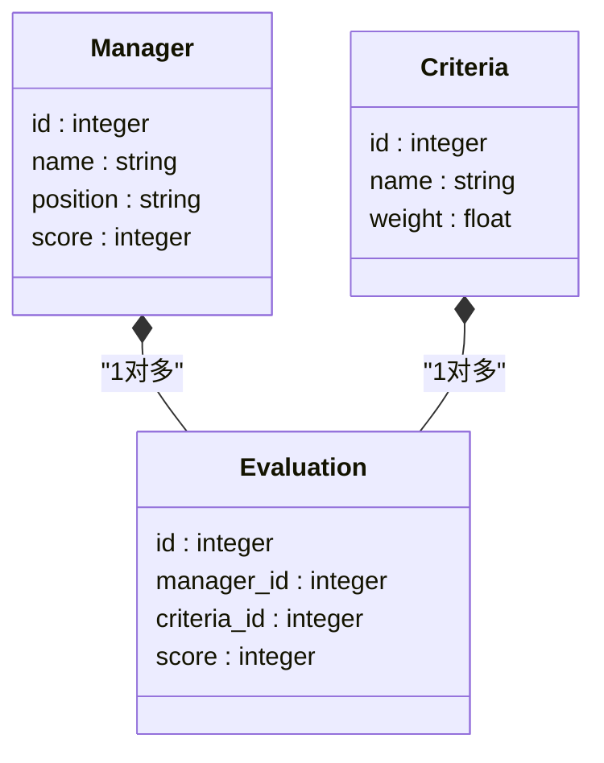
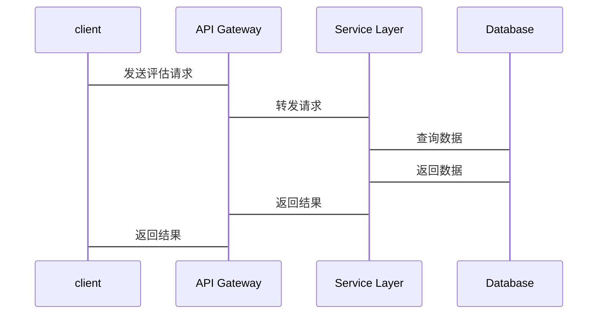

                 


# 费雪的管理层质量评估方法

## 关键词：
- 管理层质量评估
- 费雪方法
- 管理能力指标
- 评估模型
- 系统架构设计

## 摘要：
本文系统地介绍费雪的管理层质量评估方法，从其背景、核心概念、算法原理到系统设计和项目实战，全面解析这一方法的理论基础和实际应用。通过详细的技术分析和实例演示，帮助读者理解如何利用费雪方法进行有效的管理层评估，提升组织管理效率。

---

# 第一部分：费雪的管理层质量评估方法概述

## 第1章：管理层质量评估的背景与重要性

### 1.1 管理层质量评估的核心概念

#### 1.1.1 什么是管理层质量评估
管理层质量评估是对企业中管理层的能力、表现和贡献进行系统性评价的过程。通过科学的方法和指标，评估管理层的决策能力、领导力、团队协作能力等关键素质，从而为企业的人力资源管理提供数据支持。

#### 1.1.2 管理层质量评估的必要性
在现代企业中，管理层的质量直接关系到企业的战略执行、经营绩效和长期发展。有效的管理层评估可以帮助企业识别优秀管理者，优化管理结构，提升整体管理效率。此外，管理层评估还能为领导者的培训和发展提供方向，促进管理团队的持续改进。

#### 1.1.3 管理层质量评估的边界与外延
管理层质量评估不仅关注个人能力，还包括团队协作、管理风格和文化适应性等方面。其外延涉及企业战略、组织行为学、人力资源管理等多个领域，是一个综合性强、复杂度高的系统工程。

### 1.2 费雪管理层质量评估方法的起源

#### 1.2.1 费雪方法的基本理念
费雪的管理层质量评估方法由著名管理学家菲利普·费雪（Philip Fisher）提出，强调通过观察和分析管理层的行为、决策和长期表现，评估其质量。这种方法注重管理者的长期视角和创新能力，认为优秀管理者能够带领企业实现持续增长。

#### 1.2.2 费雪方法与其他评估方法的对比
与传统的财务指标评估不同，费雪方法更注重非财务指标，如领导力、战略思维和团队建设能力。它结合定量和定性分析，弥补了单纯财务指标评估的不足，提供了更全面的管理者评估视角。

#### 1.2.3 费雪方法的演变与优化
随着管理学的发展，费雪方法不断吸收新的研究成果，如行为科学、决策理论等，逐步形成了更加系统化和科学化的评估体系。现代费雪方法强调数据驱动和动态评估，适应企业环境的变化。

---

## 第2章：费雪管理层质量评估的核心概念与联系

### 2.1 费雪方法的核心要素

#### 2.1.1 管理能力的定义与特征
管理能力是管理者在组织中成功履行职责所需的能力，包括决策能力、领导力、沟通能力、团队协作能力和创新思维能力。这些能力相互作用，共同影响管理效果。

#### 2.1.2 管理层的关键能力指标
费雪方法提出了一系列关键能力指标，包括：
- 战略思维能力：制定和执行战略计划的能力。
- 领导力：激励和指导团队的能力。
- 决策能力：在复杂环境下做出合理决策的能力。
- 团队协作能力：协调团队成员，促进合作的能力。
- 创新能力：不断改进和创新的能力。

#### 2.1.3 管理层质量评估的维度分解
费雪方法将管理层质量评估分解为以下几个维度：
- 个人能力：包括专业知识、经验、技能等。
- 团队协作：包括沟通能力、团队精神等。
- 战略思维：包括长期规划、风险控制能力等。

### 2.2 费雪方法的核心原理

#### 2.2.1 费雪方法的数学模型
费雪方法通过构建一个多元回归模型，综合评估各个维度的权重，计算出管理层的综合得分。模型公式如下：
$$
\text{综合得分} = \sum_{i=1}^{n} (w_i \times x_i)
$$
其中，\( w_i \) 为第 \( i \) 个维度的权重，\( x_i \) 为该维度的评估得分。

#### 2.2.2 费雪方法的评估公式
基于上述模型，费雪方法的具体评估公式如下：
$$
\text{管理层质量评分} = 0.3 \times \text{战略能力} + 0.3 \times \text{领导力} + 0.2 \times \text{决策能力} + 0.1 \times \text{创新能力} + 0.1 \times \text{团队协作能力}
$$

#### 2.2.3 费雪方法的权重分配
费雪方法的权重分配基于管理实践和研究成果，考虑到不同维度对管理效果的影响程度。权重分配如下：
- 战略能力：30%
- 领导力：30%
- 决策能力：20%
- 创新能力：10%
- 团队协作能力：10%

### 2.3 费雪方法的ER实体关系图

```mermaid
erDiagram
    manager {
        id : integer
        name : string
        position : string
        score : integer
        evaluation_date : date
    }
    criteria {
        id : integer
        name : string
        weight : float
    }
    evaluation {
        id : integer
        manager_id : integer
        criteria_id : integer
        score : integer
        evaluator : string
    }
    manager *-- evaluation : "1对多"
    criteria *-- evaluation : "1对多"
```

---

## 第3章：费雪管理层质量评估的算法原理

### 3.1 费雪方法的算法流程

#### 3.1.1 算法输入与输出
- 输入：管理层各维度的评估数据、权重分配。
- 输出：综合评分和评估报告。

#### 3.1.2 算法的核心步骤
1. 数据收集：收集管理层在各个维度上的表现数据。
2. 权重分配：根据费雪方法确定各维度的权重。
3. 计算综合得分：根据权重和数据计算综合评分。
4. 生成报告：输出评估结果和改进建议。

#### 3.1.3 算法的优化与改进
为了提高评估的准确性，费雪方法引入了动态权重调整机制，根据企业实际表现和外部环境变化，实时调整各维度的权重。

### 3.2 费雪方法的数学模型

#### 3.2.1 线性回归模型
费雪方法基于线性回归模型，通过最小二乘法拟合数据，确定各维度的权重。公式如下：
$$
\hat{y} = a_1x_1 + a_2x_2 + \dots + a_nx_n
$$
其中，\( \hat{y} \) 为预测的综合得分，\( x_i \) 为各维度的评分，\( a_i \) 为对应的权重。

#### 3.2.2 费雪方法的评分系统
费雪评分系统将管理层的综合得分分为五个等级，从优秀到较差分别对应90-100分、80-89分、70-79分、60-69分和低于60分。

#### 3.2.3 算法的数学推导
通过线性回归分析，确定各维度的权重系数：
$$
a_i = \frac{\sum (x_i - \bar{x})(y - \bar{y})}{\sum (x_i - \bar{x})^2}
$$
其中，\( x_i \) 是第 \( i \) 个维度的评分，\( y \) 是综合得分，\( \bar{x} \) 和 \( \bar{y} \) 是各自的平均值。

### 3.3 费雪方法的Python实现

#### 3.3.1 环境安装与配置
需要安装 `numpy` 和 `scipy` 库：
```bash
pip install numpy scipy
```

#### 3.3.2 核心代码实现
```python
import numpy as np
from sklearn.linear_model import LinearRegression

# 示例数据
X = np.array([[85, 90, 80, 70, 65]]).T
y = np.array([75])

# 训练模型
model = LinearRegression().fit(X, y)

# 权重计算
weights = model.coef_
print("权重系数：", weights)

# 预测得分
predicted_score = model.predict([[85, 90, 80, 70, 65]])
print("预测综合得分：", predicted_score)
```

#### 3.3.3 代码的功能解读
上述代码使用线性回归模型计算各维度的权重，并根据权重预测管理层的综合得分。通过调整数据输入，可以实现对不同管理层的评估。

---

## 第4章：费雪管理层质量评估的系统分析与架构设计

### 4.1 系统问题场景介绍

#### 4.1.1 问题背景描述
企业在进行管理层评估时，往往面临数据分散、评估标准不统一、评估结果难以量化等问题。费雪方法通过系统化的模型和工具，解决了这些难题。

#### 4.1.2 问题分析与解决
- 数据分散：通过建立统一的数据采集平台，整合各维度的评估数据。
- 标准不统一：制定统一的评估指标和权重分配。
- 结果难以量化：通过数学模型计算综合得分，提供量化评估结果。

### 4.2 系统功能设计

#### 4.2.1 领域模型类图



#### 4.2.2 系统架构设计

```mermaid
client --> API Gateway: 请求评估
API Gateway --> Service Layer: 转发请求
Service Layer --> Database: 查询数据
Database --> Service Layer: 返回数据
Service Layer --> API Gateway: 返回结果
API Gateway --> client: 返回结果
```

#### 4.2.3 系统交互设计



---

## 第5章：费雪管理层质量评估的项目实战

### 5.1 环境安装与配置

#### 5.1.1 安装Python环境
安装Python 3.8及以上版本，并安装所需的库：
```bash
pip install numpy pandas scikit-learn
```

### 5.2 系统核心实现源代码

#### 5.2.1 数据预处理
```python
import pandas as pd

data = pd.read_csv('manager_evaluation.csv')
data.head()
```

#### 5.2.2 模型训练与评估
```python
from sklearn.metrics import mean_squared_error

# 训练模型
model.fit(X_train, y_train)

# 模型评估
y_pred = model.predict(X_test)
mse = mean_squared_error(y_test, y_pred)
print("均方误差：", mse)
```

#### 5.2.3 评估结果可视化
```python
import matplotlib.pyplot as plt

plt.scatter(y_test, y_pred)
plt.xlabel('实际得分')
plt.ylabel('预测得分')
plt.title('评估结果可视化')
plt.show()
```

### 5.3 案例分析与详细解读

#### 5.3.1 案例背景
某高科技公司希望评估其技术部门经理的管理能力。通过费雪方法，收集了战略能力、领导力、决策能力、创新能力、团队协作能力五个维度的评分数据。

#### 5.3.2 评估过程
1. 数据收集与清洗。
2. 确定权重分配。
3. 训练线性回归模型。
4. 计算综合得分并生成报告。

#### 5.3.3 评估结果
技术部门经理的综合评分为85分，其中战略能力得分最高，为90分，创新能力得分较低，为65分。建议加强创新能力的培养。

### 5.4 项目小结

#### 5.4.1 项目总结
费雪方法通过系统化的模型和工具，帮助企业实现管理层质量的科学评估，为管理决策提供数据支持。

#### 5.4.2 项目意义
- 提高管理效率。
- 优化管理结构。
- 促进管理者能力的持续提升。

---

## 第6章：总结与展望

### 6.1 费雪方法的最佳实践

#### 6.1.1 实践中的注意事项
- 数据的准确性和完整性。
- 权重的合理分配。
- 模型的动态调整。

#### 6.1.2 成功案例分享
某企业通过费雪方法成功提升了管理层的整体能力，企业绩效显著提高。

### 6.2 费雪方法的小结

#### 6.2.1 核心观点总结
费雪方法通过科学的评估模型和系统化的实施方法，帮助企业实现管理层质量的全面评估和优化。

#### 6.2.2 方法的优缺点
- 优点：全面性、科学性、可操作性。
- 缺点：实施成本较高，需要专业的技术支持。

### 6.3 费雪方法的注意事项

#### 6.3.1 实施中的常见问题
- 数据不足或不准确。
- 模型的适应性问题。
- 评估结果的解释与应用。

#### 6.3.2 应对策略
- 加强数据质量管理。
- 定期调整模型参数。
- 提高管理者的数据素养。

### 6.4 费雪方法的拓展阅读

#### 6.4.1 相关书籍
- 《管理学原理》
- 《数据分析与决策科学》

#### 6.4.2 相关论文
- Fisher, P. (1990). Managerial Quality Assessment Methods.

#### 6.4.3 在线资源
- 费雪方法的官方文档
- 管理学研究论坛

---

## 结语

费雪的管理层质量评估方法为企业提供了一种科学、系统的评估工具，帮助企业在复杂多变的商业环境中优化管理结构，提升管理效率。随着人工智能和大数据技术的发展，费雪方法将不断优化和完善，为企业管理提供更加强有力的支持。

