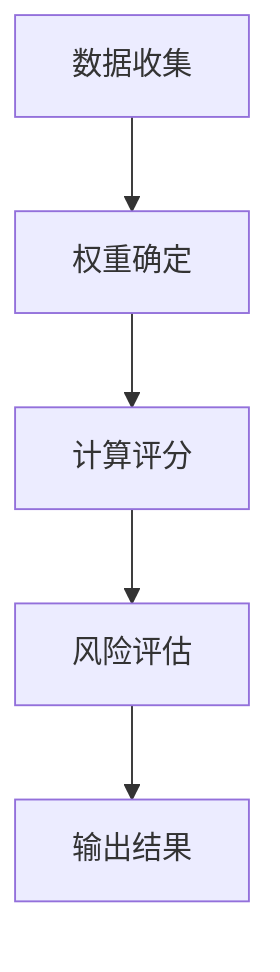
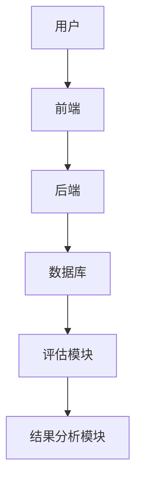

                 


# 费雪的管理层质量评估：公司治理在投资决策中的作用

> 关键词：费雪投资理论、管理层质量评估、公司治理、投资决策、风险管理、数学模型

> 摘要：本文深入探讨了费雪的管理层质量评估方法，分析了公司治理在投资决策中的关键作用。通过构建数学模型、系统架构设计和实际案例分析，详细阐述了如何评估管理层质量，优化投资决策，并降低风险。

---

## 第1章: 费雪的管理层质量评估背景与概述

### 1.1 费雪的管理层质量评估的重要性

#### 1.1.1 投资决策中的管理层角色
在投资决策中，管理层的质量是决定公司长期价值的核心因素。管理层的能力直接影响公司的战略制定、执行力和应对市场变化的能力。费雪强调，优秀管理层能够创造持续的股东价值。

#### 1.1.2 费雪投资理论的核心观点
菲利普·费雪是价值投资的先驱，他认为投资成功的关键在于选择具备优秀管理层的公司。他提出了“成长股”投资策略，强调管理层的创新能力和对股东利益的关注。

#### 1.1.3 管理层质量评估的必要性
有效的管理层质量评估能够帮助投资者识别具备优秀治理结构和决策能力的公司，从而降低投资风险，提高投资回报。通过评估管理层的质量，投资者可以更准确地预测公司未来的表现。

### 1.2 管理层质量评估的核心概念

#### 1.2.1 管理层质量评估的定义
管理层质量评估是对公司管理层的能力、战略决策能力、道德风险和执行效率进行综合评价的过程。通过量化指标，评估管理层的优劣，为投资决策提供依据。

#### 1.2.2 管理层质量评估的维度
- **战略能力**：管理层制定和执行战略的能力。
- **执行能力**：管理层在日常运营中的效率和效果。
- **道德风险**：管理层是否存在道德问题，如内幕交易、虚假陈述等。
- **团队稳定性**：管理层团队的稳定性及其对公司的忠诚度。

#### 1.2.3 费雪评估框架
费雪的评估框架包括以下几个方面：
- 管理层的行业知识和经验。
- 管理层的创新能力和适应能力。
- 管理层对股东的透明度和责任感。
- 管理层的历史业绩和决策质量。

### 1.3 公司治理与投资决策的关系

#### 1.3.1 公司治理的基本概念
公司治理是确保公司有效运作和最大化股东利益的制度安排。良好的公司治理能够减少代理成本，提高公司决策的透明度和效率。

#### 1.3.2 公司治理在投资决策中的作用
公司治理是投资决策的重要因素。优秀的公司治理结构能够吸引长期投资者，降低投资风险，提升公司的市场价值。通过评估公司治理，投资者可以识别潜在的风险和机会。

#### 1.3.3 费雪视角下的公司治理
费雪认为，优秀的公司治理结构能够确保管理层的利益与股东的利益一致。他强调，管理层应当具备高度的责任感和透明度，以确保公司的长期发展。

---

## 第2章: 管理层质量评估的核心概念与联系

### 2.1 管理层质量评估的核心原理

#### 2.1.1 管理层质量评估的理论基础
管理层质量评估的理论基础包括代理理论、 stewardship 理论和行为金融学。代理理论强调代理成本和利益冲突，stewardship 理论关注管理层的 stewardship 责任，行为金融学则研究管理层行为对市场的影响。

#### 2.1.2 管理层质量评估的关键要素
- **战略能力**：管理层制定和执行战略的能力。
- **执行力**：管理层在日常运营中的效率和效果。
- **道德风险**：管理层是否存在道德问题，如内幕交易、虚假陈述等。
- **团队稳定性**：管理层团队的稳定性及其对公司的忠诚度。

#### 2.1.3 费雪评估框架的逻辑结构
费雪的评估框架是一个综合性的分析模型，通过多个维度对管理层的质量进行评估。首先，评估管理层的战略能力和创新能力；其次，评估管理层的执行能力和道德风险；最后，综合各维度的评分，得出管理层的整体质量评分。

### 2.2 核心概念的属性特征对比

#### 2.2.1 管理层能力的属性特征
- **战略能力**：管理层制定和执行战略的能力。
- **执行能力**：管理层在日常运营中的效率和效果。
- **创新能力**：管理层在市场变化中的适应能力和创新能力。

#### 2.2.2 管理层道德风险的属性特征
- **道德风险**：管理层是否存在道德问题，如内幕交易、虚假陈述等。
- **透明度**：管理层对信息的披露程度和透明度。
- **责任感**：管理层对股东利益的关注程度。

#### 2.2.3 管理层决策质量的属性特征
- **决策质量**：管理层决策的合理性和效果。
- **决策速度**：管理层决策的效率和速度。
- **决策透明度**：管理层决策的透明度和可解释性。

### 2.3 管理层质量评估的ER实体关系图

```mermaid
er
    actor 管理层 {
        id: string
        能力: integer
        决策质量: integer
        道德风险: integer
    }
    actor 评估系统 {
        id: string
        评估结果: string
        评估时间: date
    }
    管理层 --> 评估系统: 提供数据
    评估系统 --> 管理层: 生成评估结果
```

---

## 第3章: 管理层质量评估的数学模型与算法

### 3.1 管理层质量评估的数学模型

#### 3.1.1 模型的构建与假设
- **假设1**：管理层质量评估可以通过多个指标量化。
- **假设2**：每个指标的权重是基于经验数据确定的。
- **假设3**：管理层质量评估结果是一个综合指标，可以通过加权平均计算。

#### 3.1.2 模型的输入变量
- **输入1**：管理层的战略能力评分。
- **输入2**：管理层的执行能力评分。
- **输入3**：管理层的道德风险评分。
- **输入4**：管理层的决策质量评分。

#### 3.1.3 模型的输出结果
- **输出1**：管理层的整体质量评分。
- **输出2**：管理层的潜在风险评分。

#### 3.1.4 模型的公式推导
$$ 管理层质量评分 = w_1 \times 战略能力 + w_2 \times 执行能力 + w_3 \times 道德风险 + w_4 \times 决策质量 $$

其中，$w_1, w_2, w_3, w_4$ 是各指标的权重，通常通过经验数据确定。

### 3.2 管理层质量评估的算法流程

#### 3.2.1 算法步骤
1. **数据收集**：收集管理层的战略能力、执行能力、道德风险和决策质量的评分数据。
2. **权重确定**：根据经验数据确定各指标的权重。
3. **计算评分**：根据公式计算管理层的整体质量评分。
4. **风险评估**：根据评分结果，评估管理层的潜在风险。

#### 3.2.2 算法的实现
```python
def calculate_management_quality(战略能力, 执行能力, 道德风险, 决策质量):
    # 权重系数
    w1 = 0.3
    w2 = 0.3
    w3 = 0.2
    w4 = 0.2
    
    总质量评分 = w1 * 战略能力 + w2 * 执行能力 + w3 * 道德风险 + w4 * 决策质量
    return 总质量评分

# 示例数据
战略能力 = 85
执行能力 = 90
道德风险 = 70
决策质量 = 85

质量评分 = calculate_management_quality(战略能力, 执行能力, 道德风险, 决策质量)
print(f"管理层质量评分：{质量评分}")
```

### 3.3 管理层质量评估的算法流程图



---

## 第4章: 管理层质量评估的系统分析与架构设计

### 4.1 问题场景介绍
在实际投资决策中，管理层质量评估需要一个高效的系统来支持。系统需要能够收集、处理和分析大量的数据，提供准确的评估结果。

### 4.2 系统功能设计

#### 4.2.1 系统功能模块
- **数据采集模块**：负责收集管理层的相关数据。
- **评估计算模块**：负责计算管理层的质量评分。
- **结果分析模块**：负责分析评估结果，提供投资建议。
- **用户界面模块**：提供友好的用户界面，方便用户操作。

#### 4.2.2 系统功能流程
1. **数据采集**：通过API或数据库获取管理层的数据。
2. **数据处理**：对数据进行清洗和预处理。
3. **评估计算**：根据算法计算管理层的质量评分。
4. **结果分析**：分析评估结果，生成投资建议。
5. **用户界面**：展示评估结果和投资建议。

### 4.3 系统架构设计

#### 4.3.1 系统架构图


#### 4.3.2 系统交互流程
1. 用户通过前端提交投资需求。
2. 前端将请求发送到后端。
3. 后端调用评估模块计算管理层质量评分。
4. 结果分析模块生成投资建议。
5. 前端展示结果和建议。

### 4.4 系统接口设计

#### 4.4.1 API接口
- **输入接口**：接收管理层数据和投资需求。
- **输出接口**：返回管理层质量评分和投资建议。

#### 4.4.2 数据流图
```mermaid
dataflow
    前端 --> 数据采集模块: 提交投资需求
    数据采集模块 --> 数据处理模块: 提供原始数据
    数据处理模块 --> 评估计算模块: 提供处理后的数据
    评估计算模块 --> 结果分析模块: 提供评估结果
    结果分析模块 --> 前端: 提供投资建议
```

---

## 第5章: 管理层质量评估的项目实战

### 5.1 项目背景
以某科技公司为例，评估其管理层的质量，分析公司的投资价值。

### 5.2 数据收集与处理

#### 5.2.1 数据来源
- 公司年报
- 证监会公告
- 新闻报道

#### 5.2.2 数据清洗
- 去重
- 填充缺失值
- 异常值处理

### 5.3 算法实现

#### 5.3.1 评估计算
```python
def calculate_management_quality(战略能力, 执行能力, 道德风险, 决策质量):
    # 权重系数
    w1 = 0.3
    w2 = 0.3
    w3 = 0.2
    w4 = 0.2
    
    总质量评分 = w1 * 战略能力 + w2 * 执行能力 + w3 * 道德风险 + w4 * 决策质量
    return 总质量评分

# 示例数据
战略能力 = 85
执行能力 = 90
道德风险 = 70
决策质量 = 85

质量评分 = calculate_management_quality(战略能力, 执行能力, 道德风险, 决策质量)
print(f"管理层质量评分：{质量评分}")
```

#### 5.3.2 结果分析
根据计算结果，评估公司管理层的质量，生成投资建议。

### 5.4 实际案例分析

#### 5.4.1 数据分析
通过数据分析，识别公司管理层的优劣势，评估公司的投资价值。

#### 5.4.2 投资建议
基于评估结果，给出具体的投资建议，包括买入、持有或卖出。

---

## 第6章: 管理层质量评估的总结与展望

### 6.1 总结
本文详细探讨了费雪的管理层质量评估方法，分析了公司治理在投资决策中的作用。通过构建数学模型和系统架构设计，提供了有效的评估方法。

### 6.2 最佳实践
- **数据收集**：确保数据的准确性和完整性。
- **模型优化**：根据实际情况调整模型参数。
- **系统维护**：定期更新数据和模型。

### 6.3 展望
未来，随着人工智能和大数据技术的发展，管理层质量评估将更加智能化和自动化。投资者可以通过更加精准的评估方法，做出更明智的投资决策。

---

通过本文的分析，读者可以深入了解费雪的管理层质量评估方法，并将其应用于实际投资决策中，提高投资效率和成功率。

