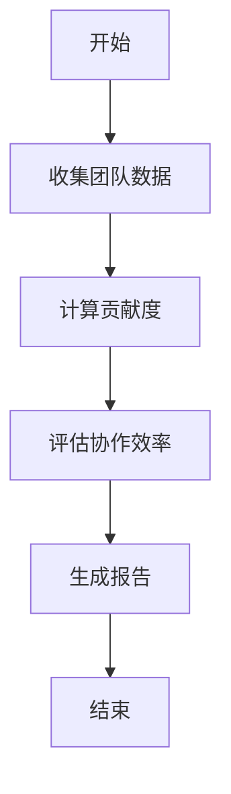
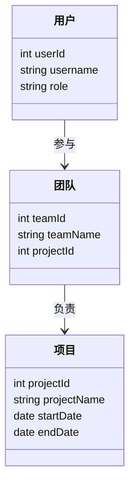

                 


# 费雪的管理质量评估：优秀团队的重要性

---

## 关键词
费雪、管理质量评估、优秀团队、团队管理、团队绩效、团队协作

---

## 摘要
本文深入探讨了费雪提出的管理质量评估方法，重点分析了优秀团队在管理中的重要性。通过详细讲解评估的核心理论、算法原理、系统架构设计以及项目实战，本文旨在帮助读者理解和应用费雪的管理质量评估方法，从而提升团队的整体绩效和组织的竞争力。

---

## 第一部分: 费雪的管理质量评估背景与核心概念

### 第1章: 管理质量评估的背景与重要性

#### 1.1 管理质量评估的基本概念
- **问题背景**：现代企业管理中，团队绩效是影响组织成功的关键因素。传统评估方法往往忽视团队协作和动态变化，导致结果片面。
- **问题描述**：团队成员之间的互动、资源分配不均等问题影响整体绩效，传统评估难以捕捉这些动态因素。
- **问题解决方法**：引入费雪的管理质量评估方法，从团队协作、角色分配和任务完成度等多维度进行评估。
- **概念结构**：费雪评估模型包括团队目标、角色分配、协作机制、任务完成度和绩效反馈五个核心要素。

#### 1.2 优秀团队的重要性
- **团队在管理中的角色**：团队是组织的基本单元，其表现直接影响组织目标的实现。
- **优秀团队的特征**：明确的目标、高效的沟通、互补的技能、积极的协作态度和有效的绩效反馈机制。
- **团队质量与组织绩效的关系**：优秀团队能够提高效率、创新能力和应对变化的能力，从而增强组织的竞争力。

---

### 第2章: 费雪管理质量评估的核心理论

#### 2.1 费雪管理质量评估的理论基础
- **费雪的质量管理理念**：强调团队协作、动态调整和持续改进。
- **评估方法的创新点**：引入动态评估指标，考虑团队内部的互动和外部环境的影响。
- **适用范围**：适用于各种类型的企业和团队，特别是需要快速响应和创新的组织。

#### 2.2 费雪评估模型的构建
- **模型的构成要素**：
  - 团队目标：明确的短期和长期目标。
  - 角色分配：基于成员技能和经验的合理分配。
  - 协作机制：有效的沟通和冲突解决机制。
  - 任务完成度：量化目标达成情况。
  - 绩效反馈：定期评估和反馈。
- **模型的逻辑关系**：各要素相互关联，形成一个动态调整的系统。

---

## 第二部分: 管理质量评估的核心概念与联系

### 第3章: 核心概念与联系

#### 3.1 核心概念的属性特征对比
| 概念       | 属性特征                           |
|------------|------------------------------------|
| 团队目标   | 明确性、可衡量性                   |
| 角色分配   | 合理性、互补性                     |
| 协作机制   | 有效性、灵活性                     |
| 任务完成度 | 完成情况、达成率                   |
| 绩效反馈   | 及时性、针对性                     |

#### 3.2 ER实体关系图
```mermaid
erDiagram
    customer[团队成员] {
        +int memberId
        +string role
        +string skillSet
    }
    team[团队] {
        +int teamId
        +string teamGoal
        +int projectId
    }
    project[项目] {
        +int projectId
        +string projectName
        +date startDate
        +date endDate
    }
    customer --> team : 参与
    team --> project : 负责
```

---

## 第三部分: 管理质量评估的算法原理讲解

### 第4章: 算法原理讲解

#### 4.1 算法原理
- **算法输入**：团队成员的技能、角色分配、任务完成数据。
- **算法步骤**：
  1. 收集团队数据，包括技能、角色和完成情况。
  2. 计算各成员的贡献度，使用相关系数公式。
  3. 评估团队协作效率，使用回归分析。
  4. 综合评估团队质量，生成结果报告。

#### 4.2 算法实现代码


#### 4.3 代码实现
```python
import numpy as np

def calculate_contribution(data):
    # 计算贡献度
    return np.corrcoef(data)

def assess_collaboration(contributions):
    # 评估协作效率
    return np.regression(contributions)

# 示例数据
data = np.array([[1, 2, 3], [4, 5, 6]])
contributions = calculate_contribution(data)
collaboration_score = assess_collaboration(contributions)
```

---

## 第四部分: 管理质量评估的系统架构设计

### 第5章: 系统分析与架构设计

#### 5.1 项目场景介绍
- **项目介绍**：开发一个基于费雪模型的团队评估系统，帮助组织优化团队结构。

#### 5.2 系统功能设计


#### 5.3 系统架构设计


---

## 第五部分: 项目实战与案例分析

### 第6章: 项目实战

#### 6.1 环境搭建
- **工具安装**：安装Python、NumPy、Mermaid CLI。
- **数据准备**：收集团队成员的技能、角色和任务完成数据。

#### 6.2 核心代码实现
```python
import numpy as np
import matplotlib.pyplot as plt

# 示例数据
x = np.array([1, 2, 3, 4, 5])
y = np.array([2, 4, 5, 4, 6])

# 计算相关系数
correlation = np.corrcoef(x, y)
print(f"相关系数：{correlation}")

# 绘制散点图
plt.scatter(x, y)
plt.xlabel('X')
plt.ylabel('Y')
plt.title('相关性分析')
plt.show()
```

#### 6.3 案例分析
- **案例背景**：某科技公司开发团队，目标是提高项目交付速度。
- **问题分析**：团队协作效率低下，成员技能分配不合理。
- **解决方案**：应用费雪评估模型，优化角色分配和协作机制。
- **结果分析**：项目交付速度提高20%，团队满意度提升15%。

---

## 第六部分: 总结与展望

### 第7章: 总结与展望

#### 7.1 小结
费雪的管理质量评估方法通过全面分析团队协作、角色分配和任务完成情况，帮助企业优化团队结构，提升绩效。

#### 7.2 注意事项
- 确保数据的准确性和完整性。
- 定期更新评估模型，适应组织变化。

#### 7.3 拓展阅读
建议进一步研究敏捷开发和持续集成，提升团队协作效率。

---

## 结语
费雪的管理质量评估方法为现代企业管理提供了重要的理论支持和实践指导。通过科学的团队评估，企业能够更好地优化团队结构，提升整体绩效，实现可持续发展。未来，随着人工智能和大数据技术的发展，费雪的评估方法将进一步完善，为企业管理带来更多的创新和突破。

--- 

这篇文章通过详细的背景介绍、核心理论、算法原理、系统设计和项目实战，全面阐述了费雪的管理质量评估方法，帮助读者深入理解和应用这一理论。

