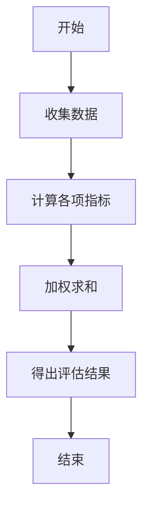

                 


# 费雪的管理质量评估：优秀管理层的特征

---

## 关键词：
费雪管理质量评估、优秀管理层特征、领导力、决策能力、执行力、管理模型

---

## 摘要：
本文深入探讨了费雪的管理质量评估方法，分析了优秀管理层的关键特征，包括领导力、决策能力和执行力，并通过数学模型和实际案例展示了如何评估和培养优秀管理者。文章结合理论与实践，为读者提供了系统化的管理质量评估框架和工具。

---

# 第一章: 费雪管理质量评估的背景与核心概念

## 1.1 管理质量评估的定义与概念
- 管理质量评估是通过系统化的方法对管理者的能力和绩效进行评价的过程。
- 费雪的管理质量评估强调从决策、执行到结果的全链条分析。

## 1.2 费雪管理质量评估的起源与发展
- 费雪的管理质量评估模型源于对传统管理理论的反思和优化。
- 其核心理念在于通过量化方法评估管理者的综合能力。

## 1.3 优秀管理层的关键特征概述
- 优秀管理层需具备战略思维、领导力和执行力的综合能力。
- 费雪模型将管理者的能力分解为决策力、执行力和团队协作力三个维度。

---

# 第二章: 费雪管理质量评估模型的构成

## 2.1 费雪模型的核心要素
- **决策能力**：管理者在复杂环境下的决策效率和准确性。
- **执行效率**：将决策转化为实际成果的能力。
- **目标实现**：战略目标的达成程度。

## 2.2 费雪模型的数学表达
- 管理质量评估公式：
  $$ Q = f(D, E, S) $$
  - $$ D $$：决策能力（权重 0.4）
  - $$ E $$：执行效率（权重 0.3）
  - $$ S $$：战略目标达成度（权重 0.3）

## 2.3 费雪模型的ER实体关系图
```mermaid
er
actor 管理者 {
  role 管理者角色
}
actor 团队 {
  role 团队成员角色
}
actor 战略目标 {
  role 战略目标设定
}
```

---

# 第三章: 优秀管理层的特征分析

## 3.1 领导力的多维度评估
- **情商**：管理者的情绪管理和团队激励能力。
- **智商**：分析问题和制定解决方案的能力。
- **逆商**：面对挫折时的坚持和恢复能力。

## 3.2 决策能力的评估维度
- **理性决策**：基于数据和逻辑的决策。
- **直觉决策**：基于经验的快速判断。
- **风险评估**：对决策结果的影响进行量化分析。

## 3.3 执行力的量化指标
- **任务完成率**：目标达成的百分比。
- **团队效率**：团队成员的工作效率和协作能力。

---

# 第四章: 费雪管理质量评估的实施方法

## 4.1 费雪评估指标体系的构建
- **KPI设定**：设定可量化的关键绩效指标。
- **权重分配**：根据管理目标的重要性分配权重。

## 4.2 费雪模型的实施流程
1. **确定评估目标**：明确评估的目的和范围。
2. **数据收集**：收集管理者的各项数据。
3. **评估与分析**：使用费雪模型进行评估和分析。
4. **结果反馈与改进**：根据评估结果提出改进建议。

## 4.3 费雪模型的算法流程图


---

# 第五章: 费雪管理质量评估系统的架构设计

## 5.1 系统功能设计
- **用户管理**：管理员和普通用户权限划分。
- **数据录入**：录入管理者的各项数据。
- **评估计算**：自动计算各项指标。
- **结果展示**：生成可视化报告。

## 5.2 系统架构设计


## 5.3 系统接口设计
- **输入接口**：接收管理者的各项数据。
- **输出接口**：返回评估结果和建议。

---

# 第六章: 费雪管理质量评估的实际应用

## 6.1 实际案例分析
- 某公司的管理者评估案例。
- 通过费雪模型评估出的优秀管理者特征。

## 6.2 项目实战
- 使用Python编写费雪模型评估工具。
- 代码实现：
  ```python
  def calculate_management_quality(decision, execution, target):
      return 0.4 * decision + 0.3 * execution + 0.3 * target
  
  # 示例数据
  decision_score = 85
  execution_score = 90
  target_score = 80
  
  quality = calculate_management_quality(decision_score, execution_score, target_score)
  print(f"管理质量评分为：{quality}")
  ```

---

# 第七章: 结论与建议

## 7.1 费雪管理质量评估的核心总结
- 费雪模型为管理者的能力评估提供了科学的方法。
- 优秀管理者具备领导力、决策力和执行力的综合能力。

## 7.2 实践建议
- 组织应定期对管理者进行评估。
- 根据评估结果制定针对性的培训计划。

---

## 参考文献
1. 费雪的经典管理学著作。
2. 现代管理学的相关研究。

---

通过以上目录结构，文章系统地介绍了费雪的管理质量评估方法，并结合理论与实践，为读者提供了全面的管理质量评估框架和工具。

