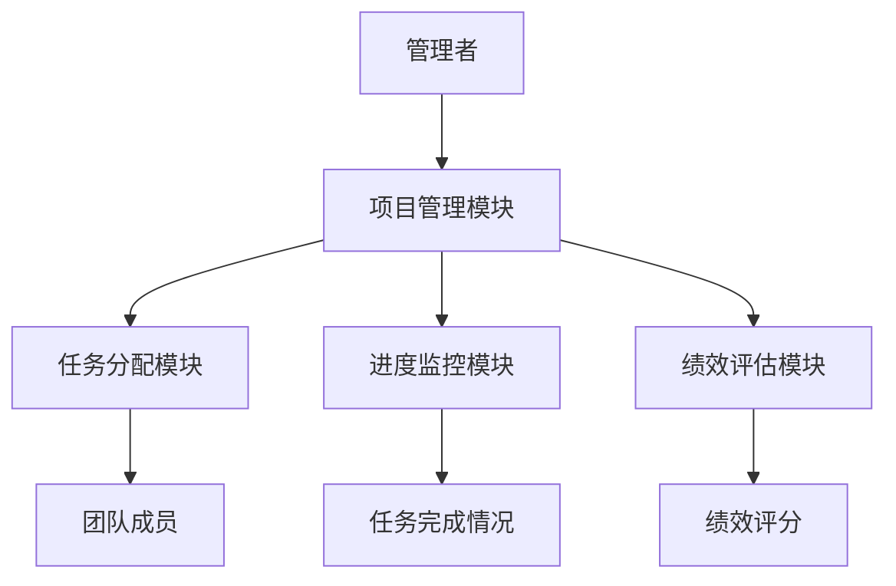
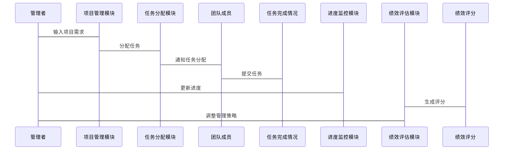

                 


# 费雪的管理质量评估：远程团队管理能力的重要性

> 关键词：远程团队管理，管理质量评估，费雪模型，团队绩效，项目管理

> 摘要：本文深入探讨了费雪的管理质量评估模型在远程团队管理中的重要性。通过分析远程办公的兴起及其挑战，详细阐述了费雪模型的核心原理、数学基础和算法实现。结合实际项目案例，展示了如何将费雪模型应用于系统设计和架构，最终总结出提升远程团队管理能力的最佳实践。

---

# 第一部分: 费雪的管理质量评估背景与基础

## 第1章: 远程团队管理的背景与重要性

### 1.1 远程办公的兴起与挑战

#### 1.1.1 远程办公的定义与发展
远程办公（Remote Work）是指员工无需在固定办公室工作，而是在家中或其他地点通过互联网完成工作任务的一种工作方式。随着技术的进步，特别是互联网和通信工具的发展，远程办公在全球范围内逐渐普及。近年来，新冠疫情的爆发进一步推动了远程办公的普及，许多企业和组织开始尝试甚至永久采用远程办公模式。

#### 1.1.2 远程办公的核心特点
- **灵活性**：员工可以根据个人时间安排工作，提高工作效率。
- **降低成本**：企业可以节省办公室租赁、能源消耗等成本，员工也可以减少通勤费用。
- **人才多样性**：企业可以吸引全球各地的优秀人才，而不再受限于地理位置。
- **沟通便利**：通过各种在线工具，团队成员可以随时保持联系，确保项目进展顺利。

#### 1.1.3 远程办公的挑战与机遇
- **挑战**：
  - 沟通效率下降：缺乏面对面交流可能导致误解和信息不畅。
  - 团队协作困难：远程团队可能难以形成凝聚力，影响项目进度。
  - 管理难度增加：管理者难以实时监督团队成员的工作情况，可能导致工作效率不均。
- **机遇**：
  - 提高员工满意度：灵活的工作时间可以提升员工的工作积极性。
  - 降低运营成本：减少办公场地和设备的投入。
  - 创新驱动：远程办公模式可以促进企业采用新的技术工具和管理方法。

### 1.2 管理质量评估的核心概念

#### 1.2.1 管理质量的定义
管理质量是指管理者在组织中协调资源、指导团队、达成目标的能力。它涵盖了决策能力、沟通能力、领导力等多个方面。

#### 1.2.2 费雪模型的提出背景
费雪模型（Fischer Model）是由著名管理学家提出的，旨在评估管理者在远程团队中的管理质量。该模型通过分析团队绩效、沟通效率、任务完成度等多个维度，量化管理者的管理能力。

#### 1.2.3 费雪模型的评估维度
- **团队绩效**：团队在规定时间内完成任务的数量和质量。
- **沟通效率**：团队成员之间的信息传递速度和准确性。
- **任务完成度**：任务是否按计划完成，是否达到预期目标。
- **团队凝聚力**：团队成员之间的合作默契程度，是否能够共同面对挑战。

### 1.3 远程团队管理能力的重要性

#### 1.3.1 远程团队管理的特点
- **虚拟化**：团队成员可能分布在不同的地理位置，无法面对面交流。
- **依赖性**：团队的成功依赖于高效的沟通和协调。
- **自主性**：团队成员需要具备高度的自主性和自律性，以确保任务按时完成。

#### 1.3.2 管理能力对团队绩效的影响
- **提高效率**：优秀的管理者能够合理分配任务，确保团队高效运作。
- **增强凝聚力**：通过有效的沟通和激励，团队成员能够形成更强的凝聚力。
- **降低风险**：管理者能够及时发现并解决问题，降低项目失败的风险。

#### 1.3.3 远程团队管理能力的核心要素
- **沟通能力**：能够有效传递信息，确保团队成员理解任务目标。
- **决策能力**：能够在复杂情况下做出合理决策。
- **领导力**：能够激励团队成员，提升团队整体绩效。
- **技术能力**：熟悉远程办公工具和技术，能够有效利用这些工具提升管理效率。

### 1.4 本章小结
远程办公的兴起带来了新的管理挑战，而费雪模型为我们提供了一个有效的评估工具。通过分析远程团队管理的特点和重要性，我们可以更好地理解如何提升管理质量，从而提高团队绩效。

---

## 第2章: 费雪模型的原理与属性分析

### 2.1 费雪模型的原理

#### 2.1.1 费雪模型的基本假设
费雪模型假设团队绩效与管理者的管理能力呈正相关关系，且可以通过量化评估管理者的能力。

#### 2.1.2 费雪模型的核心公式
费雪模型的管理质量评估公式为：
$$
Q = \frac{\sum_{i=1}^{n} w_i \cdot s_i}{\sum_{i=1}^{n} w_i}
$$
其中，\( Q \) 是管理质量指数，\( w_i \) 是第 \( i \) 个评估维度的权重，\( s_i \) 是第 \( i \) 个评估维度的评分。

#### 2.1.3 费雪模型的适用范围
费雪模型适用于远程团队管理，尤其是当团队成员分布广泛且无法面对面交流时。

### 2.2 费雪模型的属性特征对比

#### 2.2.1 管理能力的属性分析
| 属性       | 描述                                   |
|------------|--------------------------------------|
| 沟通能力   | 管理者能否有效传递信息                 |
| 决策能力   | 管理者能否在复杂情况下做出决策         |
| 领导能力   | 管理者能否激励团队成员                 |
| 技术能力   | 管理者能否熟练使用远程办公工具         |

#### 2.2.2 远程团队管理能力的特征对比
| 特征       | 面对面团队管理 | 远程团队管理 |
|------------|---------------|--------------|
| 沟通方式   | 当面交流       | 在线交流     |
| 协作工具   | 本地工具       | 在线工具     |
| 管理难度   | 较低           | 较高         |

#### 2.2.3 费雪模型的属性与实际应用
费雪模型通过量化评估各个管理维度，帮助管理者识别自身的不足，并制定改进计划。例如，如果沟通效率评分较低，管理者可以加强在线沟通工具的使用，或者组织定期的在线会议。

### 2.3 费雪模型的ER实体关系图

```mermaid
er
actor 管理者 {
  id: int
  名称: string
}
actor 团队成员 {
  id: int
  名称: string
}
actor 项目 {
  id: int
  名称: string
}
关系 管理者-团队成员 {
  role: 管理
}
关系 管理者-项目 {
  role: 负责
}
关系 团队成员-项目 {
  role: 参与
}
```

---

## 第3章: 费雪模型的数学基础与算法实现

### 3.1 费雪模型的数学模型

#### 3.1.1 费雪模型的基本公式
费雪模型的管理质量评估公式可以表示为：
$$
Q = \frac{\sum_{i=1}^{n} w_i \cdot s_i}{\sum_{i=1}^{n} w_i}
$$
其中，\( Q \) 是管理质量指数，\( w_i \) 是第 \( i \) 个评估维度的权重，\( s_i \) 是第 \( i \) 个评估维度的评分。

#### 3.1.2 费雪模型的数学推导
假设我们有 \( n \) 个评估维度，每个维度的权重 \( w_i \) 和评分 \( s_i \) 已知。那么，管理质量指数 \( Q \) 的计算过程如下：
1. 计算分子部分：\(\sum_{i=1}^{n} w_i \cdot s_i\)
2. 计算分母部分：\(\sum_{i=1}^{n} w_i\)
3. 计算管理质量指数：\( Q = \frac{\text{分子}}{\text{分母}} \)

#### 3.1.3 费雪模型的数学验证
以一个简单的例子来验证公式：
- 设有2个评估维度，权重分别为 \( w_1 = 0.6 \)，\( w_2 = 0.4 \)。
- 假设评分分别为 \( s_1 = 0.8 \)，\( s_2 = 0.7 \)。
- 计算分子：\( 0.6 \times 0.8 + 0.4 \times 0.7 = 0.48 + 0.28 = 0.76 \)
- 计算分母：\( 0.6 + 0.4 = 1 \)
- 计算管理质量指数：\( Q = 0.76 / 1 = 0.76 \)

### 3.2 费雪模型的算法实现

#### 3.2.1 算法实现的步骤
1. 收集评估维度的权重和评分。
2. 计算分子部分：\(\sum w_i \cdot s_i\)
3. 计算分母部分：\(\sum w_i\)
4. 计算管理质量指数 \( Q \)。
5. 输出结果。

#### 3.2.2 算法实现的代码示例
```python
def fisher_quality(weights, scores):
    numerator = sum(w * s for w, s in zip(weights, scores))
    denominator = sum(weights)
    return numerator / denominator

# 示例
weights = [0.6, 0.4]
scores = [0.8, 0.7]
quality = fisher_quality(weights, scores)
print(f"管理质量指数 Q = {quality}")
```

#### 3.2.3 费雪模型的优化与改进
费雪模型可以通过引入更多的评估维度和动态调整权重来优化。例如，可以根据团队的具体需求调整权重，以更准确地反映管理质量。

### 3.3 费雪模型的数学模型和公式
费雪模型的管理质量评估公式可以表示为：
$$
Q = \frac{\sum_{i=1}^{n} w_i \cdot s_i}{\sum_{i=1}^{n} w_i}
$$
其中，\( Q \) 是管理质量指数，\( w_i \) 是第 \( i \) 个评估维度的权重，\( s_i \) 是第 \( i \) 个评估维度的评分。

---

## 第4章: 费雪模型的系统架构与应用

### 4.1 系统分析与架构设计方案

#### 4.1.1 问题场景介绍
假设我们有一个由5名团队成员组成的远程开发团队，负责开发一个在线教育平台。项目周期为3个月，目标是在规定时间内完成系统设计、开发和测试。

#### 4.1.2 系统功能设计
- **需求管理**：记录和跟踪项目需求。
- **任务分配**：将任务分配给团队成员，并设定完成时间。
- **进度监控**：实时监控团队成员的工作进度。
- **沟通协作**：提供在线沟通工具，方便团队成员交流。
- **绩效评估**：定期评估团队成员的绩效，并根据评估结果调整管理策略。

#### 4.1.3 系统架构设计



#### 4.1.4 系统接口设计
- **管理者与项目管理模块接口**：管理者输入项目需求，项目管理模块生成任务列表。
- **任务分配模块与团队成员接口**：任务分配模块将任务分配给团队成员，并通知他们。
- **进度监控模块与任务完成情况接口**：进度监控模块定期获取任务完成情况，并更新进度表。
- **绩效评估模块与绩效评分接口**：绩效评估模块根据任务完成情况和团队成员的反馈生成绩效评分。

#### 4.1.5 系统交互序列图



### 4.2 项目实战: 费雪模型的应用

#### 4.2.1 环境安装
需要安装以下工具：
- Python 3.8+
- Mermaid CLI 或支持 Mermaid 的 IDE
- 数据库（如 MySQL 或 PostgreSQL）
- 开发框架（如 Django 或 Flask）

#### 4.2.2 核心代码实现
以下是一个简单的费雪模型实现示例：

```python
def calculate_quality(weights, scores):
    numerator = sum(w * s for w, s in zip(weights, scores))
    denominator = sum(weights)
    return numerator / denominator

# 示例数据
weights = [0.5, 0.3, 0.2]
scores = [0.8, 0.7, 0.9]
quality = calculate_quality(weights, scores)
print(f"管理质量指数 Q = {quality}")
```

#### 4.2.3 代码应用解读与分析
- **输入**：权重和评分列表。
- **处理**：计算分子和分母，然后计算管理质量指数。
- **输出**：管理质量指数。

#### 4.2.4 实际案例分析
假设我们有一个5人的远程团队，负责开发一个在线教育平台。评估维度包括：
- **沟通效率**：权重0.4，评分0.8
- **任务完成度**：权重0.3，评分0.7
- **团队凝聚力**：权重0.3，评分0.9

计算管理质量指数：
$$
Q = \frac{0.4 \times 0.8 + 0.3 \times 0.7 + 0.3 \times 0.9}{0.4 + 0.3 + 0.3} = \frac{0.32 + 0.21 + 0.27}{1} = 0.8
$$

结果表明，该团队的管理质量指数为0.8，属于较高水平。

### 4.3 系统小结
通过费雪模型的应用，我们可以量化评估远程团队的管理质量，并根据评估结果调整管理策略，从而提高团队绩效。

---

## 第5章: 最佳实践与总结

### 5.1 本章小结
费雪模型为我们提供了一种有效的远程团队管理质量评估方法。通过量化评估各个管理维度，我们可以识别管理中的不足，并制定改进计划。

### 5.2 注意事项
- 确保评估维度的合理性和全面性。
- 定期更新评估结果，以反映团队的实际状况。
- 结合实际情况调整权重，以更准确地反映管理质量。

### 5.3 拓展阅读
- **书籍推荐**：《远程团队管理的艺术》。
- **在线课程**：Coursera 上的《远程团队管理与领导力》。
- **工具推荐**：Trello、Asana 等项目管理工具。

### 5.4 总结
远程团队管理是一个挑战，但也是一种机遇。通过费雪模型的应用，我们可以更好地评估和提升管理质量，从而提高团队绩效。希望本文的内容能够为远程团队管理者提供有价值的参考和指导。

--- 

# 结语
费雪的管理质量评估模型为我们提供了一种科学的远程团队管理工具。通过深入理解其原理和应用，我们可以有效提升团队绩效，应对远程办公带来的挑战。未来，随着技术的不断发展，费雪模型也将不断优化，为远程团队管理提供更有力的支持。

