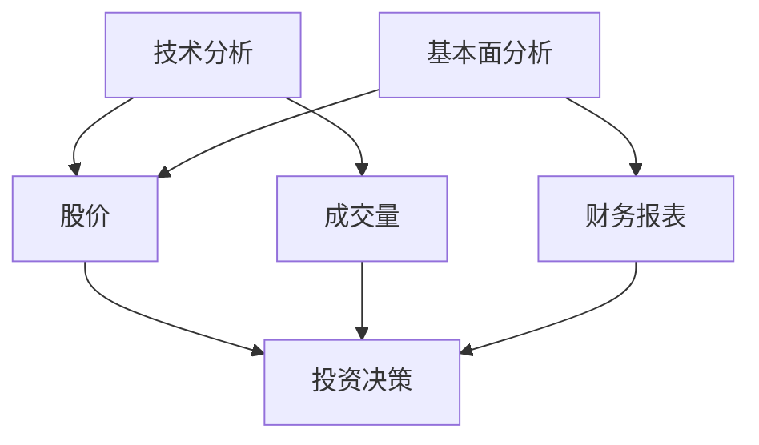
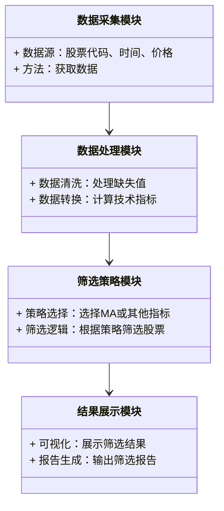
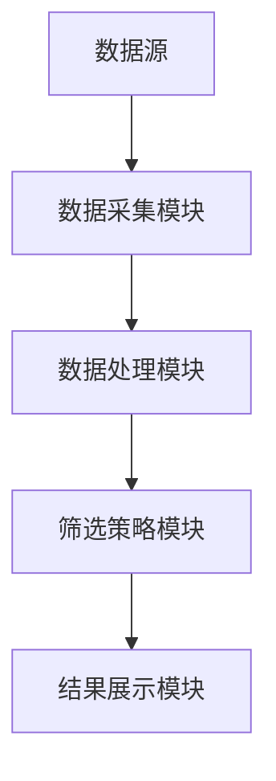
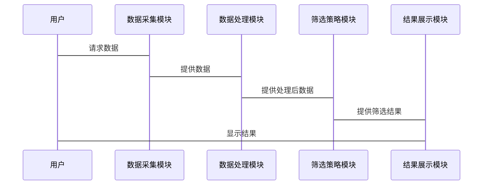

                 


# 费雪的股票筛选技巧

## 关键词：
- 股票筛选
- 技术分析
- 基本面分析
- 移动平均线（MA）
- 策略交易

## 摘要：
本文深入探讨了费雪的股票筛选技巧，结合技术分析和基本面分析，详细介绍了移动平均线（MA）算法，并通过系统架构设计和项目实战，展示了如何构建一个高效的股票筛选系统。文章内容包括背景介绍、核心概念对比、算法原理、系统架构设计、项目实战以及最佳实践，帮助读者全面理解和应用股票筛选技巧。

---

## 目录大纲

### 第一部分：股票筛选的背景与基础

#### 第1章：股票筛选的定义与重要性

##### 1.1 股票筛选的基本概念
- 1.1.1 股票筛选的定义
- 1.1.2 股票筛选的重要性
- 1.1.3 股票筛选的核心目标

##### 1.2 股票筛选的基本方法
- 1.2.1 基于技术分析的筛选
- 1.2.2 基于基本面分析的筛选
- 1.2.3 综合分析法

##### 1.3 股票筛选的流程与步骤
- 1.3.1 确定筛选目标
- 1.3.2 数据收集与整理
- 1.3.3 筛选策略的制定
- 1.3.4 筛选结果的评估

---

### 第二部分：股票筛选的核心概念与联系

#### 第2章：技术分析与基本面分析的对比

##### 2.1 技术分析的核心原理
- 2.1.1 技术分析的基本假设
- 2.1.2 技术分析的主要指标
- 2.1.3 技术分析的优缺点

##### 2.2 基本面分析的核心原理
- 2.2.1 基本面分析的基本假设
- 2.2.2 基本面分析的主要指标
- 2.2.3 基本面分析的优缺点

##### 2.3 技术分析与基本面分析的对比分析
- 2.3.1 分析方法的对比
- 2.3.2 适用场景的对比
- 2.3.3 结合使用的可行性

##### 2.4 技术分析与基本面分析的对比表格
```mermaid
| 对比维度       | 技术分析                              | 基本面分析                              |
|----------------|-------------------------------------|---------------------------------------|
| 分析基础       | 股价、成交量等市场数据                | 公司财务报表、行业地位等               |
| 时间框架       | 短期至中期                            | 中期至长期                            |
| 分析目标       | 短期价格波动预测                      | 长期投资价值评估                      |
| 优缺点         | 优点：及时性、操作性强；缺点：忽视公司基本面 | 优点：稳定性、准确性；缺点：操作复杂性 |
```

##### 2.5 技术分析与基本面分析的实体关系图


---

### 第三部分：股票筛选的算法原理

#### 第3章：移动平均线（MA）算法

##### 3.1 移动平均线的定义与作用
- 3.1.1 移动平均线的定义
- 3.1.2 移动平均线的作用
- 3.1.3 移动平均线的分类

##### 3.2 移动平均线的计算公式
- 3.2.1 简单移动平均线（SMA）的计算公式
  $$SMA = \frac{P_1 + P_2 + \dots + P_n}{n}$$
- 3.2.2 加权移动平均线（WMA）的计算公式
  $$WMA = \sum_{i=1}^{n} w_i \times P_i$$
  其中，$\sum_{i=1}^{n} w_i = 1$

##### 3.3 移动平均线的优缺点
- 3.3.1 优点
  - 简单易懂
  - 能够平滑价格波动
- 3.3.2 缺点
  - 无法预测价格趋势
  - 对于短期波动敏感

##### 3.4 移动平均线的实现代码
```python
import pandas as pd

def calculate_sma(data, window):
    return data['收盘价'].rolling(window).mean()

# 示例数据
data = pd.DataFrame({
    '收盘价': [100, 102, 101, 103, 104]
})
window = 3

sma = calculate_sma(data, window)
print(sma)
```

##### 3.5 移动平均线的数学模型
$$MA_t = \frac{1}{n}\sum_{i=1}^{n} P_{t-i}$$
其中，$P_{t-i}$ 是第 $t-i$ 天的收盘价，$n$ 是窗口大小。

---

### 第四部分：股票筛选系统的架构设计

#### 第4章：股票筛选系统的设计与实现

##### 4.1 系统功能模块划分
- 4.1.1 数据采集模块
- 4.1.2 数据处理模块
- 4.1.3 筛选策略模块
- 4.1.4 结果展示模块

##### 4.2 系统功能设计（领域模型）


##### 4.3 系统架构设计（分层架构）


##### 4.4 系统接口设计
- 数据接口：API用于数据获取和处理
- 策略接口：API用于策略筛选和结果输出

##### 4.5 系统交互设计（序列图）


---

### 第五部分：项目实战

#### 第5章：环境安装与核心代码实现

##### 5.1 环境安装
- Python 3.8+
- Pandas、NumPy、Matplotlib

##### 5.2 核心代码实现
```python
import pandas as pd
import matplotlib.pyplot as plt

# 示例数据
data = pd.DataFrame({
    '日期': ['2023-01-01', '2023-01-02', '2023-01-03', '2023-01-04', '2023-01-05'],
    '收盘价': [100, 102, 101, 103, 104]
})

window = 3
sma = data['收盘价'].rolling(window).mean()

plt.figure(figsize=(10, 6))
plt.plot(data['日期'], data['收盘价'], label='收盘价')
plt.plot(data['日期'], sma, label='SMA' + str(window))
plt.title('简单移动平均线（SMA）')
plt.xlabel('日期')
plt.ylabel('价格')
plt.legend()
plt.show()
```

##### 5.3 案例分析与解读
- 数据预处理
- 策略筛选
- 结果分析

##### 5.4 项目小结
- 策略的有效性
- 策略的可优化空间

---

### 第六部分：总结与展望

#### 第6章：最佳实践与小结

##### 6.1 最佳实践
- 策略的选择与优化
- 数据的处理与清洗
- 策略的组合与风险控制

##### 6.2 小结
- 费雪股票筛选技巧的核心要点
- 系统架构设计的重要性
- 项目实战的经验总结

##### 6.3 注意事项
- 数据的实时性
- 策略的适应性
- 风险控制的重要性

##### 6.4 拓展阅读
- 更多股票筛选算法
- 机器学习在股票筛选中的应用
- 市场情绪分析对筛选策略的影响

---

通过以上目录大纲，文章将系统地介绍费雪的股票筛选技巧，结合理论与实践，帮助读者全面掌握股票筛选的核心方法和实际应用。

