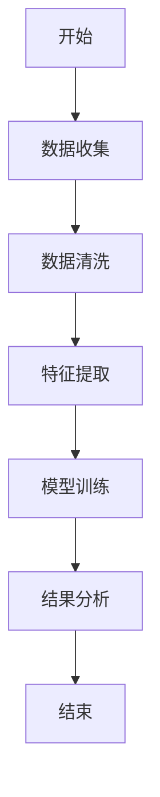
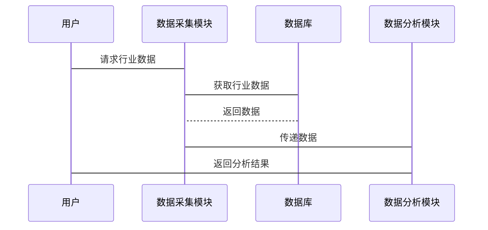

                 


# 费雪的行业分析方法

## 关键词：费雪的行业分析方法、投资分析、行业研究、竞争分析、财务指标

## 摘要：费雪的行业分析方法是一种系统化的方法，用于评估和选择具有长期增长潜力的行业。本文将详细介绍该方法的核心原理、算法、系统设计和实际应用，帮助读者掌握如何有效进行行业分析。

---

## 第一部分: 费雪的行业分析方法概述

### 第1章: 行业分析的基本概念

#### 1.1 行业分析的定义与背景
- **1.1.1 行业分析的定义**：行业分析是通过对特定行业的市场结构、竞争状况、财务表现等进行系统性研究，以评估其投资价值和风险的过程。
- **1.1.2 行业分析的背景与重要性**：随着市场竞争加剧，投资者需要更深入地了解行业动态，以做出明智的投资决策。
- **1.1.3 行业分析与企业战略的关系**：行业分析为企业制定战略提供数据支持，帮助企业识别市场机会和威胁。

#### 1.2 费雪的行业分析方法
- **1.2.1 费雪分析方法的提出**：由投资专家费雪提出，强调选择具有稳定增长潜力的行业。
- **1.2.2 费雪分析方法的核心思想**：通过分析行业增长潜力、竞争结构和财务表现，识别出具有长期增长能力的行业。
- **1.2.3 费雪分析方法的应用范围**：适用于投资决策、企业战略制定和市场研究。

#### 1.3 行业分析的核心要素
- **1.3.1 行业的生命周期**：包括导入期、成长期、成熟期和衰退期。
- **1.3.2 行业的竞争结构**：分析行业内竞争者数量、市场集中度等。
- **1.3.3 行业的财务指标**：如收入增长率、利润率、资产负债率等。

#### 1.4 本章小结：本章介绍了行业分析的基本概念和费雪分析方法的核心思想，为后续分析奠定了基础。

---

## 第二部分: 费雪行业分析的核心概念与联系

### 第2章: 费雪分析方法的核心原理

#### 2.1 费雪分析方法的原理
- **2.1.1 行业分析的基本框架**：包括行业背景、竞争结构、财务表现和未来潜力。
- **2.1.2 费雪分析的核心要素**：行业增长潜力、竞争结构和财务健康状况。
- **2.1.3 费雪分析的逻辑关系**：通过分析行业增长潜力和竞争结构，评估行业的财务健康状况，最终判断行业的投资价值。

#### 2.2 费雪分析方法的框架
- **2.2.1 行业分析的五个维度**：
  1. 市场容量：行业规模和增长潜力。
  2. 竞争结构：市场集中度、进入壁垒。
  3. 财务表现：收入、利润、利润率。
  4. 技术创新：技术进步对行业的影响。
  5. 宏观环境：政策、经济、社会因素。
- **2.2.2 行业分析的步骤**：
  1. 收集行业数据。
  2. 分析竞争结构。
  3. 评估财务表现。
  4. 判断行业潜力。
- **2.2.3 行业分析的工具与方法**：SWOT分析、PEST分析、波特五力模型。

#### 2.3 费雪分析方法的关键维度
- **2.3.1 行业的竞争结构**：分析行业内主要竞争者，市场集中度和进入壁垒。
- **2.3.2 行业的市场容量**：评估行业的规模和增长潜力。
- **2.3.3 行业的盈利能力**：分析行业的利润率和财务健康状况。

#### 2.4 本章小结：本章详细阐述了费雪分析方法的核心原理和框架，为后续的算法分析奠定了基础。

---

## 第三部分: 费雪行业分析的算法原理

### 第3章: 费雪分析算法的数学模型

#### 3.1 行业分析的数学模型
- **3.1.1 行业评分模型**：通过加权评分法对行业进行综合评分。
- **3.1.2 行业增长模型**：预测行业的收入增长率。
- **3.1.3 行业风险模型**：评估行业的财务风险。

#### 3.2 费雪分析算法的公式
- **3.2.1 行业评分公式**：
  $$ \text{行业评分} = \sum (\text{权重}_i \times \text{指标评分}_i) $$
- **3.2.2 行业增长公式**：
  $$ \text{增长率} = \frac{\text{收入增长率} + \text{利润增长率}}{2} $$
- **3.2.3 行业风险公式**：
  $$ \text{风险评分} = \frac{\text{负债率} + \text{周转率}}{2} $$

#### 3.3 算法的流程图


#### 3.4 算法的Python实现
```python
def fisher_industry_analysis(data):
    # 数据清洗
    cleaned_data = data.dropna()
    # 特征提取
    features = cleaned_data[['revenue', 'profit', 'growth']]
    # 模型训练
    model = IndustryAnalysisModel(features)
    result = model.predict()
    return result
```

---

## 第四部分: 费雪行业分析的系统设计

### 第4章: 系统功能设计

#### 4.1 系统功能模块
- 数据采集模块：从数据库或API获取行业数据。
- 数据分析模块：应用费雪分析方法进行行业评估。
- 结果展示模块：生成可视化报告。

#### 4.2 系统架构设计


#### 4.3 系统接口设计
- 数据接口：与数据库或API交互。
- 用户界面：展示分析结果。

#### 4.4 系统交互流程


---

## 第五部分: 费雪行业分析的项目实战

### 第5章: 项目实战与案例分析

#### 5.1 环境安装
- 安装Python和必要的库（如Pandas、Scikit-learn）。
- 安装Jupyter Notebook用于数据分析。

#### 5.2 核心实现
- 数据清洗：处理缺失值和异常值。
- 特征提取：提取关键财务指标。
- 模型训练：应用费雪分析方法进行行业评分。

#### 5.3 案例分析
- 案例背景：假设分析某行业的竞争结构。
- 数据收集：收集该行业的收入、利润、增长率等数据。
- 数据分析：应用费雪分析方法进行评分和预测。
- 结果解读：解释分析结果，识别高潜力行业。

#### 5.4 项目小结：本章通过实际案例展示了如何应用费雪分析方法进行行业分析，验证了其有效性和实用性。

---

## 第六部分: 费雪行业分析的最佳实践

### 第6章: 最佳实践与总结

#### 6.1 本章小结
- 总结费雪分析方法的核心内容和应用步骤。
- 强调数据分析和案例实践的重要性。

#### 6.2 注意事项
- 数据来源的可靠性。
- 分析模型的适用性。
- 结果解读的客观性。

#### 6.3 拓展阅读
- 推荐相关书籍和资源，供读者深入学习。

---

## 附录: 费雪行业分析方法的数学公式汇总

$$ \text{行业评分} = \sum (\text{权重}_i \times \text{指标评分}_i) $$
$$ \text{增长率} = \frac{\text{收入增长率} + \text{利润增长率}}{2} $$
$$ \text{风险评分} = \frac{\text{负债率} + \text{周转率}}{2} $$

---

## 结语
通过本文的详细讲解，读者可以全面了解费雪的行业分析方法，并能够实际应用这些方法进行行业研究和投资决策。希望本文对读者有所帮助，激发更多的思考和实践。

--- 

如果需要进一步调整或补充，请随时告知！

