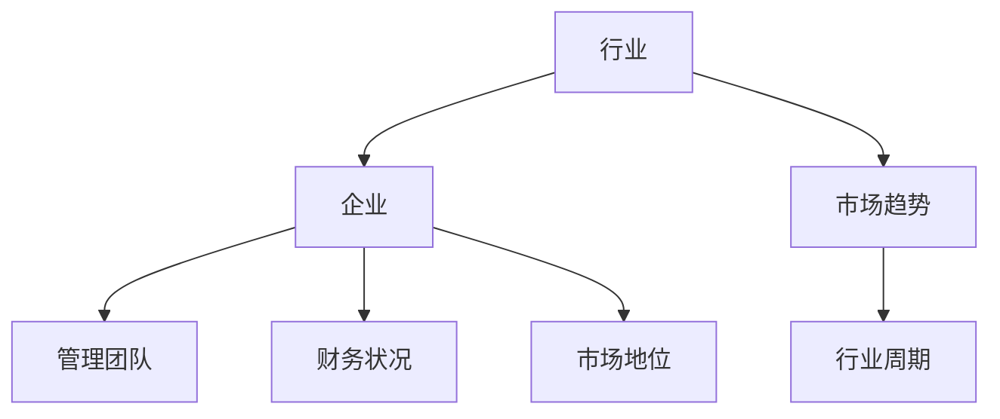
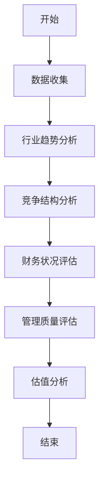
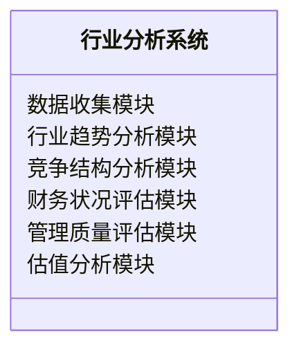
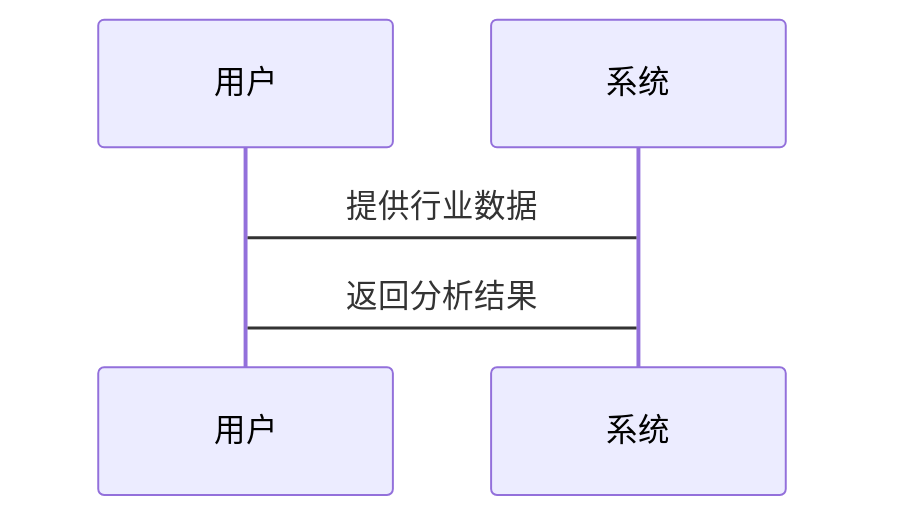

                 


# 费雪的行业分析方法

## 关键词：费雪, 行业分析, 投资策略, 企业估值, 市场趋势

## 摘要：费雪的行业分析方法是一种系统性的投资分析策略，旨在通过深入分析行业背景、企业基本面和市场趋势，帮助投资者做出明智的投资决策。本文详细探讨了费雪方法的核心概念、算法流程、数学模型以及实际应用，为读者提供全面的行业分析指南。

---

## 第一部分：行业分析的背景与重要性

### 第1章：行业分析的基本概念

#### 1.1 行业分析的定义与作用

行业分析是指对特定行业内的市场结构、竞争状况、发展趋势和经济环境进行系统性研究的过程。其目的是帮助投资者或企业更好地理解行业的运作模式，识别潜在机会和风险，从而做出更明智的决策。

行业分析在投资决策中起着至关重要的作用。通过行业分析，投资者可以评估行业的成长潜力、竞争格局以及市场容量，从而选择具有投资价值的企业或行业。此外，行业分析还能帮助企业在制定战略时考虑外部环境的影响，提高决策的科学性和前瞻性。

#### 1.2 费雪行业分析方法的背景

费雪的行业分析方法由投资专家彼得·费雪提出，是一种以基本面分析为核心的投资策略。该方法强调对行业和企业的深入研究，尤其是关注企业的管理质量、财务状况和市场地位。费雪认为，成功的投资不仅依赖于对企业的分析，还需要对所在行业的整体情况进行全面了解。

费雪方法的背景可以追溯到20世纪70年代，当时彼得·费雪通过其投资实践总结出一套独特的行业分析方法。这种方法结合了定量分析和定性分析，注重企业的成长性和估值的合理性，成为投资领域的重要参考。

#### 1.3 问题背景与问题描述

在当前的经济环境中，行业分析显得尤为重要。随着市场的全球化和竞争的加剧，投资者需要更加精准地判断行业的前景，以避免投资风险并抓住潜在机会。然而，许多投资者在进行行业分析时，往往缺乏系统的方法，导致分析结果不够准确或缺乏深度。

费雪行业分析方法正是为了解决这些问题而提出的。它提供了一套结构化的分析框架，帮助投资者全面评估行业和企业的内在价值，从而做出更明智的投资决策。

---

## 第二部分：费雪行业分析方法的核心概念

### 第2章：费雪方法的核心原理

#### 2.1 费雪方法的核心要素

费雪行业分析方法的核心要素包括以下几个方面：

1. **行业趋势分析**：研究行业的增长趋势、周期性以及技术进步等因素，判断行业的长期发展潜力。
2. **竞争结构分析**：分析行业内的主要竞争者，评估企业的竞争优势和劣势，判断企业的市场地位。
3. **财务状况评估**：通过对企业财务报表的分析，评估企业的盈利能力、资产负债情况和现金流状况。
4. **管理质量评估**：考察企业的管理团队，评估其战略决策能力和执行力。
5. **估值分析**：通过市盈率、市净率等指标，评估企业的估值是否合理。

#### 2.2 费雪方法的独特之处

费雪行业分析方法的独特之处在于其注重企业的内在价值和成长潜力，而非仅仅关注市场短期波动。与传统的行业分析方法相比，费雪方法更加注重对企业基本面的深入研究，尤其是企业的管理和财务状况。

以下是费雪方法与其他行业分析方法的对比表格：

| 对比维度 | 费雪方法 | 传统方法 |
|----------|----------|----------|
| 分析重点 | 企业内在价值 | 行业整体趋势 |
| 分析方法 | 结合定量和定性分析 | 主要依赖定量分析 |
| 适用场景 | 中长期投资决策 | 短期市场预测 |

#### 2.3 费雪方法的实体关系图

以下是一个使用Mermaid绘制的费雪方法实体关系图：



---

## 第三部分：费雪行业分析方法的算法与数学模型

### 第3章：费雪方法的算法流程

#### 3.1 费雪方法的步骤分解

费雪行业分析方法的算法流程可以分为以下几个步骤：

1. **数据收集**：收集行业和企业的相关数据，包括财务报表、市场报告和新闻资讯。
2. **行业趋势分析**：分析行业的增长趋势和周期性，判断行业的整体前景。
3. **竞争结构分析**：评估行业内主要竞争者的优势和劣势，判断企业的市场地位。
4. **财务状况评估**：对企业财务报表进行分析，评估企业的盈利能力、资产负债情况和现金流状况。
5. **管理质量评估**：考察企业的管理团队，评估其战略决策能力和执行力。
6. **估值分析**：通过市盈率、市净率等指标，评估企业的估值是否合理。

#### 3.2 费雪方法的Mermaid流程图

以下是一个使用Mermaid绘制的费雪方法流程图：



#### 3.3 费雪方法的Python代码实现

以下是一个简单的Python代码示例，用于计算企业的市盈率：

```python
def calculate_pe_ratio(net_income, price_per_share):
    return price_per_share / (net_income / 1000000)
```

### 第4章：数学模型与公式

#### 4.1 行业评分系统

费雪行业分析方法中使用了一个评分系统，用于评估行业的整体表现。评分系统基于以下几个指标：

1. **行业增长潜力**：权重为40%
2. **竞争结构**：权重为30%
3. **管理质量**：权重为20%
4. **财务状况**：权重为10%

评分公式如下：

$$
\text{行业评分} = 0.4 \times \text{增长潜力} + 0.3 \times \text{竞争结构} + 0.2 \times \text{管理质量} + 0.1 \times \text{财务状况}
$$

#### 4.2 市场增长率预测

费雪方法中还使用了一个简单的市场增长率预测模型：

$$
\text{市场增长率} = \frac{\text{行业收入增长} + \text{行业利润增长}}{2}
$$

---

## 第四部分：系统分析与架构设计

### 第5章：系统分析与架构设计

#### 5.1 系统功能设计

以下是使用Mermaid绘制的系统功能设计类图：



#### 5.2 系统架构设计

以下是使用Mermaid绘制的系统架构图：


#### 5.3 系统接口设计

以下是使用Mermaid绘制的系统交互序列图：



---

## 第五部分：项目实战

### 第6章：项目实战

#### 6.1 项目背景与目标

本项目旨在通过费雪行业分析方法，对科技行业进行深入分析，评估行业的整体前景和企业的投资价值。

#### 6.2 数据收集与处理

收集科技行业的相关数据，包括行业报告、企业财务报表和市场资讯。

#### 6.3 分析与结果解读

通过对数据的分析，评估科技行业的增长潜力、竞争结构、企业管理和财务状况，最终得出行业的评分和企业的估值。

---

## 第六部分：最佳实践

### 第7章：最佳实践

#### 7.1 小结

费雪行业分析方法是一种系统性的投资分析策略，通过对企业基本面和行业背景的深入研究，帮助投资者做出更明智的投资决策。

#### 7.2 注意事项

在实际应用中，投资者需要注意数据的准确性和分析的全面性，同时要关注市场的动态变化，及时调整分析结果。

#### 7.3 拓展阅读

建议读者进一步阅读彼得·费雪的相关著作，以及相关的投资分析书籍，以深入理解费雪方法的精髓。

---

## 总结

费雪的行业分析方法为投资者提供了一套系统化的分析框架，帮助他们在复杂多变的市场环境中做出明智的投资决策。通过本文的详细讲解，读者可以更好地理解和应用费雪方法，提升自身的投资分析能力。

