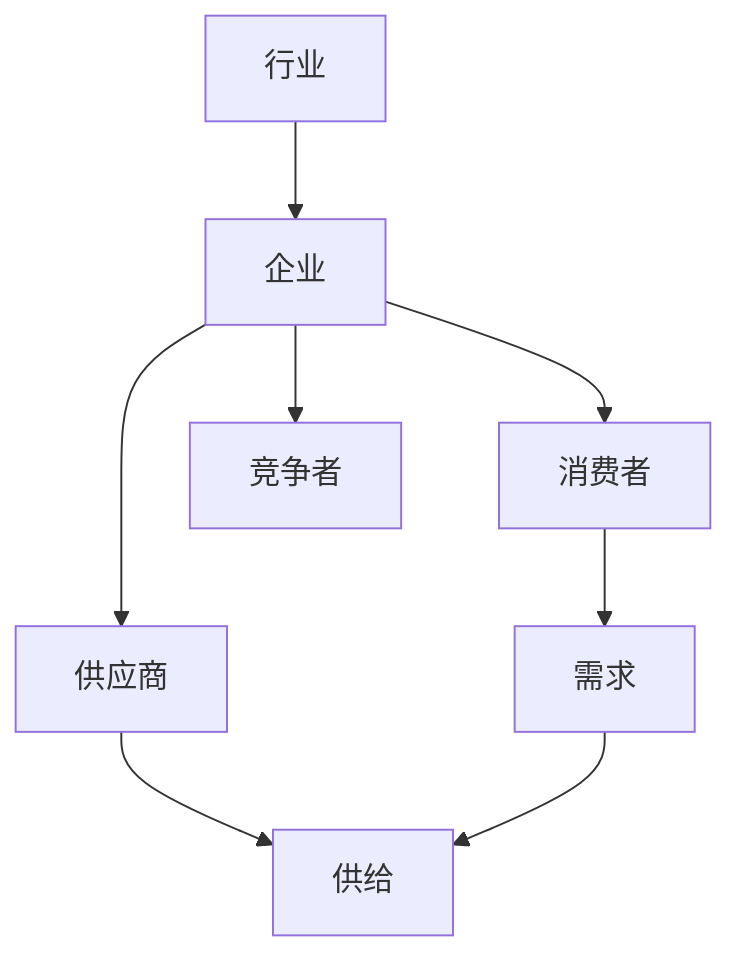
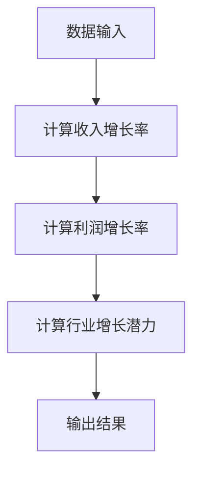
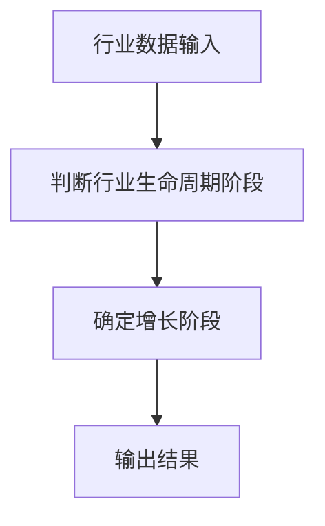
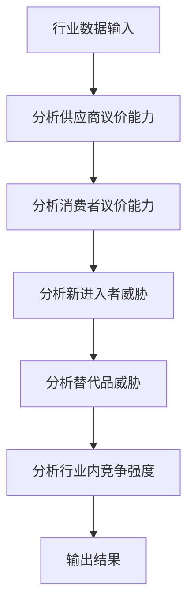
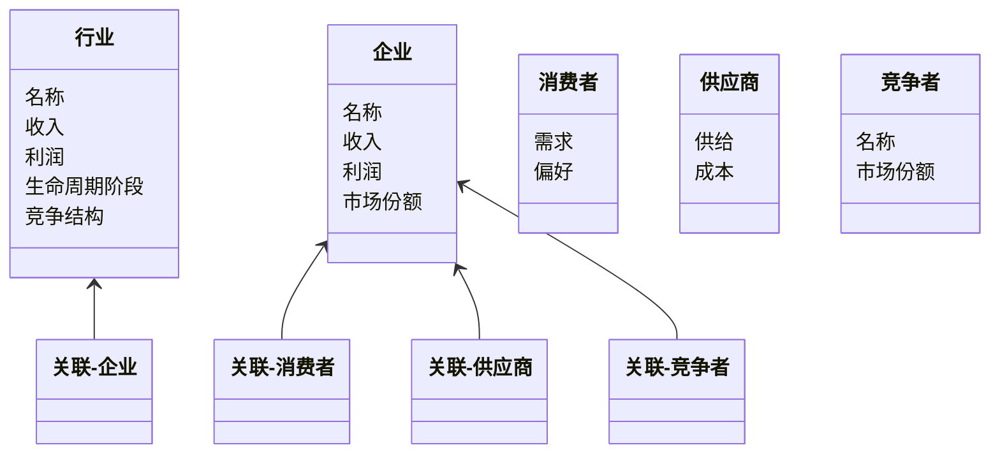
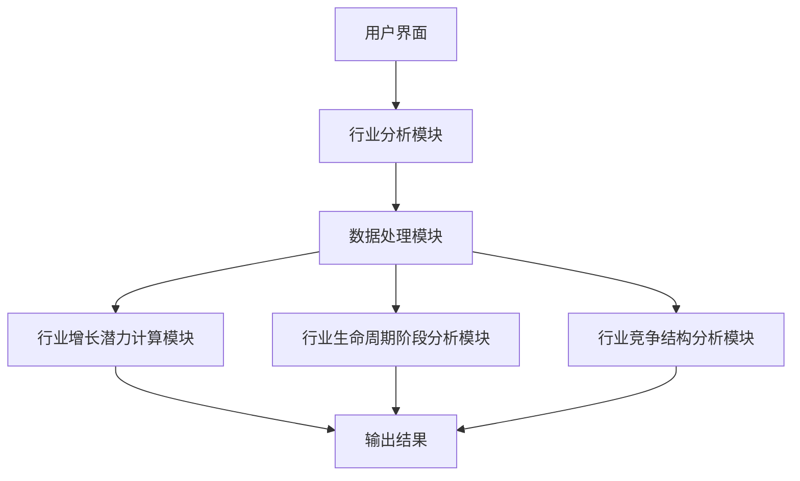
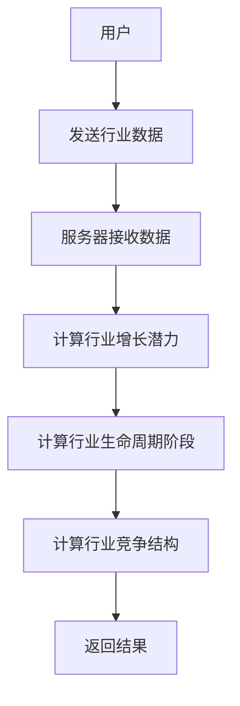

                 


# 费雪的行业分析方法：寻找高增长机会

> **关键词**: 费雪行业分析、高增长行业、投资策略、行业生命周期、行业竞争结构

> **摘要**: 本文将详细介绍费雪的行业分析方法，探讨如何通过分析行业增长潜力、行业生命周期和行业竞争结构来寻找高增长机会。文章结合理论与实践，提供具体的数学模型和Python代码实现，帮助读者系统地掌握费雪的行业分析方法。

---

# 第一部分: 费雪的行业分析方法概述

## #1: 费雪行业分析方法的背景与核心概念

### 1.1 行业分析的基本概念

#### 1.1.1 行业分析的定义与作用

行业分析是指对特定行业进行系统性研究，以评估其增长潜力、竞争结构和市场前景。行业分析的目的是帮助投资者、企业管理者等做出更明智的决策。

#### 1.1.2 费雪行业分析方法的提出背景

费雪（Philip Fisher）是20世纪的投资大师，提出了“成长股投资”的理念。他认为，投资成功的关键在于选择那些处于高增长行业的公司。费雪的行业分析方法强调通过分析行业增长潜力、行业生命周期和行业竞争结构来识别高增长机会。

#### 1.1.3 高增长行业的特征与分类

高增长行业通常具有以下特征：
- 高收入增长率
- 高利润增长率
- 较大的市场空间
- 较低的行业竞争度

高增长行业可以分为以下几类：
- 技术创新行业（如人工智能、大数据）
- 消费升级行业（如高端消费品、医疗健康）
- 新兴行业（如新能源、节能环保）

---

### 1.2 费雪行业分析的核心要素

#### 1.2.1 行业增长潜力的衡量标准

行业增长潜力是费雪行业分析的核心要素之一。它可以通过以下指标来衡量：
- 行业收入增长率
- 行业利润增长率
- 行业市场容量

#### 1.2.2 行业生命周期的阶段划分

行业生命周期分为四个阶段：
1. **导入期**：行业刚刚进入市场，需求较低，竞争较少。
2. **增长期**：行业需求迅速增长，企业数量增加，竞争加剧。
3. **成熟期**：行业需求增长放缓，市场趋于饱和，竞争激烈。
4. **衰退期**：行业需求持续下降，企业数量减少，市场萎缩。

#### 1.2.3 行业竞争结构的分析框架

费雪的行业分析方法强调分析行业的竞争结构。以下是行业竞争结构的分析框架：
- **供应商的议价能力**
- **消费者的议价能力**
- **新进入者的威胁**
- **替代品的威胁**
- **行业内竞争者的强度**

---

### 1.3 费雪方法与宏观经济分析的结合

#### 1.3.1 经济周期对行业增长的影响

经济周期对行业增长有重要影响：
- **衰退期**：行业需求下降，企业利润减少。
- **复苏期**：行业需求逐步恢复，企业利润开始回升。
- **增长期**：行业需求快速增长，企业利润显著增加。
- **成熟期**：行业需求趋于稳定，企业利润增长放缓。

#### 1.3.2 宏观政策对行业发展的推动作用

政府政策对行业的发展有重要推动作用。例如：
- **技术创新政策**：鼓励企业研发新技术，推动行业升级。
- **行业扶持政策**：通过税收优惠、资金补贴等方式支持特定行业的发展。
- **环保政策**：推动环保行业发展，限制污染行业扩张。

#### 1.3.3 行业与经济指标的相关性分析

行业与经济指标的相关性分析可以帮助投资者更好地理解行业增长潜力。例如：
- **GDP增长率**：GDP增长与行业需求密切相关。
- **CPI（消费者价格指数）**：CPI上涨可能影响行业成本和价格。
- **利率**：低利率环境通常有利于行业投资和扩张。

---

### 1.4 本章小结

本章介绍了费雪行业分析方法的背景、核心概念和宏观经济分析的结合。通过分析行业增长潜力、行业生命周期和行业竞争结构，可以帮助投资者识别高增长行业。

---

# 第二部分: 费雪行业分析的核心概念与联系

## #2: 费雪行业分析的原理与模型

### 2.1 费雪行业增长潜力的评估模型

#### 2.1.1 行业增长潜力的计算公式

行业增长潜力可以通过以下公式计算：
$$ \text{行业增长潜力} = \frac{\text{行业收入增长率} + \text{行业利润增长率}}{2} $$

其中，行业收入增长率和行业利润增长率可以通过以下公式计算：
$$ \text{收入增长率} = \frac{\text{当年收入} - \text{去年收入}}{\text{去年收入}} $$
$$ \text{利润增长率} = \frac{\text{当年利润} - \text{去年利润}}{\text{去年利润}} $$

#### 2.1.2 行业增长潜力的评估步骤

1. 收集行业数据，包括收入和利润数据。
2. 计算行业收入增长率和利润增长率。
3. 计算行业增长潜力评分。

---

### 2.2 行业生命周期与增长阶段的关联

#### 2.2.1 行业生命周期的阶段划分

行业生命周期分为四个阶段：
1. **导入期**：行业需求低，竞争小。
2. **增长期**：行业需求快速增长，竞争加剧。
3. **成熟期**：行业需求稳定，竞争激烈。
4. **衰退期**：行业需求下降，竞争减弱。

#### 2.2.2 不同阶段的增长潜力对比

以下是不同阶段的增长潜力对比：

| 阶段       | 收入增长率 | 利润增长率 | 投资价值 |
|------------|-----------|-----------|----------|
| 导入期     | 高       | 低       | 中       |
| 增长期     | 高       | 高       | 高       |
| 成熟期     | 低       | 中       | 中       |
| 衰退期     | 负       | 负       | 低       |

---

### 2.3 行业竞争结构的ER实体关系图

以下是行业竞争结构的ER实体关系图：



---

### 2.4 本章小结

本章详细讲解了费雪行业分析的核心概念与联系，包括行业增长潜力的评估模型、行业生命周期与增长阶段的关联，以及行业竞争结构的分析框架。

---

# 第三部分: 费雪行业分析的算法原理

## #3: 行业增长潜力的算法实现

### 3.1 行业增长潜力的计算算法

#### 3.1.1 算法原理

以下是行业增长潜力的计算算法：



#### 3.1.2 Python实现代码

以下是Python代码实现：

```python
def calculate_growth_potential(income_growth, profit_growth):
    return (income_growth + profit_growth) / 2

# 示例数据
last_year_income = 100
current_year_income = 120
last_year_profit = 50
current_year_profit = 60

# 计算增长率
income_growth = (current_year_income - last_year_income) / last_year_income
profit_growth = (current_year_profit - last_year_profit) / last_year_profit

# 计算行业增长潜力
growth_potential = calculate_growth_potential(income_growth, profit_growth)
print(f"行业增长潜力: {growth_potential}")
```

---

### 3.2 行业生命周期与增长阶段的分析算法

#### 3.2.1 算法原理

以下是行业生命周期与增长阶段的分析算法：



---

### 3.3 行业竞争结构的分析算法

#### 3.3.1 算法原理

以下是行业竞争结构的分析算法：



---

### 3.4 本章小结

本章详细讲解了费雪行业分析的算法原理，包括行业增长潜力的计算算法、行业生命周期与增长阶段的分析算法，以及行业竞争结构的分析算法。

---

# 第四部分: 费雪行业分析的项目实战

## #4: 费雪行业分析的系统架构设计

### 4.1 系统功能设计

#### 4.1.1 领域模型

以下是领域模型：



#### 4.1.2 系统架构设计

以下是系统架构设计：



---

### 4.2 系统接口设计

#### 4.2.1 API接口设计

以下是API接口设计：

```http
POST /api/industry-analysis
Content-Type: application/json

{
    "industry_data": {
        "收入": 100,
        "利润": 50,
        "生命周期阶段": "增长期",
        "竞争结构": {
            "供应商议价能力": "低",
            "消费者议价能力": "高",
            "新进入者威胁": "中",
            "替代品威胁": "低",
            "行业内竞争强度": "高"
        }
    }
}
```

---

### 4.3 系统交互设计

#### 4.3.1 交互流程图

以下是系统交互流程图：



---

### 4.4 项目实战总结

通过以上系统架构设计和实现，我们可以清晰地看到费雪行业分析方法在实际项目中的应用。通过数据处理模块、行业增长潜力计算模块、行业生命周期阶段分析模块和行业竞争结构分析模块的协同工作，我们可以有效地识别高增长行业。

---

# 第五部分: 费雪行业分析的最佳实践

## #5: 费雪行业分析的最佳实践

### 5.1 关键点总结

- **数据质量**：确保行业数据的准确性和完整性。
- **模型选择**：根据实际情况选择合适的行业分析模型。
- **持续监测**：定期更新行业数据，及时调整分析结果。

---

### 5.2 注意事项

- **行业数据的获取**：确保数据来源可靠。
- **模型的适用性**：不同行业可能需要不同的分析模型。
- **结果的解释**：行业增长潜力评分只是一个参考指标，需要结合实际情况进行判断。

---

### 5.3 拓展阅读

- 《投资学》——巴菲特
- 《股票作手回忆录》——利弗莫尔
- 《价值投资：普世的智慧》——彼得·林奇

---

# 结语

通过本文的详细介绍，我们系统地掌握了费雪的行业分析方法，包括行业增长潜力的评估模型、行业生命周期与增长阶段的关联，以及行业竞争结构的分析框架。希望本文的内容能够帮助读者在实际投资中更好地应用费雪的行业分析方法，识别高增长机会，实现投资成功。

