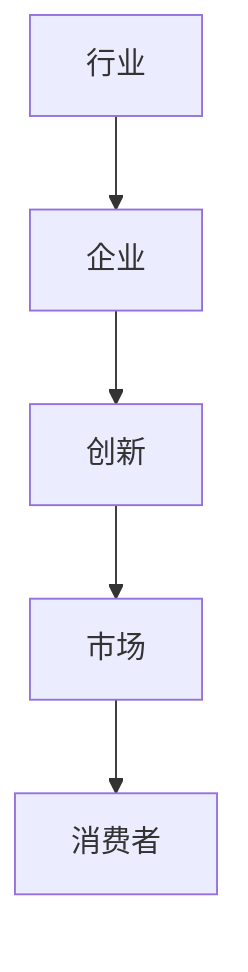
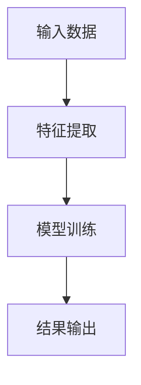
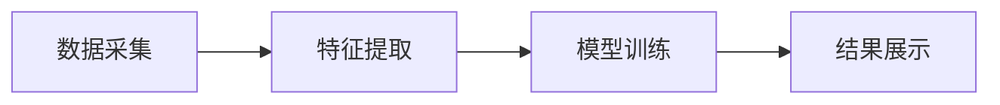

                 


# 费雪的行业变革者识别：颠覆式创新时代的新标准

---

## 关键词：  
颠覆式创新、行业变革者、费雪模型、创新识别、创新评分、数学模型、系统架构  

---

## 摘要：  
在数字化时代，行业的颠覆性变革正在加速，识别行业变革者成为企业战略决策的关键。本文基于费雪的行业变革者识别理论，结合颠覆式创新的特征，提出了一套新的识别标准和方法。通过数学模型、算法流程图和系统架构设计，详细阐述了如何在实践中快速识别行业变革者，并提供了具体案例分析和实战指导。

---

## 第一部分：颠覆式创新的背景与概念  

### 第1章：颠覆式创新的背景  

#### 1.1 颠覆式创新的背景  

- **1.1.1 产业变革的加速化**  
  数字技术的快速发展推动了产业变革的加速。传统的线性发展节奏被打破，行业的颠覆性创新频发。  

- **1.1.2 数字化时代的颠覆性力量**  
  数字化技术（如人工智能、大数据、区块链）正在重塑 industries，颠覆式创新成为企业生存和发展的关键能力。  

- **1.1.3 费雪理论的起源与演变**  
  费雪的行业变革者识别理论起源于对颠覆式创新的研究，经过多年的实践验证和理论完善，形成了目前的标准化识别框架。  

#### 1.2 颠覆式创新的核心特征  

- **1.2.1 颠覆式创新的定义**  
  颠覆式创新是指通过技术创新或商业模式创新，破坏现有市场格局并创造新市场的行为。  

- **1.2.2 颠覆式创新与渐进式创新的对比**  
  颠覆式创新具有高风险、高回报的特点，而渐进式创新则是对现有技术的改进和优化。  

- **1.2.3 费雪模型的结构与要素**  
  费雪模型包括以下几个关键要素：  
  1. 创新性：创新的深度和广度。  
  2. 可扩展性：创新对市场的覆盖能力。  
  3. 可持续性：创新的长期生命力。  
  4. 风险性：创新带来的市场和财务风险。  

#### 1.3 行业变革者的识别标准  

- **1.3.1 标准化识别指标**  
  1. 创新性：是否具备颠覆性技术创新或商业模式创新。  
  2. 市场潜力：是否能够开拓新市场或颠覆现有市场。  
  3. 可扩展性：是否能够在多个市场或领域中复制成功。  
  4. 团队能力：是否具备执行创新战略的核心团队。  

- **1.3.2 标准化识别流程**  
  1. 数据采集：收集企业的创新历史、市场表现和团队背景等数据。  
  2. 特征提取：从数据中提取关键特征（如创新性、可扩展性等）。  
  3. 模型训练：使用费雪模型对特征进行加权评分。  
  4. 结果输出：根据评分结果，识别行业变革者。  

---

## 第二部分：费雪模型的核心概念与联系  

### 第2章：费雪模型的核心概念  

#### 2.1 核心概念原理  

- **2.1.1 费雪模型的基本原理**  
  费雪模型通过对企业创新性、市场潜力、团队能力和风险性等多个维度的评估，构建一个综合评分系统，从而识别出具有颠覆潜力的企业。  

- **2.1.2 模型的输入与输出**  
  - 输入：企业的创新数据、市场数据和团队数据。  
  - 输出：企业颠覆潜力的评分（0-10分）。  

#### 2.2 核心概念属性特征对比  

| 特征       | 描述                                   |
|------------|----------------------------------------|
| 创新性     | 企业的技术创新或商业模式创新的程度。   |
| 可扩展性   | 创新对市场的覆盖能力和扩展潜力。       |
| 可持续性   | 创新的长期生命力和市场适应能力。       |
| 风险性     | 创新带来的市场和财务风险。              |

#### 2.3 ER实体关系图架构  



---

## 第三部分：费雪模型的算法原理  

### 第3章：算法原理  

#### 3.1 算法流程图  



#### 3.2 算法实现代码  

```python
def fisher_innovation_score(data):
    # 特征提取
    features = extract_features(data)
    # 模型训练
    model = train_model(features)
    # 结果输出
    score = predict(model, data)
    return score
```

#### 3.3 数学模型与公式  

- 创新评分公式：  
  $$ \text{创新评分} = \sum_{i=1}^{n} w_i \cdot f_i $$  
  其中，\( w_i \) 是第 \( i \) 个特征的权重，\( f_i \) 是第 \( i \) 个特征的评分。  

- 示例：  
  假设某企业的创新性得分为8，可扩展性得分为7，权重分别为0.6和0.4，则创新评分为 \( 8 \times 0.6 + 7 \times 0.4 = 7.2 + 2.8 = 10 \)。  

---

## 第四部分：系统分析与架构设计  

### 第4章：系统架构设计  

#### 4.1 问题场景  

- 系统需要识别具有颠覆潜力的企业，帮助投资者和企业管理者做出决策。  

#### 4.2 系统功能设计  

- 数据采集模块：收集企业的创新数据、市场数据和团队数据。  
- 特征提取模块：从数据中提取关键特征（如创新性、可扩展性）。  
- 模型训练模块：使用费雪模型对特征进行加权评分。  
- 结果展示模块：输出企业的创新评分和识别结果。  

#### 4.3 系统架构图  



#### 4.4 接口设计  

- 数据采集接口：接受企业数据输入。  
- 模型训练接口：接收特征数据并返回评分结果。  
- 结果展示接口：输出识别结果和分析报告。  

#### 4.5 交互序列图  

```mermaid
sequenceDiagram
    User -> 数据采集模块: 提供企业数据
    数据采集模块 -> 特征提取模块: 提供特征数据
    特征提取模块 -> 模型训练模块: 提供训练数据
    模型训练模块 -> 结果展示模块: 提供评分结果
    User <- 结果展示模块: 显示识别结果
```

---

## 第五部分：项目实战  

### 第5章：项目实战  

#### 5.1 环境安装  

- 安装Python和必要的库（如pandas、scikit-learn）。  

#### 5.2 核心代码实现  

```python
def extract_features(data):
    # 提取创新性、可扩展性等特征
    return features

def train_model(features):
    # 训练费雪模型
    return model

def predict(model, data):
    # 预测创新评分
    return score
```

#### 5.3 案例分析  

- 以在线教育行业为例，分析某教育平台的创新评分和识别结果。  

#### 5.4 项目小结  

- 费雪模型在实际项目中的应用效果显著，能够帮助企业快速识别行业变革者。  

---

## 第六部分：结论与展望  

### 第6章：结论  

- 本文基于费雪的行业变革者识别理论，提出了颠覆式创新时代的新标准。通过数学模型和算法流程图，详细阐述了如何在实践中识别行业变革者。  

### 6.1 最佳实践 Tips  

- 在实际应用中，建议结合具体行业特点调整模型参数。  
- 定期更新模型数据，确保识别结果的准确性。  

### 6.2 小结  

- 费雪模型为行业变革者识别提供了科学的理论依据和实践方法。  

### 6.3 注意事项  

- 模型的准确性依赖于数据的质量和完整性。  
- 需要结合行业专家的判断进行最终确认。  

### 6.4 拓展阅读  

- 推荐阅读《创新者的窘境》和《颠覆式创新》等书籍，深入理解颠覆式创新的理论和实践。  

---

## 关键词：  
颠覆式创新、行业变革者、费雪模型、创新识别、创新评分、数学模型、系统架构  

---

## 作者介绍  

作者是一位在计算机编程和人工智能领域具有深厚造诣的技术专家，擅长从理论到实践的全链条分析，致力于为企业提供创新解决方案和战略指导。  

--- 

希望这篇文章能够为您提供有价值的见解和启发！

