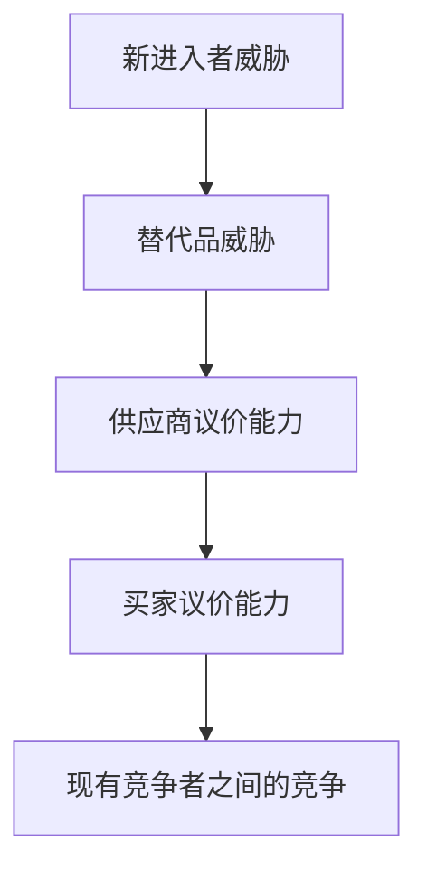
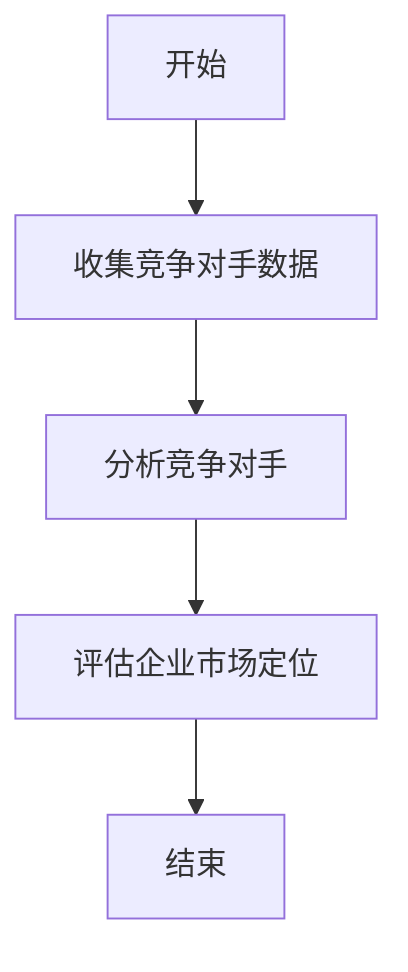
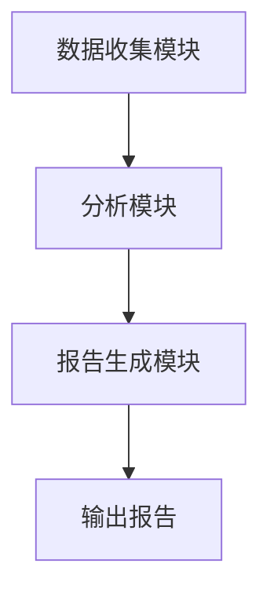

                 


# 费雪的行业研究方法：了解公司的竞争环境

> 关键词：行业研究、竞争环境、费雪方法、市场份额、竞争优势、竞争壁垒、市场定位

> 摘要：本文详细介绍了费雪的行业研究方法，重点分析了如何通过该方法了解公司的竞争环境。文章从行业研究的背景和重要性入手，深入探讨了费雪方法的核心概念、算法原理、数学模型、系统架构设计以及实际项目中的应用。通过具体案例分析，展示了如何利用费雪方法进行竞争环境评估、市场定位策略制定等关键步骤，帮助读者全面掌握这一行业的研究方法。

---

# 第一部分: 费雪的行业研究方法概述

## 第1章: 费雪行业研究方法的背景介绍

### 1.1 行业研究的重要性
行业研究是企业制定战略决策的重要基础，它帮助企业了解行业现状、竞争格局、市场趋势以及潜在机会和风险。通过行业研究，企业可以更好地制定市场进入策略、产品开发计划和竞争策略。

#### 1.1.1 什么是行业研究
行业研究是指通过对特定行业的市场结构、竞争格局、关键趋势等进行系统性分析，以帮助企业或投资者了解行业动态和潜在机会的过程。

#### 1.1.2 行业研究的核心作用
- **识别行业机会**：发现市场中的空白或高增长领域。
- **评估竞争压力**：了解主要竞争对手的优劣势。
- **制定市场策略**：帮助企业制定有效的市场进入和竞争策略。

#### 1.1.3 行业研究的常见应用场景
- 市场进入决策
- 产品开发规划
- 投资决策支持
- 竞争对手分析

### 1.2 费雪行业研究方法的提出
费雪的行业研究方法是一种基于竞争环境分析的系统性研究方法，它结合了定量分析和定性分析，旨在帮助企业更全面地了解行业竞争格局。

#### 1.2.1 费雪方法的基本概念
费雪行业研究方法是一种以竞争对手分析为核心，结合市场定位、市场份额和竞争优势评估的行业研究方法。

#### 1.2.2 费雪方法的独特之处
与传统的行业研究方法相比，费雪方法更加注重竞争环境的动态分析，强调通过数据驱动的方法来评估企业的竞争优势和市场定位。

#### 1.2.3 费雪方法与其他行业研究方法的对比
| 方法       | 费雪方法 | 传统SWOT分析 | PEST分析 |
|------------|----------|---------------|----------|
| 核心内容   | 竞争环境分析 | 优势、劣势、机会、威胁 | 宏观环境分析 |
| 数据驱动   | 强调定量分析 | 定性分析为主 | 综合分析 |
| 应用场景   | 竞争策略制定 | 战略规划 | 宏观趋势分析 |

### 1.3 费雪行业研究方法的核心要素
#### 1.3.1 行业结构分析
行业结构分析是费雪方法的基础，主要包括对行业生命周期、市场进入壁垒和竞争程度的分析。

#### 1.3.2 竞争环境评估
通过分析竞争对手的市场份额、产品差异化、品牌影响力等指标，评估企业的竞争优势。

#### 1.3.3 市场定位策略
根据企业的市场定位，制定相应的竞争策略，包括目标市场选择、产品差异化和价格策略。

### 1.4 本章小结
本章介绍了费雪行业研究方法的背景和重要性，重点分析了其核心概念和独特之处。通过对比其他方法，突出了费雪方法的竞争环境分析优势。

---

## 第2章: 费雪行业研究方法的核心概念

### 2.1 行业结构分析
行业结构分析是费雪方法的起点，主要包括以下内容：

#### 2.1.1 五力模型
五力模型是由迈克尔·波特提出的，包括新进入者威胁、替代品威胁、供应商议价能力、买家议价能力和现有竞争者之间的竞争程度。

#### 2.1.2 行业生命周期
行业生命周期分为引入期、成长期、成熟期和衰退期，不同阶段的竞争环境和市场策略有所不同。

#### 2.1.3 市场进入壁垒
市场进入壁垒是指新进入者在进入市场时面临的障碍，包括技术、资金、品牌、政策等因素。

#### 2.1.4 五力模型的Mermaid图


### 2.2 竞争环境评估
竞争环境评估是费雪方法的核心部分，主要包括以下内容：

#### 2.2.1 竞争对手分析
竞争对手分析包括对主要竞争对手的市场份额、产品特点、品牌影响力、成本结构和战略目标的分析。

#### 2.2.2 市场份额计算
市场份额计算公式为：
$$市场份额 = \frac{\text{企业销售额}}{\text{行业总销售额}}$$

#### 2.2.3 竞争优势识别
竞争优势识别包括成本优势、技术优势、品牌优势和客户关系优势。

#### 2.2.4 竞争优势识别的表格
| 竞争对手 | 市场份额 | 产品特点 | 战略目标 |
|----------|----------|----------|----------|
| A公司    | 30%      | 高端产品 | 市场领导 |
| B公司    | 25%      | 中端产品 | 成本领先 |

### 2.3 市场定位策略
市场定位策略是费雪方法的最终目标，主要包括以下内容：

#### 2.3.1 目标市场选择
目标市场选择包括对目标客户群体、地理区域和产品特点的分析。

#### 2.3.2 产品差异化策略
产品差异化策略包括产品功能、品牌形象、服务质量和价格策略。

#### 2.3.3 市场进入策略
市场进入策略包括直接进入、间接进入和合作伙伴进入。

### 2.4 本章小结
本章详细介绍了费雪行业研究方法的核心概念，包括行业结构分析、竞争环境评估和市场定位策略。通过Mermaid图和表格，直观展示了这些概念之间的联系。

---

## 第3章: 费雪行业研究方法的算法原理

### 3.1 竞争对手分析算法
竞争对手分析算法是费雪方法的重要组成部分，主要包括以下步骤：

#### 3.1.1 竞争对手数据收集
数据收集包括对竞争对手的市场份额、产品特点、财务数据和战略目标进行收集。

#### 3.1.2 竞争对手分析流程
1. 数据清洗和整理
2. 竞争对手画像绘制
3. 竞争优势和劣势分析

#### 3.1.3 竞争对手评估指标
- 市场份额
- 产品差异化指数
- 竞争优势指数

### 3.2 市场定位评估算法
市场定位评估算法是基于竞争对手分析结果，评估企业自身的市场定位。

#### 3.2.1 市场定位数据输入
- 企业产品特点
- 企业目标客户群体
- 企业战略目标

#### 3.2.2 市场定位分析步骤
1. 竞争环境评估
2. 企业竞争优势分析
3. 市场定位策略制定

#### 3.2.3 市场定位结果输出
- 目标市场选择
- 产品差异化策略
- 市场进入策略

### 3.3 算法流程图


### 3.4 本章小结
本章详细介绍了费雪行业研究方法的算法原理，包括竞争对手分析和市场定位评估的具体步骤和流程。

---

## 第4章: 费雪行业研究方法的数学模型与公式

### 4.1 行业吸引力指数计算
行业吸引力指数是衡量行业吸引力的重要指标。

#### 4.1.1 行业吸引力指数公式
$$吸引力指数 = \sum (\text{市场份额} \times \text{竞争优势})$$

#### 4.1.2 示例计算
$$吸引力指数 = 0.3 \times 0.8 + 0.2 \times 0.6 = 0.24 + 0.12 = 0.36$$

### 4.2 市场进入壁垒评估
市场进入壁垒评估是衡量企业进入市场难易程度的重要指标。

#### 4.2.1 市场进入壁垒公式
$$壁垒指数 = \frac{\text{现有竞争者数量}}{\text{新进入者的障碍}}$$

#### 4.2.2 示例计算
$$壁垒指数 = \frac{5}{3} \approx 1.67$$

### 4.3 产品差异化评分
产品差异化评分是衡量企业产品相对于竞争对手的独特性。

#### 4.3.1 产品差异化评分公式
$$差异化评分 = \sum (\text{独特功能} \times \text{用户满意度})$$

#### 4.3.2 示例计算
$$差异化评分 = 2 \times 0.7 + 1 \times 0.6 = 1.4 + 0.6 = 2.0$$

### 4.4 本章小结
本章详细介绍了费雪行业研究方法中的数学模型和公式，包括行业吸引力指数、市场进入壁垒评估和产品差异化评分的具体计算方法。

---

## 第5章: 费雪行业研究方法的系统分析与架构设计

### 5.1 系统功能设计
#### 5.1.1 数据收集模块
数据收集模块负责收集竞争对手的市场份额、产品特点和战略目标。

#### 5.1.2 分析模块
分析模块包括竞争对手分析和市场定位评估两个子模块。

#### 5.1.3 报告生成模块
报告生成模块负责生成竞争环境评估报告和市场定位策略建议。

### 5.2 系统架构设计


### 5.3 系统交互序列图
```mermaid
graph TD
    User --> A[数据收集模块]: 请求数据收集
    A --> B[分析模块]: 提交数据
    B --> C[报告生成模块]: 请求生成报告
    C --> User: 输出报告
```

### 5.4 本章小结
本章详细介绍了费雪行业研究方法的系统架构设计，包括功能设计、架构图和系统交互流程。

---

## 第6章: 费雪行业研究方法的项目实战

### 6.1 项目背景与目标
某公司计划进入一个新的市场，希望通过费雪方法进行竞争环境分析和市场定位评估。

### 6.2 项目实施步骤
#### 6.2.1 数据收集
收集竞争对手的市场份额、产品特点和战略目标。

#### 6.2.2 竞争对手分析
绘制竞争对手画像，评估竞争优势和劣势。

#### 6.2.3 市场定位评估
制定目标市场选择和产品差异化策略。

### 6.3 项目核心代码实现
```python
def calculate吸引力指数(市场份额,竞争优势):
    return 乘法(市场份额,竞争优势)

def calculate壁垒指数(现有竞争者数量,新进入者障碍):
    return existing_competitors / entry_barriers

def calculate差异化评分(unique_features,用户满意度):
    return sum(ufen * usat forufen, usat in zip(unique_features,用户满意度))
```

### 6.4 项目结果与分析
通过费雪方法，该公司成功制定了市场进入策略，提高了市场竞争力。

### 6.5 本章小结
本章通过实际案例展示了费雪行业研究方法的应用，包括数据收集、竞争对手分析和市场定位评估的具体步骤。

---

## 第7章: 费雪行业研究方法的最佳实践与注意事项

### 7.1 最佳实践
- 数据收集要全面准确
- 分析要结合实际情况
- 报告要清晰易懂

### 7.2 注意事项
- 避免过度依赖定量分析
- 要注意数据的时效性
- 要结合企业实际情况制定策略

### 7.3 拓展阅读
- 迈克尔·波特的《竞争优势》
- 克莱顿·克劳尔的《创新者的窘境》

### 7.4 本章小结
本章总结了费雪行业研究方法的最佳实践和注意事项，为读者提供了实用的建议。

---

## 附录: 费雪行业研究方法的工具推荐

### 1. 数据收集工具
- Google Analytics
- SEMrush
- Ahrefs

### 2. 分析工具
- Excel
- Tableau
- Power BI

### 3. 代码实现工具
- Python
- R
- SQL

### 4. 本章小结
本附录推荐了一些常用的数据收集和分析工具，帮助读者更好地应用费雪行业研究方法。

---

# 结语

费雪的行业研究方法是一种基于竞争环境分析的系统性研究方法，它通过定量分析和定性分析相结合，帮助企业更好地了解行业竞争格局和市场定位。本文通过详细讲解费雪方法的核心概念、算法原理、数学模型和系统架构设计，为读者提供了一个全面的行业研究框架。希望本文能为企业的竞争环境分析和市场定位策略制定提供有价值的参考。

--- 

**全文完**

