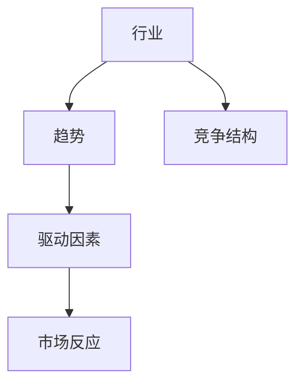
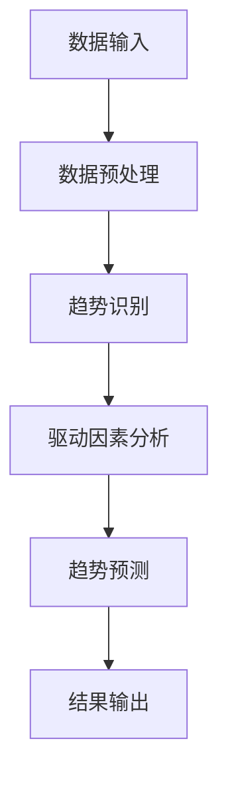
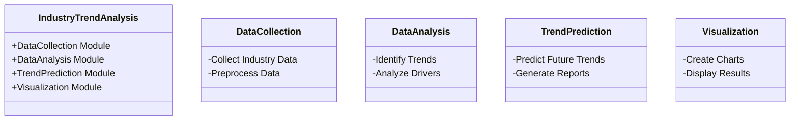

                 


# 费雪的行业趋势分析：未来增长的关键

## 关键词：行业趋势分析，费雪投资理论，趋势预测，数据分析，投资策略

## 摘要：  
费雪的行业趋势分析是一种通过研究行业生命周期、竞争结构和驱动因素来预测未来市场趋势的方法。本文将从费雪投资理论的背景出发，详细探讨行业趋势分析的核心概念、算法原理、系统架构设计以及实际项目案例。通过深入分析行业趋势，可以帮助投资者和企业更好地把握市场动态，制定科学的投资和增长策略。

---

# 第一部分：费雪的行业趋势分析基础

## 第1章：费雪投资理论与行业趋势分析概述

### 1.1 费雪投资理论的起源与发展

#### 1.1.1 费雪投资理论的起源  
费雪（Philip Fisher）是20世纪著名的投资理论家，他提出了“趋势投资”的概念。费雪认为，投资成功的关键在于识别行业和市场的长期趋势，并在趋势形成初期介入。他的理论强调长期视角和对行业基本面的深入研究，而非短期市场波动的预测。

#### 1.1.2 费雪投资理论的核心思想  
费雪的核心思想可以总结为：  
1. **行业生命周期**：行业的兴衰是有规律的，可以通过分析行业所处的生命周期阶段来预测其未来趋势。  
2. **关键成功因素**：某些行业特性（如技术进步、成本优势）是决定行业长期表现的关键因素。  
3. **趋势投资**：投资者应关注行业趋势的变化，并在趋势初期布局，以获取超额收益。  

#### 1.1.3 行业趋势分析在现代投资中的应用  
随着大数据和人工智能技术的发展，费雪的理论得到了进一步的强化和扩展。现代行业趋势分析不仅依赖于传统的财务数据，还结合了市场情绪、社交媒体数据和宏观经济指标，为投资决策提供了更强大的支持。

---

### 1.2 行业趋势分析的重要性

#### 1.2.1 行业趋势分析的定义  
行业趋势分析是指通过对行业数据的收集、整理和分析，识别行业的发展方向、关键驱动因素和潜在风险，从而为投资决策提供依据。

#### 1.2.2 行业趋势分析的必要性  
1. **帮助投资者规避风险**：通过分析行业趋势，投资者可以更好地识别行业周期性波动，避免在行业衰退期投资。  
2. **发现投资机会**：行业趋势分析能够帮助投资者发现新兴行业或行业复苏的迹象，从而提前布局。  
3. **制定长期策略**：行业趋势分析为企业的战略规划提供了数据支持，帮助企业更好地应对市场变化。  

#### 1.2.3 行业趋势分析的边界与外延  
行业趋势分析的边界包括行业内部的数据和指标，而外延则涉及宏观经济环境、政策变化和技术创新等因素。这些外部因素往往会对行业趋势产生重要影响。

---

### 1.3 费雪行业趋势分析的核心要素

#### 1.3.1 行业生命周期分析  
行业的生命周期通常分为四个阶段：  
1. **导入期**：行业刚刚起步，市场需求较低，竞争较少。  
2. **成长期**：行业需求快速增长，企业数量增加。  
3. **成熟期**：市场需求趋于稳定，竞争激烈。  
4. **衰退期**：市场需求下降，企业逐步退出。  

#### 1.3.2 行业竞争结构分析  
根据迈克尔·波特的五力模型，行业竞争结构包括：  
1. **潜在进入者的威胁**：行业门槛高低影响新进入者的难度。  
2. **替代品的威胁**：替代品的存在会影响行业的市场份额。  
3. **供应商的议价能力**：供应商的集中度和实力影响行业的成本结构。  
4. **买家的议价能力**：买家的集中度和需求量影响行业的定价能力。  
5. **行业内竞争者之间的竞争程度**：行业内竞争的激烈程度影响企业的利润率。  

#### 1.3.3 行业关键成功因素  
关键成功因素（KSF）是指在行业内取得长期成功所必须具备的条件，例如技术创新能力、成本控制能力、品牌影响力等。

---

## 第2章：费雪行业趋势分析的核心概念与联系

### 2.1 费雪行业趋势分析的核心原理

#### 2.1.1 费雪分析法的基本原理  
费雪分析法的核心是通过行业数据的分析，识别行业趋势的变化，并预测未来的发展方向。其基本原理包括：  
1. **趋势的连续性**：行业趋势往往是连续的，可以通过历史数据预测未来趋势。  
2. **驱动因素的关联性**：行业趋势的变化通常由几个关键驱动因素决定，例如技术创新、政策变化等。  

#### 2.1.2 行业趋势分析的数学模型  
费雪分析法的数学模型可以表示为：  
$$T_i = \alpha \cdot T_{i-1} + \beta \cdot D_i + \gamma$$  
其中，$T_i$ 表示第 $i$ 期的趋势，$T_{i-1}$ 表示前一期的趋势，$D_i$ 表示第 $i$ 期的驱动因素，$\alpha$、$\beta$、$\gamma$ 为模型参数。

#### 2.1.3 费雪分析法与现代数据分析技术的结合  
现代数据分析技术（如机器学习和大数据处理）可以进一步增强费雪分析法的预测能力。例如，可以通过时间序列分析和回归分析来优化模型参数，提高预测的准确性。

---

### 2.2 核心概念对比分析

#### 2.2.1 行业趋势与市场周期的对比  
| 对比维度 | 行业趋势 | 市场周期 |  
|----------|----------|----------|  
| 时间跨度 | 较长（数年） | 较短（数月） |  
| 变化规律 | 连续性较强 | 波动性较强 |  
| 驱动因素 | 行业内部因素为主 | 宏观经济因素为主 |  

#### 2.2.2 行业驱动因素与市场反应的对比  
| 对比维度 | 行业驱动因素 | 市场反应 |  
|----------|--------------|----------|  
| 主导力量 | 行业内部 | 整个市场 |  
| 影响范围 | 限于特定行业 | 影响广泛 |  

#### 2.2.3 费雪分析法与其它投资分析方法的对比  
| 对比维度 | 费雪分析法 | 技术分析 | 基本面分析 |  
|----------|-------------|----------|------------|  
| 分析对象 | 行业趋势 | 价格走势 | 公司财务数据 |  
| 分析方法 | 定量+定性 | 定量为主 | 定量为主 |  

---

### 2.3 ER实体关系图架构



---

## 第3章：费雪行业趋势分析的算法原理

### 3.1 费雪行业趋势分析的数学模型

#### 3.1.1 行业趋势预测模型  
$$Trend_{i} = \alpha \cdot Trend_{i-1} + \beta \cdot Driver_{i} + \gamma$$  
其中，$\alpha$、$\beta$、$\gamma$ 是需要通过历史数据拟合的参数。  

#### 3.1.2 驱动因素权重计算模型  
$$Weight_j = \frac{\sum_{i=1}^{n} (Factor_j \cdot Data_i)}{\sum_{i=1}^{n} Data_i}$$  
其中，$Factor_j$ 是第 $j$ 个驱动因素的权重，$Data_i$ 是第 $i$ 个数据点的值。  

---

### 3.2 费雪行业趋势分析的算法流程



---

## 第4章：费雪行业趋势分析的系统架构设计

### 4.1 系统功能设计



---

## 第5章：费雪行业趋势分析的项目实战

### 5.1 项目背景与目标

#### 5.1.1 项目背景  
以某高科技行业为例，分析其行业趋势，预测未来3年的发展方向。  

#### 5.1.2 项目目标  
1. 收集行业数据，包括市场规模、增长率、竞争格局等。  
2. 识别行业趋势，分析关键驱动因素。  
3. 预测未来趋势，制定投资策略。  

---

### 5.2 系统实现

#### 5.2.1 环境配置  
```bash
pip install pandas numpy matplotlib
```

#### 5.2.2 数据收集与预处理  
```python
import pandas as pd
data = pd.read_csv('industry_data.csv')
data = data.dropna().reset_index(drop=True)
```

#### 5.2.3 趋势识别与驱动因素分析  
```python
from statsmodels.tsa.arima_model import ARIMA
model = ARIMA(data['revenue'], order=(1, 1, 0))
model_fit = model.fit()
trend = model_fit.fitted.values
```

#### 5.2.4 趋势预测与可视化  
```python
import matplotlib.pyplot as plt
plt.plot(data['date'], trend, label='Identified Trend')
plt.xlabel('Date')
plt.ylabel('Revenue')
plt.legend()
plt.show()
```

---

## 第6章：费雪行业趋势分析的总结与展望

### 6.1 最佳实践  
1. 在实际应用中，结合行业专家意见和数据分析结果，制定更精准的投资策略。  
2. 定期更新模型参数，以适应市场变化。  

### 6.2 小结  
费雪的行业趋势分析是一种科学的投资方法，通过深入分析行业数据和趋势，可以帮助投资者和企业更好地把握市场动态，制定科学的决策。

### 6.3 注意事项  
1. 数据质量对分析结果的影响至关重要，需确保数据来源可靠。  
2. 模型的参数选择需要根据具体行业特点进行调整。  

### 6.4 拓展阅读  
1. 《费雪投资哲学》  
2. 《趋势投资实战技巧》  

---

通过以上章节的详细讲解，我们不仅掌握了费雪行业趋势分析的核心原理，还通过实际案例了解了其在投资分析中的应用。希望本文能够为读者在投资分析和行业研究领域提供有价值的参考。

