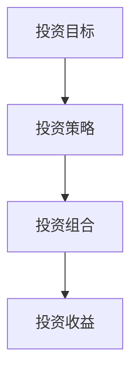
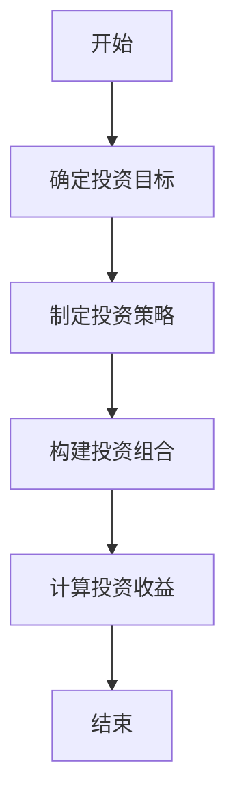
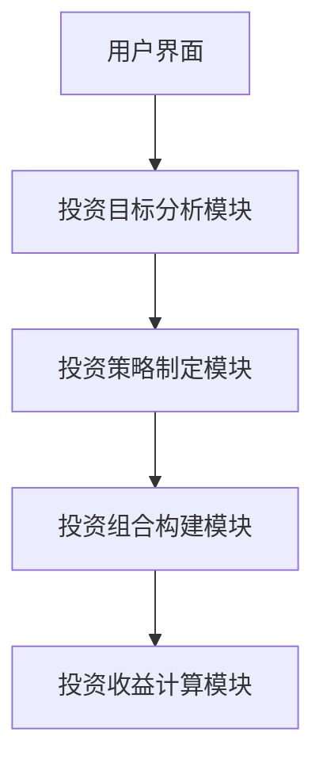
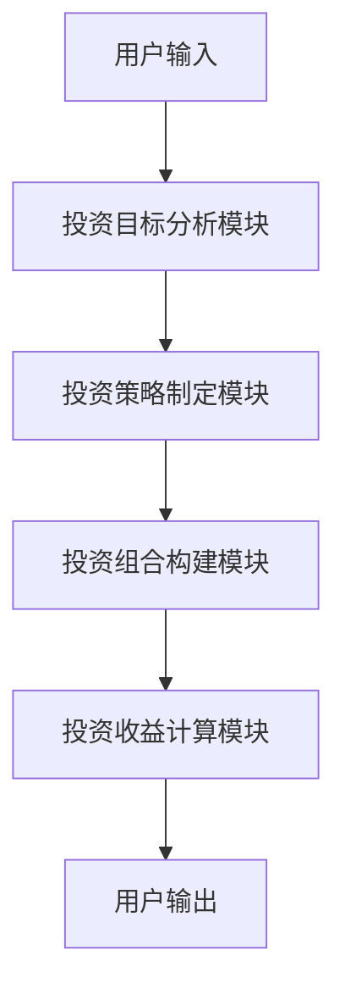

                 


# 费雪的行业领导者投资法

> 关键词：费雪投资法，行业领导者，投资策略，数学模型，系统架构

> 摘要：本文深入探讨了菲利普·费雪的行业领导者投资法，从核心概念、数学模型、系统架构到项目实战，全面解析了这一投资方法的理论基础和实际应用。通过详细的分析和案例，帮助读者理解如何通过投资于行业领导者实现长期收益最大化。

---

## 第1章: 费雪投资法的背景与核心概念

### 1.1 投资学与费雪投资法的起源

#### 1.1.1 投资学的基本概念
投资学是研究资源分配和财富增值的科学，旨在通过合理的资产配置和风险管理实现收益最大化。投资学的核心在于理解市场规律、企业价值和风险收益的平衡。

#### 1.1.2 费雪投资法的提出背景
菲利普·费雪（Philip Fisher）是20世纪的投资大师，提出了“投资于行业领导者”的理念。他认为，投资的最终目标是通过持有优质企业的股份，实现长期的资本增值。费雪的投资法强调企业质量而非价格波动，这与传统技术分析派形成鲜明对比。

#### 1.1.3 费雪投资法的核心思想
费雪的投资法的核心思想是：投资于那些具有强大竞争优势、良好管理团队和持续增长潜力的企业。他主张长期持有优质资产，而非频繁交易以捕捉短期收益。

---

### 1.2 行业领导者企业的定义与特征

#### 1.2.1 行业领导者的定义
行业领导者是指在特定行业中占据领先地位，具有显著竞争优势的企业。这些企业通常在市场中拥有较高的市场份额、强大的品牌影响力和技术优势。

#### 1.2.2 行业领导者的特征分析
- **市场领导地位**：行业领导者通常在市场中占据主导地位，能够影响行业趋势。
- **竞争优势**：拥有独特的技术、专利或商业模式，能够抵御竞争对手的冲击。
- **持续增长潜力**：行业领导者具备稳定的增长能力，能够持续为股东创造价值。
- **优秀管理团队**：领导者通常具备卓越的管理能力和战略眼光，能够带领企业不断前进。

#### 1.2.3 行业领导者的竞争优势
行业领导者的竞争优势体现在多个方面，包括成本优势、技术优势、品牌优势和市场占有率。这些优势使得行业领导者能够在市场中保持领先地位，并在经济周期波动中表现出更强的抗压能力。

---

### 1.3 费雪投资法的核心要素

#### 1.3.1 费雪投资法的基本原理
费雪投资法的核心原理在于通过长期持有优质企业的股票，实现资本的增值。他认为，投资的最终目标是选择那些能够持续增长的企业，而不是关注市场的短期波动。

#### 1.3.2 费雪投资法的三步选股法
1. **确定投资目标**：明确投资的目的和风险承受能力。
2. **制定投资策略**：根据市场情况和企业基本面，选择具有竞争优势的企业。
3. **构建投资组合**：将资金分配到多个优质企业中，分散风险。

#### 1.3.3 费雪投资法的长期视角
费雪强调长期投资的重要性，认为市场的短期波动不应影响长期投资决策。通过长期持有优质资产，投资者能够获得企业增长的收益，而无需频繁交易带来的额外成本和风险。

---

### 1.4 费雪投资法与传统投资方法的对比

#### 1.4.1 传统投资方法概述
传统投资方法包括技术分析和基本面分析。技术分析主要通过价格走势预测市场变化，而基本面分析则关注企业的财务数据和行业地位。

#### 1.4.2 费雪投资法的独特性
与传统方法相比，费雪投资法更注重企业的内在价值和长期增长潜力。他主张通过深入研究企业的基本面，选择那些能够持续为股东创造价值的企业。

#### 1.4.3 费雪投资法的优缺点
- **优点**：费雪投资法通过选择优质企业，能够在长期实现较高的收益。
- **缺点**：需要进行深入的企业研究，且在市场下跌时可能面临较大的回撤风险。

---

### 1.5 本章小结
本章从投资学的基本概念出发，介绍了费雪投资法的起源和核心思想。通过分析行业领导者的定义和特征，我们理解了费雪投资法的核心要素。最后，通过对比传统投资方法，我们总结了费雪投资法的独特性和优缺点。

---

## 第2章: 费雪投资法的核心概念与联系

### 2.1 费雪投资法的核心概念

#### 2.1.1 投资目标的确定
投资目标是投资者在市场中追求的核心目标，通常包括资本增值、收入稳定性和风险控制。费雪投资法强调通过选择优质企业，实现长期的资本增值。

#### 2.1.2 投资策略的制定
投资策略是实现投资目标的具体行动计划。费雪投资法的策略包括深入研究企业的基本面，选择那些具有竞争优势和持续增长潜力的企业。

#### 2.1.3 投资组合的构建
投资组合是投资者将资金分配到不同资产或股票的过程。通过分散投资，投资者可以降低风险，同时充分利用市场的机会。

---

### 2.2 费雪投资法的核心要素对比

#### 2.2.1 投资目标与投资策略的对比
- **投资目标**：是投资者在市场中追求的核心目标，具有长期性和稳定性。
- **投资策略**：是实现投资目标的具体方法，具有灵活性和可调整性。

#### 2.2.2 投资策略与投资组合的对比
- **投资策略**：是指导投资行为的总体方针，注重长期目标的实现。
- **投资组合**：是投资策略的具体实施，注重资产的分配和风险的控制。

#### 2.2.3 投资组合与投资目标的对比
- **投资组合**：是实现投资目标的具体工具，注重资产的多样性和风险的分散。
- **投资目标**：是投资者在市场中追求的核心目标，注重长期收益的实现。

---

### 2.3 费雪投资法的ER实体关系图



---

### 2.4 本章小结
本章通过分析费雪投资法的核心概念，探讨了投资目标、投资策略和投资组合之间的关系。通过ER实体关系图，我们理解了投资目标如何通过投资策略和投资组合实现最终的收益。

---

## 第3章: 费雪投资法的数学模型与算法原理

### 3.1 费雪投资法的数学模型

#### 3.1.1 投资收益的计算公式
投资收益的计算公式如下：

$$ \text{投资收益} = \text{最终价值} - \text{初始价值} $$

其中，最终价值包括资本增值和分红收益，初始价值为投资者的初始投资额。

#### 3.1.2 投资组合的收益计算
投资组合的收益计算公式如下：

$$ R_p = \sum_{i=1}^{n} w_i R_i $$

其中，\( R_p \) 为投资组合的收益，\( w_i \) 为第 \( i \) 只股票的权重，\( R_i \) 为第 \( i \) 只股票的收益。

---

### 3.2 费雪投资法的算法原理

#### 3.2.1 投资目标的确定算法
1. 确定投资目标（资本增值、收入稳定性、风险控制）。
2. 根据目标选择合适的投资策略。

#### 3.2.2 投资策略的制定算法
1. 深入研究企业的基本面，选择具有竞争优势和持续增长潜力的企业。
2. 根据市场情况调整投资策略，保持投资组合的灵活性。

#### 3.2.3 投资组合的构建算法
1. 根据企业的基本面和市场情况，选择优质企业构建投资组合。
2. 通过分散投资降低风险，实现收益的最大化。

---

### 3.3 费雪投资法的算法流程图



---

### 3.4 本章小结
本章通过数学模型和算法原理，详细阐述了费雪投资法的核心思想。通过投资收益的计算公式和算法流程图，我们理解了如何通过数学模型实现投资目标。

---

## 第4章: 费雪投资法的系统分析与架构设计

### 4.1 投资分析系统的功能设计

#### 4.1.1 投资目标分析模块
投资目标分析模块用于确定投资者的核心目标，包括资本增值、收入稳定性和风险控制。

#### 4.1.2 投资策略制定模块
投资策略制定模块根据市场情况和企业基本面，制定合适的投资策略。

#### 4.1.3 投资组合构建模块
投资组合构建模块根据企业的竞争优势和市场情况，构建优质的投资组合。

---

### 4.2 投资分析系统的架构设计



---

### 4.3 投资分析系统的接口设计

#### 4.3.1 输入接口
- 投资目标：资本增值、收入稳定性、风险控制。
- 市场数据：企业的基本面数据和市场趋势。

#### 4.3.2 输出接口
- 投资策略：根据市场情况制定的具体投资计划。
- 投资组合：根据企业基本面构建的优质投资组合。

#### 4.3.3 数据接口
- 数据输入：企业的财务数据、市场数据。
- 数据输出：投资策略和投资组合的构建结果。

---

### 4.4 投资分析系统的交互流程图



---

### 4.5 本章小结
本章通过系统分析与架构设计，详细阐述了投资分析系统的功能设计和架构设计。通过模块化设计和接口设计，我们理解了如何通过系统实现费雪投资法的核心思想。

---

## 第5章: 费雪投资法的项目实战

### 5.1 投资分析系统的环境安装

#### 5.1.1 系统运行环境
- 操作系统：Windows、Linux、macOS。
- 开发工具：Python、Jupyter Notebook、Mermaid。
- 依赖库：numpy、pandas、matplotlib。

#### 5.1.2 系统安装步骤
1. 安装Python和必要的依赖库。
2. 安装Jupyter Notebook和Mermaid插件。
3. 下载企业基本面数据和市场数据。

---

### 5.2 投资分析系统的核心实现

#### 5.2.1 投资目标分析模块的实现
```python
import pandas as pd

def determine_investment_goal():
    # 确定投资目标
    goal = input("请输入投资目标（资本增值/收入稳定性/风险控制）：")
    return goal
```

#### 5.2.2 投资策略制定模块的实现
```python
import numpy as np

def formulate_investment_strategy():
    # 制定投资策略
    goal = determine_investment_goal()
    strategy = {
        '目标': goal,
        '策略': '选择具有竞争优势和持续增长潜力的企业'
    }
    return strategy
```

#### 5.2.3 投资组合构建模块的实现
```python
import pandas as pd

def construct_investment_portfolio():
    # 构建投资组合
    strategy = formulate_investment_strategy()
    df = pd.read_csv('企业基本面数据.csv')
    portfolio = df[df['竞争优势'] == '显著']
    return portfolio
```

---

### 5.3 投资组合的数学分析与优化

#### 5.3.1 投资组合的收益计算
```python
def calculate_portfolio_return(portfolio):
    # 计算投资组合的收益
    returns = portfolio['收益'].mean()
    return returns
```

#### 5.3.2 投资组合的风险控制
```python
import numpy as np

def calculate_portfolio_risk(portfolio):
    # 计算投资组合的风险
    returns = portfolio['收益'].values
    variance = np.var(returns)
    return variance
```

---

### 5.4 投资组合的案例分析

#### 5.4.1 案例背景
假设我们选择的行业领导者包括苹果、谷歌和微软。

#### 5.4.2 案例分析
```python
import pandas as pd

def case_analysis():
    # 案例分析
    df = pd.read_csv('企业基本面数据.csv')
    portfolio = df[df['行业领导者'] == '是']
    returns = portfolio['收益'].values
    print("投资组合的平均收益为：", np.mean(returns))
    print("投资组合的方差为：", np.var(returns))
```

---

### 5.5 本章小结
本章通过项目实战，详细阐述了费雪投资法的实现过程。通过投资组合的数学分析和优化，我们理解了如何通过实际操作实现投资目标。

---

## 第6章: 费雪投资法的总结与展望

### 6.1 费雪投资法的核心总结

#### 6.1.1 费雪投资法的核心思想
费雪投资法的核心思想是通过投资于行业领导者，实现长期的资本增值。他强调企业质量而非价格波动，主张长期持有优质资产。

#### 6.1.2 费雪投资法的实现步骤
1. 确定投资目标。
2. 制定投资策略。
3. 构建投资组合。
4. 计算投资收益。
5. 优化投资组合。

---

### 6.2 费雪投资法的最佳实践

#### 6.2.1 投资策略的制定
- 根据市场情况和企业基本面，选择具有竞争优势和持续增长潜力的企业。

#### 6.2.2 投资组合的构建
- 通过分散投资降低风险，实现收益的最大化。

#### 6.2.3 投资组合的优化
- 定期评估投资组合的表现，根据市场变化进行调整。

---

### 6.3 费雪投资法的注意事项

#### 6.3.1 风险管理
- 通过分散投资降低风险，避免过度集中于某一行业或企业。

#### 6.3.2 市场波动
- 在市场下跌时，保持长期视角，避免恐慌性抛售。

#### 6.3.3 企业研究
- 深入研究企业的基本面，选择具有竞争优势和持续增长潜力的企业。

---

### 6.4 费雪投资法的拓展阅读

#### 6.4.1 经典书籍
- 《股票投资成功之道》（Philip Fisher）

#### 6.4.2 相关论文
- 《投资于行业领导者：菲利普·费雪的投资策略》

---

## 本章小结
通过本章的总结与展望，我们回顾了费雪投资法的核心思想和实现步骤。同时，我们提出了最佳实践和注意事项，为读者提供了进一步学习和实践的方向。

---

# 结语
费雪的行业领导者投资法是一种以企业质量为核心的投资方法，通过选择优质企业实现长期的资本增值。希望本文能够帮助读者深入理解这一投资方法的核心思想，并在实际操作中加以应用。

