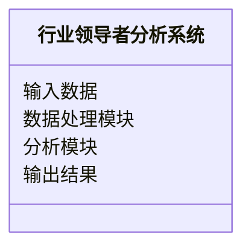

                 

# 费雪的行业领导者理论：寻找市场冠军

> 关键词：费雪，行业领导者，投资理论，市场分析，企业成长

> 摘要：本文深入探讨了费雪的行业领导者理论，分析了行业领导者的核心特征，结合实际案例，详细阐述了如何通过数学模型和系统架构来识别和评估行业领导者。文章还提供了投资策略和风险管理的实用建议，帮助投资者在复杂市场中寻找真正的市场冠军。

---

# 第一部分：行业领导者理论的背景与核心要素

## 第1章：费雪投资理论的背景与发展

### 1.1 费雪的生平简介
菲利普·费雪（Philip Fisher）是20世纪著名的投资大师之一，被誉为“成长型投资之父”。他于1907年出生在美国加利福尼亚州，1930年代开始投资生涯，其投资理念对现代投资理论产生了深远影响。费雪的投资哲学强调长期持有优质股票，关注企业的成长性和竞争优势。

### 1.2 行业领导者理论的提出背景
费雪提出行业领导者理论的初衷是寻找那些能够在行业中长期占据领先地位的企业。他认为，投资者应该关注企业的内在价值和成长潜力，而不是短期市场波动。行业领导者理论的核心在于识别那些能够持续创新、提高市场份额并实现稳健增长的企业。

### 1.3 行业领导者理论的核心思想
行业领导者理论强调以下几点：
1. **市场地位**：行业领导者通常在市场中占据主导地位，能够影响行业的发展方向。
2. **竞争优势**：这些企业拥有独特的竞争优势，如技术壁垒、成本优势或品牌影响力。
3. **财务表现**：行业领导者的财务指标通常优于行业平均水平，表现出稳健的盈利能力。
4. **管理层能力**：优秀的管理层是企业成功的关键，行业领导者通常拥有经验丰富且能力强的管理团队。

---

## 第2章：行业领导者的核心特征分析

### 2.1 市场地位与竞争优势
行业领导者的市场地位是其核心特征之一。通过分析企业的市场份额、市场占有率以及行业排名，可以初步判断其是否具备行业领导者的潜力。例如，可以通过以下指标进行评估：

- **市场份额**：市场份额越高，企业的市场地位越稳固。
- **品牌影响力**：强大的品牌能够为企业带来持续的竞争优势。
- **技术壁垒**：拥有独特技术的企业更难被竞争对手取代。

### 2.2 财务表现与成长能力
财务表现是衡量企业健康状况的重要指标。行业领导者通常表现出稳健的财务状况和持续的盈利能力。以下是关键的财务指标：

- **净收益**：企业的净利润率越高，盈利能力越强。
- **收入增长率**：收入持续增长是企业成长性的体现。
- **ROE（净资产收益率）**：ROE高的企业表明资产使用效率高。

### 2.3 管理层与公司治理
管理层的能力和公司的治理结构是影响企业长期发展的关键因素。行业领导者通常拥有经验丰富且有能力的管理层，同时公司治理结构透明、规范。

---

## 第3章：行业领导者理论的数学模型与分析方法

### 3.1 基于财务指标的行业领导者筛选模型
为了量化评估企业的市场地位和财务表现，我们可以构建一个综合评分模型。以下是具体的步骤：

1. **数据收集**：收集目标行业内的企业数据，包括市场份额、净收益、收入增长率等。
2. **指标加权**：根据重要性对各个指标进行加权，例如市场地位占40%，财务表现占60%。
3. **计算评分**：根据加权公式计算每家企业的综合评分。

**公式**：
$$ \text{综合评分} = \sum_{i=1}^{n} w_i \times x_i $$

其中，$w_i$ 是指标的权重，$x_i$ 是指标的具体值。

### 3.2 市场表现评估公式
为了进一步评估企业的市场表现，我们可以引入市场表现评分公式：

$$ \text{市场表现评分} = \frac{\sum_{j=1}^{m} y_j}{m} \times 100 $$

其中，$y_j$ 是每个企业的市场表现指标值，$m$ 是指标的数量。

---

## 第4章：行业领导者分析的系统架构与实现

### 4.1 系统分析与设计
为了高效地识别行业领导者，我们可以构建一个行业领导者分析系统。该系统的主要功能模块包括：

- **数据处理模块**：负责收集和预处理企业数据。
- **分析模块**：基于数学模型进行评分和筛选。
- **输出结果**：展示分析结果，包括综合评分和潜在的行业领导者。

### 4.2 系统架构设计
以下是系统架构的Mermaid图：

### 4.3 系统实现步骤
1. **数据收集**：从公开数据源获取企业数据。
2. **数据预处理**：清洗数据，去除异常值。
3. **模型计算**：应用数学模型进行评分。
4. **结果输出**：展示评分结果，筛选出潜在的行业领导者。

---

## 第5章：投资策略与风险管理

### 5.1 投资策略
基于行业领导者理论，投资者可以采取以下策略：
1. **长期持有**：选择具有持续成长性的行业领导者，长期持有。
2. **分散投资**：在多个行业中寻找领导者，分散风险。

### 5.2 风险管理
尽管行业领导者具有较强的竞争力，但市场波动和行业变化仍可能带来风险。因此，投资者需要关注以下方面：
1. **行业风险**：关注行业趋势和政策变化。
2. **公司风险**：定期评估企业的财务状况和管理层能力。
3. **市场风险**：避免过度集中投资。

---

## 第6章：案例分析与实际应用

### 6.1 案例分析：科技行业
以科技行业为例，我们可以分析苹果公司（Apple）是否符合行业领导者的特点：
1. **市场地位**：苹果是全球最大的科技公司之一，市场份额持续增长。
2. **竞争优势**：拥有强大的品牌和技术壁垒。
3. **财务表现**：净利润率和ROE均高于行业平均水平。
4. **管理层能力**：史蒂夫·乔布斯和蒂姆·库克都是优秀的领导者。

### 6.2 实际应用：消费行业
在消费行业中，我们可以分析可口可乐公司是否符合行业领导者特征：
1. **市场地位**：可口可乐在全球软饮料市场占据主导地位。
2. **竞争优势**：强大的品牌影响力和全球分销网络。
3. **财务表现**：收入持续增长，财务状况稳健。

---

## 第7章：结论与展望

### 7.1 结论
通过本文的分析，我们可以得出以下结论：
- 行业领导者具有显著的市场地位、竞争优势和财务表现。
- 投资者可以通过数学模型和系统分析的方法识别行业领导者。
- 长期持有行业领导者是实现稳健投资收益的有效策略。

### 7.2 展望
未来，随着技术的进步和数据的丰富，行业领导者理论将更加完善。投资者可以借助人工智能和大数据分析工具，更高效地识别和评估行业领导者。

---

通过本文的详细分析，读者可以深入了解费雪的行业领导者理论，并能够实际应用这些方法来寻找市场冠军。希望本文能为投资者提供有价值的参考和指导。

