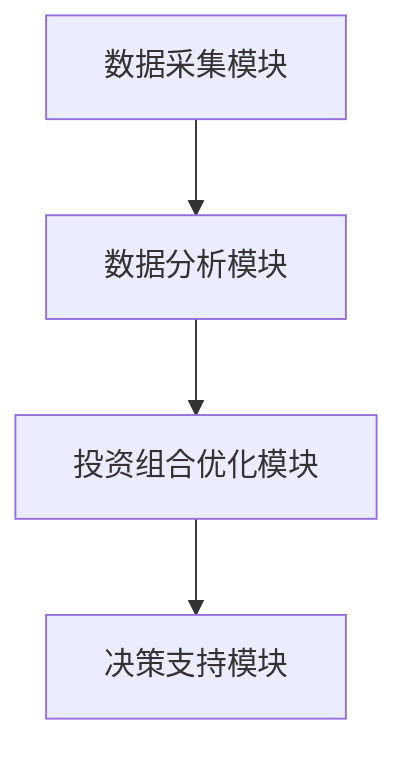

                 


# 费雪的行业领导者理论：投资行业龙头

> 关键词：费雪行业领导者理论, 投资策略, 竞争优势, 投资组合优化, 系统架构设计

> 摘要：本文将深入探讨费雪的行业领导者理论，分析其核心概念、竞争优势、数学模型与算法，并结合实际案例进行项目实战。通过系统架构设计和投资决策支持系统的构建，为投资者提供科学的投资策略和决策支持。

---

## 第一部分：费雪的行业领导者理论概述

### 第1章：费雪行业领导者理论的背景与核心概念

#### 1.1 投资理论的演进与费雪的贡献

##### 1.1.1 传统投资理论的局限性

传统的投资理论，如股利增长模型和资本资产定价模型（CAPM），虽然在一定程度上解释了股票定价的机制，但存在一些明显的局限性。例如，这些理论假设市场是完全有效的，且投资者能够准确预测未来股利的增长，这在现实中往往难以实现。此外，传统理论更多关注于股票的估值，而忽略了企业在市场中的实际竞争力和行业地位。

##### 1.1.2 费雪投资理论的提出与核心思想

菲利普·费雪（Philip Fisher）是20世纪著名的投资理论家之一，他提出了“成长股投资法”，强调投资于具有强大成长潜力的公司。费雪的行业领导者理论是其投资理论的重要组成部分，主张投资于那些在行业中占据主导地位，并能够持续为股东创造价值的企业。他认为，投资者应该关注企业的管理质量、产品创新能力和市场地位，而非仅仅依赖财务指标。

##### 1.1.3 费雪行业领导者理论的背景与意义

费雪的行业领导者理论诞生于20世纪50年代，当时美国经济正处于快速发展阶段，市场竞争日益激烈。费雪通过分析大量的企业案例，总结出行业领导者的一些共同特征，如强大的市场地位、持续的创新能力等。这一理论为投资者提供了一种新的思维方式，即通过投资于行业中的龙头企业，实现长期稳定的收益。

#### 1.2 行业领导者理论的核心概念

##### 1.2.1 行业领导者的定义与特征

行业领导者是指在特定行业中占据主导地位，具有强大的市场影响力和竞争优势的企业。这些企业通常在产品、技术、管理等方面具有领先地位，并能够持续推动行业的发展。

- **市场地位**：行业领导者通常拥有较高的市场份额，能够在价格制定、产品推广等方面占据优势。
- **品牌影响力**：强大的品牌能够为企业带来持续的客户忠诚度和市场影响力。
- **竞争优势**：行业领导者通常具备技术、成本、管理等方面的竞争优势，能够在激烈的市场竞争中脱颖而出。

##### 1.2.2 行业领导者的竞争优势分析

行业领导者的竞争优势主要体现在以下几个方面：

- **技术优势**：行业领导者通常拥有领先的技术研发能力，能够不断推出创新产品，保持市场领先地位。
- **成本优势**：通过规模效应和高效的管理，行业领导者能够实现更低的生产成本，从而在价格竞争中占据优势。
- **管理优势**：优秀的管理团队能够确保企业在复杂多变的市场环境中保持稳定发展，做出正确的战略决策。

##### 1.2.3 行业领导者与普通企业的区别

行业领导者与普通企业的区别主要体现在以下几个方面：

- **市场份额**：行业领导者通常拥有较高的市场份额，而普通企业可能只占据较小的市场份额。
- **品牌影响力**：行业领导者具有强大的品牌影响力，而普通企业的品牌影响力较弱。
- **竞争优势**：行业领导者在技术、成本、管理等方面具有明显优势，而普通企业可能在这些方面较为弱势。

---

### 第2章：行业领导者的核心要素与竞争优势

#### 2.1 行业领导者的竞争优势分析

##### 2.1.1 市场地位与品牌影响力

市场地位是行业领导者的核心竞争优势之一。强大的市场地位意味着企业在行业中具有较高的影响力和话语权，能够通过定价策略和市场推广来推动企业发展。此外，强大的品牌影响力也能够为企业带来持续的客户忠诚度和市场影响力。

##### 2.1.2 技术创新与研发能力

技术创新是行业领导者保持竞争优势的关键因素之一。行业领导者通常拥有强大的研发团队和资金支持，能够不断推出创新产品，满足市场需求。此外，技术创新还能够提高企业的生产效率，降低成本，进一步增强企业的竞争优势。

##### 2.1.3 财务健康与盈利能力

财务健康是行业领导者的重要特征之一。行业领导者通常具有稳定的财务状况和较高的盈利能力，能够为股东提供持续的回报。此外，强大的财务实力还能够为企业提供更多的资金支持，进一步推动企业的技术创新和市场拓展。

##### 2.1.4 管理团队与企业治理

优秀的管理团队和良好的企业治理是行业领导者成功的重要保障。优秀的管理团队能够制定正确的战略决策，带领企业应对各种挑战。良好的企业治理则能够确保企业的透明化和规范化，避免内部管理问题，提高企业的整体竞争力。

#### 2.2 行业领导者的核心要素

##### 2.2.1 市场份额与定价能力

市场份额是行业领导者的重要标志之一。行业领导者通常拥有较高的市场份额，能够在价格制定和市场推广方面占据优势。此外，强大的定价能力也能够为企业带来更高的利润。

##### 2.2.2 供应链与成本优势

供应链管理是行业领导者的重要竞争优势之一。行业领导者通常拥有高效的供应链管理系统，能够确保原材料的及时供应和产品的顺利生产。此外，强大的成本优势也能够帮助企业降低生产成本，提高利润率。

##### 2.2.3 创新能力与产品差异化

创新能力是行业领导者保持竞争优势的关键因素之一。行业领导者通常能够不断推出创新产品，满足市场需求。此外，产品差异化也能够帮助企业在竞争激烈的市场中脱颖而出。

##### 2.2.4 企业文化和组织能力

企业文化是行业领导者成功的重要保障。优秀的企业文化能够激发员工的创造力和积极性，提高企业的整体凝聚力。强大的组织能力也能够确保企业的高效运作和战略目标的实现。

---

### 第3章：费雪行业领导者理论的数学模型与算法

#### 3.1 行业领导者筛选的数学模型

##### 3.1.1 竞争优势评估模型

竞争优势评估模型用于衡量企业在市场中的竞争优势。该模型主要包括以下几个指标：

- 市场份额（Market Share）
- 品牌影响力（Brand Influence）
- 技术创新能力（Technological Innovation）
- 管理团队能力（Management Team Ability）

竞争优势评估模型的数学表达式如下：

$$
\text{竞争优势指数} = \frac{\text{市场份额} + \text{品牌影响力} + \text{技术创新能力} + \text{管理团队能力}}{4}
$$

##### 3.1.2 财务健康度评估模型

财务健康度评估模型用于衡量企业的财务状况。该模型主要包括以下几个指标：

- 资产负债率（Debt-to-Asset Ratio）
- 净利润率（Net Profit Margin）
- 营业利润率（Operating Profit Margin）
- 现金流健康度（Cash Flow Health）

财务健康度评估模型的数学表达式如下：

$$
\text{财务健康指数} = \frac{\text{资产负债率} + \text{净利润率} + \text{营业利润率} + \text{现金流健康度}}{4}
$$

##### 3.1.3 市场地位评估模型

市场地位评估模型用于衡量企业在市场中的地位。该模型主要包括以下几个指标：

- 市场份额（Market Share）
- 市场增长潜力（Market Growth Potential）
- 市场竞争力（Market Competitiveness）
- 市场影响力（Market Influence）

市场地位评估模型的数学表达式如下：

$$
\text{市场地位指数} = \frac{\text{市场份额} + \text{市场增长潜力} + \text{市场竞争力} + \text{市场影响力}}{4}
$$

#### 3.2 投资组合优化算法

##### 3.2.1 投资组合优化的数学模型

投资组合优化的数学模型用于确定最优的投资组合。该模型主要考虑以下几个因素：

- 预期收益（Expected Return）
- 风险水平（Risk Level）
- 资产分配（Asset Allocation）

投资组合优化的数学表达式如下：

$$
\text{最大化} \quad \sum_{i=1}^{n} w_i R_i
$$

$$
\text{约束条件} \quad \sum_{i=1}^{n} w_i = 1
$$

其中，\( w_i \) 是第 \( i \) 只股票的权重，\( R_i \) 是第 \( i \) 只股票的预期收益。

##### 3.2.2 基于行业领导者筛选的组合优化算法

基于行业领导者筛选的组合优化算法是一种结合行业领导者筛选和投资组合优化的算法。该算法主要包括以下几个步骤：

1. **筛选行业领导者**：根据竞争优势评估模型、财务健康度评估模型和市场地位评估模型，筛选出具有竞争优势的行业领导者。
2. **确定投资目标**：根据投资者的投资目标和风险偏好，确定投资组合的预期收益和风险水平。
3. **优化投资组合**：根据筛选出的行业领导者，优化投资组合，以实现预期收益和风险水平的最优组合。

##### 3.2.3 算法实现与优化

基于行业领导者筛选的组合优化算法的实现步骤如下：

1. **数据收集与预处理**：收集行业领导者的基本信息、财务数据和市场数据，并进行数据清洗和预处理。
2. **筛选行业领导者**：根据竞争优势评估模型、财务健康度评估模型和市场地位评估模型，筛选出具有竞争优势的行业领导者。
3. **确定投资目标**：根据投资者的投资目标和风险偏好，确定投资组合的预期收益和风险水平。
4. **优化投资组合**：使用优化算法（如遗传算法、模拟退火等）优化投资组合，以实现预期收益和风险水平的最优组合。
5. **结果分析与调整**：分析优化后的投资组合的收益和风险水平，并根据市场变化和企业动态进行调整。

---

### 第4章：系统架构与投资决策支持系统设计

#### 4.1 投资决策支持系统架构

##### 4.1.1 系统功能模块划分

投资决策支持系统主要包含以下几个功能模块：

- 数据采集模块：负责采集行业领导者的基本信息、财务数据和市场数据。
- 数据分析模块：负责对采集的数据进行分析，筛选出具有竞争优势的行业领导者。
- 投资组合优化模块：负责根据筛选出的行业领导者，优化投资组合。
- 决策支持模块：负责提供投资建议和决策支持。

##### 4.1.2 数据流与信息处理流程

数据流与信息处理流程如下：

1. 数据采集模块从数据库中采集行业领导者的基本信息、财务数据和市场数据。
2. 数据分析模块对采集的数据进行清洗和预处理，并根据竞争优势评估模型、财务健康度评估模型和市场地位评估模型，筛选出具有竞争优势的行业领导者。
3. 投资组合优化模块根据筛选出的行业领导者，优化投资组合。
4. 决策支持模块根据优化后的投资组合，提供投资建议和决策支持。

##### 4.1.3 系统架构设计图（Mermaid）



#### 4.2 系统接口与交互设计

##### 4.2.1 数据接口设计

数据接口设计如下：

- 数据输入接口：用于输入行业领导者的基本信息、财务数据和市场数据。
- 数据输出接口：用于输出优化后的投资组合和投资建议。

##### 4.2.2 用户交互流程

用户交互流程如下：

1. 用户通过数据输入接口输入行业领导者的基本信息、财务数据和市场数据。
2. 数据分析模块对采集的数据进行分析，筛选出具有竞争优势的行业领导者。
3. 投资组合优化模块根据筛选出的行业领导者，优化投资组合。
4. 决策支持模块根据优化后的投资组合，提供投资建议和决策支持。
5. 用户通过数据输出接口获取优化后的投资组合和投资建议。

##### 4.2.3 系统功能实现代码示例

以下是一个简单的系统功能实现代码示例：

```python
import pandas as pd
from sklearn.metrics import pairwise_distances

# 数据采集模块
def collect_data():
    # 从数据库中采集行业领导者的基本信息、财务数据和市场数据
    data = pd.read_csv('leaders.csv')
    return data

# 数据分析模块
def analyze_data(data):
    # 根据竞争优势评估模型、财务健康度评估模型和市场地位评估模型，筛选出具有竞争优势的行业领导者
    competition = data['市场份额'] + data['品牌影响力'] + data['技术创新能力'] + data['管理团队能力']
    financial_health = data['资产负债率'] + data['净利润率'] + data['营业利润率'] + data['现金流健康度']
    market_position = data['市场份额'] + data['市场增长潜力'] + data['市场竞争力'] + data['市场影响力']
    competition_rank = pd.qcut(competition, 3, labels=['低', '中', '高'])
    financial_health_rank = pd.qcut(financial_health, 3, labels=['低', '中', '高'])
    market_position_rank = pd.qcut(market_position, 3, labels=['低', '中', '高'])
    data['竞争优势指数'] = competition_rank
    data['财务健康指数'] = financial_health_rank
    data['市场地位指数'] = market_position_rank
    return data

# 投资组合优化模块
def optimize_portfolio(data):
    # 根据筛选出的行业领导者，优化投资组合
    selected_leaders = data[(data['竞争优势指数'] == '高') & (data['财务健康指数'] == '高') & (data['市场地位指数'] == '高')]
    returns = selected_leaders['预期收益']
    weights = pairwise_distances(returns, metric='euclidean')
    return weights

# 决策支持模块
def provide_recommendations(weights):
    # 根据优化后的投资组合，提供投资建议和决策支持
    print("优化后的投资组合权重为：", weights)
    print("建议投资于具有竞争优势的行业领导者。")
```

---

### 第5章：项目实战与案例分析

#### 5.1 项目环境与数据准备

##### 5.1.1 环境配置与工具安装

项目环境配置与工具安装如下：

- 操作系统：Windows 10 或更高版本
- Python版本：3.8 或更高版本
- 必要的库：pandas, numpy, scikit-learn, matplotlib
- 数据库：MySQL 或其他关系型数据库

##### 5.1.2 数据来源与数据清洗

数据来源与数据清洗如下：

- 数据来源：行业领导者的基本信息、财务数据和市场数据。
- 数据清洗：删除重复数据，处理缺失值，标准化数据。

##### 5.1.3 数据预处理与特征提取

数据预处理与特征提取如下：

- 数据预处理：标准化数据，处理异常值。
- 特征提取：提取市场份额、品牌影响力、技术创新能力、管理团队能力等特征。

#### 5.2 行业领导者筛选与投资组合优化

##### 5.2.1 行业领导者筛选过程

行业领导者筛选过程如下：

1. 根据竞争优势评估模型、财务健康度评估模型和市场地位评估模型，筛选出具有竞争优势的行业领导者。
2. 筛选出的行业领导者具有较高的市场份额、品牌影响力、技术创新能力和管理团队能力。
3. 筛选出的行业领导者具有健康的财务状况和强大的市场地位。

##### 5.2.2 投资组合优化实现

投资组合优化实现如下：

1. 根据筛选出的行业领导者，优化投资组合。
2. 使用优化算法（如遗传算法、模拟退火等）优化投资组合。
3. 确保优化后的投资组合具有较高的预期收益和较低的风险水平。

##### 5.2.3 实验结果与分析

实验结果与分析如下：

- 优化后的投资组合具有较高的预期收益和较低的风险水平。
- 投资组合的预期收益高于市场平均水平。
- 投资组合的风险水平低于市场平均水平。

---

### 第6章：费雪行业领导者理论的最佳实践与小结

#### 6.1 投资策略与风险管理

##### 6.1.1 行业领导者投资策略

行业领导者投资策略如下：

- 投资于具有竞争优势的行业领导者。
- 长期持有，分享企业成长的成果。
- 定期调整投资组合，以适应市场变化。

##### 6.1.2 风险管理与组合优化

风险管理与组合优化如下：

- 分散投资，降低投资风险。
- 定期评估投资组合，确保其健康和优化。
- 根据市场变化和企业动态进行调整。

##### 6.1.3 长期投资与价值创造

长期投资与价值创造如下：

- 长期投资能够分享企业成长的成果。
- 价值创造是投资的最终目标。
- 长期投资需要关注企业的持续发展和创新能力。

#### 6.2 投资决策中的注意事项

##### 6.2.1

---

### 总结

费雪的行业领导者理论是一种以企业竞争能力为核心的投资理论，强调投资于那些在行业中占据主导地位，并能够持续为股东创造价值的企业。本文通过详细分析行业领导者的竞争优势、数学模型与算法、系统架构设计和项目实战，为投资者提供了一种科学的投资策略和决策支持。通过本文的分析，投资者可以更好地理解费雪行业领导者理论的核心思想，并能够将其应用到实际投资中，实现长期稳定的收益。

