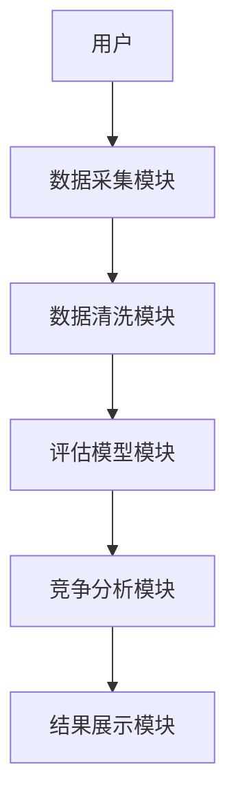
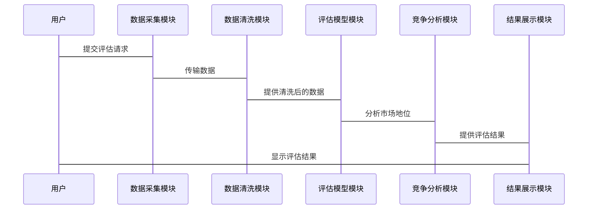

                 


# 费雪的行业领导者理论：独角兽公司的崛起与评估

---

## 关键词

- 费雪行业领导者理论
- 独角兽公司
- 企业评估
- 市场分析
- 技术创新

---

## 摘要

本文从费雪的行业领导者理论出发，探讨独角兽公司的崛起与评估方法。通过分析行业领导者的核心特征与独角兽公司的商业模式，结合实际案例，提出系统的评估框架与策略。文章内容涵盖理论背景、核心概念、评估方法、系统架构设计及项目实战，旨在为企业管理者和技术从业者提供深入的分析与实践指导。

---

## 第一部分：行业领导者理论概述

### 1.1 费雪的行业领导者理论背景

#### 1.1.1 什么是行业领导者理论

行业领导者理论是费雪提出的一种企业分析框架，旨在识别和评估行业中的主导企业。这些企业通常在市场中占据领先地位，具有强大的竞争优势和持续的盈利能力。

#### 1.1.2 费雪理论的核心观点

- **市场地位**：行业领导者通常在目标市场中占据主导地位，具有较高的市场份额。
- **竞争优势**：通过技术创新、成本优势或品牌影响力，行业领导者能够抵御竞争对手的挑战。
- **盈利能力**：行业领导者通常能够保持稳定的盈利能力，并在市场波动中表现优异。

#### 1.1.3 行业领导者与独角兽公司的关系

- 行业领导者是独角兽公司的一种表现形式。
- 独角兽公司通常具备行业领导者的特征，但其估值和成长速度更为显著。

---

### 1.2 独角兽公司的定义与现状

#### 1.2.1 独角兽公司的定义

独角兽公司是指成立不超过10年，估值超过10亿美元的企业。这些公司通常在技术创新、商业模式或市场扩展方面具有显著优势。

#### 1.2.2 独角兽公司的起源与发展

- 起源于硅谷，早期代表公司包括Airbnb、Uber等。
- 近年来，全球范围内涌现出大量独角兽公司，尤其是在科技和互联网领域。

#### 1.2.3 独角兽公司对经济和社会的影响

- **经济影响**：独角兽公司通常通过高增长和高估值推动资本市场的发展。
- **社会影响**：独角兽公司往往引领行业趋势，改变消费者行为和市场格局。

---

## 第二部分：行业领导者与独角兽公司的核心概念

### 2.1 行业领导者的属性与特征

#### 2.1.1 行业领导者的定义与分类

- **定义**：行业领导者是指在特定行业中占据主导地位的企业。
- **分类**：根据市场地位和竞争优势，行业领导者可以分为区域型、全国型和全球型领导者。

#### 2.1.2 行业领导者的市场地位与影响力

- 市场份额高，具有定价权。
- 对行业趋势和政策有较大的影响力。

#### 2.1.3 行业领导者的核心竞争力

- 技术创新能力强。
- 运营效率高，成本控制能力强。
- 品牌影响力大，客户忠诚度高。

---

### 2.2 独角兽公司的特征与模式

#### 2.2.1 独角兽公司的商业模式

- 以创新驱动为核心，注重用户体验。
- 采用轻资产模式，依赖技术和服务。

#### 2.2.2 独角兽公司的估值与融资特点

- 高估值，融资能力强。
- 股权融资为主，注重资本运作。

#### 2.2.3 独角兽公司的创新与技术驱动

- 技术创新是独角兽公司的核心竞争力。
- 通过大数据、人工智能等技术推动业务增长。

---

### 2.3 行业领导者与独角兽公司的对比分析

#### 2.3.1 行业领导者与独角兽公司的异同

| 特性               | 行业领导者          | 独角兽公司          |
|--------------------|--------------------|--------------------|
| 市场地位           | 领导地位           | 领导地位           |
| 成长阶段           | 成熟期             | 成长期             |
| 估值               | 较低               | 高                 |
| 融资能力           | 较强               | 极强               |

#### 2.3.2 行业领导者与独角兽公司的优劣势对比

- **行业领导者优势**：市场地位稳固，抗风险能力强。
- **行业领导者劣势**：增长潜力有限，创新动力不足。
- **独角兽公司优势**：增长速度快，创新能力强。
- **独角兽公司劣势**：市场地位不稳定，抗风险能力较弱。

#### 2.3.3 行业领导者与独角兽公司的协同发展

- 行业领导者可以通过并购或合作，吸收独角兽公司的创新优势。
- 独角兽公司可以通过成为行业领导者的合作伙伴，提升市场地位。

---

## 第三部分：独角兽公司的崛起与评估方法

### 3.1 独角兽公司崛起的背景与驱动因素

#### 3.1.1 技术进步与创新

- 数字化转型推动了独角兽公司的崛起。
- 技术创新降低了创业门槛，提高了效率。

#### 3.1.2 市场需求的变化

- 消费者需求多样化，为独角兽公司提供了市场机会。
- 全球化和本地化需求并存，推动独角兽公司拓展市场。

#### 3.1.3 资本市场的支持

- 风险投资和私募股权的活跃为独角兽公司提供了资金支持。
- 资本市场对高增长企业的青睐推动了独角兽公司的估值提升。

---

### 3.2 独角兽公司评估指标与模型

#### 3.2.1 估值模型与方法

- **DCF模型**：通过现金流折现评估企业价值。
- **可比公司法**：与同行业上市公司进行比较，估算企业价值。

#### 3.2.2 市场地位与竞争分析

- 市场份额分析。
- 竞争对手分析。

#### 3.2.3 财务表现与成长潜力

- 收入增长率。
- 净利润增长率。
- 资产负债表分析。

---

### 3.3 独角兽公司评估的挑战与解决方案

#### 3.3.1 评估中的常见问题

- 数据不透明，难以获取准确的财务数据。
- 企业处于高增长阶段，历史数据不足以预测未来表现。

#### 3.3.2 数据获取与处理的难点

- 数据来源分散，难以整合。
- 数据清洗和处理成本高。

#### 3.3.3 解决方案与优化建议

- 建立多数据源的整合机制。
- 使用机器学习技术预测企业未来表现。

---

## 第四部分：行业领导者理论与独角兽公司的战略应用

### 4.1 系统分析与架构设计

#### 4.1.1 项目介绍

- 本项目旨在构建一个独角兽公司评估系统，结合费雪的行业领导者理论，提供全面的评估框架。

#### 4.1.2 系统功能设计

- 数据采集模块：整合企业财务数据、市场数据等。
- 评估模型模块：基于DCF模型和可比公司法，提供企业估值。
- 竞争分析模块：分析企业的市场地位和竞争优势。

#### 4.1.3 系统架构设计



#### 4.1.4 系统接口设计

- 数据接口：与第三方数据源对接，获取企业数据。
- 用户接口：提供可视化界面，展示评估结果。

#### 4.1.5 系统交互流程



---

## 第五部分：项目实战

### 5.1 环境安装

- **工具安装**：安装Python、Pandas、Matplotlib、Scikit-learn等工具。
- **数据源获取**：从公开数据源获取独角兽公司数据。

### 5.2 核心代码实现

#### 5.2.1 数据清洗代码

```python
import pandas as pd

# 读取数据
df = pd.read_csv('unicorn_companies.csv')

# 删除缺失值
df.dropna(inplace=True)

# 处理异常值
df = df[df['valuation'] > 0]
```

#### 5.2.2 估值模型实现

```python
import numpy as np
from sklearn.linear_model import LinearRegression

# 训练模型
model = LinearRegression()
model.fit(X_train, y_train)

# 预测估值
predicted_valuation = model.predict(X_test)
```

#### 5.2.3 竞争分析代码

```python
import networkx as nx

# 创建竞争图
G = nx.Graph()
G.add_nodes_from(companies)
for i in range(len(companies)):
    for j in range(i+1, len(companies)):
        if companies[i]竞争关系 companies[j]:
            G.add_edge(companies[i], companies[j])
```

### 5.3 案例分析与解读

#### 5.3.1 案例分析

以某独角兽公司为例，分析其市场地位、财务表现和竞争优势。

#### 5.3.2 实际应用

展示评估系统的实际运行结果，解读评估结果的意义。

---

## 第六部分：总结与展望

### 6.1 最佳实践 tips

- 在评估独角兽公司时，应结合定量分析与定性分析。
- 数据清洗和特征工程是评估系统的关键步骤。

### 6.2 小结

本文通过费雪的行业领导者理论，分析了独角兽公司的崛起与评估方法，提出了系统的评估框架与实现方案。

### 6.3 注意事项

- 数据获取和处理的成本较高，需注意数据隐私和合规性。
- 评估模型的准确性依赖于数据质量和模型选择。

### 6.4 拓展阅读

- 推荐阅读《企业估值实战：DCF模型与可比公司法》。
- 推荐学习相关领域的最新研究成果。

---

通过本文的分析与实践，读者可以深入了解独角兽公司的评估方法，掌握行业领导者理论的实际应用，为企业战略决策提供有力支持。

