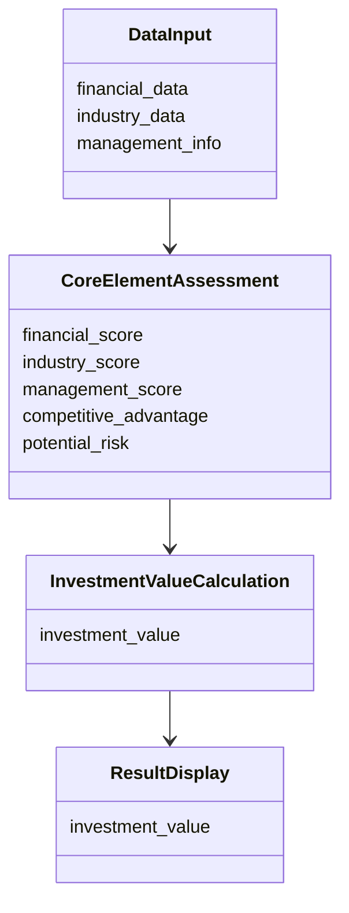
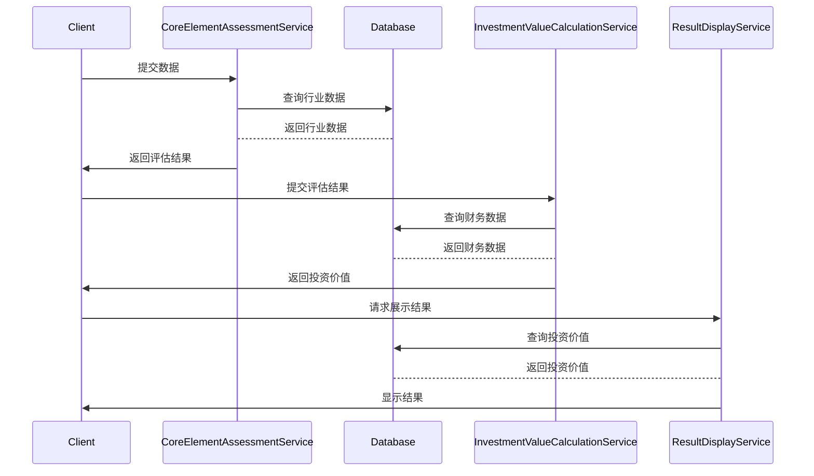

                 


# 费雪的质化分析方法

---

## 关键词：质化分析方法，投资分析，费雪，数据分析，投资策略

---

## 摘要

费雪的质化分析方法是一种结合定性与定量分析的投资分析方法，旨在通过深入分析企业的基本面，评估其内在价值和投资潜力。本文详细介绍了质化分析方法的核心概念、算法原理、系统架构设计、实战案例以及最佳实践，帮助读者全面理解并掌握这一方法在投资分析中的应用。

---

# 第1章: 费雪的质化分析方法概述

## 1.1 质化分析方法的背景与意义

质化分析方法是一种结合定性分析和定量分析的投资分析方法。它通过对企业基本面的深入分析，评估其内在价值和投资潜力，帮助投资者做出更明智的投资决策。

### 1.1.1 质化分析方法的定义

质化分析方法是一种以基本面分析为核心，结合定量和定性分析的投资分析方法。它通过对企业财务状况、行业地位、管理质量等多方面因素的综合评估，判断企业的投资价值。

### 1.1.2 质化分析方法的核心思想

质化分析方法的核心思想是通过深入分析企业的基本面，识别其竞争优势和潜在风险，从而评估其投资价值。它强调对企业财务数据的定量分析和对行业、管理等定性因素的综合考量。

### 1.1.3 质化分析方法的应用领域

质化分析方法广泛应用于股票投资分析、行业分析和经济周期分析等领域。它尤其适合那些希望通过深入分析企业基本面来指导投资决策的投资者和分析师。

## 1.2 费雪分析方法的特点

费雪的质化分析方法具有独特性、优势和局限性。

### 1.2.1 费雪分析方法的独特性

费雪分析方法的独特性在于其将定性和定量分析相结合，既考虑了企业的财务数据，又考虑了行业地位和管理质量等定性因素。

### 1.2.2 费雪分析方法的优势

费雪分析方法的优势在于其全面性和准确性。通过综合考虑多方面因素，它能够更准确地评估企业的投资价值。

### 1.2.3 费雪分析方法的局限性

费雪分析方法的局限性在于其复杂性和主观性。由于需要综合考虑多方面因素，其分析过程较为复杂，且部分因素的评估存在主观性。

## 1.3 费雪分析方法与其他分析方法的对比

### 1.3.1 费雪分析方法与定量分析的对比

费雪分析方法与定量分析的对比在于，前者综合考虑了定性和定量因素，而后者主要依赖于定量数据。

### 1.3.2 费雪分析方法与定性分析的对比

费雪分析方法与定性分析的对比在于，前者结合了定量分析，而后者主要依赖于定性因素。

### 1.3.3 费雪分析方法与传统投资分析的对比

费雪分析方法与传统投资分析的对比在于，前者更加注重对企业基本面的深入分析，而后者可能更加注重市场趋势和技术分析。

## 1.4 费雪分析方法的应用场景

### 1.4.1 股票投资分析

费雪分析方法在股票投资分析中的应用可以帮助投资者评估企业的内在价值和投资潜力。

### 1.4.2 行业分析

费雪分析方法在行业分析中的应用可以帮助投资者了解行业的竞争格局和企业的市场地位。

### 1.4.3 经济周期分析

费雪分析方法在经济周期分析中的应用可以帮助投资者把握经济周期对企业基本面的影响。

## 1.5 本章小结

本章介绍了费雪的质化分析方法的背景、核心思想、特点以及应用场景。通过对比分析，展示了其独特性和优势。

---

# 第2章: 费雪分析方法的核心概念

## 2.1 质化分析的核心要素

质化分析的核心要素包括财务状况、行业地位、管理质量、竞争优势和潜在风险。

### 2.1.1 核心要素的定义

财务状况：企业的财务健康状况，包括盈利能力、偿债能力、营运能力等。

行业地位：企业在行业中的地位，包括市场份额、竞争优势等。

管理质量：企业管理层的能力和战略决策。

竞争优势：企业在市场中的竞争优势，包括成本优势、技术优势等。

潜在风险：企业面临的潜在风险，包括行业风险、财务风险等。

### 2.1.2 核心要素的特征

财务状况：量化指标，可以通过财务报表获取。

行业地位：定性与定量结合，可以通过市场份额数据和行业分析报告获取。

管理质量：定性因素，需要通过调研和分析获取。

竞争优势：定性与定量结合，可以通过企业公开信息和行业分析获取。

潜在风险：定性与定量结合，需要通过综合分析获取。

### 2.1.3 核心要素的相互关系

财务状况、行业地位、管理质量、竞争优势和潜在风险相互关联，共同影响企业的投资价值。

## 2.2 费雪分析方法的原理

费雪分析方法的原理是通过综合分析企业的核心要素，评估其投资价值。

### 2.2.1 费雪分析的基本原理

费雪分析的基本原理是通过对企业基本面的全面分析，评估其内在价值和投资潜力。

### 2.2.2 费雪分析的核心假设

费雪分析的核心假设是企业具有可持续的竞争优势，并且管理层能够有效管理企业。

### 2.2.3 费雪分析的逻辑框架

费雪分析的逻辑框架包括：识别核心要素、评估核心要素、综合评估投资价值。

## 2.3 费雪分析方法的数学模型

### 2.3.1 基本公式

费雪分析的基本公式可以表示为：

$$
\text{投资价值} = \text{财务状况} \times \text{行业地位} \times \text{管理质量} \times \text{竞争优势} \div \text{潜在风险}
$$

### 2.3.2 模型的构建

费雪分析模型的构建需要综合考虑企业的多方面因素，通过加权平均的方式评估其投资价值。

### 2.3.3 模型的验证

模型的验证需要通过历史数据和实际案例进行验证，确保模型的有效性和准确性。

## 2.4 费雪分析方法的流程图

### 2.4.1 流程图的定义

费雪分析方法的流程图包括：识别核心要素、评估核心要素、综合评估投资价值。

### 2.4.2 流程图的步骤

1. 识别核心要素：财务状况、行业地位、管理质量、竞争优势和潜在风险。
2. 评估核心要素：分别评估每个核心要素的优劣。
3. 综合评估投资价值：根据评估结果综合计算投资价值。

### 2.4.3 流程图的优化

通过优化流程图，可以提高分析效率和准确性，例如通过自动化工具辅助评估核心要素。

## 2.5 本章小结

本章详细介绍了费雪分析方法的核心概念，包括核心要素、原理和数学模型，并通过流程图展示了分析过程。

---

# 第3章: 费雪分析方法的算法原理

## 3.1 算法的基本原理

费雪分析方法的算法基本原理是通过综合分析企业的核心要素，评估其投资价值。

### 3.1.1 算法的输入

算法的输入包括企业的财务数据、行业数据和企业管理层的信息。

### 3.1.2 算法的输出

算法的输出是企业的投资价值评估结果。

### 3.1.3 算法的步骤

1. 收集企业数据：包括财务数据、行业数据和企业管理层的信息。
2. 评估核心要素：分别评估财务状况、行业地位、管理质量、竞争优势和潜在风险。
3. 综合评估投资价值：根据评估结果计算投资价值。

## 3.2 算法的数学模型

### 3.2.1 模型的定义

费雪分析的数学模型可以表示为：

$$
\text{投资价值} = \sum_{i=1}^{n} w_i \times x_i
$$

其中，\( w_i \) 是第 \( i \) 个核心要素的权重，\( x_i \) 是第 \( i \) 个核心要素的评估值。

### 3.2.2 模型的参数

模型的参数包括核心要素的权重和评估值。

### 3.2.3 模型的优化

通过调整核心要素的权重，可以优化模型的准确性。

## 3.3 算法的流程图

### 3.3.1 流程图的定义

费雪分析算法的流程图包括：数据输入、核心要素评估、投资价值计算。

### 3.3.2 流程图的步骤

1. 数据输入：收集企业的财务数据、行业数据和企业管理层的信息。
2. 核心要素评估：分别评估财务状况、行业地位、管理质量、竞争优势和潜在风险。
3. 投资价值计算：根据评估结果计算投资价值。

### 3.3.3 流程图的优化

通过优化流程图，可以提高算法的效率和准确性，例如通过自动化工具辅助数据收集和评估。

## 3.4 算法的代码实现

### 3.4.1 代码的结构

代码的结构包括数据输入、核心要素评估、投资价值计算。

### 3.4.2 代码的实现

```python
def fisher_analysis(financial_data, industry_data, management_info):
    # 评估核心要素
    financial_score = assess_financial_status(financial_data)
    industry_score = assess_industry_position(industry_data)
    management_score = assess_management_quality(management_info)
    competitive_advantage = assesscompetitive_advantage(financial_data, industry_data)
    potential_risk = assess_potential_risk(financial_data, industry_data, management_info)
    
    # 综合评估投资价值
    investment_value = (financial_score * industry_score * management_score * competitive_advantage) / potential_risk
    return investment_value
```

### 3.4.3 代码的测试

通过测试用例验证代码的正确性，例如通过历史数据和实际案例进行验证。

## 3.5 本章小结

本章详细介绍了费雪分析方法的算法原理，包括基本原理、数学模型和代码实现，并通过流程图展示了分析过程。

---

# 第4章: 费雪分析方法的系统架构设计

## 4.1 系统分析与设计

### 4.1.1 系统的目标

系统的目标是通过自动化工具辅助费雪分析方法的应用，提高分析效率和准确性。

### 4.1.2 问题场景介绍

问题场景包括：数据收集、核心要素评估、投资价值计算和结果展示。

### 4.1.3 系统功能设计

系统功能设计包括：数据输入、核心要素评估、投资价值计算和结果展示。

### 4.1.4 领域模型（Mermaid 类图）



### 4.1.5 系统架构设计（Mermaid 架构图）


### 4.1.6 系统接口设计

系统接口设计包括：数据输入接口、核心要素评估接口、投资价值计算接口和结果展示接口。

### 4.1.7 系统交互（Mermaid 序列图）



## 4.2 本章小结

本章详细介绍了费雪分析方法的系统架构设计，包括系统目标、功能设计、架构图和接口设计。

---

# 第5章: 费雪分析方法的项目实战

## 5.1 项目背景与目标

项目背景是通过费雪分析方法对企业进行投资价值评估，目标是开发一个自动化工具辅助分析。

## 5.2 核心代码实现

### 5.2.1 环境安装

需要安装Python和相关库，例如Pandas、NumPy、Matplotlib等。

### 5.2.2 核心代码实现

```python
import pandas as pd
import numpy as np

def assess_financial_status(financial_data):
    # 评估财务状况，返回分数
    pass

def assess_industry_position(industry_data):
    # 评估行业地位，返回分数
    pass

def assess_management_quality(management_info):
    # 评估管理质量，返回分数
    pass

def assesscompetitive_advantage(financial_data, industry_data):
    # 评估竞争优势，返回分数
    pass

def assess_potential_risk(financial_data, industry_data, management_info):
    # 评估潜在风险，返回分数
    pass

def fisher_analysis(financial_data, industry_data, management_info):
    financial_score = assess_financial_status(financial_data)
    industry_score = assess_industry_position(industry_data)
    management_score = assess_management_quality(management_info)
    competitive_advantage = assesscompetitive_advantage(financial_data, industry_data)
    potential_risk = assess_potential_risk(financial_data, industry_data, management_info)
    
    investment_value = (financial_score * industry_score * management_score * competitive_advantage) / potential_risk
    return investment_value
```

## 5.3 代码应用解读与分析

### 5.3.1 代码的功能解读

代码的功能包括数据输入、核心要素评估、投资价值计算。

### 5.3.2 代码的实现分析

代码通过函数实现核心要素的评估和投资价值的计算，具有较高的模块化和可扩展性。

## 5.4 案例分析与详细讲解

### 5.4.1 案例背景

假设我们分析一家科技公司的投资价值。

### 5.4.2 数据收集

收集该公司的财务数据、行业数据和企业管理层的信息。

### 5.4.3 核心要素评估

评估财务状况、行业地位、管理质量、竞争优势和潜在风险。

### 5.4.4 投资价值计算

根据评估结果计算投资价值。

## 5.5 项目小结

本章通过一个实际案例详细讲解了费雪分析方法的应用，展示了代码的实现和实际分析过程。

---

# 第6章: 费雪分析方法的最佳实践

## 6.1 小结与回顾

### 6.1.1 核心概念回顾

质化分析方法的核心概念包括财务状况、行业地位、管理质量、竞争优势和潜在风险。

### 6.1.2 算法原理回顾

费雪分析方法通过综合评估核心要素，计算投资价值。

## 6.2 注意事项

### 6.2.1 数据的准确性

数据的准确性是分析结果的关键，需要确保数据来源可靠。

### 6.2.2 分析的主观性

部分核心要素的评估具有主观性，需要结合实际情况进行判断。

### 6.2.3 结果的验证

分析结果需要通过历史数据和实际案例进行验证，确保模型的有效性。

## 6.3 拓展阅读

### 6.3.1 相关书籍

推荐阅读《投资学基础》和《费雪投资理论》。

### 6.3.2 相关论文

推荐阅读相关的学术论文，了解费雪分析方法的最新研究。

### 6.3.3 在线资源

推荐访问相关投资分析网站，获取最新的行业动态和分析工具。

## 6.4 本章小结

本章总结了费雪分析方法的核心概念和算法原理，并提供了注意事项和拓展阅读内容。

---

# 结语

费雪的质化分析方法是一种结合定性和定量分析的投资分析方法，通过综合评估企业的核心要素，评估其投资价值。本文详细介绍了费雪分析方法的核心概念、算法原理、系统架构设计、项目实战以及最佳实践，帮助读者全面理解并掌握这一方法在投资分析中的应用。希望读者能够通过本文的指导，成功应用费雪分析方法，做出更明智的投资决策。

