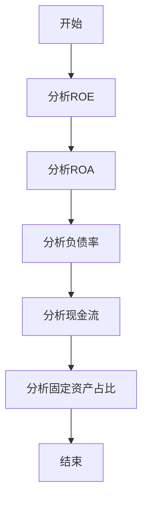
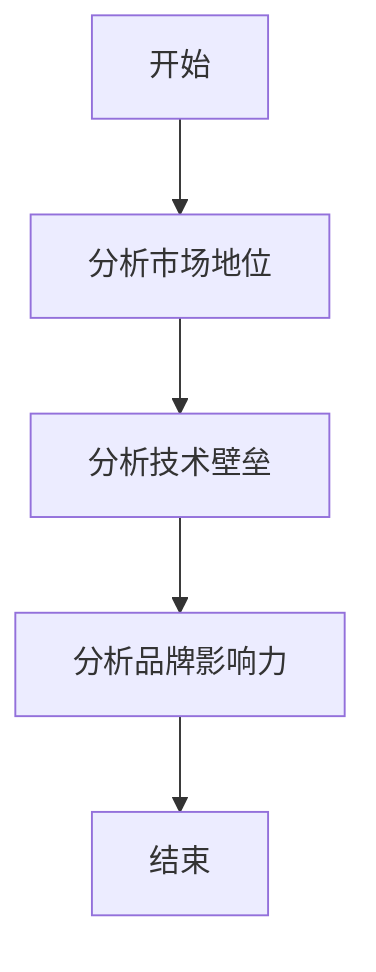

                 


# 费雪的质量增长型公司特征

> 关键词：费雪投资理论、质量增长型公司、投资策略、风险管理、企业分析

> 摘要：本文详细探讨了费雪的质量增长型公司特征，包括其定义、核心特征、筛选标准、投资策略和风险管理等方面。通过分析和实例，展示了如何识别和投资于质量增长型公司，帮助投资者做出明智决策。

---

# 第一部分: 费雪投资理念的背景与基础

## 第1章: 费雪投资理论的起源

### 1.1 费雪的生平与投资经历
菲利普·费雪（Philip Fisher）是20世纪著名的投资理论家，被誉为“成长股之父”。他出生于1907年，去世于2004年，是价值投资的重要倡导者之一。费雪的投资理念强调长期成长和对公司基本面的深入分析，他的著作《如何选择成长股》是投资领域的经典。

### 1.2 费雪投资理论的核心思想
费雪的核心思想是：选择那些具有持续增长潜力的公司进行投资。他认为，成功的投资不仅仅是买入低估的股票，而是买入那些能够在未来几年内实现收入和利润增长的公司。他提出了“质量增长型公司”的概念，即那些具有强大竞争优势、稳定管理团队和良好财务状况的公司。

### 1.3 质量增长型公司与传统增长型公司的区别
| 特征 | 质量增长型公司 | 传统增长型公司 |
|------|----------------|----------------|
| 盈利能力 | 高且稳定 | 可能波动较大 |
| 市场地位 | 领先或竞争优势明显 | 市场地位不稳定 |
| 财务状况 | 健康，低负债 | 可能存在财务杠杆问题 |

### 1.4 本章小结
本章介绍了费雪的投资理念和质量增长型公司的定义，为后续分析奠定了基础。

---

## 第2章: 质量增长型公司的核心特征分析

### 2.1 财务特征分析
质量增长型公司通常具有以下财务特征：
1. **盈利能力**：ROE（净资产收益率）和ROA（资产收益率）较高。
2. **财务健康**：低负债率，现金流充足。
3. **资产质量**：固定资产占比合理，无大量不良资产。

**Mermaid流程图：质量增长型公司的财务特征分析**



### 2.2 竞争优势分析
质量增长型公司通常具备以下竞争优势：
1. **市场领导地位**：公司市场份额较高。
2. **技术壁垒**：拥有独特的技术或专利。
3. **品牌影响力**：品牌知名度高，客户忠诚度强。

**Mermaid流程图：竞争优势分析**



### 2.3 管理团队分析
质量增长型公司通常有：
1. **稳定的管理团队**：管理层长期稳定，经验丰富。
2. **高效的公司治理**：董事会结构合理，监督机制完善。
3. **透明的决策机制**：公司决策透明，信息披露及时。

---

## 第3章: 质量增长型公司的筛选标准与方法

### 3.1 筛选标准
质量增长型公司的筛选标准包括：
1. **盈利能力**：ROE > 15%，ROA > 10%。
2. **增长能力**：收入和利润连续三年增长。
3. **财务健康**：负债率 < 50%，现金流为正。
4. **竞争优势**：市场地位领先，技术壁垒高。
5. **管理团队**：管理层稳定，治理结构合理。

### 3.2 筛选方法
**步骤1：筛选盈利能力高的公司**
```python
import pandas as pd

def filter_profitability(df):
    return df[df['ROE'] > 15]
```

**步骤2：筛选增长能力强的公司**
```python
def filter_growth(df):
    return df[df['Revenue Growth'] > 10]
```

**步骤3：综合评分**
使用综合评分模型：
$$
\text{综合评分} = 0.4 \times \text{ROE} + 0.3 \times \text{Revenue Growth} + 0.3 \times \text{Cash Flow}
$$

### 3.3 本章小结
本章详细介绍了质量增长型公司的筛选标准和方法，帮助投资者找到符合条件的公司。

---

## 第4章: 质量增长型公司的投资策略与风险管理

### 4.1 投资策略
1. **长期持有**：避免频繁交易，长期持有优质公司股票。
2. **分散投资**：将资金分散投资于多个质量增长型公司，降低风险。
3. **定期调整**：每年重新评估投资组合，调整不符合条件的公司。

### 4.2 风险管理
1. **市场风险**：通过分散投资降低市场波动带来的风险。
2. **个股风险**：定期跟踪公司基本面，及时发现潜在风险。
3. **组合风险**：使用夏普比率评估投资组合的风险调整后收益。

**公式：夏普比率**
$$
\text{夏普比率} = \frac{\text{组合平均收益} - \text{无风险收益率}}{\text{组合收益的标准差}}
$$

### 4.3 本章小结
本章介绍了质量增长型公司的投资策略和风险管理方法，帮助投资者降低风险，实现长期收益。

---

## 第5章: 质量增长型公司投资的实战

### 5.1 环境安装
使用Python和Pandas进行数据分析，安装必要的库：
```bash
pip install pandas numpy matplotlib
```

### 5.2 数据收集与清洗
从财务报表中提取ROE、Revenue Growth等数据，清洗数据并计算综合评分。

### 5.3 实战案例分析
以苹果公司为例：
```python
import pandas as pd

# 假设df为苹果公司数据
def is_quality_growth(df):
    return (df['ROE'] > 15) & (df['Revenue Growth'] > 10)
```

### 5.4 投资组合构建
根据筛选标准，选择综合评分高的公司构建投资组合，并定期调整。

### 5.5 小结
通过实战案例，展示了如何应用费雪的质量增长型公司特征进行投资。

---

# 第六章: 最佳实践与总结

### 6.1 小结
质量增长型公司具备盈利能力高、财务健康、竞争优势明显等特征。投资者应结合这些特征，制定科学的投资策略。

### 6.2 注意事项
1. **长期投资**：避免短期波动影响决策。
2. **分散投资**：降低个股风险。
3. **持续学习**：关注市场变化，及时调整投资策略。

### 6.3 拓展阅读
推荐阅读《如何选择成长股》和《投资学原理》等书籍，深入理解质量增长型公司的投资策略。

---

# 结语

费雪的质量增长型公司特征为投资者提供了科学的投资方法。通过深入分析公司的财务、竞争优势和管理团队，结合合理的投资策略和风险管理，投资者可以在长期实现稳定收益。希望本文对读者有所帮助，祝您投资成功！

