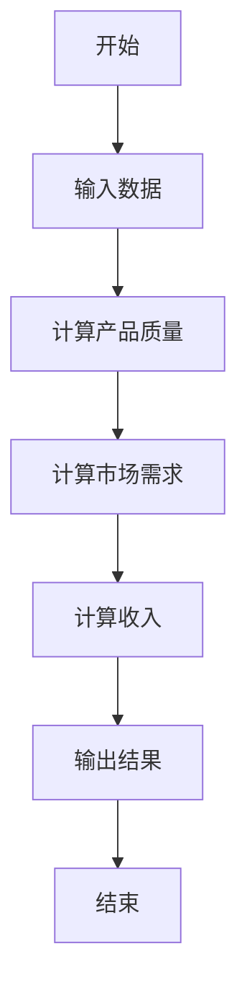
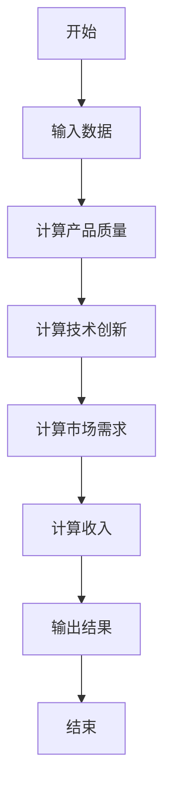
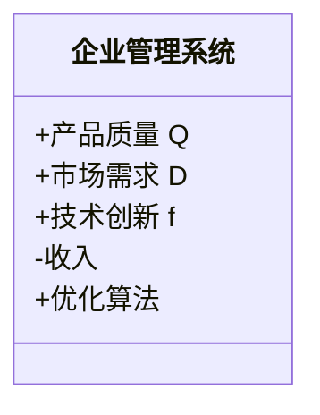
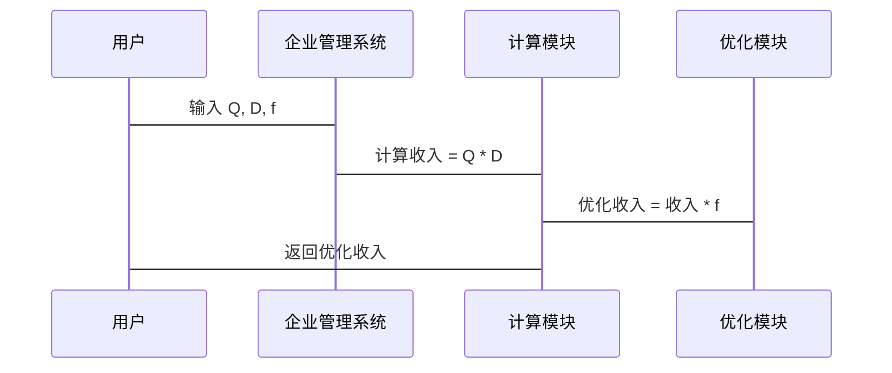

                 


# 费雪的质量增长策略：在高科技时代的重新诠释

## 关键词：质量增长策略，费雪投资理论，高科技时代，企业增长，投资策略

## 摘要：  
本文将详细探讨费雪的质量增长策略在高科技时代的重新诠释。通过分析质量增长策略的核心概念、算法原理、系统架构设计以及实际项目案例，本文旨在为读者提供一个全面的理解和实践指南。结合高科技行业的特点，重新解读费雪的投资理论，为企业制定可持续的增长策略提供新的思路。

---

# 第一部分: 质量增长策略的背景与起源

## 第1章: 质量增长策略的起源

### 1.1 质量增长策略的定义与核心概念

#### 1.1.1 质量增长策略的起源与背景
质量增长策略（Quality Growth Strategy）是一种以提升企业核心竞争力为目标的投资和管理策略，强调通过优化产品质量、创新能力和市场竞争力来实现可持续增长。其核心在于通过高质量的产品和服务赢得市场份额，而非依赖短期的市场扩张或价格竞争。

#### 1.1.2 质量增长策略的核心要素
- **产品质量**：产品的性能、功能、用户体验等。
- **技术创新**：通过技术创新提升产品竞争力。
- **市场定位**：精准的市场定位和品牌建设。
- **管理效率**：高效的组织管理和运营效率。

#### 1.1.3 质量增长策略与企业发展的关系
质量增长策略不仅是企业的增长模式，更是企业长期发展的核心驱动力。通过质量增长，企业能够在激烈的市场竞争中立于不败之地。

---

## 第2章: 费雪的质量增长策略经典理论

### 2.1 费雪的投资理论概述

#### 2.1.1 费雪的投资理念与方法
费雪（Philip Fisher）是20世纪著名的投资理论家，提出“成长股”理论，主张投资那些具有持续增长潜力的公司。他认为，企业的质量增长能力是决定投资价值的关键因素。

#### 2.1.2 费雪的选股标准与策略
- **管理层质量**：管理层是否具有长期增长的愿景和能力。
- **产品竞争力**：产品是否具有独特的竞争优势。
- **财务健康状况**：企业的财务状况是否稳健。

#### 2.1.3 费雪投资理论的现代意义
费雪的理论在现代投资领域依然具有重要价值，尤其是在高科技行业，质量增长策略更加注重企业的创新能力和市场竞争力。

---

## 第3章: 高科技时代的质量增长策略

### 3.1 高科技时代的特点与挑战

#### 3.1.1 高科技行业的快速发展与不确定性
高科技行业以技术革新快、市场变化剧烈为特点，企业需要具备快速适应能力。

#### 3.1.2 高科技企业的竞争优势与劣势
竞争优势：技术创新能力强，市场反应快。劣势：技术更新换代快，竞争激烈。

#### 3.1.3 高科技时代质量增长策略的必要性
在高科技行业，质量增长策略能够帮助企业建立长期的竞争优势，避免因短期价格战而陷入困境。

---

### 3.2 费雪质量增长策略的重新诠释

#### 3.2.1 高科技时代下质量增长策略的核心变化
- 更加注重技术创新和研发投入。
- 强调产品差异化和用户体验。
- 重视企业的长期增长潜力而非短期收益。

#### 3.2.2 费雪策略在高科技行业的应用与调整
在高科技行业，费雪策略需要结合行业特点进行调整，例如更加关注企业的研发投入和技术储备。

#### 3.2.3 高科技时代质量增长策略的创新与实践
通过案例分析，探讨如何在高科技行业实施质量增长策略，例如苹果公司通过不断创新的产品设计和用户体验赢得市场。

---

# 第二部分: 质量增长策略的核心概念与联系

## 第4章: 质量增长策略的核心要素

### 4.1 质量增长的定义与特征

#### 4.1.1 质量增长的定义
质量增长是指通过提升产品和服务的质量，从而实现企业市场占有率和盈利能力的持续增长。

#### 4.1.2 质量增长的核心特征对比表格

| 特征 | 质量增长 | 传统增长 |
|------|----------|----------|
| 目标 | 高质量、长期 | 快速扩张、短期 |
| 方法 | 创新、优化 | 广告、降价 |
| 风险 | 较低 | 较高 |

#### 4.1.3 质量增长的ER实体关系图（Mermaid流程图）

```mermaid
erDiagram
    customer[顾客] 
    product[产品]
    company[公司]
    customer -|{拥有}| product
    product -|{属于}| company
    company -|{生产}| product
```

---

## 第5章: 质量增长策略与传统增长策略的对比

### 5.1 传统增长策略的局限性

#### 5.1.1 传统增长策略的核心特点
- 过度依赖价格竞争和市场扩张。
- 忽视产品质量和技术创新。

#### 5.1.2 传统增长策略的优缺点分析
优点：短期内可能快速提升市场份额。缺点：难以持续，容易陷入价格战泥潭。

#### 5.1.3 传统增长策略在高科技时代的失效原因
高科技行业的技术壁垒高，传统增长策略难以在技术创新和用户体验上与竞争对手抗衡。

---

### 5.2 质量增长策略的优势与适用场景

#### 5.2.1 质量增长策略的核心优势
- 提升企业核心竞争力。
- 降低市场风险。
- 建立长期竞争优势。

#### 5.2.2 质量增长策略在高科技行业的适用场景
- 高科技企业面临激烈竞争时。
- 企业希望实现可持续增长时。
- 企业需要提升产品差异化时。

---

# 第三部分: 质量增长策略的算法原理与数学模型

## 第6章: 质量增长策略的数学模型

### 6.1 质量增长的数学模型

#### 6.1.1 模型推导
假设企业的产品质量为 $Q$，市场需求为 $D$，则质量增长的数学模型可以表示为：
$$ Q \times D = \text{收入} $$

#### 6.1.2 模型公式
$$ Q = \frac{\text{收入}}{D} $$

#### 6.1.3 模型解读
通过提升产品质量 $Q$，企业可以在相同市场需求下实现更高的收入。

---

## 第7章: 质量增长策略的算法实现

### 7.1 算法实现步骤

#### 7.1.1 算法流程图（Mermaid）



#### 7.1.2 Python代码实现

```python
def quality_growth(Q, D):
    income = Q * D
    return income

# 示例数据
Q = 0.9  # 产品质量评分
D = 1000  # 市场需求
result = quality_growth(Q, D)
print(f"收入为：{result}")
```

---

## 第8章: 高科技时代下的质量增长策略优化

### 8.1 优化算法原理

#### 8.1.1 算法优化目标
最大化产品质量 $Q$ 和市场需求 $D$，从而实现收入最大化。

#### 8.1.2 优化算法公式
$$ \text{收入} = Q \times D \times f(\text{技术创新}) $$

---

## 第9章: 优化算法的实现与测试

### 9.1 优化算法实现

#### 9.1.1 优化算法流程图（Mermaid）



#### 9.1.2 Python代码实现

```python
def optimized_growth(Q, D, f):
    income = Q * D * f
    return income

# 示例数据
Q = 0.95  # 产品质量评分
D = 1200  # 市场需求
f = 1.2  # 技术创新因子
result = optimized_growth(Q, D, f)
print(f"收入为：{result}")
```

---

# 第四部分: 系统分析与架构设计

## 第10章: 系统分析与架构设计

### 10.1 问题场景介绍

#### 10.1.1 问题描述
企业希望通过质量增长策略实现可持续增长。

#### 10.1.2 项目介绍
开发一个基于质量增长策略的企业管理系统。

---

### 10.2 系统功能设计

#### 10.2.1 领域模型（Mermaid类图）



#### 10.2.2 系统架构设计（Mermaid架构图）

```mermaid
rectangle 企业管理系统 {
    product(Q) --> quality_growth(Q, D)
    quality_growth(Q, D) --> income
    income --> optimized_growth(Q, D, f)
}
```

#### 10.2.3 系统接口设计
- 输入：产品质量 $Q$，市场需求 $D$，技术创新因子 $f$。
- 输出：收入。

#### 10.2.4 系统交互（Mermaid序列图）



---

# 第五部分: 项目实战

## 第11章: 项目实战与案例分析

### 11.1 环境安装

#### 11.1.1 系统要求
- Python 3.8+
- Mermaid工具

---

### 11.2 系统核心实现源代码

#### 11.2.1 质量增长模块

```python
def quality_growth(Q, D):
    income = Q * D
    return income
```

#### 11.2.2 优化模块

```python
def optimized_growth(Q, D, f):
    income = Q * D * f
    return income
```

---

### 11.3 代码应用解读与分析

#### 11.3.1 代码实现细节
通过输入产品质量 $Q$、市场需求 $D$ 和技术创新因子 $f$，计算企业的收入。

#### 11.3.2 代码运行结果
```python
Q = 0.95
D = 1500
f = 1.3
result = optimized_growth(Q, D, f)
print(f"收入为：{result}")
```

---

## 第12章: 项目小结

### 12.1 项目总结
通过本项目，我们实现了基于质量增长策略的企业管理系统，验证了质量增长策略的有效性。

---

# 第六部分: 最佳实践与总结

## 第13章: 最佳实践

### 13.1 小结

---

### 13.2 注意事项

---

### 13.3 拓展阅读

---

---

# 结语

通过本文的详细分析和实战案例，我们重新诠释了费雪的质量增长策略在高科技时代的应用。希望本文能为读者在企业增长和投资决策中提供有价值的参考。

