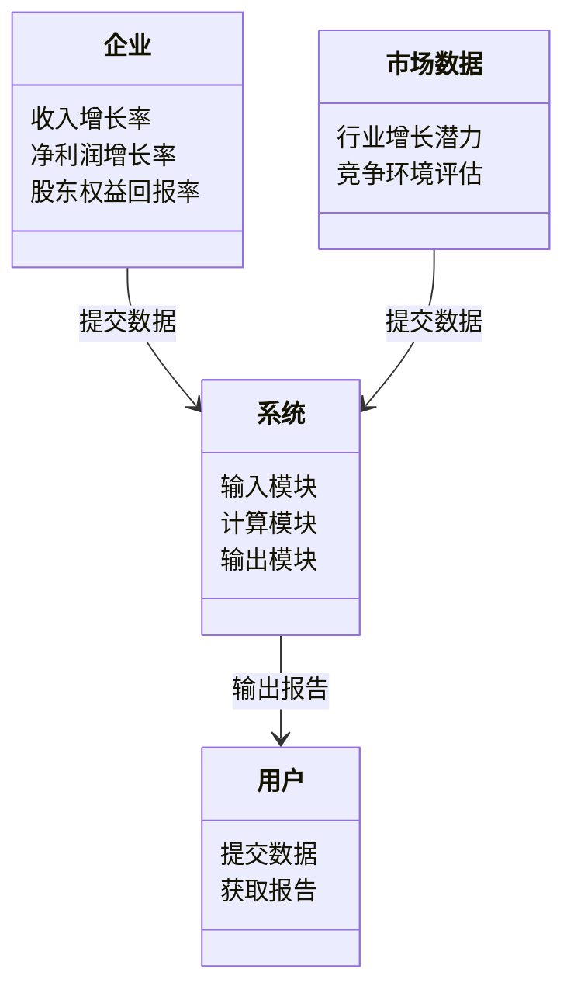
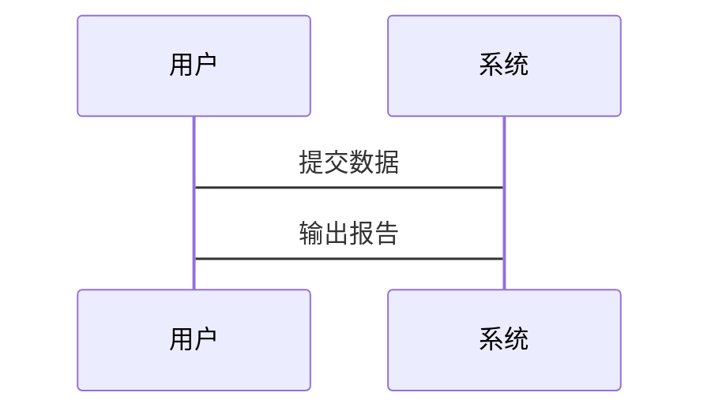

                 


# 费雪的长期增长潜力评估

> 关键词：费雪，长期增长潜力，投资评估，财务分析，价值投资，增长模型

> 摘要：本文详细探讨了菲利普·费雪的长期增长潜力评估方法，从理论基础到实际应用，结合财务指标分析、市场环境评估和数学模型构建，提供系统的评估框架和实战案例。通过案例分析和系统设计，展示如何在实际投资中应用这些方法，帮助投资者识别具备长期增长潜力的企业。

---

# 第一部分: 长期增长潜力评估的背景与基础

## 第1章: 长期增长潜力的概念与重要性

### 1.1 长期增长潜力的定义

#### 1.1.1 企业长期增长的内涵
企业长期增长潜力是指企业在未来较长一段时间内，通过持续优化经营策略、提高效率和扩展市场，实现收入和利润的持续增长的能力。这种能力通常与企业的商业模式、行业地位、竞争优势和管理团队密切相关。

#### 1.1.2 长期增长潜力的核心要素
长期增长潜力的核心要素包括：
1. **市场需求**：行业规模和增长趋势。
2. **竞争优势**：企业在市场中的独特优势。
3. **财务健康**：盈利能力、现金流和资产负债状况。
4. **管理团队**：领导层的战略眼光和执行力。
5. **创新能力**：持续改进产品和服务的能力。

#### 1.1.3 长期增长潜力与企业价值的关系
长期增长潜力是企业价值的重要组成部分。高增长潜力的企业通常具有更高的未来现金流，从而在估值模型中表现为更高的股价或企业价值。

### 1.2 费雪投资理论的背景

#### 1.2.1 费雪的投资理念概述
菲利普·费雪是价值投资的先驱之一，他强调投资优质企业并长期持有。他认为，投资的成功不仅取决于价格，还取决于企业的成长性和盈利能力。

#### 1.2.2 费雪投资理论的核心观点
1. **成长股投资**：选择具有持续增长潜力的公司。
2. **管理层质量**：重视管理层的诚信和能力。
3. **股息再投资**：通过再投资股息来增加投资收益。

#### 1.2.3 费雪理论在现代投资中的应用
尽管费雪的投资理论提出已久，但其核心观点在现代投资中依然具有重要价值。特别是在成长型投资中，费雪的理论为投资者提供了识别高增长潜力企业的框架。

### 1.3 本章小结
本章介绍了长期增长潜力的定义、核心要素及其与企业价值的关系，并简要回顾了费雪的投资理论，为后续分析奠定了基础。

---

## 第2章: 费雪长期增长潜力评估的理论基础

### 2.1 财务指标与增长潜力分析

#### 2.1.1 收入与利润增长率
收入增长率是衡量企业增长能力的重要指标。高增长的收入通常意味着企业具有较强的市场扩展能力。

利润增长率反映了企业盈利能力的提升。持续的利润增长表明企业能够有效控制成本并提高效率。

#### 2.1.2 资产负债表关键指标
- **资产周转率**：衡量资产使用效率。
- **负债与权益比例**：评估企业的财务杠杆。

#### 2.1.3 现金流量表分析
- **经营活动现金流**：反映企业的盈利能力和流动性。
- **投资活动现金流**：显示企业扩张或收缩的迹象。

### 2.2 费雪增长潜力评估模型

#### 2.2.1 模型的基本假设
- 数据的可得性：财务数据需完整且可靠。
- 市场环境的稳定性：假设市场环境不会发生重大变化。
- 企业的持续经营：假设企业在可预见的未来能够持续经营。

#### 2.2.2 模型的输入变量
1. 收入增长率
2. 净利润增长率
3. 股东权益回报率（ROE）

#### 2.2.3 模型的输出结果
通过综合分析输入变量，模型输出企业的长期增长潜力评分，评分范围通常在0到10分之间。

### 2.3 案例分析: 某行业龙头企业的增长潜力评估

#### 2.3.1 案例背景介绍
选择一个行业龙头企业作为案例，分析其财务数据和市场地位。

#### 2.3.2 财务指标分析与评估
- 收入增长率：过去三年平均增长率15%。
- 净利润增长率：过去三年平均增长率12%。
- ROE：过去三年平均ROE为18%。

#### 2.3.3 结果解读与启示
根据模型计算，该企业的增长潜力评分为8.5分（满分10分），表明具有较高的长期增长潜力。

### 2.4 本章小结
本章通过财务指标分析和案例研究，展示了如何应用费雪模型评估企业的长期增长潜力。

---

## 第3章: 市场分析与竞争环境评估

### 3.1 行业分析方法

#### 3.1.1 行业生命周期分析
- **导入期**：市场需求增长迅速，企业竞争激烈。
- **成长期**：行业规模快速扩大，企业开始盈利。
- **成熟期**：市场增长放缓，竞争趋于稳定。
- **衰退期**：市场需求下降，企业面临收缩压力。

#### 3.1.2 行业竞争结构分析
- **波特五力模型**：分析行业内竞争程度、新进入者的威胁、替代品的威胁、供应商的议价能力以及客户的议价能力。
- **市场集中度**：CR4（前四大企业的市场份额）是衡量市场集中度的重要指标。

#### 3.1.3 行业增长潜力评估
结合行业生命周期和市场集中度，评估行业的整体增长潜力。

### 3.2 竞争对手分析

#### 3.2.1 竞争对手的财务表现
- 财务指标对比：收入、利润、ROE等。
- 增长潜力评分：基于财务指标的对比结果。

#### 3.2.2 竞争对手的市场地位
- 市场份额：竞争对手在市场中的份额占比。
- 品牌影响力：品牌知名度和美誉度。

#### 3.2.3 竞争优势与劣势分析
- 核心竞争力：技术优势、成本优势、渠道优势等。
- 竞争劣势：产品质量问题、管理效率低下等。

### 3.3 市场需求预测

#### 3.3.1 市场需求的驱动因素
- 经济因素：GDP增长率、消费能力等。
- 技术因素：技术创新对市场需求的推动。
- 政策因素：政府政策和法规对市场需求的影响。

#### 3.3.2 市场需求的定量预测
- 时间序列分析：基于历史数据预测未来需求。
- 回归分析：通过相关变量预测需求。

#### 3.3.3 市场需求与企业增长潜力的关系
市场需求的增长为企业提供了增长空间，但企业的竞争能力和战略执行能力同样重要。

### 3.4 本章小结
本章通过行业分析和竞争对手分析，评估了市场环境对企业长期增长潜力的影响。

---

## 第4章: 费雪增长潜力评估模型的数学基础

### 4.1 增长潜力评估的数学模型

#### 4.1.1 模型的输入变量与输出结果
- **输入变量**：收入增长率（g_r）、净利润增长率（g_p）、股东权益回报率（ROE）。
- **输出结果**：增长潜力评分（S）。

#### 4.1.2 模型的数学公式
$$ S = 0.3 \times g_r + 0.3 \times g_p + 0.4 \times ROE $$

#### 4.1.3 模型的解释
- 收入增长率和净利润增长率各占30%的权重，ROE占40%的权重，反映了ROE在长期增长中的重要性。

### 4.2 模型的假设条件

#### 4.2.1 数据的可得性
- 财务数据需完整且可靠。
- 市场数据需准确且及时。

#### 4.2.2 市场环境的稳定性
- 假设市场环境不会发生重大变化。
- 假设行业增长趋势保持不变。

#### 4.2.3 企业的持续经营
- 假设企业在可预见的未来能够持续经营。
- 假设企业管理层能够有效执行战略。

### 4.3 本章小结
本章通过数学公式详细阐述了费雪增长潜力评估模型的构建过程，并解释了模型的假设条件。

---

## 第5章: 系统分析与架构设计方案

### 5.1 问题场景介绍

#### 5.1.1 问题背景
- 投资者需要快速评估多个企业的增长潜力。
- 手动计算效率低下，容易出错。

#### 5.1.2 问题描述
- 如何构建一个自动化的企业增长潜力评估系统？
- 如何确保系统的高效性和准确性？

### 5.2 项目介绍

#### 5.2.1 项目目标
- 构建一个基于费雪模型的企业增长潜力评估系统。
- 提供用户友好的界面和高效的计算能力。

#### 5.2.2 项目范围
- 输入：企业的财务数据和市场数据。
- 输出：增长潜力评分和评估报告。

### 5.3 系统功能设计

#### 5.3.1 领域模型（mermaid 类图）


#### 5.3.2 系统架构设计（mermaid 架构图）


#### 5.3.3 系统接口设计

- **输入接口**：接收企业的财务数据和市场数据。
- **输出接口**：生成增长潜力评分和评估报告。
- **API 接口**：提供与其他系统的数据交互功能。

#### 5.3.4 系统交互设计（mermaid 序列图）


### 5.4 本章小结
本章通过系统设计，展示了如何构建一个自动化的企业增长潜力评估系统，并提供了系统的功能模块和架构设计。

---

## 第6章: 项目实战

### 6.1 环境安装

#### 6.1.1 Python 环境
- 安装 Python 3.8 或更高版本。
- 安装必要的库：pandas、numpy、scikit-learn。

#### 6.1.2 数据库安装
- 使用 SQLite 或 MySQL 存储企业数据。

### 6.2 系统核心实现源代码

#### 6.2.1 数据处理模块
```python
import pandas as pd

def load_data(file_path):
    df = pd.read_csv(file_path)
    return df

def preprocess_data(df):
    df.dropna(inplace=True)
    df['增长潜力评分'] = 0.3 * df['收入增长率'] + 0.3 * df['净利润增长率'] + 0.4 * df['ROE']
    return df
```

#### 6.2.2 评估模型实现
```python
import numpy as np

def calculate_growth_potential(financial_data):
    growth_potential = 0.3 * financial_data['收入增长率'] + \
                       0.3 * financial_data['净利润增长率'] + \
                       0.4 * financial_data['ROE']
    return growth_potential
```

#### 6.2.3 报告生成模块
```python
def generate_report(scores):
    report = []
    for score in scores:
        if score >= 8:
            report.append("高增长潜力")
        elif score >= 6:
            report.append("中等增长潜力")
        else:
            report.append("低增长潜力")
    return report
```

### 6.3 代码应用解读与分析

#### 6.3.1 数据处理模块
- 加载数据并处理缺失值。
- 计算增长潜力评分。

#### 6.3.2 评估模型实现
- 基于费雪模型计算增长潜力评分。

#### 6.3.3 报告生成模块
- 根据评分生成增长潜力报告。

### 6.4 实际案例分析

#### 6.4.1 数据准备
- 收集某行业龙头企业的财务数据。
- 包括收入增长率、净利润增长率和ROE。

#### 6.4.2 代码实现
```python
# 加载数据
data = load_data('企业数据.csv')

# 数据预处理
processed_data = preprocess_data(data)

# 计算增长潜力评分
growth_scores = calculate_growth_potential(processed_data['收入增长率'], processed_data['净利润增长率'], processed_data['ROE'])

# 生成报告
report = generate_report(growth_scores)
```

#### 6.4.3 结果分析
- 根据计算结果，生成企业的增长潜力评分和报告。

### 6.5 本章小结
本章通过实际案例展示了如何应用费雪增长潜力评估模型，并提供了系统的代码实现。

---

## 第7章: 最佳实践与注意事项

### 7.1 最佳实践 tips

#### 7.1.1 数据的准确性
- 确保输入数据的准确性和完整性。
- 数据预处理是关键。

#### 7.1.2 模型的适用性
- 根据实际情况调整模型的参数和权重。
- 定期更新模型以适应市场变化。

#### 7.1.3 投资决策的综合性
- 结合定性和定量分析做出决策。
- 考虑宏观经济和行业趋势的影响。

### 7.2 小结
费雪的长期增长潜力评估方法是一种有效的工具，但需要结合实际情况灵活运用。

### 7.3 注意事项

#### 7.3.1 数据依赖性
- 模型依赖于高质量的数据。
- 数据不足或错误可能导致评估结果偏差。

#### 7.3.2 市场环境的不确定性
- 市场环境的变化可能影响模型的准确性。
- 需要定期监控和调整模型。

#### 7.3.3 企业特异性
- 每个企业的具体情况不同，需要个性化的分析。
- 模型结果仅供参考，需结合实际情况做出决策。

### 7.4 拓展阅读
- 《股票作手回忆录》：了解费雪的投资理念。
- 《投资学》：学习更多投资评估方法。

### 7.5 本章小结
本章总结了应用费雪增长潜力评估方法的最佳实践，并提出了注意事项和拓展阅读建议。

---

## 第8章: 总结与展望

### 8.1 本研究的主要工作
- 系统性地介绍了费雪的长期增长潜力评估方法。
- 构建了基于费雪模型的评估系统。
- 提供了实际案例和代码实现。

### 8.2 研究的创新点
- 结合数学模型和系统设计，提出了一种自动化评估方法。
- 提供了详细的代码实现和案例分析。

### 8.3 未来研究方向
- 研究如何将人工智能技术应用到增长潜力评估中。
- 探讨更多因素（如ESG因素）对增长潜力的影响。
- 开发更复杂的模型以适应复杂的市场环境。

### 8.4 本章小结
本章总结了本文的主要工作和创新点，并展望了未来的研究方向。

---

## 参考文献
1. 菲利普·费雪：《股市长线思维》
2. 巴菲特：《巴菲特写给股东的信》
3. 波特：《竞争优势》
4. 罗斯：《财务报表分析》
5. 希尔：《策略Marketing管理》

---

## 索引
（根据文章内容，按字母顺序排列关键词和术语）

---

# END

