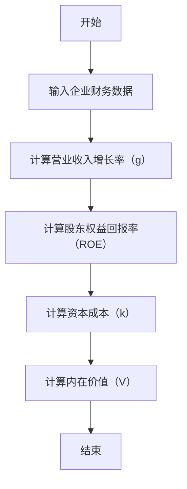
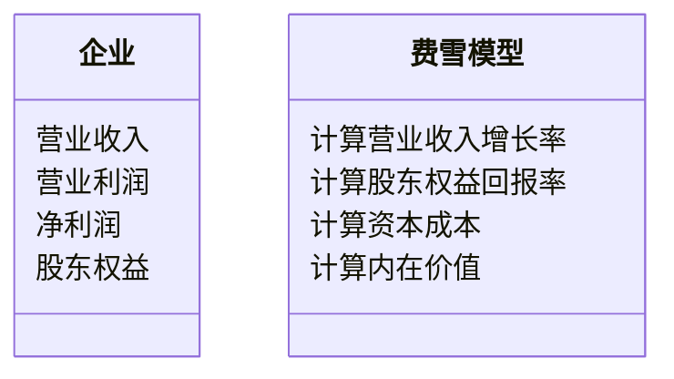
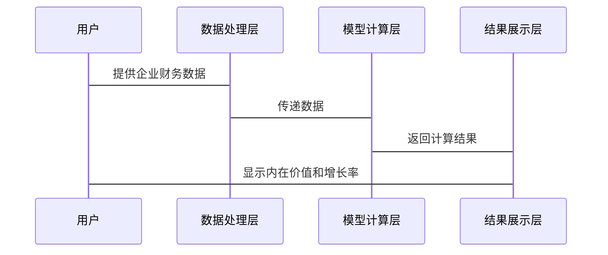

                 


# 费雪的长期增长潜力评估

> 关键词：费雪模型、长期增长潜力、内在价值、资本成本、股东权益回报率

> 摘要：本文详细阐述了费雪的长期增长潜力评估方法，从理论基础到数学模型，从系统架构设计到项目实战，全面解析了如何利用费雪模型评估企业的长期增长潜力。通过具体案例分析，展示了如何将费雪模型应用于实际投资决策中。

---

# 第1章: 费雪投资理念概述

## 1.1 费雪投资理论的核心思想

### 1.1.1 费雪的"三步走"投资策略
费雪的投资策略可以概括为“三步走”：
1. **第一步**：识别具有强大竞争优势的企业。
2. **第二步**：评估企业的长期增长潜力。
3. **第三步**：等待最佳的买入时机。

### 1.1.2 费雪投资理论的现代意义
费雪的投资理论强调长期视角和企业基本面分析，其核心思想在今天依然具有重要的现实意义：
- 企业价值的创造源于其长期的盈利能力。
- 投资者应关注企业的内在价值，而非市场的短期波动。

### 1.1.3 费雪投资理论与价值投资的区别
虽然费雪的投资理念与价值投资有相似之处，但两者在方法上存在差异：
- **价值投资**：关注安全边际，寻找价格低于内在价值的投资标的。
- **费雪投资**：更注重企业的成长性和长期盈利能力，强调买入具有强大竞争优势的企业。

---

## 1.2 长期增长潜力评估的重要性

### 1.2.1 企业长期增长的核心驱动因素
企业长期增长的驱动力包括：
1. 市场需求的增长。
2. 企业的竞争优势（如专利、品牌、成本优势）。
3. 管理层的执行力和战略规划。

### 1.2.2 投资者为何需要关注长期增长潜力
- 长期增长潜力是企业价值的核心驱动因素。
- 通过评估长期增长潜力，投资者可以识别出那些能够持续创造价值的企业。

### 1.2.3 长期增长潜力评估的误区与常见问题
- 误区：仅关注短期财务指标，忽视企业的长期竞争优势。
- 常见问题：如何量化企业的长期增长潜力？如何避免主观判断的偏差？

---

## 1.3 费雪模型的基本框架

### 1.3.1 费雪模型的基本假设
- 企业的收益将按固定增长率（g）增长。
- 企业的资本成本（k）保持不变。

### 1.3.2 费雪模型的输入变量与输出结果
- **输入变量**：
  - 营业收入增长率（g）。
  - 股东权益回报率（ROE）。
  - 资本成本（k）。
- **输出结果**：
  - 企业的内在价值（V）。

### 1.3.3 费雪模型的适用范围与局限性
- **适用范围**：
  - 适用于成长型企业，尤其是那些具有稳定增长潜力的企业。
- **局限性**：
  - 假设收益按固定增长率增长可能与实际情况不符。
  - 忽略了企业的周期性波动。

---

# 第2章: 费雪模型的核心概念与联系

## 2.1 费雪模型的核心原理

### 2.1.1 费雪模型的内在价值计算公式
$$ V = \frac{E}{k} $$
其中，E是企业的预期收益，k是资本成本。

### 2.1.2 费雪模型的营业收入增长率（g）计算公式
$$ g = \frac{\text{净利润}}{\text{营业收入}} \times \frac{\text{营业收入}}{\text{股东权益}} $$

---

## 2.2 费雪模型与企业生命周期的关系

### 2.2.1 企业生命周期的四个阶段
1. **导入期**：企业处于起步阶段，增长潜力大，但盈利能力较低。
2. **成长期**：企业进入快速成长阶段，营业收入和净利润均快速增长。
3. **成熟期**：企业增长趋于稳定，营业收入和净利润增速放缓。
4. **衰退期**：企业竞争力下降，增长潜力减弱。

### 2.2.2 不同生命周期阶段的费雪模型应用
- **成长期**：适用性较高，因为企业营业收入和净利润均快速增长。
- **成熟期**：适用性下降，因为企业增长潜力趋于稳定。

---

## 2.3 费雪模型的输入变量分析

### 2.3.1 营业收入增长率（g）
- 定义：企业营业收入的年均增长率。
- 影响因素：市场需求、竞争格局、企业战略等。

### 2.3.2 股东权益回报率（ROE）
- 定义：净利润与股东权益的比率。
- 影响因素：企业管理效率、资产周转率、杠杆率等。

### 2.3.3 资本成本（k）
- 定义：企业为获取资本所支付的成本，包括债务成本和股权成本。
- 影响因素：市场利率、企业信用评级等。

---

## 2.4 费雪模型的ER实体关系图


---

# 第3章: 费雪模型的数学模型与算法原理

## 3.1 费雪模型的数学公式推导

### 3.1.1 内在价值公式
$$ V = \frac{E}{k} $$

### 3.1.2 营业收入增长率（g）的计算
$$ g = \frac{\text{净利润}}{\text{营业收入}} \times \frac{\text{营业收入}}{\text{股东权益}} $$

---

## 3.2 费雪模型的算法流程图



---

## 3.3 费雪模型的Python实现

```python
def calculate_revenue_growth(net_income, revenue, equity):
    return (net_income / revenue) * (revenue / equity)

def fisher_model(net_income, revenue, equity, capital_cost):
    revenue_growth = calculate_revenue_growth(net_income, revenue, equity)
    intrinsic_value = (net_income / equity) / capital_cost
    return intrinsic_value

# 示例数据
net_income = 100  # 净利润（单位：万元）
revenue = 1000    # 营收（单位：万元）
equity = 500      # 股东权益（单位：万元）
capital_cost = 0.1  # 资本成本，假设为10%

intrinsic_value = fisher_model(net_income, revenue, equity, capital_cost)
print(f"内在价值: {intrinsic_value:.2f} 万元")
```

---

## 3.4 费雪模型的代码解读与分析
1. **calculate_revenue_growth**：计算营业收入增长率，公式为净利润占营业收入的比例乘以营业收入占股东权益的比例。
2. **fisher_model**：综合计算企业的内在价值，公式为净利润除以股东权益，再除以资本成本。

---

# 第4章: 系统分析与架构设计

## 4.1 系统功能设计

### 4.1.1 领域模型


### 4.1.2 系统架构设计


### 4.1.3 系统接口设计
- **输入接口**：企业财务数据（营业收入、净利润、股东权益）。
- **输出接口**：内在价值、营业收入增长率。

---

## 4.2 系统交互流程



---

# 第5章: 项目实战

## 5.1 环境安装

```bash
pip install mermaid
pip install matplotlib
```

---

## 5.2 核心实现

```python
import matplotlib.pyplot as plt

def plot_revenue_growth(revenue_growth, title):
    plt.figure(figsize=(10, 6))
    plt.plot(revenue_growth, label='营业收入增长率')
    plt.title(title)
    plt.xlabel('年份')
    plt.ylabel('增长率')
    plt.legend()
    plt.show()

# 示例数据
revenue_growth = [0.15, 0.20, 0.18, 0.16]
years = [2019, 2020, 2021, 2022]

plot_revenue_growth(revenue_growth, "营业收入增长率趋势图")
```

---

## 5.3 案例分析

### 5.3.1 案例背景
某成长型企业过去四年的财务数据如下：
- 2019年：营业收入=1000万元，净利润=100万元，股东权益=500万元。
- 2020年：营业收入=1200万元，净利润=120万元，股东权益=600万元。
- 2021年：营业收入=1300万元，净利润=130万元，股东权益=700万元。
- 2022年：营业收入=1400万元，净利润=140万元，股东权益=800万元。

### 5.3.2 模型计算
```python
def calculate_revenue_growth(net_income, revenue, equity):
    return (net_income / revenue) * (revenue / equity)

def fisher_model(net_income, revenue, equity, capital_cost):
    revenue_growth = calculate_revenue_growth(net_income, revenue, equity)
    intrinsic_value = (net_income / equity) / capital_cost
    return intrinsic_value

capital_cost = 0.1  # 假设资本成本为10%

# 2019年
iv_2019 = fisher_model(100, 1000, 500, capital_cost)
print(f"2019年内在价值: {iv_2019:.2f} 万元")

# 2020年
iv_2020 = fisher_model(120, 1200, 600, capital_cost)
print(f"2020年内在价值: {iv_2020:.2f} 万元")

# 2021年
iv_2021 = fisher_model(130, 1300, 700, capital_cost)
print(f"2021年内在价值: {iv_2021:.2f} 万元")

# 2022年
iv_2022 = fisher_model(140, 1400, 800, capital_cost)
print(f"2022年内在价值: {iv_2022:.2f} 万元")
```

---

## 5.4 项目小结
通过上述实战，我们可以看到费雪模型在实际应用中的具体操作步骤和计算过程。模型的核心在于对企业长期增长潜力的量化评估，但同时也需要结合实际市场情况和企业基本面进行综合判断。

---

# 第6章: 最佳实践、小结与注意事项

## 6.1 最佳实践
- **数据质量**：确保输入数据的准确性和完整性。
- **模型假设**：合理评估模型的假设条件，避免盲目套用。
- **持续监测**：定期更新企业财务数据，动态调整模型参数。

---

## 6.2 小结
费雪的长期增长潜力评估模型为我们提供了一种量化企业价值的重要工具。通过本文的详细讲解和实战案例，读者可以更好地理解并应用这一模型，从而做出更科学的投资决策。

---

## 6.3 注意事项
- 费雪模型适用于成长型企业，对成熟期或衰退期的企业可能不够准确。
- 模型计算结果仅供参考，实际投资需结合市场环境和企业基本面进行综合判断。

---

## 6.4 拓展阅读
- 《投资学》（作者：F·莫尼卡·史密斯）
- 《股票投资实战技巧》（作者：张振雄）

--- 

# 结语
通过本文的系统讲解，我们深入探讨了费雪的长期增长潜力评估方法，并通过具体案例展示了其在实际投资中的应用。希望本文能为投资者提供有价值的参考，帮助您更好地理解和应用这一经典投资模型。

