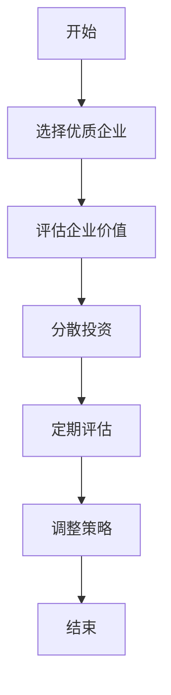

                 

# 目录大纲：《费雪的长期持股策略》

---

## 第一部分：背景介绍

### 第1章：费雪与长期持股策略概述

#### 1.1 费雪的生平与投资理念
- **1.1.1 费雪的早年经历与投资起步**  
  介绍费雪的背景，包括他的教育、职业经历以及如何进入投资领域。
  
- **1.1.2 费雪的投资哲学与核心思想**  
  探讨费雪的投资理念，如“买入优秀企业，长期持有”等核心思想。

- **1.1.3 费雪对投资界的贡献与影响**  
  分析费雪的策略对后世投资者的影响，尤其是长期持股策略的传承与发展。

#### 1.2 长期持股策略的起源与发展
- **1.2.1 长期持股策略的定义与特点**  
  解释长期持股的定义，对比短线交易的特点。

- **1.2.2 费雪如何提出并实践长期持股策略**  
  回顾费雪在实践中如何发展并应用这一策略。

- **1.2.3 长期持股策略在投资史上的地位**  
  探讨这一策略在投资历史中的重要性及其独特性。

#### 1.3 长期持股策略的核心理念
- **1.3.1 选择优质企业的原则**  
  介绍费雪选择企业的标准，如管理层质量、企业盈利能力等。

- **1.3.2 长期持有的逻辑与优势**  
  分析长期持有在市场波动中的优势，如避免交易成本、税负等。

- **1.3.3 风险控制与收益最大化的关系**  
  探讨如何通过长期持有平衡风险与收益，实现财富稳步增长。

#### 1.4 长期持股策略与短线交易的对比
- **1.4.1 短线交易的特点与风险**  
  比较短线交易的高风险、高波动性及其对投资者心理和时间的要求。

- **1.4.2 长期持股的优势与适用场景**  
  说明长期持股在市场不确定性中的稳定性及长期增长潜力。

- **1.4.3 选择合适策略的关键因素**  
  分析投资者自身情况（如资金规模、风险承受能力）对策略选择的影响。

#### 1.5 费雪投资哲学的现代意义
- **1.5.1 长期持股策略在当前市场环境下的适用性**  
  探讨在当前市场环境下，费雪策略的有效性及适应性。

- **1.5.2 投资者如何结合自身情况选择策略**  
  给出投资者根据自身情况选择合适策略的建议。

- **1.5.3 费雪策略的未来发展趋势**  
  展望长期持股策略在未来的演变与发展。

---

## 第二部分：核心概念与联系

### 第2章：长期持股策略的核心要素

#### 2.1 长期持股的定义与特点
- **2.1.1 长期持股的定义**  
  明确长期持股的定义，即长期持有优质股票，不频繁交易。

- **2.1.2 长期持股的核心特点**  
  包括选择优质企业、注重长期价值、降低交易成本等。

- **2.1.3 长期持股与其他投资策略的对比**  
  比较价值投资、成长投资等策略与长期持股的异同。

#### 2.2 长期持股策略与价值投资的联系
- **2.2.1 价值投资的定义与核心理念**  
  介绍价值投资的基本概念，即以低于内在价值的价格买入优质股票。

- **2.2.2 长期持股策略与价值投资的异同**  
  对比两者在选股标准、持有时间、交易频率等方面的异同。

- **2.2.3 费雪如何结合两者理念**  
  分析费雪如何将长期持股与价值投资相结合，形成独特的投资策略。

#### 2.3 长期持股策略的ER实体关系图
- **2.3.1 实体关系图的定义与作用**  
  介绍ER实体关系图在策略分析中的作用，用于展示策略中的关键要素及其相互关系。

- **2.3.2 费雪策略的实体关系图解析**  
  通过ER图展示长期持股策略中的关键实体，如“优质企业”、“长期持有”、“市场波动”等，及其相互关系。

- **2.3.3 实体关系图在策略中的应用**  
  说明如何利用ER图分析策略中的关键因素，帮助投资者更好地理解和应用策略。

---

## 第三部分：算法原理与数学模型

### 第3章：长期持股策略的算法原理

#### 3.1 长期持股策略的算法流程
- **3.1.1 策略的输入与输出**  
  输入包括市场数据、企业基本面信息等，输出为投资决策。

- **3.1.2 策略的主要步骤**  
  包括选股、评估、决策、监控和调整等步骤。

- **3.1.3 策略的优化与改进**  
  探讨如何根据市场变化和个人情况优化策略，如动态调整持有期限等。

#### 3.2 长期持股策略的Mermaid流程图

---

## 第四部分：数学模型

### 第4章：长期持股策略的数学模型

#### 4.1 股票估值的基本公式
- **4.1.1 市盈率（P/E）**  
  $$ P/E = \frac{股价}{每股收益} $$
- **4.1.2 市净率（P/B）**  
  $$ P/B = \frac{股价}{每股净资产} $$
- **4.1.3 内在价值（Graham公式）**  
  $$ 内在价值 = \frac{预期收益}{折现率} $$

#### 4.2 费雪策略中的数学模型
- **4.2.1 长期收益的计算**  
  $$ 长期收益 = (1 + 年收益率)^n - 1 $$
- **4.2.2 风险调整后的收益模型**  
  $$ 风险调整收益 = 收益 - 风险调整因子 $$

---

## 第五部分：系统分析与架构设计

### 第5章：长期持股策略的系统分析

#### 5.1 项目介绍
- **5.1.1 项目目标**  
  设计并实现一个基于费雪策略的投资管理系统。

#### 5.2 系统功能设计
- **5.2.1 领域模型**  
  用Mermaid类图展示系统中的主要实体及其关系，如投资者、股票、市场数据等。

#### 5.3 系统架构设计
- **5.3.1 总体架构**  
  用Mermaid架构图展示系统的主要模块，如数据采集、分析模块、投资决策模块等。

---

## 第六部分：项目实战

### 第6章：长期持股策略的实战应用

#### 6.1 环境安装
- **6.1.1 Python环境搭建**  
  安装Python、Pandas、NumPy等必要的库。

#### 6.2 核心实现
- **6.2.1 数据获取与处理**  
  代码示例：从Yahoo Finance获取股票数据并进行预处理。

#### 6.3 代码应用解读
- **6.3.1 股票筛选逻辑**  
  代码实现费雪策略中的选股标准。

#### 6.4 案例分析
- **6.4.1 投资苹果公司**  
  分析投资苹果公司的过程，展示长期持有的收益。

#### 6.5 项目小结
- **6.5.1 实战经验总结**  
  总结实战中的经验和教训，进一步优化策略。

---

## 第七部分：最佳实践与小结

### 第7章：长期持股策略的最佳实践

#### 7.1 投资心态的重要性
- **7.1.1 保持耐心与纪律**  
  强调在市场波动中保持冷静，避免情绪化决策。

#### 7.2 小结
- **7.2.1 费雪策略的核心要点回顾**  
  总结全文，强调长期持有优质企业的核心思想。

#### 7.3 注意事项
- **7.3.1 风险提示**  
  提醒投资者注意市场风险、流动性风险等。

#### 7.4 拓展阅读
- **7.4.1 推荐书籍与资源**  
  推荐相关书籍和资源，帮助读者深入学习长期持股策略。

---

## 第八部分：总结

### 第8章：长期持股策略的未来展望

#### 8.1 费雪策略的现代挑战
- **8.1.1 数字化投资的影响**  
  分析技术进步对长期持股策略的影响。

#### 8.2 投资者如何适应变化
- **8.2.1 技术与策略的结合**  
  探讨如何利用现代技术优化长期持股策略。

---

通过以上目录，我们可以系统地探讨费雪的长期持股策略，从理论到实践，帮助投资者更好地理解和应用这一策略。

