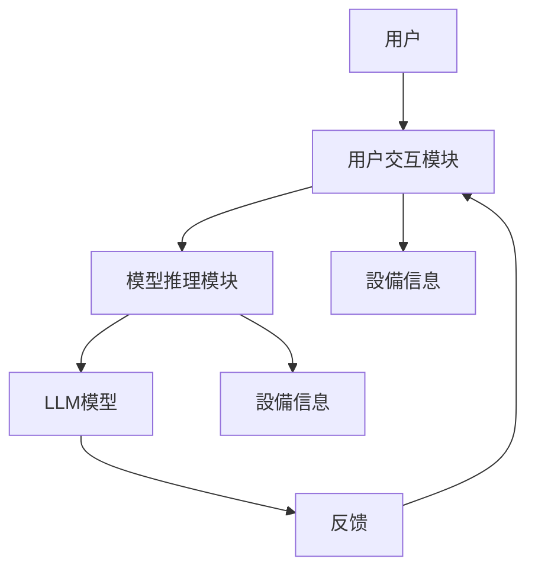

                 


# 跨平台AI Agent：LLM在多种终端设备上的部署

> 关键词：跨平台AI Agent, 大语言模型, LLM, 终端设备部署, AI系统架构, 跨平台通信

> 摘要：本文详细探讨了跨平台AI Agent在多种终端设备上的部署方法，分析了LLM在不同设备上的技术挑战，并提供了系统的架构设计和实际部署案例。通过理论与实践结合，帮助开发者理解如何在不同平台上高效部署和优化AI模型。

---

## 第1章：跨平台AI Agent的背景与概念

### 1.1 跨平台AI Agent的定义与背景

#### 1.1.1 跨平台AI Agent的定义
跨平台AI Agent是一种能够在多种终端设备上运行的智能代理，通过整合大语言模型（LLM）的能力，提供一致且高效的用户体验。它能够适应不同的硬件和操作系统环境，支持语音、文本等多种交互方式。

#### 1.1.2 跨平台AI Agent的发展背景
随着AI技术的普及，用户对智能化服务的需求日益增长。然而，设备的多样性（如手机、平板、PC、智能手表）带来了部署上的挑战。跨平台AI Agent通过统一的架构，解决了多设备兼容性问题，提升了用户体验。

#### 1.1.3 跨平台AI Agent的应用场景
- 智能助手：如 Siri、Google Assistant，支持多设备协同。
- 企业级应用：跨平台统一管理，提升效率。
- 智慧家居：通过不同设备协同工作，提供无缝服务。

---

### 1.2 LLM与AI Agent的关系

#### 1.2.1 LLM的简介
大语言模型（LLM）如GPT-3、PaLM，通过深度学习处理自然语言，具备强大的理解和生成能力。

#### 1.2.2 LLM在AI Agent中的作用
- 提供对话能力：理解和生成自然语言，实现人机交互。
- 支持多语言：适应全球用户需求。
- 适应不同平台：通过调整模型参数，适配不同设备性能。

#### 1.2.3 跨平台部署的意义
- 扩展设备生态：提升AI Agent的可用性。
- 提高用户粘性：一致的体验增强用户满意度。
- 优化资源利用：根据不同设备特点优化性能。

---

## 第2章：LLM的核心原理与特点

### 2.1 LLM的核心原理

#### 2.1.1 深度学习与神经网络基础
神经网络通过多层处理，从数据中学习特征，生成有意义的输出。

#### 2.1.2 Transformer模型的工作原理
- 编码器：将输入序列转换为上下文表示。
- 解码器：生成目标序列，如自然语言文本。

#### 2.1.3 注意力机制（Attention）
通过权重分配，模型关注重要词汇，提升理解和生成能力。

#### 2.1.4 梯度下降与反向传播
优化算法调整参数，最小化预测误差。

#### 2.1.5 参数量与模型复杂度
模型参数越多，能力越强，但计算需求增加。

### 2.2 LLM的主要特点

#### 2.2.1 大规模参数量
- 参数量从百万到万亿，提升模型能力。
- 通过训练大量数据，掌握多种语言和任务。

#### 2.2.2 强大的上下文理解能力
- 理解上下文关系，生成连贯回答。
- 通过注意力机制，关注关键信息。

#### 2.2.3 多语言支持与适应性
- 通过多语言训练，支持多种语言。
- 通过参数调整，适应不同应用场景。

---

## 第3章：跨平台部署的技术挑战与解决方案

### 3.1 技术挑战

#### 3.1.1 设备多样性
- 硬件性能差异：从高端手机到低端设备。
- 操作系统差异：iOS、Android、Windows、macOS。

#### 3.1.2 网络环境复杂性
- 离线与在线模式切换。
- 网络延迟影响用户体验。

#### 3.1.3 本地与云端结合
- 本地推理速度快，但资源有限。
- 云端计算能力强，但依赖网络。

### 3.2 解决方案

#### 3.2.1 模型优化技术
- 模型压缩：减少参数量，降低计算需求。
- 知识蒸馏：通过教师模型指导学生模型，减少参数量。

#### 3.2.2 跨平台通信
- 使用通用协议：如HTTP、WebSocket，确保兼容性。
- 跨平台SDK：提供统一接口，简化开发。

#### 3.2.3 性能监控与优化
- 监控设备性能：CPU、内存、网络使用情况。
- 动态调整策略：根据设备性能优化模型运行。

---

## 第4章：系统架构设计

### 4.1 系统功能模块

#### 4.1.1 用户交互模块
- 支持文本、语音、手势等多种交互方式。
- 根据设备能力调整交互方式。

#### 4.1.2 模型推理模块
- 支持多种设备的计算能力。
- 根据设备性能优化推理速度。

#### 4.1.3 跨平台通信模块
- 统一接口处理不同设备的通信需求。
- 支持离线和在线模式切换。

### 4.2 系统架构图



---

## 第5章：算法实现细节

### 5.1 算法流程

#### 5.1.1 模型训练流程
- 数据预处理：清洗和标注数据。
- 模型训练：使用大规模数据训练LLM。
- 超参数调优：优化学习率、批次大小等参数。

#### 5.1.2 模型推理流程
- 接收输入：解析用户输入。
- 生成响应：基于模型生成回答。
- 返回结果：将结果传递给交互模块。

### 5.2 代码实现

#### 5.2.1 LLM模型加载

```python
import torch
from transformers import AutoTokenizer, AutoModelForCausalLM

# 加载预训练模型和分词器
model_name = "gpt2"
tokenizer = AutoTokenizer.from_pretrained(model_name)
model = AutoModelForCausalLM.from_pretrained(model_name)
```

#### 5.2.2 模型推理

```python
def generate_response(prompt):
    inputs = tokenizer.encode(prompt, return_tensors="pt")
    outputs = model.generate(inputs, max_length=50, num_beams=5, temperature=0.7)
    response = tokenizer.decode(outputs[0], skip_special_tokens=True)
    return response
```

---

## 第6章：项目实战与案例分析

### 6.1 项目背景与目标

#### 6.1.1 项目背景
- 开发一个支持多设备的AI助手。
- 提供一致的用户体验。

#### 6.1.2 项目目标
- 实现跨平台部署。
- 优化模型性能。

### 6.2 项目实施过程

#### 6.2.1 系统设计
- 分模块设计：用户交互、模型推理、通信模块。
- 使用跨平台框架：如React Native开发移动端。

#### 6.2.2 实施步骤
- 环境搭建：安装Python、框架依赖。
- 模块开发：开发各功能模块。
- 测试优化：测试各设备上的性能和用户体验。

---

## 第7章：总结与展望

### 7.1 总结

跨平台AI Agent通过整合LLM技术，解决了多设备部署的难题。通过优化模型和通信协议，提升了用户体验和系统性能。

### 7.2 展望

未来，随着技术进步，AI Agent将更加智能化，支持更多设备和场景。模型优化和边缘计算的发展将进一步提升其性能和可用性。

### 7.3 注意事项

- 确保数据安全和隐私保护。
- 优化模型以适应不同设备性能。
- 提供良好的用户反馈机制，及时修复问题。

---

通过本文的详细讲解，读者可以系统地了解跨平台AI Agent的部署方法和实现细节，为实际开发提供指导和参考。

