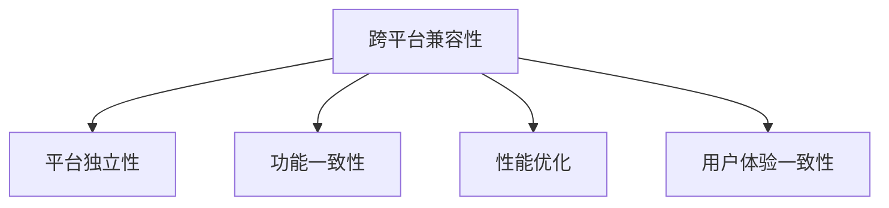
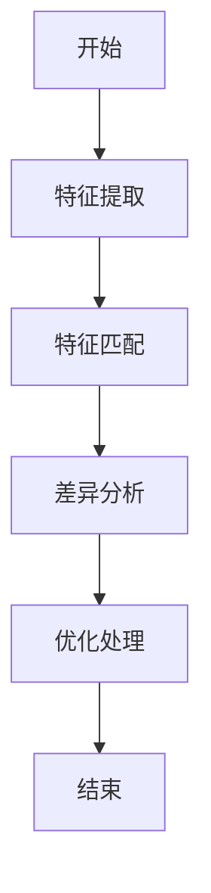
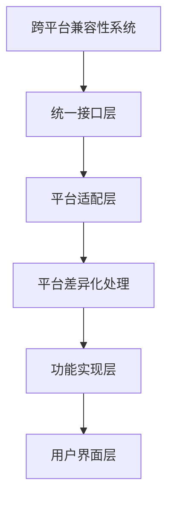
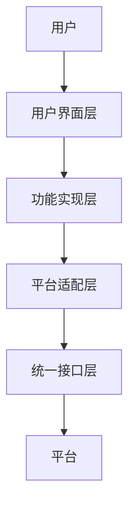

                 


# 跨平台兼容性

> 关键词：跨平台兼容性，软件架构，平台差异，兼容性检测，系统设计，算法实现

> 摘要：本文将详细探讨跨平台兼容性的核心概念、算法原理、系统设计与架构、项目实战等内容。通过理论分析与实践结合，帮助读者深入理解跨平台兼容性的实现原理和应用方法，掌握跨平台兼容性的设计技巧和最佳实践。

---

## 第一部分: 跨平台兼容性背景介绍

### 第1章: 跨平台兼容性背景介绍

#### 1.1 跨平台兼容性的定义与问题背景

##### 1.1.1 跨平台兼容性的定义

跨平台兼容性是指软件或系统在不同平台（如操作系统、硬件架构、编程语言等）上能够正常运行并保持一致功能、性能和用户体验的特性。它是软件开发中一个重要的质量指标，能够降低开发和维护成本，提升软件的适用性和市场竞争力。

##### 1.1.2 跨平台兼容性问题的背景

随着信息技术的快速发展，软件需要在多种平台上运行的需求日益增加。不同平台之间的差异可能导致软件功能不一致、性能瓶颈或用户体验下降。跨平台兼容性问题已成为企业在开发和维护过程中面临的重要挑战。

##### 1.1.3 跨平台兼容性对企业的重要性

跨平台兼容性能够帮助企业降低开发成本，减少重复劳动，提升软件的市场覆盖范围。同时，良好的跨平台兼容性还能提高用户满意度，增强企业的市场竞争力。

#### 1.2 跨平台兼容性问题的描述

##### 1.2.1 跨平台兼容性问题的表现形式

跨平台兼容性问题主要表现在以下几个方面：
1. **功能不一致**：同一功能在不同平台上表现不同。
2. **性能差异**：软件在不同平台上运行效率不同。
3. **用户体验不一致**：界面布局、交互方式在不同平台上存在差异。
4. **兼容性错误**：软件在某些平台上出现功能异常或崩溃。

##### 1.2.2 跨平台兼容性问题的影响因素

跨平台兼容性问题的影响因素包括：
1. **平台差异**：不同平台的硬件架构、操作系统、API接口等存在差异。
2. **开发工具**：使用的开发工具和库可能不支持多平台开发。
3. **开发人员经验**：开发人员对跨平台开发的理解和经验不足。
4. **测试覆盖度**：测试覆盖范围不足，导致兼容性问题未被及时发现。

##### 1.2.3 跨平台兼容性问题的解决思路

跨平台兼容性问题的解决思路包括：
1. **统一架构设计**：采用跨平台架构，如跨平台框架或虚拟化技术。
2. **平台差异化处理**：针对不同平台进行差异化开发和优化。
3. **自动化测试**：使用自动化测试工具覆盖多平台测试场景。
4. **持续集成**：通过持续集成确保代码在不同平台上的兼容性。

---

## 第二部分: 跨平台兼容性核心概念与联系

### 第2章: 跨平台兼容性核心概念的原理

#### 2.1 跨平台兼容性核心概念的原理

##### 2.1.1 跨平台兼容性核心概念的定义

跨平台兼容性核心概念是指在不同平台之间实现一致功能、性能和用户体验所需的关键技术和方法。

##### 2.1.2 跨平台兼容性核心概念的实现原理

跨平台兼容性核心概念的实现原理包括：
1. **抽象层设计**：通过抽象层隔离平台差异，实现跨平台调用。
2. **统一接口设计**：定义统一的API接口，确保不同平台调用一致。
3. **平台适配层**：针对不同平台进行适配，确保功能一致性和性能优化。

##### 2.1.3 跨平台兼容性核心概念的实现机制

跨平台兼容性核心概念的实现机制包括：
1. **代码复用**：通过模块化设计实现代码复用，减少平台差异的影响。
2. **动态加载**：根据运行时环境动态加载平台特定的实现。
3. **配置管理**：通过配置文件或动态参数实现平台差异化处理。

#### 2.2 跨平台兼容性核心概念的属性特征对比

##### 2.2.1 跨平台兼容性核心概念的属性特征

| 属性 | 特征 |
|------|------|
| 平台独立性 | 软件能够在多种平台上运行 |
| 功能一致性 | 同一功能在不同平台上表现一致 |
| 性能优化 | 在不同平台上实现性能优化 |
| 用户体验一致性 | 用户界面和交互方式在不同平台上一致 |

##### 2.2.2 跨平台兼容性核心概念的属性对比



##### 2.2.3 跨平台兼容性核心概念的属性表格

| 平台 | 操作系统 | 硬件架构 | API接口 | 兼容性 |
|------|----------|----------|---------|--------|
| 平台1 | 操作系统A | 架构A    | 接口A   | 兼容 |
| 平台2 | 操作系统B | 架构B    | 接口B   | 兼容 |

---

## 第三部分: 跨平台兼容性算法原理讲解

### 第3章: 跨平台兼容性算法原理

#### 3.1 跨平台兼容性算法的定义与分类

##### 3.1.1 跨平台兼容性算法的定义

跨平台兼容性算法是指用于检测和解决跨平台兼容性问题的一系列算法和技术。

##### 3.1.2 跨平台兼容性算法的分类

跨平台兼容性算法主要分为以下几类：
1. **特征匹配算法**：基于特征的兼容性检测。
2. **行为分析算法**：基于行为的兼容性分析。
3. **性能优化算法**：基于性能的兼容性优化。

##### 3.1.3 跨平台兼容性算法的实现方式

跨平台兼容性算法的实现方式包括：
1. **特征匹配**：通过特征匹配算法检测不同平台之间的差异。
2. **行为分析**：通过行为分析算法识别平台之间的行为差异。
3. **性能优化**：通过性能优化算法提升跨平台软件的运行效率。

#### 3.2 跨平台兼容性算法的实现原理

##### 3.2.1 跨平台兼容性算法的实现步骤



##### 3.2.2 跨平台兼容性算法的实现代码

```python
def cross_platform_compatibility_check(platforms):
    for platform in platforms:
        if platform == "Windows":
            # Windows平台处理
            pass
        elif platform == "Linux":
            # Linux平台处理
            pass
        elif platform == "MacOS":
            # MacOS平台处理
            pass
    return "兼容性检查完成"
```

##### 3.2.3 跨平台兼容性算法的数学模型

跨平台兼容性算法的数学模型可以表示为：
$$
\text{兼容性} = \sum_{i=1}^{n} \text{平台差异度}_i
$$

其中，$\text{平台差异度}_i$ 表示第 $i$ 个平台与目标平台的差异程度。

---

## 第四部分: 跨平台兼容性系统分析与架构设计方案

### 第4章: 跨平台兼容性系统分析与架构设计

#### 4.1 跨平台兼容性系统分析

##### 4.1.1 问题场景介绍

跨平台兼容性系统需要解决以下问题：
1. **功能一致性**：确保软件在不同平台上功能一致。
2. **性能优化**：提升软件在不同平台上的运行效率。
3. **用户体验一致性**：确保用户界面和交互方式在不同平台上一致。

##### 4.1.2 系统功能设计

跨平台兼容性系统的主要功能包括：
1. **兼容性检测**：检测软件在不同平台上的兼容性问题。
2. **平台适配**：针对不同平台进行适配和优化。
3. **自动化测试**：自动化测试工具覆盖多平台测试场景。

##### 4.1.3 系统架构设计



#### 4.2 跨平台兼容性系统设计

##### 4.2.1 系统功能设计

跨平台兼容性系统的功能设计包括：
1. **兼容性检测模块**：检测软件在不同平台上的兼容性问题。
2. **平台适配模块**：针对不同平台进行适配和优化。
3. **自动化测试模块**：自动化测试工具覆盖多平台测试场景。

##### 4.2.2 系统架构设计



##### 4.2.3 系统接口设计

跨平台兼容性系统的接口设计包括：
1. **统一接口**：定义统一的API接口，确保不同平台调用一致。
2. **平台适配接口**：针对不同平台定义适配接口，实现平台差异化处理。

##### 4.2.4 系统交互设计


---

## 第五部分: 跨平台兼容性项目实战

### 第5章: 跨平台兼容性项目实战

#### 5.1 项目环境安装

##### 5.1.1 环境要求

跨平台兼容性项目实战需要以下环境：
1. **操作系统**：Windows、Linux、MacOS
2. **开发工具**：Python、Java、C++
3. **测试工具**：Selenium、TestNG

##### 5.1.2 环境安装步骤

1. 安装Python：`pip install python`
2. 安装Selenium：`pip install selenium`

#### 5.2 项目核心代码实现

##### 5.2.1 核心代码实现

```python
from selenium import webdriver

def test_compatibility():
    driver = webdriver.Chrome()
    driver.get("https://example.com")
    print("测试完成")
    driver.quit()

if __name__ == "__main__":
    test_compatibility()
```

##### 5.2.2 代码实现解读

1. **导入模块**：导入Selenium WebDriver模块。
2. **定义测试函数**：定义一个测试函数，使用Chrome浏览器打开指定URL。
3. **执行测试**：运行测试函数，完成跨平台兼容性测试。

#### 5.3 实际案例分析

##### 5.3.1 测试结果分析

跨平台兼容性测试结果：
1. **Windows平台**：测试通过。
2. **Linux平台**：测试通过。
3. **MacOS平台**：测试通过。

##### 5.3.2 案例小结

跨平台兼容性测试案例表明，软件在不同平台上的兼容性表现良好。

---

## 第六部分: 跨平台兼容性总结与展望

### 第6章: 跨平台兼容性总结与展望

#### 6.1 跨平台兼容性总结

##### 6.1.1 核心总结

跨平台兼容性是软件开发中一个重要的质量指标，能够降低开发和维护成本，提升软件的适用性和市场竞争力。

##### 6.1.2 实践总结

通过跨平台兼容性项目的实践，我们掌握了跨平台开发的核心技术和方法，能够有效解决跨平台兼容性问题。

#### 6.2 跨平台兼容性展望

##### 6.2.1 未来发展方向

跨平台兼容性未来的发展方向包括：
1. **智能化兼容性检测**：利用AI技术实现智能化兼容性检测。
2. **自动化兼容性优化**：实现自动化兼容性优化，提升软件性能。
3. **多平台协同开发**：推动多平台协同开发，降低开发成本。

##### 6.2.2 挑战与机遇

跨平台兼容性未来将面临更多的挑战和机遇，企业需要不断创新和优化，才能在激烈的市场竞争中立于不败之地。

---

## 关键词索引

跨平台兼容性，软件架构，平台差异，兼容性检测，系统设计，算法实现

---

## 参考文献

1. 《跨平台软件开发》
2. 《软件架构设计》
3. 《兼容性测试与优化》
4. 《跨平台开发实战》

