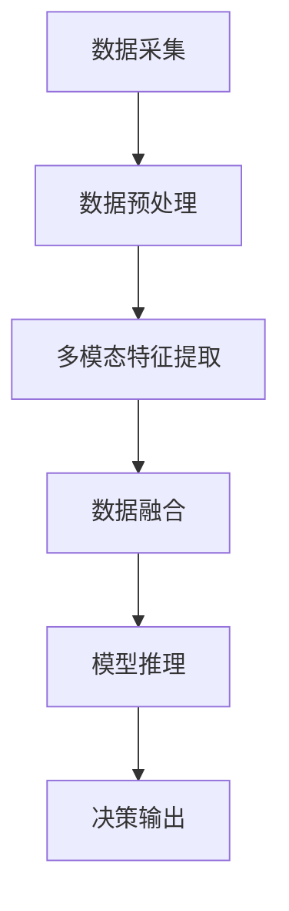
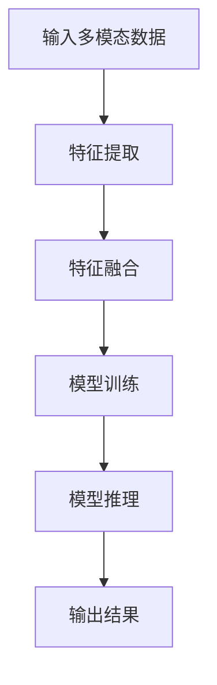
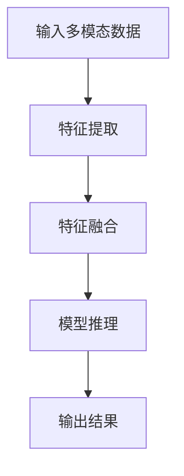
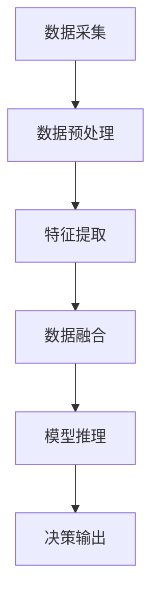

                 


# 跨感官AI Agent：融合LLM与多模态感知输入

---

## 关键词

- 跨感官AI
- LLM
- 多模态感知
- 数据融合
- AI代理

---

## 摘要

本文探讨了跨感官AI Agent的定义、问题背景、融合方法、系统设计和实际应用。通过结合大语言模型（LLM）和多模态感知输入，跨感官AI Agent能够处理多种感官数据，提升AI的感知和决策能力。文章详细分析了跨感官数据融合的原理、算法实现、系统架构，并通过实际案例展示了如何构建和应用跨感官AI Agent。

---

# 第一部分：跨感官AI Agent的背景与核心概念

## 第1章：跨感官AI Agent的背景与问题描述

### 1.1 跨感官AI Agent的定义与背景

#### 1.1.1 什么是跨感官AI Agent
跨感官AI Agent是一种能够同时处理和融合多种感官数据（如视觉、听觉、触觉等）的人工智能代理。它通过整合不同感官的信息，提供更全面的感知和决策能力。

#### 1.1.2 跨感官AI Agent的背景与发展趋势
随着AI技术的快速发展，单一感官数据的处理已无法满足复杂场景的需求。跨感官AI Agent通过融合多模态数据，成为AI研究的热点方向，广泛应用于机器人、自动驾驶、医疗等领域。

#### 1.1.3 跨感官AI Agent的核心问题与挑战
- 多模态数据的异构性：不同感官数据的格式和特征差异大。
- 数据融合的复杂性：如何有效整合多模态数据，提取有用信息。
- 实时性与效率：在实时应用中，如何快速处理多模态数据。

### 1.2 跨感官AI Agent的问题描述

#### 1.2.1 多模态数据融合的难点
- 数据对齐：不同感官数据的时间和空间对齐问题。
- 信息冗余：同一信息在不同感官中的重复表示。
- 信息缺失：某些感官数据可能缺失，影响整体感知。

#### 1.2.2 跨感官数据处理的复杂性
- 多模态数据的多样性：包括图像、文本、语音等多种类型。
- 数据的动态变化：实时场景中数据不断变化，需要快速响应。
- 跨感官数据的关联性：如何建立不同感官数据之间的关联。

#### 1.2.3 跨感官AI Agent的实际应用场景
- 智能机器人：通过视觉和听觉感知环境，执行复杂任务。
- 自动驾驶：融合视觉、雷达和GPS数据，提高驾驶安全性。
- 健康监测：通过多模态数据监测患者健康状况，辅助诊断。

---

## 第2章：大语言模型（LLM）与多模态感知的融合

### 2.1 大语言模型（LLM）的核心原理

#### 2.1.1 LLM的基本概念与工作原理
大语言模型是一种基于深度学习的自然语言处理模型，能够理解和生成人类语言。其核心是通过大量数据训练，学习语言的分布特征，生成有意义的文本。

#### 2.1.2 LLM的训练方法与特点
- 基于Transformer架构：使用自注意力机制，捕捉上下文信息。
- 预训练-微调模式：先在大规模通用数据上预训练，再在特定任务上微调。
- 模型规模：参数量大，计算资源需求高。

#### 2.1.3 LLM在自然语言处理中的应用
- 文本生成：自动撰写文章、对话系统。
- 机器翻译：跨语言交流。
- 情感分析：判断文本情感倾向。

### 2.2 多模态感知的核心原理

#### 2.2.1 多模态数据的定义与分类
多模态数据指的是来自不同感官的多种数据类型，如图像（视觉）、音频（听觉）、文本（语言）等。

#### 2.2.2 多模态感知的关键技术
- 多模态特征提取：将不同感官数据转化为统一的特征表示。
- 多模态数据融合：将不同特征进行融合，提升感知能力。
- 多模态学习模型：设计能够处理多模态数据的深度学习模型。

#### 2.2.3 多模态感知在AI Agent中的作用
- 提供更全面的环境感知。
- 增强AI的决策能力。
- 支持复杂场景下的任务执行。

### 2.3 跨感官数据融合的原理与方法

#### 2.3.1 跨感官数据融合的定义与目标
跨感官数据融合是指将来自不同感官的数据进行整合，以获得更准确、全面的感知信息。

#### 2.3.2 跨感官数据融合的主流方法
- 基于特征的方法：将不同模态的特征向量进行融合。
- 基于模型的方法：构建跨模态模型，直接处理多模态数据。
- 基于注意力机制的方法：动态调整不同模态的重要性。

#### 2.3.3 跨感官数据融合的挑战与解决方案
- 数据异构性：通过特征对齐或共享表示解决。
- 计算效率：优化算法，降低计算复杂度。
- 实时性：采用轻量级模型或分布式计算。

---

## 第3章：跨感官AI Agent的核心概念与联系

### 3.1 跨感官AI Agent的核心概念

#### 3.1.1 跨感官数据融合的实体关系图
通过ER图展示跨感官数据融合的核心实体及其关系。

```mermaid
erd
  entity 跨感官数据融合 {
    <图片>
  }
```

#### 3.1.2 跨感官AI Agent的系统架构图
展示跨感官AI Agent的整体架构，包括数据采集、融合、处理和决策模块。



### 3.2 跨感官AI Agent的核心算法原理

#### 3.2.1 跨感官数据融合的算法流程图



---

## 第4章：跨感官AI Agent的算法实现

### 4.1 跨感官数据融合的数学模型

#### 4.1.1 跨感官数据融合的数学表达
假设我们有来自视觉和听觉的特征向量$V$和$A$，融合后的特征向量$F$可以表示为：
$$
F = f(V, A)
$$
其中$f$是一个融合函数，如加权和：
$$
F = \alpha V + (1-\alpha) A
$$

#### 4.1.2 模型训练的损失函数
使用交叉熵损失函数进行训练：
$$
L = -\frac{1}{N}\sum_{i=1}^{N} y_i \log p_i + (1 - y_i)\log(1 - p_i)
$$
其中$y_i$是真实标签，$p_i$是模型预测概率。

#### 4.1.3 模型推理的算法流程



---

## 第5章：跨感官AI Agent的系统设计

### 5.1 系统架构设计

#### 5.1.1 系统功能设计
- 数据采集模块：获取多模态数据。
- 数据预处理模块：清洗和标准化数据。
- 特征提取模块：提取多模态特征。
- 数据融合模块：融合多模态特征。
- 模型推理模块：进行预测和决策。

#### 5.1.2 系统架构图



---

## 第6章：跨感官AI Agent的项目实战

### 6.1 项目背景与目标

#### 6.1.1 项目背景
本项目旨在构建一个能够处理视觉和听觉数据的跨感官AI Agent，用于智能助手场景。

### 6.2 项目实现

#### 6.2.1 环境安装
- Python 3.8+
- PyTorch 1.9+
- Transformers库
- Mermaid工具

#### 6.2.2 核心代码实现

```python
import torch
from transformers import AutoTokenizer, AutoModelForMaskedLM
import numpy as np

class CrossModalFuser:
    def __init__(self, visual_dim, audio_dim):
        self.visual_dim = visual_dim
        self.audio_dim = audio_dim
        self.fc = torch.nn.Linear(visual_dim + audio_dim, 1)

    def forward(self, visual_features, audio_features):
        fused = torch.cat((visual_features, audio_features), dim=-1)
        output = self.fc(fused)
        return output

# 示例用法
visual_features = torch.randn(1, 512)
audio_features = torch.randn(1, 256)
fuser = CrossModalFuser(512, 256)
output = fuser(visual_features, audio_features)
print(output.shape)  # 输出形状为 (1, 1)
```

---

## 第7章：总结与展望

### 7.1 小结
跨感官AI Agent通过融合多模态数据，显著提升了AI的感知和决策能力。本文详细探讨了其核心概念、算法实现和系统设计，并通过项目实战展示了其应用潜力。

### 7.2 注意事项
- 数据预处理和特征提取是关键步骤，需精心设计。
- 模型训练需选择合适的优化策略和硬件资源。
- 实际应用中需考虑实时性和计算效率。

### 7.3 拓展阅读
- 多模态数据融合的最新研究。
- 基于Transformer的多模态模型。
- 跨感官AI在机器人和自动驾驶中的应用。

---

# 结语

跨感官AI Agent作为AI技术的重要发展方向，正在改变我们处理复杂场景的方式。通过融合多模态数据，AI代理将变得更加智能和实用，未来将在更多领域发挥重要作用。

