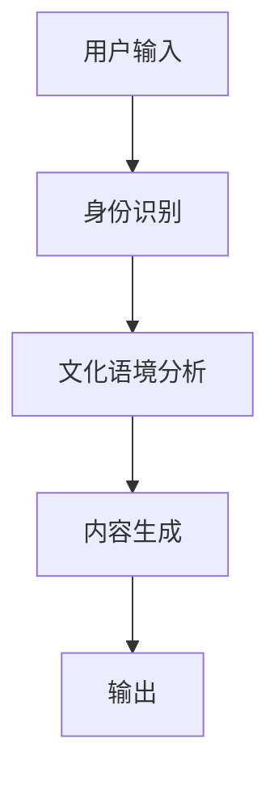
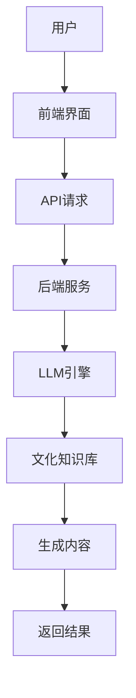
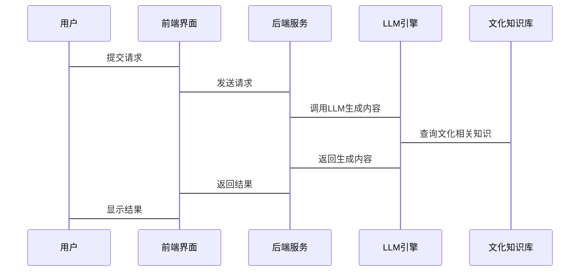

                 

# 跨文化交流AI Agent：增强LLM的文化敏感度

> 关键词：跨文化交流、AI Agent、LLM、文化敏感度、自然语言处理、机器学习、知识图谱

> 摘要：  
本文深入探讨了跨文化交流AI Agent的设计与实现，重点分析了如何通过增强LLM（大型语言模型）的文化敏感度来提升AI Agent在跨文化场景下的交互能力。文章从背景、技术原理、系统架构到实际应用，详细阐述了跨文化交流AI Agent的核心概念、算法实现及应用场景，最后通过实际案例展示了如何通过技术手段解决跨文化交流中的文化敏感性问题。

---

# 目录

1. [跨文化交流AI Agent的背景与核心概念](#跨文化交流AI-Agent的背景与核心概念)
   - 1.1 跨文化交流的定义与重要性
   - 1.2 AI Agent的基本概念
   - 1.3 跨文化交流AI Agent的核心功能

2. [文化敏感性与LLM的关系](#文化敏感性与LLM的关系)
   - 2.1 文化敏感性的定义与属性
   - 2.2 LLM的基本原理与局限性
   - 2.3 跨文化交流中LLM的挑战

3. [增强LLM文化敏感度的技术方法](#增强LLM文化敏感度的技术方法)
   - 3.1 文化语料库的构建
   - 3.2 文化知识图谱的构建与应用
   - 3.3 基于注意力机制的跨文化对话模型

4. [跨文化交流AI Agent的系统架构与实现](#跨文化交流AI-Agent的系统架构与实现)
   - 4.1 系统功能设计
   - 4.2 系统架构设计
   - 4.3 系统接口与交互流程

5. [跨文化交流AI Agent的实际应用与案例分析](#跨文化交流AI-Agent的实际应用与案例分析)
   - 5.1 商业场景中的应用
   - 5.2 教育场景中的应用
   - 5.3 社交媒体中的应用

6. [总结与未来展望](#总结与未来展望)
   - 6.1 跨文化交流AI Agent的总结
   - 6.2 未来的技术发展趋势
   - 6.3 对开发者与研究者的建议

---

## 第1章: 跨文化交流AI Agent的背景与核心概念

### 1.1 跨文化交流的定义与重要性

#### 1.1.1 跨文化交流的定义  
跨文化交流是指不同文化背景的人们之间通过语言、行为、符号等方式进行信息交换的过程。它强调理解和尊重不同文化之间的差异，避免因文化冲突导致的误解。

#### 1.1.2 跨文化交流的核心要素  
- 语言：语言是跨文化交流的核心工具，不同语言背后承载着不同的文化内涵。  
- 行为：非语言行为（如手势、表情）在跨文化中同样重要，可能因文化差异产生歧义。  
- 价值观：不同文化对同一事物的看法可能截然不同，例如时间观念、个人与集体的关系等。  

#### 1.1.3 跨文化交流在AI技术中的应用  
随着全球化的发展，跨文化交流的需求日益增加。AI技术，特别是自然语言处理（NLP）和机器学习（ML），为跨文化交流提供了新的可能性。例如，AI Agent可以通过分析用户的语言和行为，实时调整其响应以适应不同文化背景的用户。

### 1.2 AI Agent的基本概念

#### 1.2.1 AI Agent的定义  
AI Agent（智能体）是指能够感知环境并采取行动以实现目标的实体。它可以是一个软件程序，也可以是一个物理设备，核心在于其智能性和自主性。

#### 1.2.2 AI Agent的核心功能  
- 感知环境：通过传感器或数据输入获取信息。  
- 判断与决策：基于获取的信息进行推理和决策。  
- 行动：根据决策执行操作，例如生成自然语言回复、调整行为模式等。  

#### 1.2.3 跨文化交流AI Agent的特点  
- 多语言支持：能够理解和生成多种语言。  
- 文化适应性：能够根据用户的文化背景调整其表达方式和行为模式。  
- 实时响应：能够在短时间内生成符合文化敏感性的回复。  

---

## 第2章: 文化敏感性与LLM的关系

### 2.1 文化敏感性的定义与属性

#### 2.1.1 文化敏感性的定义  
文化敏感性是指AI系统在处理跨文化事务时，能够识别、理解和尊重不同文化背景的能力。具备文化敏感性的系统能够避免因文化差异导致的误解或冲突。

#### 2.1.2 文化敏感性的核心属性  
- 文化识别能力：能够识别用户的文化背景。  
- 文化适应能力：能够根据文化背景调整系统的行为或输出。  
- 文化理解能力：能够理解特定文化中的隐含含义和非语言信号。  

### 2.2 LLM的基本原理与局限性

#### 2.2.1 LLM的基本原理  
LLM（Large Language Model）是一种基于深度学习的自然语言处理模型，通过大量语料库的训练，能够生成与上下文相关的自然语言文本。其核心是通过概率模型预测下一个可能的单词。

#### 2.2.2 LLM在跨文化交流中的局限性  
- 文化偏见：LLM可能因为训练语料库的偏差而产生文化偏见。  
- 文化适应性不足：LLM通常难以理解特定文化中的隐含规则和非语言信号。  
- 实时调整能力有限：LLM难以根据实时反馈调整其生成内容。  

### 2.3 跨文化交流中LLM的挑战

#### 2.3.1 語言差异的影响  
不同语言的语法结构、词汇选择和文化内涵差异可能影响LLM的生成效果。例如，中文和英文在时间表达上差异显著，LLM需要能够识别这些差异。

#### 2.3.2 文化语境的理解  
LLM需要理解特定文化背景下的语境，例如在某些文化中，直接拒绝可能被视为失礼，而在其他文化中则可能被视为坦率。  

#### 2.3.3 用户文化背景的动态变化  
用户的文化背景可能因时间、地点或情境的变化而有所不同，LLM需要具备动态适应能力。  

---

## 第3章: 增强LLM文化敏感度的技术方法

### 3.1 文化语料库的构建

#### 3.1.1 文化语料库的定义  
文化语料库是指专门用于训练LLM的文化相关语料库，包含不同文化背景下的语言数据、文化规则和文化案例。

#### 3.1.2 文化语料库的构建方法  
- 数据收集：从不同文化背景的用户中收集真实对话数据。  
- 数据标注：标注每条数据的文化属性，例如文化背景、情感倾向、语境等。  
- 数据清洗：去除低质量或不相关的数据。  

#### 3.1.3 文化语料库的应用  
通过将文化语料库与通用语料库结合训练，可以提升LLM在跨文化交流中的表现。  

### 3.2 文化知识图谱的构建与应用

#### 3.2.1 文化知识图谱的定义  
文化知识图谱是一种以知识图谱形式表示的文化信息数据库，包含文化背景、文化规则、文化案例等信息。

#### 3.2.2 文化知识图谱的构建方法  
- 数据抽取：从文本、图像等多模态数据中提取文化相关信息。  
- 数据关联：建立文化信息之间的关联关系。  
- 数据推理：通过推理引擎生成新的文化知识。  

#### 3.2.3 文化知识图谱的应用  
LLM可以通过查询文化知识图谱，动态调整其生成内容的文化敏感性。  

### 3.3 基于注意力机制的跨文化对话模型

#### 3.3.1 注意力机制的定义  
注意力机制是一种用于模型在生成文本时关注输入数据中重要部分的技术，常用于机器翻译和对话生成。

#### 3.3.2 跨文化对话模型的设计  
- 在LLM的生成过程中，引入文化相关的注意力权重，优先关注与用户文化背景相关的内容。  
- 通过多模态输入（如用户的位置、时间、行为数据）动态调整注意力权重。  

#### 3.3.3 跨文化对话模型的优势  
- 提高生成内容的文化相关性。  
- 减少文化偏见的发生。  
- 提升用户体验的满意度。  

---

## 第4章: 跨文化交流AI Agent的系统架构与实现

### 4.1 系统功能设计

#### 4.1.1 系统功能模块  
- 用户身份识别：识别用户的文化背景。  
- 文化语境分析：分析用户的语境和情感倾向。  
- 文化敏感性调整：根据文化背景调整生成内容。  

#### 4.1.2 功能流程图  

### 4.2 系统架构设计

#### 4.2.1 系统架构图  

#### 4.2.2 核心组件  
- 前端界面：负责与用户的交互。  
- 后端服务：处理用户的请求并调用LLM引擎。  
- LLM引擎：生成符合文化敏感性的文本内容。  
- 文化知识库：存储文化相关知识，供LLM引擎调用。  

### 4.3 系统接口与交互流程

#### 4.3.1 系统接口设计  
- 用户输入接口：支持多语言输入。  
- 系统输出接口：支持多语言输出，并提供文化适应性调整选项。  

#### 4.3.2 交互流程图  

---

## 第5章: 跨文化交流AI Agent的实际应用与案例分析

### 5.1 商业场景中的应用

#### 5.1.1 案例背景  
某跨国公司需要与来自不同文化背景的客户进行沟通，希望通过AI Agent提升其客户服务质量。

#### 5.1.2 系统实现  
- 前端界面支持多语言切换。  
- 后端服务集成文化知识库，提供文化适应性调整功能。  

#### 5.1.3 应用效果  
- 提高客户满意度。  
- 降低因文化差异导致的误解。  

### 5.2 教育场景中的应用

#### 5.2.1 案例背景  
某在线教育平台希望为不同文化背景的学生提供个性化的学习支持。

#### 5.2.2 系统实现  
- LLM引擎集成文化知识图谱，支持多语言教学内容生成。  
- 系统根据学生文化背景动态调整教学内容。  

#### 5.2.3 应用效果  
- 提高学生的学习效果。  
- 增强学生对不同文化的理解。  

### 5.3 社交媒体中的应用

#### 5.3.1 案例背景  
某社交媒体平台希望为用户提供跨文化社交功能。

#### 5.3.2 系统实现  
- 前端界面支持用户选择文化背景。  
- LLM引擎根据用户文化背景生成文化敏感性内容。  

#### 5.3.3 应用效果  
- 提高用户活跃度。  
- 降低文化冲突的发生。  

---

## 第6章: 总结与未来展望

### 6.1 跨文化交流AI Agent的总结

#### 6.1.1 核心观点回顾  
- 跨文化交流AI Agent通过增强LLM的文化敏感度，提升了跨文化场景下的交互能力。  
- 文化语料库、文化知识图谱和注意力机制是实现文化敏感性的重要技术手段。  

#### 6.1.2 成功经验总结  
- 多模态数据的整合有助于提升文化理解能力。  
- 系统的动态适应性是实现文化敏感性的关键。  

### 6.2 未来的技术发展趋势

#### 6.2.1 多模态模型的应用  
未来的AI Agent将更加注重多模态数据的整合，例如结合视觉、听觉等信息提升文化理解能力。  

#### 6.2.2 实时文化适应性  
AI Agent需要具备更强的实时文化适应能力，能够根据用户的实时反馈动态调整其行为。  

### 6.3 对开发者与研究者的建议

#### 6.3.1 技术建议  
- 加强文化语料库的建设，确保数据的多样性和代表性。  
- 深入研究文化知识图谱的构建方法，提升系统的推理能力。  

#### 6.3.2 应用建议  
- 关注跨文化场景下的实际需求，开发符合用户习惯的AI Agent。  
- 加强跨学科合作，提升AI Agent的文化理解能力。  

---

通过以上目录和内容的设计，我们可以看到，跨文化交流AI Agent的实现不仅需要技术上的突破，还需要对文化背景的深刻理解。未来，随着技术的不断发展，跨文化交流AI Agent将在更多领域发挥重要作用，为全球用户提供更加智能和贴心的服务。

