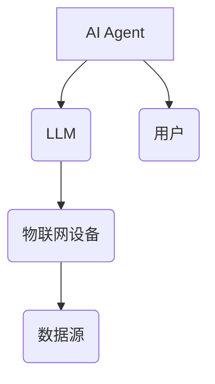
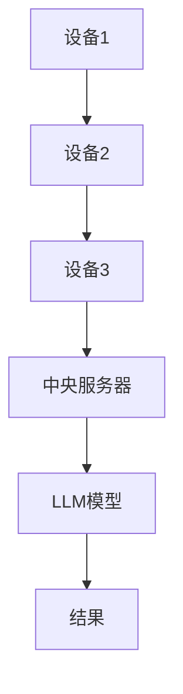

                 


# 跨設備AI Agent：LLM在物联网环境中的部署

> 关键词：跨设备AI Agent, LLM, 物联网, 分布式计算, 大语言模型

> 摘要：本文深入探讨了跨设备AI Agent在物联网环境中的部署，结合大语言模型（LLM）的技术原理和实际应用，分析了其在物联网环境中的核心问题、系统架构、算法原理和最佳实践。文章通过详细的技术分析和实际案例，为读者提供了从理论到实践的全面指导。

---

## 第1章：跨设备AI Agent 概述

### 1.1 跨設備AI Agent 的定义与背景

#### 1.1.1 什么是AI Agent
AI Agent（人工智能代理）是一种能够感知环境、自主决策并执行任务的智能体。它能够通过传感器获取信息，利用算法进行分析和推理，然后采取行动以实现目标。AI Agent可以是软件程序、机器人或任何具备智能决策能力的实体。

#### 1.1.2 跨設備AI Agent 的特点
跨设备AI Agent的核心特点在于其能够协调多个设备的工作，实现设备间的协同与数据共享。这种协同不仅限于单一设备，而是通过分布式计算和通信协议，在不同设备之间建立高效的交互机制。

#### 1.1.3 物联网环境中的AI Agent
物联网（Internet of Things, IoT）是一个将物理世界与数字世界连接的网络架构，通过传感器和智能设备实时采集和传输数据。AI Agent在物联网中的应用，使得设备能够更智能地处理数据，优化决策过程，提升用户体验。

### 1.2 LLM 在物联网中的应用

#### 1.2.1 大语言模型的基本概念
大语言模型（Large Language Model, LLM）是一种基于深度学习的自然语言处理模型，能够理解和生成人类语言。常见的LLM包括GPT系列、BERT等，它们在文本生成、意图识别、问答系统等领域表现出色。

#### 1.2.2 LLM 在物联网中的潜在应用
在物联网环境中，LLM可以用于智能助手、设备控制、数据分析等场景。例如，用户可以通过语音指令（如“关闭客厅的灯”）触发设备动作，LLM负责解析指令并执行相应操作。

#### 1.2.3 跨設備AI Agent 的核心问题
跨设备AI Agent的核心问题包括设备间的通信、数据隐私、计算资源分配等。如何在设备间高效传递信息，如何在有限的计算资源下优化模型性能，是实现跨设备AI Agent的关键挑战。

---

## 第2章：跨设备AI Agent 的核心概念与联系

### 2.1 核心概念原理

#### 2.1.1 AI Agent 的核心原理
AI Agent通过感知环境、分析数据、制定策略和执行动作来完成任务。在物联网环境中，AI Agent需要协调多个设备的资源，优化整体性能。

#### 2.1.2 LLM 在跨设备协同中的作用
LLM在跨设备协同中主要用于意图理解、任务分配和结果反馈。例如，当用户发出指令时，LLM解析指令并将其转化为设备间的协同动作。

#### 2.1.3 物联网环境下的数据处理机制
物联网环境下的数据处理机制包括数据采集、数据传输、数据存储和数据分析。AI Agent通过处理这些数据，实现对设备的智能控制。

### 2.2 核心概念属性对比表格

| 概念       | 描述                                                                 |
|------------|----------------------------------------------------------------------|
| AI Agent   | 具备自主决策能力的智能体                                             |
| LLM        | 基于大语言模型的文本生成与理解能力                                   |
| 物联网      | 连接物理世界与数字世界的网络架构                                     |

### 2.3 实体关系图（ER图）



---

## 第3章：跨设备AI Agent 的算法原理

### 3.1 分布式计算与多设备协同

#### 3.1.1 分布式计算的基本原理
分布式计算将任务分解为多个子任务，分别在不同的设备上执行。通过协调这些子任务的结果，最终完成整体目标。这种方法可以提高系统的并行处理能力和容错性。

#### 3.1.2 多设备协同的通信机制
在物联网环境中，设备间的通信通常采用HTTP或MQTT协议。HTTP适合简单的请求-响应模式，而MQTT更适合低带宽、高延迟的环境。

#### 3.1.3 基于LLM的分布式推理流程
基于LLM的分布式推理流程包括数据采集、数据传输、模型推理和结果反馈。例如，在智能家居场景中，AI Agent协调智能音箱、智能灯泡和智能空调的工作。

### 3.2 大语言模型的压缩与优化

#### 3.2.1 模型压缩技术
模型压缩技术包括剪枝、量化等方法，旨在减少模型的参数数量，降低计算复杂度。例如，剪枝可以去除模型中冗余的神经元，量化则将浮点数参数转换为整数。

#### 3.2.2 知识蒸馏方法
知识蒸馏通过将大型模型的知识迁移到较小的模型中，从而实现模型的轻量化。教师模型（Large Model）负责生成高质量的输出，学生模型（Small Model）通过模仿学习掌握相似的技能。

#### 3.2.3 跨设备部署的优化策略
在边缘设备上部署LLM时，需要考虑设备的计算能力和存储空间。通过模型剪枝和量化，可以在不明显降低性能的前提下，显著减少模型的大小。

### 3.3 算法流程图



---

## 第4章：数学模型与公式

### 4.1 分布式计算中的通信开销模型

通信开销公式为：
$$ \text{通信开销} = \frac{\text{数据大小} \times \text{传输距离}}{\text{带宽}} $$

例如，假设数据大小为100KB，传输距离为100米，带宽为1Mbps，则通信开销为：
$$ \text{通信开销} = \frac{100 \times 100}{1} = 10000 \text{ms} $$

---

## 第5章：系统分析与架构设计方案

### 5.1 问题场景介绍

跨设备AI Agent在物联网中的应用场景包括智能家居、工业物联网和智慧城市。每个场景都有其独特的挑战，如设备异构性、网络延迟和数据隐私。

### 5.2 项目介绍

项目目标是开发一个支持跨设备协同的AI Agent系统，利用LLM进行数据分析和决策。关键技术包括分布式计算、边缘计算和自然语言处理。

### 5.3 系统功能设计

系统功能设计包括数据采集、数据传输、模型推理和结果反馈。通过Mermaid类图可以清晰地展示系统组件及其交互关系。

### 5.4 系统架构设计

系统架构设计采用分层架构，包括设备层、传输层、计算层和应用层。通过Mermaid架构图可以直观地展示各层之间的关系和数据流。

### 5.5 系统接口设计

系统接口设计包括设备与服务器之间的数据接口，服务器与LLM模型之间的调用接口。这些接口需要定义清晰的协议和数据格式，确保设备间的高效通信。

### 5.6 系统交互流程

通过Mermaid序列图可以展示用户请求、设备数据采集、数据传输、模型推理和结果返回的完整流程，帮助读者理解系统的整体交互过程。

---

## 第6章：项目实战

### 6.1 环境安装

开发环境需要安装Python 3.8以上版本、TensorFlow、PyTorch和Flask库。以下是安装命令：

```bash
pip install python>=3.8
pip install tensorflow
pip install torch
pip install flask
```

### 6.2 系统核心实现

以下是设备数据采集模块的代码示例：

```python
import requests

def collect_data(device_id):
    url = f"http://localhost:5000/api/devices/{device_id}/data"
    response = requests.get(url)
    return response.json()
```

### 6.3 代码应用解读与分析

代码实现需要注意设备间的通信效率和数据安全。选择合适的通信协议和加密算法，可以有效降低通信延迟和数据泄露风险。

### 6.4 实际案例分析

以智能家居为例，描述系统如何协同多个设备完成任务。例如，当用户发出指令“关闭客厅的灯”时，AI Agent解析指令，通过MQTT协议通知智能灯泡执行关闭操作。

### 6.5 项目小结

项目实现的关键点包括设备间的高效通信、模型的轻量化部署和系统的可扩展性。在实际应用中，需要根据具体场景优化系统参数，确保系统的稳定性和性能。

---

## 第7章：最佳实践与总结

### 7.1 最佳实践Tips

- 选择合适的通信协议，如MQTT适合低带宽环境。
- 采用模型蒸馏技术优化模型性能。
- 注意数据隐私和安全，采用加密通信和访问控制。

### 7.2 总结

跨设备AI Agent和LLM在物联网环境中的部署，不仅提升了系统的智能化水平，还为物联网应用带来了新的可能性。通过本文的分析和实践，读者可以更好地理解跨设备AI Agent的技术细节和实际应用。

### 7.3 注意事项

在实际部署中，需要注意设备间的通信延迟、设备资源限制和数据隐私问题。通过合理的系统设计和优化，可以有效解决这些问题。

### 7.4 拓展阅读

推荐阅读分布式计算和物联网安全的相关书籍和论文，以深入理解跨设备AI Agent的技术细节和未来发展方向。

---

通过本文的详细讲解和实际案例分析，读者可以全面掌握跨设备AI Agent在物联网环境中的部署方法和实现技巧。希望本文能为相关领域的研究和实践提供有价值的参考。

