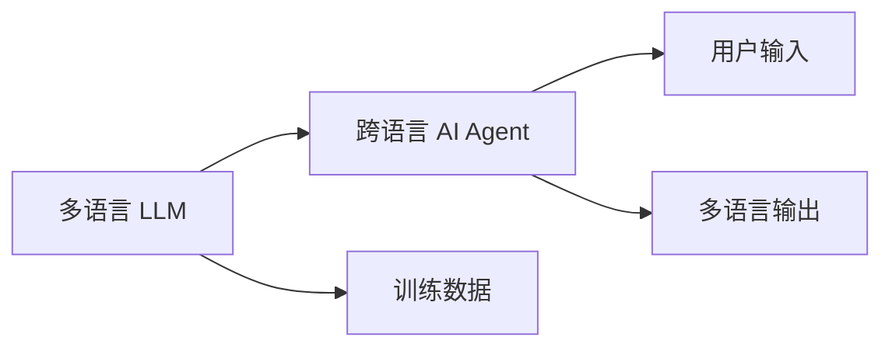
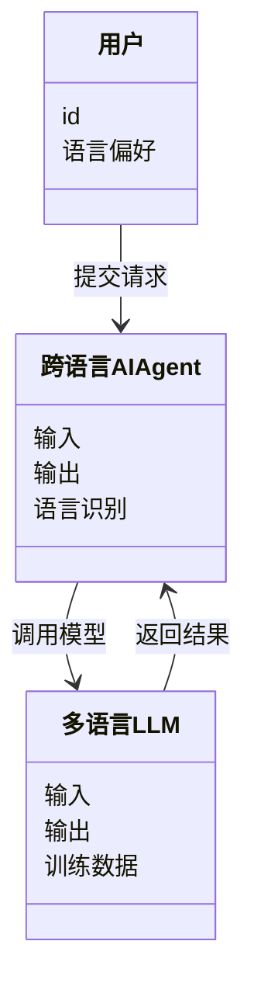
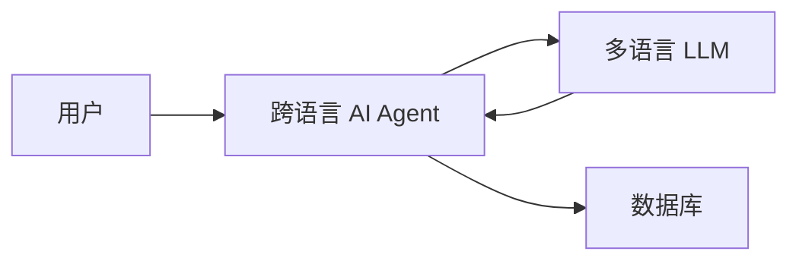
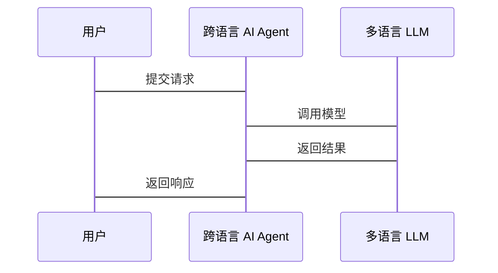

                 


# 跨语言 AI Agent：多语言 LLM 在国际化场景中的应用

---

## 关键词

- 跨语言 AI Agent
- 多语言 LLM
- 国际化场景
- 人工智能
- 自然语言处理

---

## 摘要

本文深入探讨了跨语言 AI Agent 的核心概念、技术原理和实际应用场景。通过分析多语言大型语言模型（LLM）在国际化场景中的应用，本文详细介绍了跨语言 AI Agent 的定义、工作原理、算法原理和系统架构设计。同时，本文通过实际案例展示了跨语言 AI Agent 的实现过程，并提出了性能优化和扩展性的建议。最后，本文总结了跨语言 AI Agent 的优势与挑战，并展望了其未来发展。

---

## 第1章: 跨语言 AI Agent 的背景与核心概念

### 1.1 问题背景

#### 1.1.1 跨语言交流的挑战

在国际化场景中，跨语言交流是一个复杂的问题。随着全球化的深入，企业和组织需要与来自不同语言背景的用户进行交互。传统的单语言 AI 系统在面对多语言场景时，往往无法有效处理语言差异带来的信息失真问题。例如，用户使用中文询问“如何预约医生”，而系统需要将其翻译成英文并理解用户的真实需求。

此外，不同语言之间的语义差异、文化差异和语法结构差异使得跨语言交流变得更加复杂。例如，中文中的“请”具有礼貌含义，而直接翻译成英文时可能需要调整语序和语气。

#### 1.1.2 多语言 LLM 的出现与潜力

随着深度学习技术的发展，多语言大型语言模型（LLM）逐渐成为跨语言交流的核心技术。多语言 LLM 可以同时理解和生成多种语言，具有以下潜力：

- **通用性**：多语言 LLM 可以处理多种语言的文本，适用于全球化的应用场景。
- **高效性**：多语言 LLM 可以减少对翻译工具的依赖，直接进行跨语言对话。
- **准确性**：多语言 LLM 通过大规模预训练数据，能够更好地捕捉不同语言之间的语义联系。

#### 1.1.3 跨语言 AI Agent 的应用场景

跨语言 AI Agent 可以广泛应用于以下场景：

- **客户服务**：跨国公司可以通过跨语言 AI Agent 为全球用户提供多语言支持。
- **教育领域**：跨语言 AI Agent 可以为学习者提供多语言的学习辅助。
- **内容生成**：跨语言 AI Agent 可以帮助生成多语言内容，如新闻、广告等。
- **电子商务**：跨语言 AI Agent 可以帮助用户进行多语言的产品搜索和推荐。

---

### 1.2 问题描述

#### 1.2.1 跨语言交流的核心问题

跨语言交流的核心问题包括：

- **语言歧义**：同一词语在不同语言中的含义可能不同。
- **文化差异**：不同语言背后的文化背景可能影响语义的理解。
- **语法差异**：不同语言的语法结构可能导致信息转换的复杂性。

#### 1.2.2 多语言 LLM 在 AI Agent 中的角色

多语言 LLM 在跨语言 AI Agent 中扮演了关键角色：

- **语言理解**：多语言 LLM 可以理解多种语言的输入。
- **语言生成**：多语言 LLM 可以生成多种语言的输出。
- **跨语言推理**：多语言 LLM 可以在不同语言之间进行语义推理。

#### 1.2.3 跨语言 AI Agent 的目标与边界

- **目标**：跨语言 AI Agent 的目标是实现跨语言的自然交互，提供无缝的语言支持。
- **边界**：跨语言 AI Agent 的边界包括语言支持的范围、性能限制和文化适应性。

---

### 1.3 问题解决

#### 1.3.1 跨语言 AI Agent 的解决方案

跨语言 AI Agent 的解决方案包括：

- **多语言模型训练**：使用多语言数据对模型进行预训练。
- **跨语言适应**：通过微调或多任务学习进一步优化模型。
- **语言切换机制**：实现不同语言之间的无缝切换。

#### 1.3.2 多语言 LLM 的技术优势

- **通用性**：多语言 LLM 可以支持多种语言，适用于不同场景。
- **高效性**：多语言 LLM 可以减少对翻译工具的依赖，提高处理效率。
- **准确性**：多语言 LLM 通过大规模预训练，能够更好地捕捉不同语言之间的语义联系。

#### 1.3.3 跨语言 AI Agent 的核心要素

- **语言理解能力**：能够理解多种语言的输入。
- **语言生成能力**：能够生成多种语言的输出。
- **跨语言推理能力**：能够在不同语言之间进行语义推理。

---

## 第2章: 跨语言 AI Agent 的核心概念与联系

### 2.1 核心概念原理

#### 2.1.1 多语言 LLM 的定义与特点

多语言 LLM 是一种能够理解和生成多种语言的大型语言模型。其特点包括：

- **多语言支持**：能够处理多种语言的文本。
- **语义理解**：能够捕捉不同语言之间的语义联系。
- **可扩展性**：可以轻松扩展支持的语言种类。

#### 2.1.2 跨语言 AI Agent 的工作原理

跨语言 AI Agent 的工作原理包括：

- **输入接收**：接收用户输入的多语言文本。
- **语言识别**：识别输入语言并进行相应的处理。
- **语义理解**：通过多语言 LLM 理解输入的语义。
- **生成输出**：生成目标语言的输出文本。

#### 2.1.3 跨语言 AI Agent 与多语言 LLM 的关系

跨语言 AI Agent 是多语言 LLM 的应用形式，通过多语言 LLM 提供跨语言交互能力。

---

### 2.2 核心概念对比表

#### 2.2.1 多语言 LLM 与单语言 LLM 的对比

| 特性               | 多语言 LLM           | 单语言 LLM           |
|--------------------|----------------------|----------------------|
| 语言支持           | 多种语言             | 单种语言             |
| 语义理解           | 跨语言语义理解       | 单语言语义理解       |
| 应用场景           | 国际化场景           | 单一语言场景         |

#### 2.2.2 跨语言 AI Agent 与传统 AI Agent 的对比

| 特性               | 跨语言 AI Agent      | 传统 AI Agent        |
|--------------------|----------------------|----------------------|
| 语言支持           | 多种语言             | 单种语言或有限语言   |
| 跨语言能力         | 支持多语言交互       | 仅支持单语言交互     |
| 应用场景           | 国际化场景           | 单一语言场景         |

---

### 2.3 实体关系图



---

## 第3章: 跨语言 AI Agent 的算法原理

### 3.1 多语言 LLM 的训练流程

#### 3.1.1 数据预处理

数据预处理包括：

- **数据清洗**：去除无效数据和噪声。
- **数据对齐**：将不同语言的数据对齐。
- **数据增强**：通过数据增强技术提高数据质量。

#### 3.1.2 模型训练

模型训练包括：

- **初始化参数**：初始化模型参数。
- **前向传播**：将输入数据输入模型，计算输出。
- **损失计算**：计算损失函数。
- **反向传播**：通过反向传播更新模型参数。

#### 3.1.3 跨语言适应

跨语言适应包括：

- **微调**：通过微调模型适应特定语言。
- **多任务学习**：通过多任务学习提高模型的跨语言能力。

---

### 3.2 算法原理的数学模型

#### 3.2.1 损失函数

$$ L = -\sum_{i=1}^{n} \log p(y_i|x_i) $$

其中，$L$ 是损失函数，$y_i$ 是输出，$x_i$ 是输入。

#### 3.2.2 优化器

常用的优化器包括随机梯度下降（SGD）和Adam优化器：

$$ \theta_{t+1} = \theta_t - \eta \nabla_\theta L(\theta_t) $$

其中，$\theta$ 是模型参数，$\eta$ 是学习率。

---

## 第4章: 跨语言 AI Agent 的系统分析与架构设计

### 4.1 问题场景介绍

跨国企业需要为全球用户提供多语言支持，包括客户服务、产品推荐和信息查询。

---

### 4.2 系统功能设计

#### 4.2.1 领域模型



---

### 4.3 系统架构设计

#### 4.3.1 系统架构图



---

### 4.4 系统接口设计

#### 4.4.1 输入接口

用户输入多语言文本，系统接收并进行语言识别。

#### 4.4.2 输出接口

系统生成目标语言的输出文本，并返回给用户。

---

### 4.5 系统交互流程

#### 4.5.1 序列图



---

## 第5章: 跨语言 AI Agent 的项目实战

### 5.1 环境安装

#### 5.1.1 安装 Python

```bash
python --version
```

#### 5.1.2 安装依赖库

```bash
pip install transformers torch
```

---

### 5.2 核心代码实现

#### 5.2.1 加载多语言 LLM

```python
from transformers import AutoTokenizer, AutoModelForSeq2SeqLM
model_name = "facebook/m2m-100"
tokenizer = AutoTokenizer.from_pretrained(model_name)
model = AutoModelForSeq2SeqLM.from_pretrained(model_name)
```

#### 5.2.2 跨语言处理

```python
def translate(input_text, src_lang, tgt_lang):
    inputs = tokenizer.prepare_seq2seq_batch(input_text, src_lang=src_lang, tgt_lang=tgt_lang)
    outputs = model.generate(**inputs)
    return tokenizer.decode(outputs[0], skip_special_tokens=True)
```

#### 5.2.3 对话管理

```python
def chat():
    while True:
        user_input = input("请输入内容：")
        if user_input == "退出":
            break
        response = translate(user_input, "zh", "en")
        print("AI:", response)
```

---

### 5.3 案例分析

#### 5.3.1 实际案例

用户输入：“我需要帮助。”

AI Agent：识别输入语言为中文，调用多语言 LLM 将其翻译为英文：“I need help.”

---

## 第6章: 跨语言 AI Agent 的最佳实践

### 6.1 性能优化

#### 6.1.1 模型选择

选择适合应用场景的多语言 LLM 模型，如 Facebook 的 M2M-100。

#### 6.1.2 系统优化

优化模型推理速度，例如通过量化技术减少模型大小。

---

### 6.2 安全性

#### 6.2.1 数据隐私

确保用户数据的隐私和安全，避免数据泄露。

---

### 6.3 可扩展性

#### 6.3.1 新语言支持

通过模型微调或参数调整，快速增加对新语言的支持。

---

### 6.4 小结

跨语言 AI Agent 的实现需要结合多语言 LLM 的技术优势，通过系统设计和优化，确保其在国际化场景中的高效性和准确性。

---

### 6.5 注意事项

- **语言支持范围**：确保模型支持目标语言。
- **性能限制**：注意模型推理速度和资源消耗。
- **文化适应**：考虑不同语言背后的文化差异。

---

### 6.6 拓展阅读

- [Transformers 模型库](https://huggingface.co/transformers)
- [多语言 NLP 书籍](https://www.amazon.com/Multilingual-Natural-Language-Processing/dp/1788934791)

---

## 第7章: 总结与展望

### 7.1 总结

跨语言 AI Agent 是多语言 LLM 在国际化场景中的重要应用，通过其强大的语言理解和生成能力，可以实现跨语言的自然交互。

---

### 7.2 展望

未来，跨语言 AI Agent 将进一步优化性能，扩展语言支持范围，并在更多领域中得到广泛应用。

---

以上是《跨语言 AI Agent：多语言 LLM 在国际化场景中的应用》的技术博客文章的完整目录大纲和内容。

