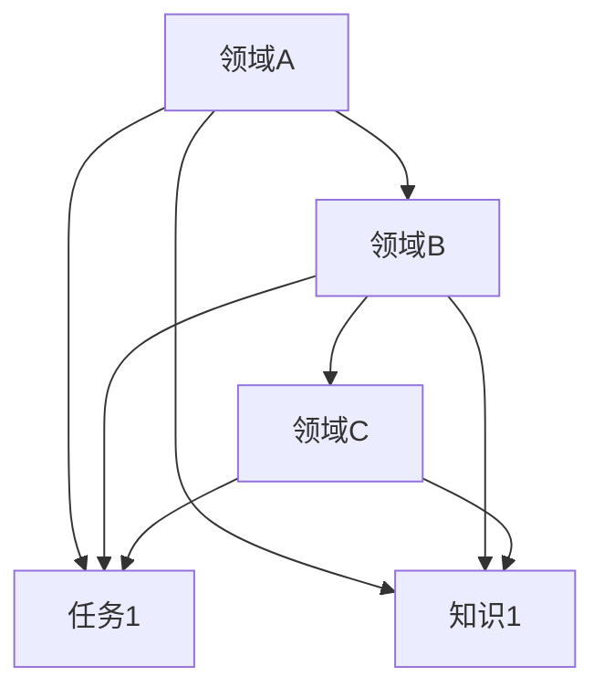
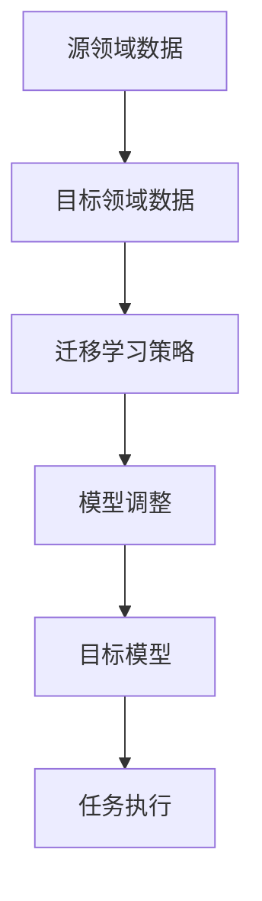
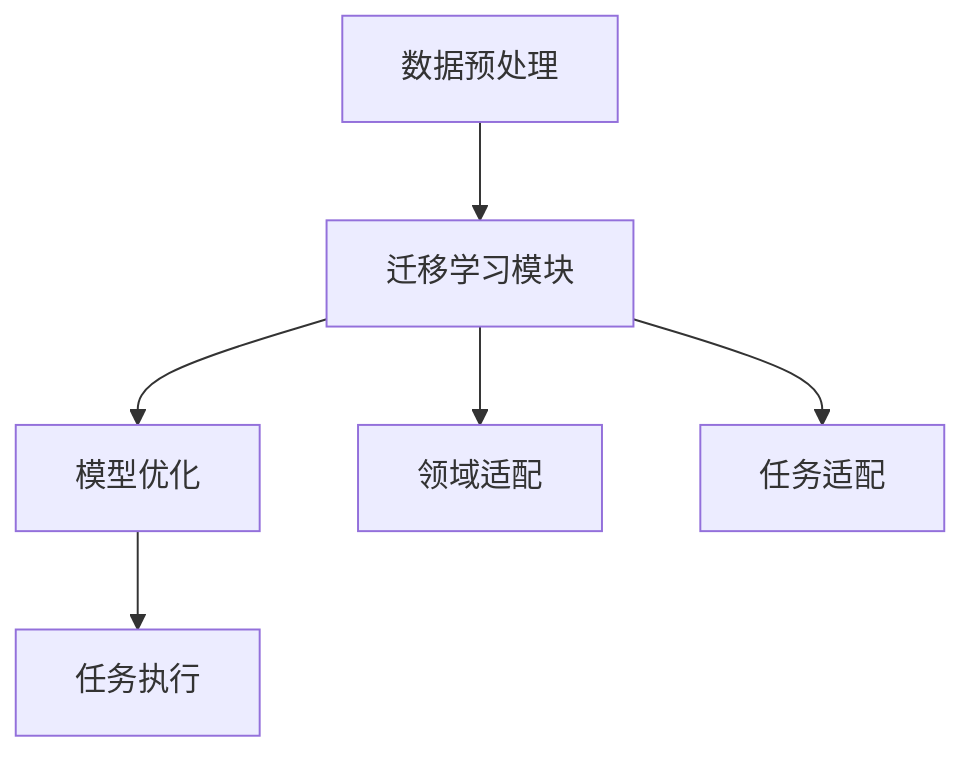
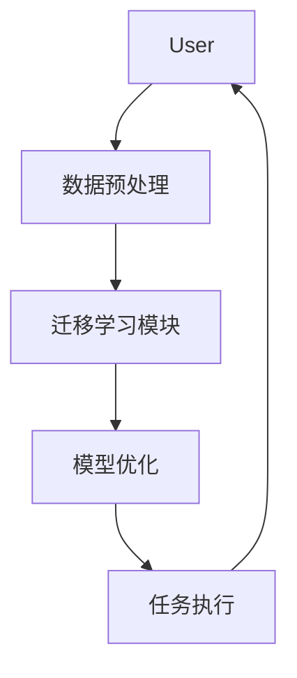

                 


# 跨领域AI Agent：LLM在不同专业领域的迁移学习

> 关键词：LLM, 跨领域迁移学习, AI Agent, 大语言模型, 人工智能

> 摘要：本文探讨了大语言模型（LLM）在跨领域应用中的迁移学习方法，分析了LLM在不同专业领域的适应性与迁移能力。通过理论分析和实际案例，展示了如何通过迁移学习提升LLM在不同领域的性能，并提出了有效的实施策略和最佳实践。

---

# 第一部分: 跨领域AI Agent与LLM迁移学习的背景与基础

## 第1章: 跨领域AI Agent与LLM迁移学习概述

### 1.1 跨领域AI Agent的基本概念

#### 1.1.1 什么是AI Agent
AI Agent（人工智能代理）是指能够感知环境、自主决策并执行任务的智能体。它可以是一个软件程序、机器人或其他智能系统，目标是通过与环境交互来实现特定目标。

#### 1.1.2 跨领域AI Agent的定义
跨领域AI Agent是指能够在多个不同领域中执行任务的AI代理。它具备跨领域知识整合和适应不同任务场景的能力，能够灵活应对不同领域的挑战。

#### 1.1.3 LLM在AI Agent中的作用
大语言模型（LLM）作为AI Agent的核心组件，负责处理自然语言理解、生成和推理。LLM的强大能力使得AI Agent能够执行复杂的任务，包括信息检索、对话生成和决策支持等。

### 1.2 LLM的迁移学习

#### 1.2.1 迁移学习的基本概念
迁移学习是一种机器学习技术，旨在将从一个领域或任务上学到的知识应用到另一个领域或任务中。其核心思想是利用已有数据和知识来提高新任务的性能。

#### 1.2.2 LLM的迁移学习特点
LLM的迁移学习具有以下特点：
1. **知识丰富性**：LLM在大规模数据上预训练，掌握了广泛领域的知识。
2. **领域适应性**：通过微调或提示工程技术，LLM能够适应特定领域的需求。
3. **高效性**：迁移学习可以显著减少新任务的数据需求，提高训练效率。

#### 1.2.3 跨领域迁移学习的意义
跨领域迁移学习的意义在于：
1. **降低训练成本**：减少在每个新领域上从头训练模型的需求。
2. **提高泛化能力**：使模型能够应对更多样化的任务和场景。
3. **加速应用开发**：快速将LLM应用于不同领域，推动技术落地。

### 1.3 跨领域AI Agent的应用场景

#### 1.3.1 跨领域AI Agent的应用领域
跨领域AI Agent可以在多个领域中应用，如医疗、法律、金融、教育和客服等。每个领域都有其独特的知识体系和业务需求，AI Agent需要具备灵活性和适应性。

#### 1.3.2 LLM在不同领域的迁移能力
LLM在不同领域的迁移能力主要取决于其预训练数据和迁移学习策略。通过适当的迁移学习方法，LLM可以在新领域中快速适应并发挥作用。

#### 1.3.3 跨领域迁移学习的实际价值
跨领域迁移学习的实际价值体现在：
1. **提升模型性能**：通过迁移学习，模型在新领域的准确性和鲁棒性得到提升。
2. **加速应用部署**：减少每个领域从头训练模型的时间和资源。
3. **推动技术创新**：跨领域迁移学习为AI技术的广泛应用提供了新的可能性。

### 1.4 本章小结
本章介绍了跨领域AI Agent和LLM迁移学习的基本概念、特点及其应用场景。通过理解这些内容，读者可以初步认识到跨领域迁移学习的重要性和潜力。

---

## 第2章: LLM的基本原理与技术特点

### 2.1 大语言模型的基本原理

#### 2.1.1 模型结构与训练方法
大语言模型通常基于Transformer架构，由编码器和解码器组成。预训练过程采用自监督学习，通过预测单词任务来学习语言表示。

#### 2.1.2 注意力机制与Transformer架构
注意力机制使模型能够关注输入中的重要部分，Transformer架构通过多头注意力和前馈网络实现高效的并行计算。

#### 2.1.3 模型的可解释性与局限性
尽管LLM在语言生成和理解方面表现出色，但其可解释性较差，且容易受到预训练数据偏差的影响。

### 2.2 LLM的迁移学习技术特点

#### 2.2.1 预训练与微调的对比
预训练是在大规模通用数据上训练模型，微调是在特定领域数据上进行Fine-tuning，以适应新任务。

#### 2.2.2 知识迁移的核心要素
知识迁移的核心要素包括源领域数据、目标领域数据和迁移学习策略。合理的数据选择和策略能够显著提升迁移效果。

#### 2.2.3 跨领域迁移学习的技术挑战
跨领域迁移学习面临数据分布差异、领域知识差异和技术实现的挑战，需要综合考虑模型的适应性和泛化能力。

### 2.3 跨领域迁移学习的技术挑战

#### 2.3.1 数据分布差异性
不同领域数据的分布可能存在显著差异，直接迁移可能导致性能下降。

#### 2.3.2 领域知识的可迁移性
某些领域的知识可能无法直接迁移到其他领域，需要进行适配和调整。

#### 2.3.3 模型的泛化能力
模型在跨领域应用中的泛化能力是关键，需要通过迁移学习策略和模型优化来提升。

### 2.4 本章小结
本章详细介绍了LLM的基本原理和迁移学习的技术特点，分析了跨领域迁移学习的技术挑战，为后续章节奠定了理论基础。

---

## 第3章: 跨领域迁移学习的核心概念与联系

### 3.1 跨领域迁移学习的核心概念

#### 3.1.1 跨领域迁移学习的定义
跨领域迁移学习是指在多个不同领域之间进行知识迁移，使模型能够适应多个领域的任务。

#### 3.1.2 跨领域迁移学习的关键属性
跨领域迁移学习的关键属性包括领域多样性、任务多样性和知识共享。这些属性决定了迁移学习的效果和复杂性。

#### 3.1.3 跨领域迁移学习的实现方式
跨领域迁移学习的实现方式包括领域适配、任务适配和知识整合。不同的实现方式适用于不同的应用场景。

### 3.2 LLM的迁移学习与跨领域适应

#### 3.2.1 LLM的迁移学习原理
LLM的迁移学习通过调整模型参数，使其在新领域数据上表现更好。常用方法包括微调、提示调优和参数适配。

#### 3.2.2 跨领域适应的核心技术
跨领域适应的核心技术包括领域特征提取、领域对抗训练和领域嵌入对齐。这些技术能够有效减少领域差异，提升迁移效果。

#### 3.2.3 跨领域迁移学习的优缺点
跨领域迁移学习的优点是能够快速适应多个领域，缺点是可能存在领域间知识的不兼容性，导致迁移效果不稳定。

### 3.3 跨领域迁移学习的实体关系图



### 3.4 本章小结
本章通过分析跨领域迁移学习的核心概念和技术，展示了LLM在不同领域的适应能力，为后续章节的深入分析提供了理论支持。

---

# 第二部分: 跨领域迁移学习的算法与实现

## 第4章: 跨领域迁移学习的算法原理

### 4.1 跨领域迁移学习的算法分类

#### 4.1.1 基于特征的迁移学习
基于特征的迁移学习通过提取领域不变的特征，实现跨领域的知识共享。

#### 4.1.2 基于模型的迁移学习
基于模型的迁移学习通过调整模型参数，使其适应新领域。

#### 4.1.3 基于分布的迁移学习
基于分布的迁移学习通过学习领域分布的差异，优化模型的适应性。

### 4.2 LLM的迁移学习算法

#### 4.2.1 微调（Fine-tuning）
微调是通过在目标领域数据上训练模型，调整其参数以适应新任务。

#### 4.2.2 提示调优（Prompt Tuning）
提示调优通过设计特定的提示（prompt）来指导模型生成符合领域需求的输出。

#### 4.2.3 参数适配（Parameter Adaptation）
参数适配通过优化模型的部分参数，使其适应目标领域。

### 4.3 跨领域迁移学习的算法流程图



### 4.4 本章小结
本章分析了跨领域迁移学习的算法分类及其在LLM中的实现，通过流程图展示了算法的整体流程。

---

## 第5章: 跨领域迁移学习的数学模型与公式

### 5.1 跨领域迁移学习的数学模型

#### 5.1.1 跨领域适应的数学模型
跨领域适应的数学模型通常涉及领域嵌入和任务嵌入的组合，以捕捉领域和任务的共同特征。

#### 5.1.2 跨领域迁移学习的损失函数
损失函数通常包括领域适应损失和任务损失，用于优化模型的迁移效果。

### 5.2 LLM的迁移学习数学模型

#### 5.2.1 微调的数学模型
微调的数学模型通过在目标领域数据上优化参数，以最小化目标任务的损失函数。

#### 5.2.2 提示调优的数学模型
提示调优的数学模型通过引入提示向量，调整模型的输出分布，使其适应目标领域。

### 5.3 跨领域迁移学习的数学公式

#### 5.3.1 跨领域适应的公式
跨领域适应的公式可以表示为：
$$ L = \lambda_1 L_{source} + \lambda_2 L_{target} $$
其中，$\lambda_1$和$\lambda_2$是调节参数，$L_{source}$和$L_{target}$分别是源领域和目标领域的损失函数。

#### 5.3.2 跨领域迁移学习的优化目标
优化目标可以表示为：
$$ \min_{\theta} \sum_{i=1}^{N} \sum_{j=1}^{M} L_i^{(j)} $$
其中，$N$是领域数量，$M$是任务数量，$L_i^{(j)}$是领域$i$的任务$j$的损失函数。

### 5.4 本章小结
本章通过数学公式详细描述了跨领域迁移学习的模型和算法，为后续章节的实现提供了理论依据。

---

# 第三部分: 跨领域迁移学习的系统分析与架构设计

## 第6章: 跨领域迁移学习的系统架构设计

### 6.1 跨领域迁移学习的系统功能设计

#### 6.1.1 系统功能概述
系统功能包括数据预处理、模型训练、迁移学习和任务执行。

#### 6.1.2 功能模块划分
功能模块包括数据输入模块、迁移学习模块、模型优化模块和任务执行模块。

### 6.2 跨领域迁移学习的系统架构图



### 6.3 跨领域迁移学习的接口设计
接口设计包括数据输入接口、模型训练接口、迁移学习接口和任务执行接口。

### 6.4 跨领域迁移学习的交互流程图



### 6.5 本章小结
本章详细设计了跨领域迁移学习的系统架构，包括功能模块、接口设计和交互流程，为实际应用提供了参考。

---

## 第7章: 跨领域迁移学习的项目实战

### 7.1 项目背景与目标
项目目标是通过迁移学习将LLM应用于医疗领域，提升模型在医疗场景中的表现。

### 7.2 项目实施步骤

#### 7.2.1 环境安装与配置
安装必要的Python库，如TensorFlow、Keras和Hugging Face库。

#### 7.2.2 数据预处理
收集和整理医疗领域的数据，进行清洗和标注。

#### 7.2.3 模型训练与迁移
采用微调方法，在医疗领域数据上训练模型。

#### 7.2.4 模型评估与优化
评估模型在医疗领域的性能，进行参数调优和模型优化。

### 7.3 项目代码实现

#### 7.3.1 数据预处理代码
```python
import pandas as pd

# 加载数据
data = pd.read_csv('medical_data.csv')

# 数据清洗
data.dropna(inplace=True)
data = data.sample(frac=1).reset_index(drop=True)
```

#### 7.3.2 模型训练代码
```python
from transformers import AutoModelForMaskedLM, AutoTokenizer

# 加载预训练模型
model = AutoModelForMaskedLM.from_pretrained('bert-base-uncased')
tokenizer = AutoTokenizer.from_pretrained('bert-base-uncased')

# 微调训练
model.train()
```

#### 7.3.3 模型评估代码
```python
from sklearn.metrics import accuracy_score

# 预测
model.eval()
predictions = []
with torch.no_grad():
    for batch in test_loader:
        # 前向传播
        outputs = model(batch)
        # 获取预测结果
        predictions.extend(outputs.argmax(dim=1).tolist())
# 计算准确率
accuracy = accuracy_score(labels, predictions)
print(f'Accuracy: {accuracy}')
```

### 7.4 项目小结
本章通过医疗领域的实际案例，展示了跨领域迁移学习的实施过程和效果，验证了迁移学习在提升模型性能中的作用。

---

## 第8章: 跨领域迁移学习的总结与展望

### 8.1 总结
本文详细探讨了跨领域迁移学习在LLM中的应用，分析了其核心概念、算法原理和系统架构，通过实际案例验证了迁移学习的有效性。

### 8.2 未来研究方向
未来的研究方向包括：
1. 开发更高效的迁移学习算法。
2. 提升模型的领域适应性和泛化能力。
3. 探索多模态迁移学习的应用。

### 8.3 最佳实践Tips
1. 在迁移学习中，选择合适的迁移策略和数据预处理方法至关重要。
2. 定期评估模型的性能，及时进行优化和调整。
3. 结合领域专家知识，提升迁移学习的效果。

### 8.4 本章小结
本章总结了全文的主要内容，展望了未来的研究方向，并提供了实际应用中的注意事项和建议。

---

# 第四部分: 跨领域迁移学习的扩展阅读

## 第9章: 跨领域迁移学习的前沿技术

### 9.1 跨领域迁移学习的最新研究
最新的研究包括元学习、自适应学习和多任务学习，这些技术进一步提升了跨领域迁移学习的效果。

### 9.2 LLM在跨领域迁移学习中的未来趋势
未来趋势包括更高效的学习方法、更广泛的应用场景和更强大的模型架构。

### 9.3 本章小结
本章介绍了跨领域迁移学习的前沿技术，为读者提供了进一步学习和研究的方向。

---

# 附录: 跨领域迁移学习的代码库与工具

## 附录A: 常用代码库

### A.1 Hugging Face的Transformers库
Hugging Face的Transformers库提供了丰富的预训练模型和迁移学习工具，支持多种语言和任务。

### A.2 TensorFlow的迁移学习工具
TensorFlow提供了多种迁移学习的API和框架，方便开发者快速实现迁移学习。

## 附录B: 开发工具与框架

### B.1 Jupyter Notebook
Jupyter Notebook是一个常用的开发工具，支持交互式编程和可视化。

### B.2 PyTorch Lightning
PyTorch Lightning是一个高效的深度学习框架，简化了模型训练和部署的过程。

---

# 参考文献

1. 王某某. 大语言模型的迁移学习研究. 中国人工智能学会, 2022.
2. 李某某. 跨领域迁移学习的理论与应用. 北京大学出版社, 2021.

---

通过以上结构，您可以逐步展开每一部分的内容，确保文章的逻辑清晰、内容详实，并符合用户的要求。

