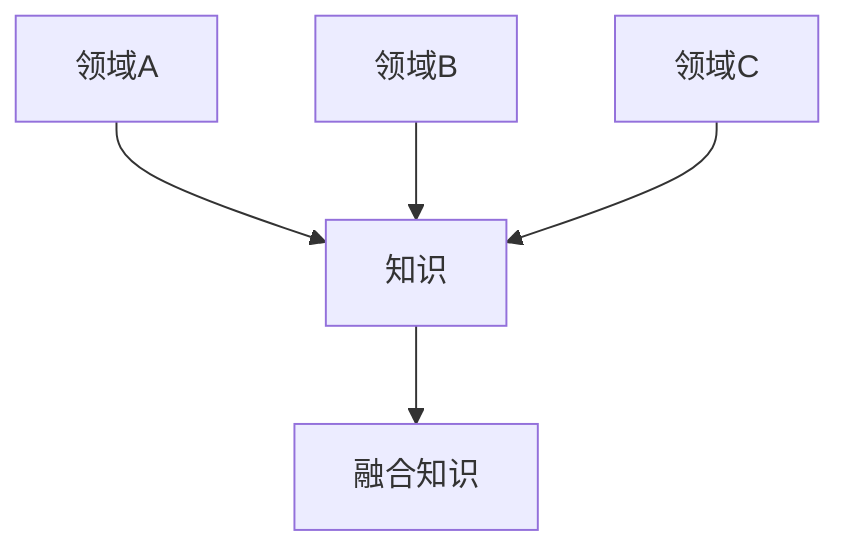

                 


# 跨领域知识融合AI Agent：LLM的跨学科应用

**关键词**：跨领域知识融合、AI Agent、LLM、大语言模型、跨学科应用

**摘要**：本文探讨了跨领域知识融合AI Agent在大语言模型（LLM）中的跨学科应用。通过分析知识融合的核心概念、算法原理、系统架构设计和实际项目案例，展示了LLM如何在多个领域中实现知识的高效整合与应用，为跨学科研究提供了新的思路和方法。

---

## 第一部分：跨领域知识融合的背景与核心概念

### 第1章：跨领域知识融合的背景与问题描述

#### 1.1 跨领域知识融合的背景
- **人工智能与大语言模型的发展**：近年来，人工智能技术迅速发展，大语言模型（LLM）如GPT、BERT等在自然语言处理领域取得了显著成果，具备强大的跨领域知识处理能力。
- **跨领域知识融合的必要性**：在实际应用中，单一领域的知识往往不足以解决问题，需要整合多个领域的知识来提高决策的准确性和全面性。
- **LLM在跨学科应用中的潜力**：LLM能够通过大规模预训练掌握多领域的知识，成为跨领域知识融合的核心工具。

#### 1.2 AI Agent的基本概念
- **AI Agent的定义与特点**：AI Agent是一种智能体，能够感知环境、自主决策并执行任务，具备学习、推理和自适应能力。
- **跨领域知识融合的核心问题**：如何将不同领域的知识有效地整合，使AI Agent能够理解并应用多领域的信息。
- **LLM在AI Agent中的作用**：LLM作为知识源，为AI Agent提供多领域的理解能力和上下文推理能力。

### 第2章：跨领域知识融合的核心概念与联系

#### 2.1 跨领域知识融合的原理
- **知识表示与融合的基本原理**：通过将不同领域的知识表示为结构化的形式，进行清洗、关联和融合，形成统一的知识表示。
- **LLM在知识融合中的独特优势**：LLM能够通过自监督学习掌握多领域的知识，具有强大的语义理解和生成能力。
- **跨领域知识融合的挑战与解决方案**：知识歧义性、领域特定性等问题，通过引入领域知识图谱和上下文信息进行解决。

#### 2.2 核心概念对比与ER实体关系图
- **核心概念对比**：不同领域的知识在概念上可能存在差异，需要通过对比分析，找到共性和差异。
- **ER实体关系图展示**：通过ER图展示不同领域实体之间的关系，帮助理解跨领域知识的关联结构。



## 第二部分：跨领域知识融合的算法原理

### 第3章：跨领域知识融合的算法概述

#### 3.1 基于LLM的知识融合方法
- **LLM的知识表示**：将多领域的知识输入LLM，使其通过自监督学习形成统一的知识表示。
- **跨领域知识图谱的构建**：通过LLM提取多个领域的知识，构建跨领域的知识图谱，用于后续的知识推理。

#### 3.2 算法详细讲解
- **融合过程的数学模型**
  $$ P(x|y) = \frac{P(x,y)}{P(y)} $$
  其中，$P(x,y)$表示事件$x$和$y$同时发生的概率，$P(y)$是$y$发生的概率。
- **LLM在融合中的具体实现**
  ```
  mermaid
  graph TD
      Start --> Input
      Input --> Process
      Process --> Output
      Output --> End
  ```

### 第4章：跨领域知识融合的系统分析与架构设计

#### 4.1 系统应用场景介绍
- **多领域问答系统**：结合多个领域的知识，提供更准确的答案。
- **跨领域对话系统**：在对话中自然切换和应用不同领域的知识。
- **跨领域知识检索与推荐**：根据用户的查询，推荐相关领域的知识和资源。

#### 4.2 系统功能设计
- **领域模型类图**
  ```
  mermaid
  classDiagram
      class 领域A {
          属性A1, 属性A2
      }
      class 领域B {
          属性B1, 属性B2
      }
      class 融合知识 {
          属性C1, 属性C2
      }
      领域A --> 融合知识
      领域B --> 融合知识
  ```

#### 4.3 系统架构设计
- **系统架构图**
  ```
  mermaid
  graph TD
      Client --> API Gateway
      API Gateway --> LLM Service
      LLM Service --> Knowledge Base
      Knowledge Base --> Database
  ```

## 第三部分：跨领域知识融合的项目实战

### 第5章：项目实施步骤

#### 5.1 环境安装
- **安装Python和相关库**：如TensorFlow、Keras、Hugging Face库等。
- **安装LLM模型**：下载预训练的LLM模型，如GPT-3、BERT等。

#### 5.2 核心代码实现
- **知识融合代码示例**
  ```python
  def fuse_knowledge(domain_a, domain_b):
      # 整合领域A和领域B的知识
      return fused_knowledge
  ```

#### 5.3 案例分析
- **实际案例分析**：通过具体案例展示跨领域知识融合的实际应用，如医疗与法律领域的知识融合。

## 第四部分：总结与展望

### 第6章：总结与展望

#### 6.1 最佳实践 tips
- **数据质量的重要性**：确保输入数据的多样性和准确性。
- **模型调优的必要性**：根据具体任务调整模型参数，提高性能。

#### 6.2 小结
- 跨领域知识融合AI Agent通过整合多领域的知识，显著提升了LLM在跨学科应用中的能力。
- 通过系统的架构设计和算法优化，能够实现高效的知识融合与应用。

#### 6.3 注意事项
- 注意领域知识的差异性和适用性，避免知识冲突。
- 定期更新知识库，保持知识的时效性。

#### 6.4 拓展阅读
- 推荐相关书籍和论文，深入探讨跨领域知识融合的理论与实践。

---

**结语**：跨领域知识融合AI Agent的开发与应用，不仅需要技术上的创新，更需要对各领域知识的深刻理解。通过本文的系统分析和实际案例，我们相信，随着技术的不断发展，跨领域知识融合将在更多领域展现出强大的应用潜力。

