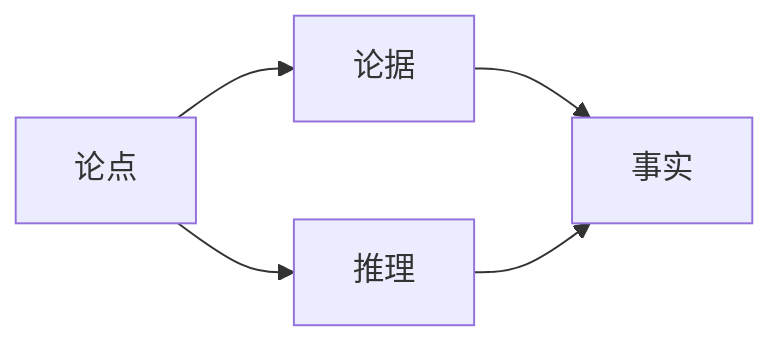
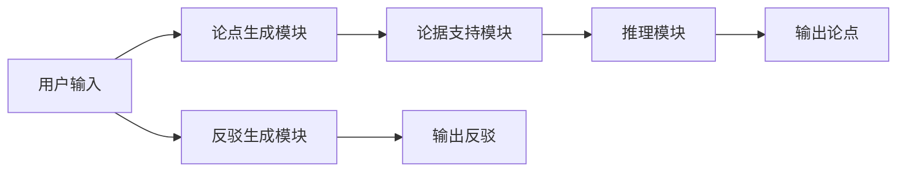
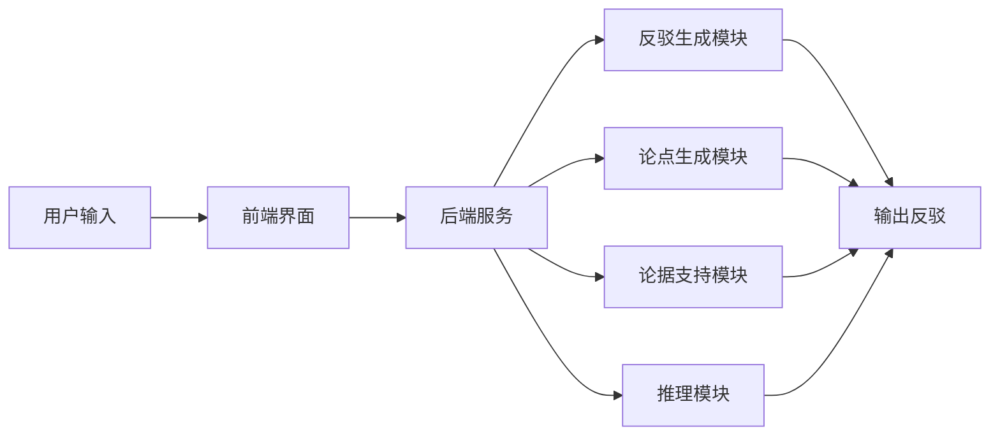

                 


# 辩论系统AI Agent：LLM驱动的论证与反驳能力

**关键词**：AI辩论系统、LLM、论证与反驳、自然语言处理、逻辑推理

**摘要**：本文探讨了基于大语言模型（LLM）的辩论系统AI Agent，详细分析其论证与反驳能力。文章从背景介绍、核心概念、算法原理、系统架构到项目实战，全面阐述了LLM在辩论系统中的应用，结合实际案例和最佳实践，为读者提供深入的技术解析。

---

## 第1章: 背景介绍

### 1.1 辩论系统AI Agent的定义与背景

#### 1.1.1 什么是辩论系统AI Agent

辩论系统AI Agent是一种利用大语言模型（LLM）进行自动论证和反驳的智能系统，旨在模拟人类在辩论中的逻辑推理和语言表达能力。其核心在于通过自然语言处理技术，生成有说服力的论点，并有效回应对方的反驳。

#### 1.1.2 辩论系统AI Agent的应用场景

- **教育领域**：辅助学生进行辩论练习，提升逻辑思维能力。
- **法律领域**：帮助律师快速生成法律文书和辩论策略。
- **商业领域**：为企业提供市场分析和竞争对手分析的论点支持。
- **娱乐领域**：应用于智能辩论机器人，提升用户体验。

#### 1.1.3 辩论系统AI Agent的发展现状

随着LLM技术的不断进步，辩论系统AI Agent逐渐从理论研究走向实际应用。当前，主要集中在以下几个方面：
1. **自动论点生成**：基于LLM生成支持特定立场的论点。
2. **自动反驳生成**：根据对手的论点，自动生成反驳理由。
3. **实时对话交互**：支持动态交互，适应对话中的变化。

### 1.2 辩论系统的核心问题

#### 1.2.1 论证与反驳的基本概念

论证是指通过逻辑推理和证据支持来证明某个观点的过程，而反驳则是指出对方论证中的漏洞或错误，削弱其说服力。

#### 1.2.2 辩论系统中的逻辑推理

逻辑推理是辩论系统AI Agent的核心能力，包括以下几种类型：
1. **归纳推理**：从具体实例中总结一般性结论。
2. **演绎推理**：从一般性原则推导出具体结论。
3. **类比推理**：通过类比分析，找到相似案例的解决方案。

#### 1.2.3 辩论系统的边界与外延

辩论系统AI Agent的边界主要在于其逻辑推理和语言表达能力，而外延则涉及具体应用场景和技术实现方式。

---

## 第2章: LLM驱动的论证与反驳能力

### 2.1 大语言模型（LLM）的基本原理

#### 2.1.1 LLM的定义与特点

大语言模型是一种基于深度学习的自然语言处理模型，具有以下特点：
1. **大规模训练数据**：通常使用海量文本数据进行预训练。
2. **自注意力机制**：通过自注意力机制捕捉上下文信息。
3. **生成能力强**：能够生成连贯且符合逻辑的文本。

#### 2.1.2 LLM的训练与推理机制

- **预训练**：使用大规模数据进行无监督学习，目标是优化语言模型的参数。
- **微调**：在特定任务上进行有监督学习，优化模型在特定领域的表现。
- **推理**：根据输入生成输出，通常采用生成式模型（如GPT）或检索式模型（如BERT）。

#### 2.1.3 LLM在论证与反驳中的优势

1. **强大的语言理解能力**：能够准确理解复杂的文本内容。
2. **灵活的生成能力**：能够生成多种不同的论点和反驳理由。
3. **快速的推理能力**：能够在短时间内生成有效的反驳。

### 2.2 辩论系统中的LLM应用

#### 2.2.1 LLM驱动的论证生成

- **论点生成**：根据给定的立场，生成支持该立场的论点。
- **论据支持**：为论点提供相关的事实和数据支持。
- **结构优化**：优化论点的逻辑结构，使其更具说服力。

#### 2.2.2 LLM驱动的反驳生成

- **识别漏洞**：分析对方论点中的逻辑漏洞。
- **生成反驳**：基于漏洞生成有效的反驳理由。
- **策略优化**：优化反驳的策略，使其更具攻击性。

#### 2.2.3 LLM在辩论系统中的角色定位

1. **助手角色**：辅助人类辩手生成论点和反驳理由。
2. **对手角色**：作为虚拟对手，与人类进行辩论练习。
3. **裁判角色**：评估辩论内容的逻辑性和说服力。

---

## 第3章: 辩论系统的核心概念

### 3.1 论证与反驳的逻辑结构

#### 3.1.1 论证的基本要素

1. **论点**：核心观点，需要被证明的命题。
2. **论据**：支持论点的事实、数据或证据。
3. **推理**：连接论点和论据的逻辑推理过程。

#### 3.1.2 论证的逻辑形式

1. **命题逻辑**：基于命题的真假进行推理。
2. **谓词逻辑**：涉及个体和谓词的逻辑推理。
3. **模态逻辑**：涉及可能性、必然性和不可能性的推理。

#### 3.1.3 论证的强度与可信度

1. **强度**：论点的说服力和逻辑性。
2. **可信度**：论据的可靠性和来源的权威性。

### 3.2 辩论系统的实体关系

#### 3.2.1 实体关系图（ER图）



#### 3.2.2 辩论系统中的实体属性

| 实体 | 属性 |
|------|------|
| 论点 | 内容、立场、强度 |
| 论据 | 类型、来源、可靠性 |
| 推理 | 逻辑形式、推理规则、推理结果 |

#### 3.2.3 实体之间的关系分析

- **论点与论据的关系**：论点是论据支持的核心观点。
- **论点与推理的关系**：推理是连接论点和论据的逻辑桥梁。
- **论据与事实的关系**：论据来源于事实，并通过事实支持论点。

---

## 第4章: LLM与辩论系统的关联

### 4.1 LLM的核心原理

#### 4.1.1 概率语言模型的数学基础

- **条件概率公式**：$$P(w_i | w_{i-1}, ..., w_1)$$
- **损失函数**：交叉熵损失 $$-\sum_{i=1}^n \log P(w_i | w_{i-1}, ..., w_1)$$

#### 4.1.2 LLM的训练目标

- **预训练目标**：优化语言模型的参数，使其能够生成连贯的文本。
- **微调目标**：在特定任务上优化模型，使其适应特定领域的需求。

#### 4.1.3 LLM的推理机制

- **生成式推理**：基于概率分布生成文本。
- **检索式推理**：基于语义相似度检索相关文本。

### 4.2 辩论系统中的LLM应用

#### 4.2.1 LLM在论证生成中的应用

- **论点生成**：通过生成模型生成支持论点的内容。
- **论据支持**：通过检索模型查找相关事实和数据。
- **结构优化**：通过语言模型优化论点的表达方式。

#### 4.2.2 LLM在反驳生成中的应用

- **识别漏洞**：通过自然语言理解技术识别对方论点中的逻辑漏洞。
- **生成反驳**：通过生成模型生成有效的反驳理由。
- **策略优化**：通过语言模型优化反驳的表达方式和策略。

#### 4.2.3 LLM在辩论系统中的优化与提升

- **模型优化**：通过模型微调提升在辩论任务中的表现。
- **数据增强**：通过数据增强技术增加训练数据的多样性。
- **多模态集成**：结合图像、视频等多模态信息提升辩论系统的综合能力。

---

## 第5章: LLM的算法原理

### 5.1 概率语言模型的数学模型

#### 5.1.1 概率语言模型的公式推导

- **联合概率分布**：$$P(w_1, w_2, ..., w_n) = \prod_{i=1}^n P(w_i | w_{i-1}, ..., w_1)$$
- **对数似然函数**：$$\log P(w_1, w_2, ..., w_n) = \sum_{i=1}^n \log P(w_i | w_{i-1}, ..., w_1)$$

#### 5.1.2 LLM的训练目标

- **优化目标**：最大化训练数据的对数似然。
- **损失函数**：交叉熵损失 $$-\mathbb{E}[\log P(w | x)]$$

#### 5.1.3 梯度下降与参数更新

- **梯度计算**：使用反向传播算法计算损失函数对模型参数的梯度。
- **参数更新**：通过梯度下降算法更新模型参数，$$\theta_{new} = \theta_{old} - \eta \nabla_\theta L$$

### 5.2 LLM的训练过程

#### 5.2.1 预训练阶段

- **无监督学习**：使用大规模文本数据进行无监督预训练。
- **模型架构**：采用Transformer架构，包含编码器和解码器。

#### 5.2.2 微调阶段

- **有监督学习**：在特定任务上进行有监督微调。
- **数据增强**：通过数据增强技术增加训练数据的多样性。

#### 5.2.3 推理阶段

- **生成式推理**：通过生成模型生成文本。
- **检索式推理**：通过检索模型检索相关文本。

---

## 第6章: 系统分析与架构设计

### 6.1 系统功能设计

#### 6.1.1 系统功能模块

- **论点生成模块**：生成支持论点的内容。
- **论据支持模块**：提供论点的事实和数据支持。
- **推理模块**：进行逻辑推理，连接论点和论据。
- **反驳生成模块**：生成反驳理由。

#### 6.1.2 系统功能流程



### 6.2 系统架构设计

#### 6.2.1 系统架构图



#### 6.2.2 系统接口设计

- **输入接口**：用户输入辩论话题和立场。
- **输出接口**：输出支持论点和反驳理由。
- **内部接口**：模块之间的数据交互接口。

### 6.3 系统交互流程

#### 6.3.1 用户输入

用户输入辩论话题和立场，例如：“支持远程办公的普及对工作效率的影响”。

#### 6.3.2 系统处理

1. **论点生成模块**：生成支持论点的内容，例如：“远程办公提高了工作效率”。
2. **论据支持模块**：提供论点的事实和数据支持，例如：“根据2022年调查报告，远程办公提高了员工的工作满意度，进而提升了工作效率”。
3. **推理模块**：连接论点和论据，形成完整的论证。
4. **反驳生成模块**：生成反驳理由，例如：“远程办公可能导致沟通不畅，影响工作效率”。

#### 6.3.3 输出结果

系统输出支持论点和反驳理由，例如：
- **论点**：远程办公提高了工作效率。
- **论据**：根据2022年调查报告，远程办公提高了员工的工作满意度，进而提升了工作效率。
- **反驳**：远程办公可能导致沟通不畅，影响工作效率。

---

## 第7章: 项目实战

### 7.1 环境安装

- **Python 3.8及以上版本**
- **安装必要的库**：`transformers`, `torch`, `scikit-learn`

### 7.2 核心代码实现

#### 7.2.1 论点生成模块

```python
from transformers import AutoTokenizer, AutoModelForCausalLM

tokenizer = AutoTokenizer.from_pretrained('gpt2')
model = AutoModelForCausalLM.from_pretrained('gpt2')

def generate_argument(prompt):
    inputs = tokenizer.encode(prompt, return_tensors='pt')
    outputs = model.generate(inputs, max_length=50, temperature=0.7)
    return tokenizer.decode(outputs[0], skip_special_tokens=True)
```

#### 7.2.2 论据支持模块

```python
import requests
from bs4 import BeautifulSoup

def get_fact_support(argument):
    url = f'https://example.com/fact-check/{argument}'
    response = requests.get(url)
    soup = BeautifulSoup(response.text, 'html.parser')
    return soup.find('div', class_='fact-support').text
```

#### 7.2.3 推理模块

```python
def logical_inference(argument, support):
    # 示例推理逻辑，实际可根据需求扩展
    return f"{argument} 因为 {support}，所以是正确的。"
```

#### 7.2.4 反驳生成模块

```python
def generate_counter_argument(argument):
    inputs = tokenizer.encode(argument, return_tensors='pt')
    outputs = model.generate(inputs, max_length=50, temperature=0.7)
    return tokenizer.decode(outputs[0], skip_special_tokens=True)
```

### 7.3 实际案例分析

#### 7.3.1 案例背景

假设辩论话题为“支持远程办公的普及对工作效率的影响”，立场为“支持”。

#### 7.3.2 代码实现

1. **论点生成**：
   ```python
   prompt = "支持远程办公的普及对工作效率的影响"
   argument = generate_argument(prompt)
   print(argument)  # 输出：远程办公提高了工作效率
   ```

2. **论据支持**：
   ```python
   support = get_fact_support(argument)
   print(support)  # 输出：根据2022年调查报告，远程办公提高了员工的工作满意度，进而提升了工作效率
   ```

3. **推理模块**：
   ```python
   inference = logical_inference(argument, support)
   print(inference)  # 输出：远程办公提高了工作效率 因为 根据2022年调查报告，远程办公提高了员工的工作满意度，进而提升了工作效率，所以是正确的。
   ```

4. **反驳生成**：
   ```python
   counter_argument = generate_counter_argument(argument)
   print(counter_argument)  # 输出：远程办公可能导致沟通不畅，影响工作效率
   ```

#### 7.3.3 项目小结

通过上述代码实现，我们可以看到，基于LLM的辩论系统AI Agent能够有效地生成论点、支持论据，并生成有效的反驳理由。然而，实际应用中仍需进一步优化模型性能，提升系统的交互性和用户体验。

---

## 第8章: 最佳实践

### 8.1 小结

本文详细探讨了基于LLM的辩论系统AI Agent，从背景介绍、核心概念、算法原理到系统架构和项目实战，全面解析了LLM在辩论系统中的应用。

### 8.2 注意事项

1. **数据质量**：确保训练数据的多样性和代表性。
2. **模型优化**：通过微调和优化算法提升模型性能。
3. **用户体验**：注重系统的交互设计，提升用户体验。

### 8.3 拓展阅读

- **论文推荐**：《Large Language Models for Argumentation and Refutation》
- **工具推荐**：Hugging Face的Transformers库，用于快速实现基于LLM的辩论系统。

---

## 附录: 数学公式与代码示例

### 附录1: 数学公式

- **条件概率公式**：$$P(w_i | w_{i-1}, ..., w_1)$$
- **交叉熵损失**：$$-\mathbb{E}[\log P(w | x)]$$
- **梯度下降算法**：$$\theta_{new} = \theta_{old} - \eta \nabla_\theta L$$

### 附录2: 代码示例

```python
import torch
import torch.nn as nn
import torch.optim as optim

class SimpleModel(nn.Module):
    def __init__(self):
        super(SimpleModel, self).__init__()
        self.fc = nn.Linear(10, 5)
        self.output = nn.Linear(5, 1)

    def forward(self, x):
        x = self.fc(x)
        x = self.output(x)
        return x

model = SimpleModel()
criterion = nn.MSELoss()
optimizer = optim.SGD(model.parameters(), lr=0.01)

# 训练过程
for epoch in range(100):
    inputs = torch.randn(10, 10)
    labels = torch.randn(10, 1)
    
    outputs = model(inputs)
    loss = criterion(outputs, labels)
    
    optimizer.zero_grad()
    loss.backward()
    optimizer.step()
```

---

通过以上内容，我们可以看到，基于LLM的辩论系统AI Agent在论证与反驳能力方面具有强大的潜力。未来，随着技术的不断进步，辩论系统AI Agent将更加智能化，为更多领域提供支持。

