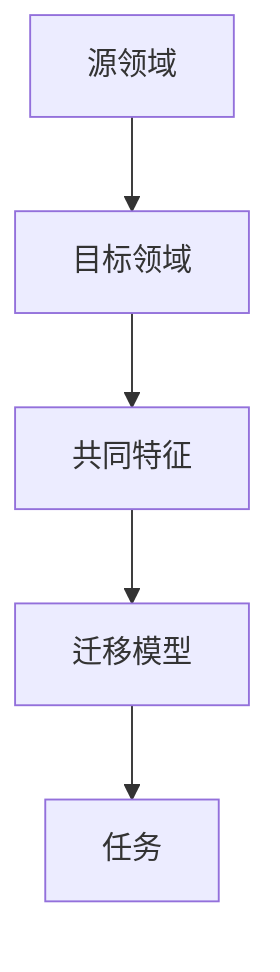
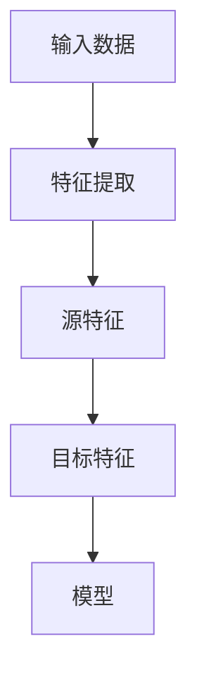
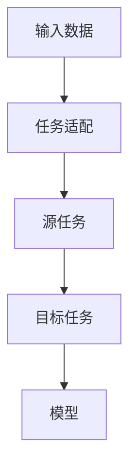
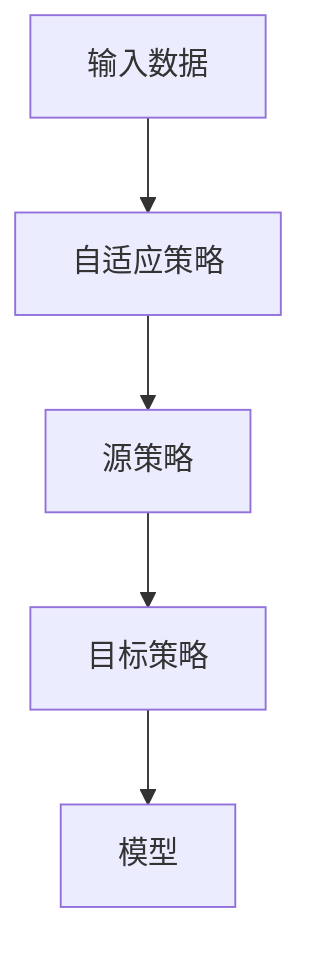
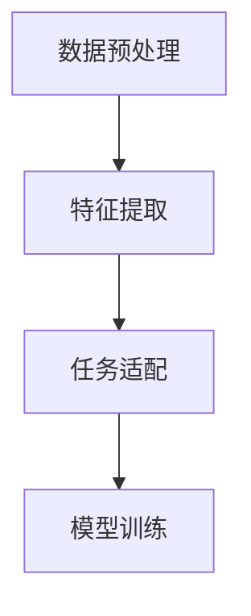
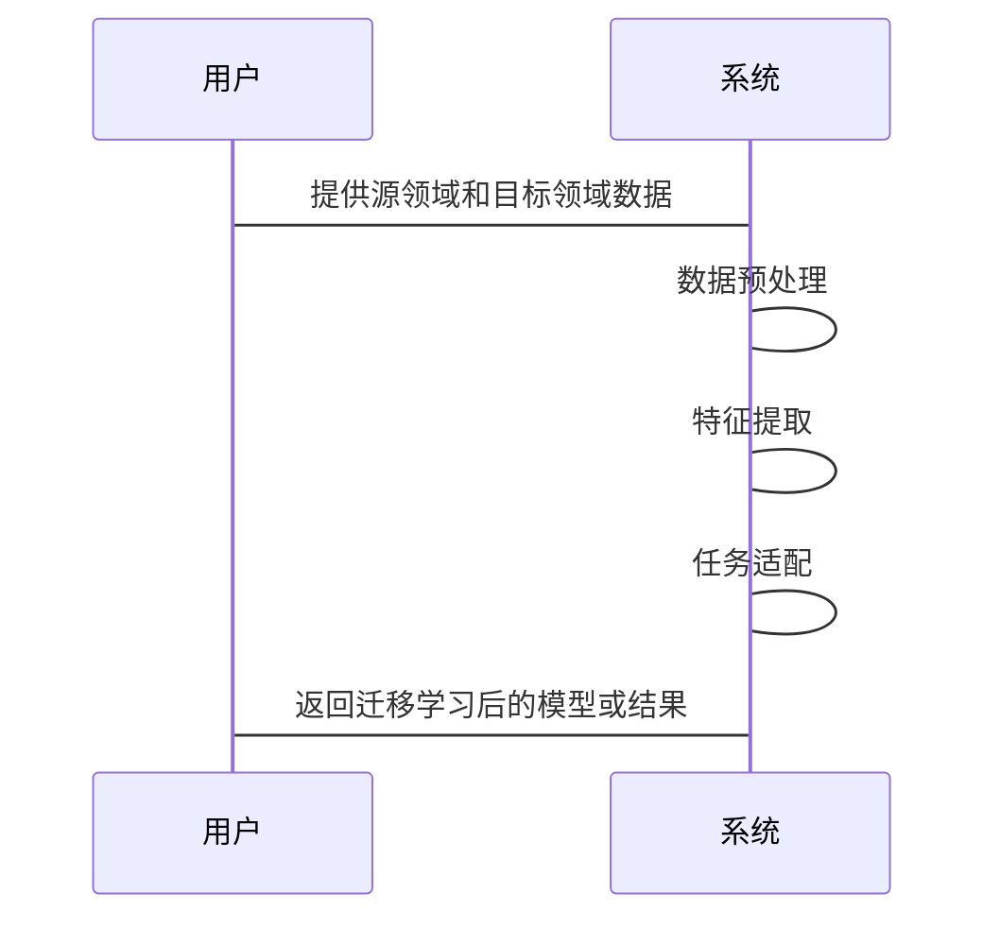
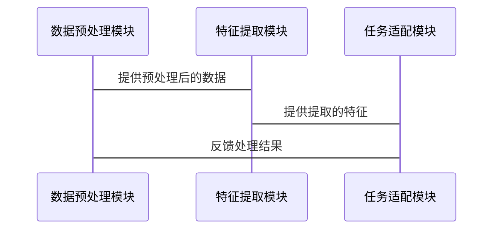

                 


# 迁移学习：让AI Agent快速适应新领域

## 关键词
迁移学习, AI Agent, 机器学习, 知识迁移, 领域适应

## 摘要
迁移学习是一种机器学习技术，允许AI Agent在新领域中快速适应，而无需从头开始训练。本文详细探讨迁移学习的核心概念、算法原理、系统架构，并通过实际案例展示其应用。通过本文，读者将了解如何利用迁移学习提升AI Agent的适应能力，使其在不同领域中高效运作。

---

# 第一部分: 迁移学习的核心概念

## 第1章: 迁移学习的核心概念

### 1.1 迁移学习的背景与问题背景

#### 1.1.1 传统机器学习的局限性
传统机器学习方法在特定领域内表现优异，但当应用于新领域时，通常需要重新训练整个模型，这不仅耗时，而且需要大量新领域的数据。例如，图像分类模型在移动到医学图像分析领域时，需要重新收集和标注大量医学数据。

#### 1.1.2 迁移学习的定义与目标
迁移学习（Transfer Learning）是指将从一个领域（源领域）学到的知识迁移到另一个领域（目标领域）的过程。其目标是利用源领域的数据和知识，减少目标领域数据的需求，提高模型在目标领域的性能。

#### 1.1.3 迁移学习的应用场景与边界
- **应用场景**：图像识别、自然语言处理、推荐系统等。
- **边界**：迁移学习并不适用于所有场景，例如当源领域和目标领域差异较大时，迁移学习的效果可能不佳。

### 1.2 迁移学习的核心概念与联系

#### 1.2.1 迁移学习的核心概念原理
迁移学习的核心在于发现源领域和目标领域的共同特征或结构，通过提取这些特征，减少对目标领域数据的依赖。

#### 1.2.2 核心概念属性特征对比表
| 属性         | 源领域       | 目标领域       |
|--------------|--------------|----------------|
| 数据量       | 丰富         | 稀缺           |
| 标签         | 充足         | 稀缺           |
| 任务         | 相关任务     | 相关任务或新任务 |

#### 1.2.3 ER实体关系图架构（Mermaid流程图）


---

## 第2章: 迁移学习的核心算法与数学模型

### 2.1 迁移学习的算法原理

#### 2.1.1 基于特征提取的迁移学习算法（Mermaid流程图）


#### 2.1.2 基于任务适配的迁移学习算法（Mermaid流程图）


#### 2.1.3 基于自适应策略的迁移学习算法（Mermaid流程图）


### 2.2 迁移学习的数学模型与公式

#### 2.2.1 特征提取模型
$$ y = f(x) $$

#### 2.2.2 任务适配模型
$$ y = g(x) $$

#### 2.2.3 自适应策略模型
$$ y = h(x) $$

---

## 第3章: 迁移学习的系统架构与设计

### 3.1 系统架构设计

#### 3.1.1 系统功能模块划分
- 数据预处理模块
- 特征提取模块
- 任务适配模块
- 模型训练模块

#### 3.1.2 系统架构图（Mermaid架构图）


#### 3.1.3 系统接口设计
- 输入接口：接收源领域和目标领域的数据
- 输出接口：输出迁移学习后的模型或结果

### 3.2 系统交互流程

#### 3.2.1 用户输入处理流程（Mermaid序列图）


#### 3.2.2 系统内部交互流程（Mermaid序列图）


---

## 第4章: 迁移学习算法的实现

### 4.1 环境安装与配置

#### 4.1.1 Python环境搭建
安装Python 3.8以上版本，推荐使用虚拟环境。

#### 4.1.2 依赖库安装
安装TensorFlow、Keras、Scikit-learn等库。

#### 4.1.3 数据集准备
获取源领域和目标领域的数据集，进行预处理。

### 4.2 核心算法实现

#### 4.2.1 特征提取算法实现
```python
def feature_extractor(input_data):
    # 提取特征的代码
    return features
```

#### 4.2.2 任务适配算法实现
```python
def task_adapter(features):
    # 适配任务的代码
    return adapted_features
```

#### 4.2.3 自适应策略算法实现
```python
def adaptive_strategy(adapted_features):
    # 制定策略的代码
    return strategy
```

### 4.3 代码实现与解读

#### 4.3.1 特征提取代码实现
```python
import tensorflow as tf
from tensorflow.keras import layers

model = tf.keras.Sequential([
    layers.Dense(64, activation='relu'),
    layers.Dense(10, activation='softmax')
])
```

#### 4.3.2 任务适配代码实现
```python
def adapt_task(features, target_task):
    # 适配任务的代码
    adapted_features = features * target_task.scaling_factor
    return adapted_features
```

#### 4.3.3 自适应策略代码实现
```python
def adaptive_strategy(features, target_task):
    # 制定策略的代码
    if target_task == 'classification':
        return 'use_svm'
    else:
        return 'use_knn'
```

---

## 第5章: 项目实战与案例分析

### 5.1 实际案例分析

#### 5.1.1 案例背景介绍
以图像分类为例，源领域是自然图像，目标领域是医学图像。

#### 5.1.2 数据预处理与特征提取
对医学图像进行预处理，提取相关特征。

#### 5.1.3 模型训练与评估
使用迁移学习后的模型在医学图像上进行训练，评估其性能。

### 5.2 案例详细讲解

#### 5.2.1 环境配置
安装必要的库，如TensorFlow、Keras。

#### 5.2.2 数据预处理
对图像进行归一化、调整尺寸等处理。

#### 5.2.3 模型训练
使用迁移学习算法训练模型，并在测试集上评估其性能。

#### 5.2.4 结果分析
对比迁移学习前后的性能，验证其有效性。

---

## 第6章: 总结与展望

### 6.1 总结
迁移学习通过利用源领域的知识，帮助AI Agent快速适应新领域，减少数据依赖，提升效率。

### 6.2 未来展望
未来的研究方向可能包括更高效的迁移算法、多领域迁移学习、以及在边缘计算和物联网中的应用。

---

通过本文的详细讲解，读者将全面理解迁移学习的核心概念、算法原理及其在实际项目中的应用。迁移学习作为一种强大的技术，将继续推动AI Agent在各个领域的快速发展。

