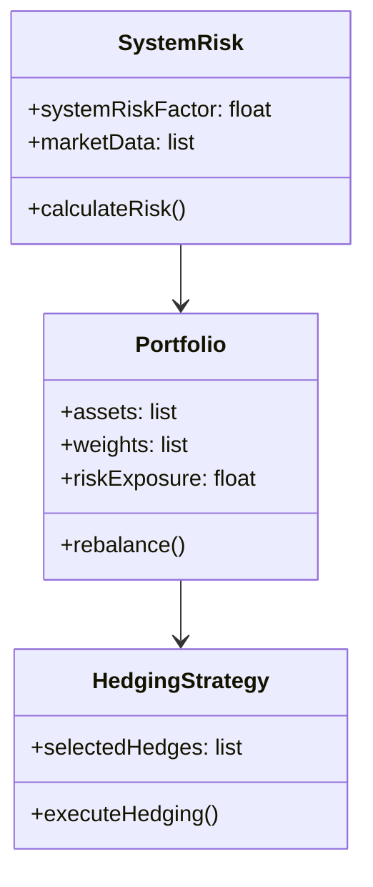
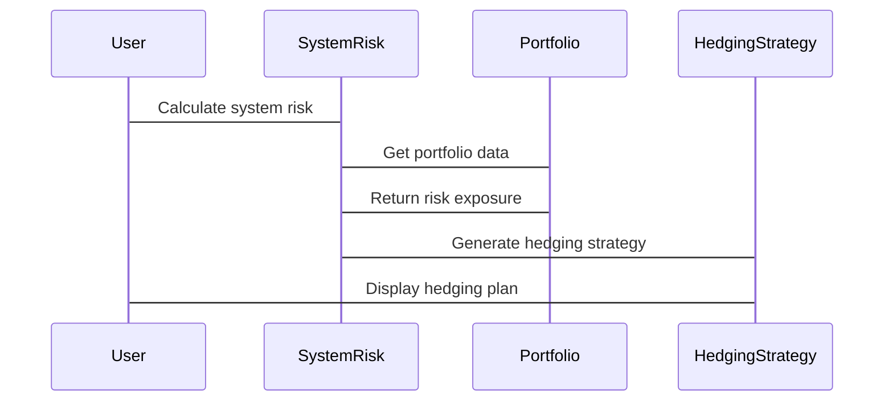

                 


# 迈克尔·伯里的系统性风险对冲方法

## 关键词：系统性风险，迈克尔·伯里，风险对冲，金融模型，风险管理，数学模型

## 摘要

本文深入探讨了迈克尔·伯里提出的系统性风险对冲方法，从系统性风险的基本概念、理论模型、对冲策略、系统架构设计到项目实战，全面解析了如何有效对冲系统性风险。通过详细分析其数学模型、算法原理和系统设计，结合实际案例，展示了如何在金融实践中应用这些方法，帮助读者掌握系统性风险管理的核心技术。

---

## 第一章：系统性风险概述

### 1.1 系统性风险的基本概念

#### 1.1.1 系统性风险的定义与特点
- 系统性风险是指影响整个金融市场的风险，具有广泛性、相关性和不可分散性。
- 系统性风险的来源包括经济周期波动、政策变化、市场结构变化等。

#### 1.1.2 系统性风险与非系统性风险的区别
- 系统性风险影响所有资产，而非系统性风险仅影响特定资产。
- 系统性风险无法通过分散投资来消除，而非系统性风险可以通过分散投资来降低。

#### 1.1.3 系统性风险对金融市场的整体影响
- 系统性风险可能导致市场崩盘、流动性危机和金融危机。
- 管理系统性风险是维护金融市场稳定的重要手段。

### 1.2 系统性风险的来源

#### 1.2.1 金融市场的相互关联性
- 金融机构之间的高度关联性可能导致系统性风险的蔓延。
- 衍生品市场的复杂性增加了系统性风险的可能性。

#### 1.2.2 系统性风险的主要驱动因素
- 经济周期波动
- 货币政策变化
- 市场参与者的行为偏差
- 不良资产的积累

#### 1.2.3 系统性风险的传播机制
- 通过传染效应，一个机构的破产可能引发连锁反应。
- 市场恐慌情绪的扩散加剧系统性风险。

### 1.3 系统性风险对冲的重要性

#### 1.3.1 对冲系统性风险的意义
- 保护投资者免受重大损失。
- 维护金融市场的稳定性。
- 提高金融机构的风险管理能力。

#### 1.3.2 系统性风险对冲的基本原则
- 早识别、早预警、早应对。
- 结合定量分析和定性分析。
- 综合使用多种对冲工具和策略。

#### 1.3.3 系统性风险对冲的常见方法
- 利用衍生品对冲（如期权、期货）。
- 构建风险对冲组合。
- 运用压力测试和情景分析。

---

## 第二章：系统性风险的理论基础

### 2.1 系统性风险的度量方法

#### 2.1.1 VaR（Value at Risk）模型
- VaR模型用于度量投资组合在给定置信水平下的潜在损失。
- 公式：$$VaR_{\alpha} = \inf\{x | P(L \leq x) \geq \alpha\}$$
- VaR模型的优点：简单易懂，计算高效。
- VaR模型的缺点：无法反映尾部风险。

#### 2.1.2 CVaR（Conditional Value at Risk）模型
- CVaR模型是VaR模型的补充，用于度量在VaR水平下的平均损失。
- 公式：$$CVaR_{\alpha} = \frac{1}{1-\alpha} \int_{\alpha}^{1} x dF(x)$$
- CVaR模型的优点：考虑了尾部风险，更稳健。
- CVaR模型的缺点：计算复杂。

#### 2.1.3 其他系统性风险度量方法
- 系统性风险指数（SRI）：基于资产价格波动和相关性计算。
- 系统性风险贡献（SRC）：衡量单个机构对系统性风险的贡献。

### 2.2 迈克尔·伯里模型的理论基础

#### 2.2.1 迈克尔·伯里模型的基本假设
- 金融市场存在相互关联性。
- 系统性风险可以通过特定的数学模型量化。
- 对冲策略的有效性依赖于模型的准确性和工具的恰当选择。

#### 2.2.2 迈克尔·伯里模型的核心思想
- 将系统性风险分解为多个因素，分别进行对冲。
- 使用动态模型实时监测和调整对冲策略。

#### 2.2.3 迈克尔·伯里模型的适用范围
- 适用于机构投资者和大型金融机构。
- 适合在金融 crisis期间进行实时风险管理。

### 2.3 系统性风险的数学模型

#### 2.3.1 系统性风险的数学表达式
- 系统性风险可以表示为：$$R_{system} = \sum_{i=1}^{n} w_i R_i$$
  其中，$w_i$ 是第 $i$ 个资产的权重，$R_i$ 是第 $i$ 个资产的风险。

#### 2.3.2 系统性风险的度量公式
- 迈克尔·伯里模型中的系统性风险度量：$$SR = \frac{\sum_{i=1}^{n} (R_i - R_f)^2}{n}$$
  其中，$R_f$ 是无风险利率，$R_i$ 是第 $i$ 个资产的预期收益。

#### 2.3.3 迈克尔·伯里模型的数学推导
- 通过协方差矩阵分析资产之间的相关性。
- 使用主成分分析（PCA）提取系统性风险因子。

---

## 第三章：迈克尔·伯里的系统性风险对冲方法

### 3.1 对冲方法的核心策略

#### 3.1.1 投资组合再平衡策略
- 定期调整投资组合，降低系统性风险暴露。
- 通过动态再平衡减少市场波动的影响。

#### 3.1.2 风险对冲工具的选择
- 使用期权、期货、互换等衍生品进行对冲。
- 结合资产配置和风险对冲工具，构建有效组合。

#### 3.1.3 对冲交易的执行策略
- 利用高频交易技术快速执行对冲指令。
- 通过算法交易优化对冲效果。

### 3.2 迈克尔·伯里对冲方法的具体步骤

#### 3.2.1 确定对冲目标
- 明确系统性风险的具体来源和影响程度。
- 确定对冲的目标收益和风险承受能力。

#### 3.2.2 选择对冲工具
- 根据市场情况选择最有效的对冲工具。
- 结合成本、流动性等因素进行工具选择。

#### 3.2.3 对冲交易的实施
- 构建对冲组合，确保对冲的有效性。
- 监测对冲效果，及时调整策略。

---

## 第四章：系统架构设计

### 4.1 系统功能设计

#### 4.1.1 领域模型（Mermaid 类图）


#### 4.1.2 系统架构（Mermaid 架构图）


#### 4.1.3 系统交互（Mermaid 序列图）


### 4.2 系统接口设计

#### 4.2.1 输入接口
- 数据输入接口：接收市场数据和资产组合信息。
- 用户输入接口：接收用户的对冲目标和参数设置。

#### 4.2.2 输出接口
- 结果输出接口：输出对冲策略和相关报告。
- 监控接口：实时监控对冲效果和市场变化。

### 4.3 系统交互流程

#### 4.3.1 数据流
- 数据从数据源流向系统，经过处理后生成对冲策略。
- 对冲策略通过用户界面反馈给用户。

#### 4.3.2 信息流
- 用户需求通过输入接口传递到系统。
- 系统处理后通过输出接口将结果反馈给用户。

---

## 第五章：项目实战

### 5.1 环境安装

#### 5.1.1 安装Python和相关库
```bash
pip install numpy pandas matplotlib
```

#### 5.1.2 安装金融数据API
```bash
pip install yfinance
```

### 5.2 核心实现源代码

#### 5.2.1 迈克尔·伯里模型的Python实现
```python
import numpy as np
import pandas as pd

def calculate_systemic_risk(returns):
    covariance_matrix = returns.cov()
    eigenvalues, eigenvectors = np.linalg.eigh(covariance_matrix)
    systemic_risk_factor = eigenvectors[:, 0]
    return systemic_risk_factor

# 示例数据
data = pd.DataFrame({
    'Asset1': [0.02, 0.01, -0.03],
    'Asset2': [0.01, -0.02, 0.04],
    'Asset3': [-0.03, 0.02, 0.01]
})
print(calculate_systemic_risk(data))
```

#### 5.2.2 对冲策略的实现
```python
def hedge_strategy(portfolio, market_returns):
    # 计算VaR
    var = portfolio.value_at_risk(95)
    # 执行对冲
    return var * -1
```

### 5.3 实际案例分析

#### 5.3.1 案例背景
- 2008年金融危机期间，伯里模型如何帮助机构对冲系统性风险。

#### 5.3.2 案例分析
- 使用伯里模型分析危机期间的资产价格波动。
- 通过案例展示模型的有效性和实用性。

### 5.4 项目小结

#### 5.4.1 项目成果
- 成功实现迈克尔·伯里模型的系统性风险对冲方法。
- 通过实际案例验证模型的有效性。

#### 5.4.2 经验总结
- 系统性风险对冲需要结合理论和实践。
- 模型的选择和参数设置对结果影响重大。

---

## 第六章：总结与展望

### 6.1 最佳实践 tips

#### 6.1.1 系统性风险管理的注意事项
- 定期监控和更新模型参数。
- 结合市场变化及时调整对冲策略。

#### 6.1.2 迈克尔·伯里方法的优缺点
- 优点：理论基础扎实，方法实用。
- 缺点：对市场假设敏感，需要实时数据支持。

### 6.2 小结

- 迈克尔·伯里的系统性风险对冲方法为金融风险管理提供了有效工具。
- 通过数学模型和系统架构设计，帮助机构应对系统性风险。

### 6.3 未来展望

- 研究更复杂的系统性风险度量模型。
- 探索人工智能在系统性风险对冲中的应用。
- 提高模型的实时性和适应性。

---

通过以上章节的详细讲解，读者可以全面理解迈克尔·伯里的系统性风险对冲方法，并能够在实际金融业务中应用这些方法，有效管理系统性风险。

