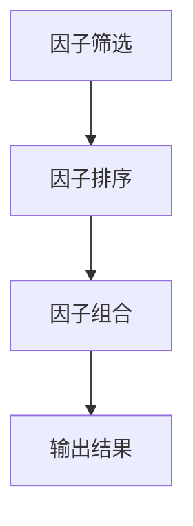
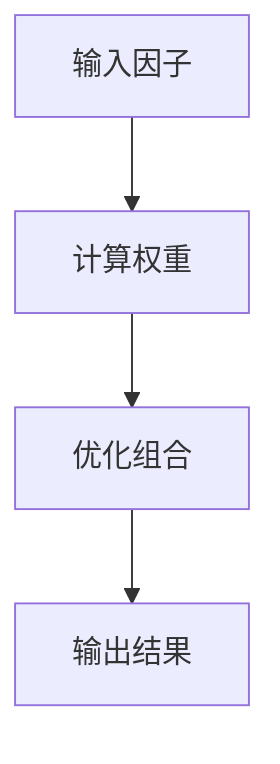
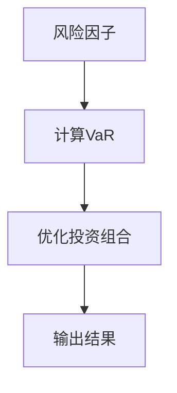
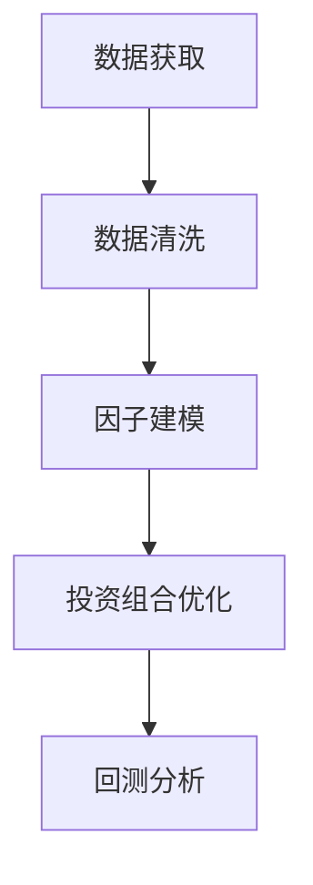

                 


# 迈克尔·莫布森的价值投资定量分析

## 关键词：价值投资、定量分析、因子模型、风险管理、投资组合优化

## 摘要：
迈克尔·莫布森的价值投资方法结合了传统的基本面分析和现代的定量分析技术，为投资者提供了一种更为科学和系统化的投资策略。本文将深入探讨莫布森的价值投资理念，分析其背后的数学模型和定量方法，结合实际案例，展示如何通过因子筛选、投资组合优化和风险管理等技术手段，提升投资决策的效率和准确性。通过对莫布森投资策略的定量分析，本文旨在为投资者提供一种新的视角和方法，帮助他们在复杂多变的市场环境中做出更为明智的投资决策。

---

## 第1章: 价值投资与定量分析概述

### 1.1 价值投资的核心理念
#### 1.1.1 价值投资的定义与历史发展
价值投资是一种以基本面分析为基础的投资策略，强调以低于内在价值的价格购买优质股票，长期持有，等待市场重新认识到其价值。该理念由本杰明·格雷厄姆和戴维·多德提出，经过数十年的发展，逐渐演变为现代投资理论的重要组成部分。迈克尔·莫布森在其著作《安全的勇气》中，进一步完善了这一理念，强调了安全边际的重要性。

#### 1.1.2 迈克尔·莫布森的价值投资方法
莫布森的价值投资方法强调以下几个方面：
- **安全边际**：买入价格远低于内在价值的股票，以降低投资风险。
- **竞争优势**：选择具有持续竞争优势的企业，确保企业的长期盈利能力。
- **逆向思维**：在市场恐慌时寻找被低估的投资标的，在市场狂热时保持冷静。

#### 1.1.3 定量分析在价值投资中的作用
定量分析通过数学模型和算法，将价值投资的理念转化为可操作的投资策略。通过量化指标和因子分析，投资者可以更客观地筛选股票，优化投资组合，降低人为情绪对决策的影响。

---

### 1.2 定量分析的基本概念
#### 1.2.1 定量分析的定义与特点
定量分析是一种基于数据和模型的投资方法，通过量化指标和统计分析，寻找具有超额收益的投资机会。其特点包括：
- **数据驱动**：依赖于历史数据和统计分析。
- **模型化**：通过数学模型模拟市场行为和股票表现。
- **系统化**：建立一套完整的投资系统，从选股到组合管理，实现自动化操作。

#### 1.2.2 定量分析与价值投资的结合
定量分析为价值投资提供了技术支持，使其更加科学和系统化。通过量化指标，投资者可以更精确地识别被低估的股票，优化投资组合，降低风险。

#### 1.2.3 定量分析在投资决策中的应用
定量分析在投资决策中的应用包括：
- **股票筛选**：通过因子模型筛选具有高性价比的股票。
- **估值分析**：利用数学模型估算股票的内在价值。
- **风险管理**：通过统计模型控制投资组合的风险。

---

## 第2章: 价值投资的数学模型与公式

### 2.1 股票估值的核心公式
#### 2.1.1 股票内在价值公式
股票的内在价值可以通过股利贴现模型（DDM）计算：
$$
V = \frac{D}{k - g}
$$
其中：
- \( V \) 表示股票的内在价值
- \( D \) 表示预期股利
- \( k \) 表示折现率
- \( g \) 表示股利增长率

#### 2.1.2 市盈率与市净率的计算
市盈率（P/E）和市净率（P/B）是常用的估值指标：
$$
P/E = \frac{股票价格}{每股收益}
$$
$$
P/B = \frac{股票价格}{每股净资产}
$$

#### 2.1.3 股息率与股息增长模型
股息率（Dividend Yield）计算公式：
$$
\text{股息率} = \frac{\text{股息支付率}}{\text{股票价格}}
$$

---

### 2.2 股票筛选的因子模型
#### 2.2.1 常用因子的定义与公式
常用的因子包括：
- **价值因子（Value）**：低市盈率、低市净率。
- **质量因子（Quality）**：高ROE、低债务。
- **动量因子（Momentum）**：过去一年的收益增长率。

#### 2.2.2 因子权重的计算方法
因子权重可以通过历史回测确定，权重高的因子对股票筛选的影响更大。

#### 2.2.3 因子组合的优化策略
通过最小化投资组合的波动率，优化因子权重。

---

### 2.3 投资组合的风险与收益分析
#### 2.3.1 风险调整后的收益公式
夏普比率（Sharpe Ratio）计算公式：
$$
\text{夏普比率} = \frac{E(r) - R_f}{\sigma}
$$
其中：
- \( E(r) \) 是投资组合的预期收益
- \( R_f \) 是无风险利率
- \( \sigma \) 是投资组合的收益标准差

#### 2.3.2 特雷诺比率
特雷诺比率（Treynor Ratio）计算公式：
$$
\text{特雷诺比率} = \frac{E(r) - R_f}{\beta}
$$
其中：
- \( \beta \) 是投资组合的系统性风险系数

#### 2.3.3 风险管理的数学模型
VaR（Value at Risk）模型用于衡量投资组合在给定置信水平下的潜在损失。

---

## 第3章: 定量分析的算法原理

### 3.1 因子筛选与排序算法
#### 3.1.1 因子排序的逻辑
通过历史回测，筛选出具有稳定超额收益的因子。

#### 3.1.2 算法流程图


#### 3.1.3 因子权重的计算代码示例
```python
import pandas as pd
import numpy as np

def calculate_factor_weights(factor_data):
    # 计算因子的协方差矩阵
    cov_matrix = factor_data.cov()
    # 计算均值-方差优化的权重
    mu = factor_data.mean()
    inv_cov = np.linalg.inv(cov_matrix)
    weights = inv_cov @ mu
    weights = weights / np.sum(weights)
    return weights
```

---

### 3.2 投资组合优化算法
#### 3.2.1 均值-方差优化模型
均值-方差优化模型通过最小化投资组合的波动率，最大化预期收益。

#### 3.2.2 股票权重的优化计算
使用优化算法计算每只股票的最优权重。

#### 3.2.3 算法流程图


---

### 3.3 风险管理算法
#### 3.3.1 风险调整后的收益计算
通过VaR模型计算投资组合的风险敞口。

#### 3.3.2 VaR模型的应用
VaR模型用于衡量投资组合在给定置信水平下的潜在损失。

#### 3.3.3 算法流程图


---

## 第4章: 系统分析与架构设计

### 4.1 系统功能设计
#### 4.1.1 领域模型
```mermaid
classDiagram
    class 股票筛选 {
        输入：股票列表
        输出：筛选后的股票
    }
    class 估值模型 {
        输入：股票数据
        输出：内在价值
    }
    class 投资组合优化 {
        输入：筛选后的股票
        输出：最优投资组合
    }
    stock_screening -> valuation_model
    valuation_model -> portfolio_optimization
```

#### 4.1.2 系统架构设计


---

## 第5章: 项目实战

### 5.1 环境安装与配置
安装必要的Python库，如pandas、numpy、scipy等。

### 5.2 核心实现代码
```python
import pandas as pd
import numpy as np

def calculate_factor_weights(factor_data):
    cov_matrix = factor_data.cov()
    mu = factor_data.mean()
    inv_cov = np.linalg.inv(cov_matrix)
    weights = inv_cov @ mu
    weights = weights / np.sum(weights)
    return weights
```

### 5.3 实际案例分析
以A股市场为例，展示如何应用莫布森的价值投资策略进行股票筛选和投资组合优化。

---

## 第6章: 总结与展望

### 6.1 总结
本文通过定量分析的方法，深入探讨了迈克尔·莫布森的价值投资策略，展示了如何通过数学模型和算法优化投资决策。

### 6.2 展望
未来的研究方向包括动态调整因子权重、引入机器学习模型等，以进一步提升投资策略的效率和准确性。

---

## 参考文献
[1] 莫布森. 《安全的勇气》. [2] 希尔. 《机构投资的创新之路》.

---

## 致谢
感谢读者的耐心阅读，感谢技术专家和投资领域的同仁们提供的宝贵意见。

