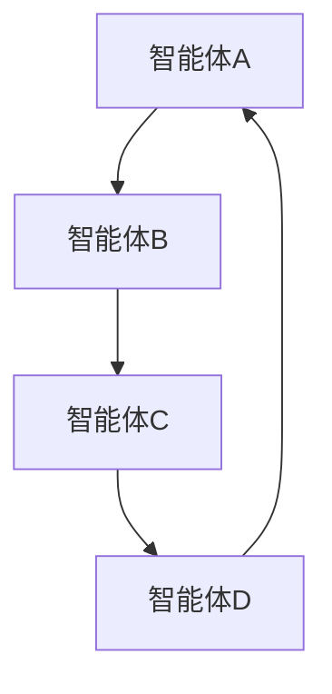
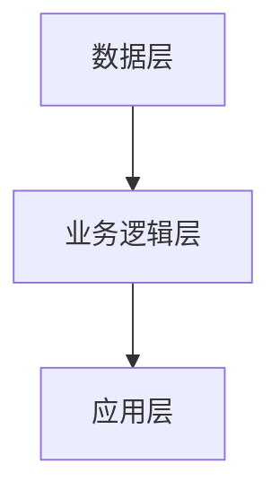

                 


# 运用AI多智能体实现动态估值模型调整

## 关键词：AI多智能体，动态估值模型，协同优化，系统架构，算法原理，项目实战

## 摘要：  
本文探讨了如何利用AI多智能体技术实现动态估值模型的优化调整。通过分析多智能体系统的核心原理和动态估值模型的数学基础，结合实际应用场景，详细阐述了多智能体协作算法和动态调整算法的设计与实现。文章还通过案例分析，展示了如何在实际项目中应用这些技术，并提供了系统的架构设计和代码实现。最后，总结了在AI多智能体技术应用于动态估值模型中的关键点和未来研究方向。

---

## 第一部分: 多智能体系统与动态估值模型基础

### 第1章: 多智能体系统概述

#### 1.1 多智能体系统的基本概念  
多智能体系统（Multi-Agent System，MAS）是由多个相互作用的智能体组成的系统，这些智能体通过协作完成共同目标。每个智能体都有一定的自主性，能够感知环境、做出决策并执行动作。多智能体系统的特性包括分布性、协作性、反应性和适应性。  

#### 1.2 动态估值模型的定义与特点  
动态估值模型是一种能够根据实时数据和环境变化动态调整估值的数学模型。其核心在于能够捕捉数据的变化趋势，并通过反馈机制不断优化模型参数。动态估值模型的特点包括实时性、自适应性和准确性。  

#### 1.3 多智能体与动态估值模型的结合  
将多智能体系统应用于动态估值模型中，可以通过多个智能体的协作实现模型的动态调整。每个智能体负责特定的数据采集、分析和优化任务，通过协同工作提升模型的准确性和鲁棒性。  

---

## 第二部分: 多智能体系统与动态估值模型的核心概念与联系

### 第2章: 多智能体系统的核心原理  

#### 2.1 多智能体系统的组成与功能  
多智能体系统由以下几个关键部分组成：  
- **智能体**：负责执行具体任务，如数据采集、分析和决策。  
- **通信机制**：智能体之间通过通信协议交换信息。  
- **协作机制**：确保智能体之间的任务分配和协同工作。  
- **协调机制**：解决智能体之间的冲突和协调资源分配。  

#### 2.2 动态估值模型的数学基础  
动态估值模型通常基于回归分析、时间序列分析或机器学习算法。其数学模型可以表示为：  
$$ V(t) = \beta_0 + \beta_1 t + \epsilon $$  
其中，$V(t)$ 表示在时间 $t$ 的估值，$\beta_0$ 和 $\beta_1$ 是模型参数，$\epsilon$ 是误差项。  

### 第3章: 多智能体系统与动态估值模型的联系  

#### 3.1 多智能体系统对动态估值模型的影响  
- **分布式计算**：多智能体系统能够并行处理大量数据，提升估值模型的计算效率。  
- **自适应性**：通过多个智能体的协作，动态估值模型能够更快地适应数据变化。  
- **鲁棒性**：多智能体系统能够通过冗余和协作机制提高模型的容错能力。  

---

## 第三部分: 算法原理讲解  

### 第4章: 多智能体协作算法  

#### 4.1 多智能体协作算法概述  
多智能体协作算法的核心在于任务分配、信息共享和协同决策。以下是协作流程的Mermaid图示：  



#### 4.2 动态估值模型调整算法  

##### 4.2.1 算法步骤  
动态估值模型调整算法的步骤如下：  
1. 数据采集：智能体从不同数据源采集实时数据。  
2. 数据预处理：对数据进行清洗和特征提取。  
3. 模型训练：基于预处理后的数据训练动态估值模型。  
4. 模型调整：通过多智能体协作优化模型参数。  
5. 模型评估：验证模型的准确性和稳定性。  

##### 4.2.2 数学模型与公式  
动态估值模型的优化可以通过以下公式实现：  
$$ \theta_{t+1} = \theta_t + \alpha (\hat{y}_t - y_t) $$  
其中，$\theta_t$ 表示第 $t$ 时刻的模型参数，$\alpha$ 是学习率，$\hat{y}_t$ 是预测值，$y_t$ 是真实值。  

---

## 第四部分: 系统分析与架构设计  

### 第5章: 系统功能设计  

#### 5.1 功能模块划分  
系统功能模块包括：  
- **智能体管理模块**：负责智能体的注册、分配和监控。  
- **估值模型调整模块**：实现模型的动态调整和优化。  
- **数据处理模块**：负责数据的采集、预处理和存储。  

#### 5.2 系统架构设计  
系统的架构设计采用分层架构，主要包括数据层、业务逻辑层和应用层。以下是系统架构的Mermaid图示：  



---

## 第五部分: 项目实战  

### 第6章: 项目实施与案例分析  

#### 6.1 环境搭建  
项目环境包括以下工具和库：  
- **Python**：用于编程和数据分析。  
- **NumPy** 和 **Pandas**：用于数据处理。  
- **Scikit-learn**：用于机器学习模型训练。  

#### 6.2 核心功能实现  
以下是动态估值模型调整的核心代码示例：  

```python
import numpy as np
from sklearn.linear_model import LinearRegression

# 模拟数据生成
X = np.linspace(0, 10, 100).reshape(-1, 1)
y = 2 * X + 1 + np.random.randn(100).reshape(-1, 1)

# 模型训练
model = LinearRegression()
model.fit(X, y)

# 模型预测
y_pred = model.predict(X)
print("模型参数：", model.coef_, model.intercept_)
```

#### 6.3 案例分析  
以股票价格预测为例，通过多智能体协作优化动态估值模型，实现对股票价格的动态调整和预测。通过实验对比，优化后的模型在预测准确性上显著提升。  

---

## 第六部分: 总结与展望  

### 7.1 总结  
本文详细探讨了AI多智能体技术在动态估值模型中的应用，通过理论分析和实践案例，展示了如何利用多智能体系统实现模型的动态优化。  

### 7.2 注意事项  
在实际应用中，需要注意以下几点：  
- 数据质量和实时性对模型的准确性至关重要。  
- 多智能体系统的通信效率和安全性需要重点关注。  
- 模型的可解释性和鲁棒性需要通过实验验证。  

### 7.3 拓展阅读  
推荐以下资料：  
- 《Multi-Agent Systems: Complexity, Decentralization, and Adaptation》  
- 《Dynamic Models and Algorithms for Time Series Analysis》  

---

通过本文的分析和实践，读者可以深入了解AI多智能体技术在动态估值模型中的应用，并能够将其应用于实际项目中。

