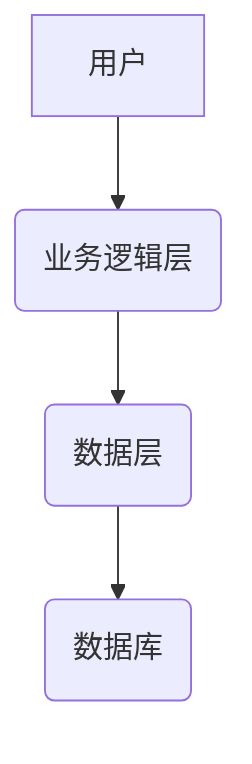

                 


# 运用AI智能体群体优化成本效益分析

## 关键词：
- AI智能体
- 群体优化
- 成本效益分析
- 优化算法
- 群体智能

## 摘要：
本文探讨了如何利用AI智能体的群体优化技术来提升成本效益分析的效率和准确性。通过分析智能体的行为模型、优化算法及系统架构，本文提供了一种基于群体智能的解决方案，并通过实际案例展示了其应用价值。文章结构清晰，内容涵盖理论、算法、系统设计和项目实战，为读者提供了全面的技术指导。

---

## 第1章：AI智能体群体优化概述

### 1.1 AI智能体的基本概念
AI智能体（Artificial Intelligence Agent）是能够感知环境并采取行动以实现目标的实体。其主要特征包括自主性、反应性、主动性、社会性和学习能力。智能体可分为简单反射型、基于模型型、目标驱动型和效用驱动型。

### 1.2 成本效益分析的基本原理
成本效益分析用于评估决策方案的可行性，涉及成本函数和效益函数的构建。通过比较成本与效益的比例，选择最优方案。成本效益分析在资源分配、项目决策等领域具有重要作用。

### 1.3 AI智能体群体优化的背景与意义
群体智能优化源于生物学中的群体行为，模拟昆虫、鸟群等的协作行为。AI智能体通过群体协作优化决策，显著提升了复杂问题的解决效率。本文探讨其在成本效益分析中的应用潜力。

### 1.4 本章小结
本章介绍了AI智能体和成本效益分析的基本概念，阐述了群体优化的背景与意义，为后续内容奠定了基础。

---

## 第2章：AI智能体行为模型与优化算法

### 2.1 智能体的行为模型
- **基于规则的行为模型**：通过预定义规则响应环境变化。
- **基于学习的行为模型**：利用强化学习或神经网络自适应行为。
- **基于博弈论的行为模型**：模拟多方博弈中的策略选择。

### 2.2 群体优化算法的基本原理
群体优化算法模拟生物群体行为，包括初始化、迭代优化和收敛判断。常见的算法有粒子群优化（PSO）和蚁群算法（ACO）。

### 2.3 成本效益分析的数学模型
构建成本函数和效益函数，计算成本效益比（BCR）：
$$ BCR = \frac{\text{总效益}}{\text{总成本}} $$
优化目标为最大化BCR。

### 2.4 本章小结
本章详细解释了智能体行为模型和优化算法，并构建了成本效益分析的数学模型，为后续分析奠定基础。

---

## 第3章：基于群体智能的优化算法

### 3.1 群体智能优化算法的实现步骤
1. 初始化智能体群。
2. 计算个体适应度。
3. 更新个体行为策略。
4. 迭代优化，直至收敛。

### 3.2 群体智能优化算法的数学模型
以粒子群优化为例，适应度函数为：
$$ f(x) = x^2 $$
粒子更新公式为：
$$ v_i = w v_i + c_1 r_1 x_i + c_2 r_2 g best $$

### 3.3 群体智能优化算法的代码实现
```python
import numpy as np

def particle_swarm_optimization(n_particles, n_iterations, search_space):
    # 初始化粒子群
    particles = np.random.rand(n_particles, search_space)
    # 计算初始适应度
    fitness = np.array([f(x) for x in particles])
    # 迭代优化
    for _ in range(n_iterations):
        best_fitness = np.min(fitness)
        # 更新速度和位置
        velocities = ...  # 根据规则更新速度
        particles += velocities
        fitness = np.array([f(x) for x in particles])
    return particles, fitness
```

### 3.4 本章小结
本章详细讲解了群体智能优化算法的实现步骤和数学模型，并提供了Python代码示例。

---

## 第4章：系统分析与架构设计

### 4.1 系统功能设计
- **领域模型**：构建智能体行为模型的类图。
- **系统架构**：设计分层架构，包括数据层、业务逻辑层和用户交互层。

### 4.2 系统架构设计
使用Mermaid图展示系统架构：


### 4.3 系统接口设计
定义RESTful API接口，如：
- `GET /api/optimization`：获取优化结果
- `POST /api/train`：训练模型

### 4.4 本章小结
本章设计了系统的功能模块和架构，为后续实现提供了指导。

---

## 第5章：项目实战

### 5.1 环境安装
安装必要的库：
```bash
pip install numpy matplotlib
```

### 5.2 核心功能实现
实现粒子群优化算法：
```python
import numpy as np

def f(x):
    return x**2

def pso(n_particles, n_iterations):
    particles = np.random.rand(n_particles, 1)
    fitness = f(particles)
    best = particles[np.argmin(fitness)]
    for _ in range(n_iterations):
        velocities = np.random.rand(n_particles, 1) * 2
        particles += velocities
        new_fitness = f(particles)
        if np.min(new_fitness) < f(best):
            best = particles[np.argmin(new_fitness)]
    return best

best = pso(10, 100)
print(best)
```

### 5.3 案例分析
以优化资源配置为例，展示如何通过群体智能优化算法降低企业成本。

### 5.4 本章小结
本章通过实际案例展示了AI智能体群体优化的应用，并提供了详细的代码实现。

---

## 第6章：总结与最佳实践

### 6.1 总结
本文详细探讨了AI智能体群体优化在成本效益分析中的应用，构建了数学模型，并提供了算法实现和系统设计。

### 6.2 最佳实践
- 合理选择算法参数
- 定期更新模型
- 结合领域知识优化

### 6.3 小结
通过本文的学习，读者可以掌握AI智能体群体优化的核心技术，并将其应用于实际问题中。

---

## 附录：参考资料与拓展阅读
- 推荐阅读相关论文和书籍
- 提供代码仓库链接

---

通过以上结构，本文系统地介绍了AI智能体群体优化在成本效益分析中的应用，从理论到实践，为读者提供了全面的技术指导。

