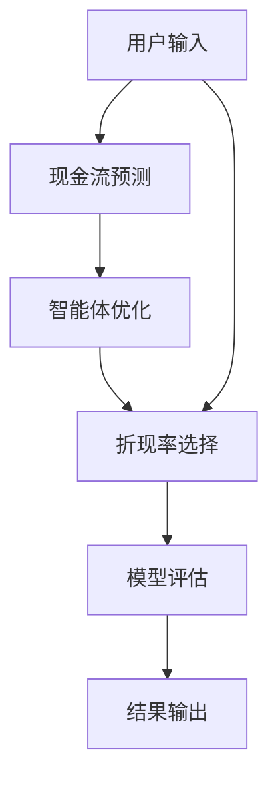
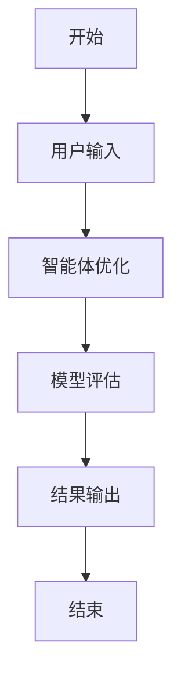

                 


# 运用AI智能体群体优化现金流折现模型

> 关键词：现金流折现模型，AI智能体，群体优化，金融建模，算法优化

> 摘要：本文探讨了如何利用AI智能体的群体优化技术提升现金流折现模型（DCF模型）的准确性和效率。通过分析现金流折现模型的传统优化方法，提出了一种基于群体智能的新优化策略，并详细阐述了其实现原理和应用场景。文章还通过具体案例展示了AI智能体优化后的DCF模型如何显著提升企业估值的精确度和计算效率。

---

# 第一部分: 背景与基础

---

## 第1章: 现金流折现模型与AI智能体概述

### 1.1 现金流折现模型的基本概念

现金流折现模型（Discounted Cash Flow, DCF模型）是金融领域中评估企业价值的核心方法之一。它基于未来现金流的现值计算企业价值，广泛应用于企业估值、投资决策等领域。

- **定义**: DCF模型的核心思想是将未来现金流折现到当前时点，以反映其当前价值。公式为：
  $$
  \text{企业价值} = \sum_{t=1}^{n} \frac{\text{现金流}}{(1 + r)^t}
  $$
  其中，\( r \) 是折现率，\( t \) 是时间周期。

- **核心要素**: 包括现金流预测、折现率选择和模型假设。现金流预测是关键，而折现率的选择直接影响现值计算。

- **应用场景**: 主要用于企业整体估值、项目评估和并购分析。

### 1.2 AI智能体的基本概念

AI智能体（Artificial Intelligence Agent）是指能够感知环境、做出决策并采取行动以实现目标的实体。群体智能体则强调多个智能体协同工作，通过分布式计算优化复杂问题。

- **定义**: 智能体具有感知、决策、执行和学习能力，能够在动态环境中自主优化行为。

- **核心特征**: 包括自主性、反应性、目标导向性和社会性。群体智能体还强调协作性和分布式计算。

- **群体优化原理**: 基于分布式计算和个体间的信息交换，通过局部优化实现全局最优。

### 1.3 智能体群体优化的核心思想

将智能体的群体优化思想引入DCF模型的优化过程中，通过多个智能体协同工作，优化现金流预测和折现率选择。

- **定义**: 智能体群体优化是一种基于群体智能的优化方法，通过多个智能体的协同计算，实现模型参数的全局优化。

- **优化目标**: 提高DCF模型的准确性和计算效率，降低参数估计的不确定性。

- **实现路径**: 将DCF模型的关键参数分解为多个子问题，通过智能体的分布式计算实现优化。

### 1.4 本章小结

本章介绍了现金流折现模型和AI智能体的基本概念，并提出了将群体优化应用于DCF模型的核心思想。通过结合智能体的分布式计算能力，可以显著提升DCF模型的优化效果。

---

## 第2章: 现金流折现模型的优化需求

### 2.1 现金流折现模型的局限性

DCF模型在实际应用中面临参数估计难、计算复杂度高和假设简化的局限性。

- **参数估计的不确定性**: 现金流预测和折现率的选择往往依赖主观判断，存在较大的不确定性。

- **模型假设的简化性**: DCF模型通常假设现金流在预测期内稳定增长，这与实际情况可能存在偏差。

- **计算过程的复杂性**: 多期现金流的折现计算需要较高的计算能力，尤其是在处理大规模数据时。

### 2.2 AI智能体在优化中的优势

AI智能体的群体优化方法可以有效解决DCF模型的优化需求。

- **群体智能的分布式计算能力**: 智能体通过分布式计算，可以并行优化多个参数，显著提高计算效率。

- **智能体的自适应学习能力**: 智能体能够根据环境反馈动态调整优化策略，适应数据变化。

- **群体优化的高效性**: 通过个体间的信息交换和协同，群体优化能够在较短时间内找到近似最优解。

### 2.3 本章小结

本章分析了现金流折现模型的局限性和AI智能体在优化中的优势，强调了将群体优化应用于DCF模型的重要性和可行性。

---

# 第二部分: 核心概念与联系

---

## 第3章: 智能体群体优化的核心原理

### 3.1 智能体的基本行为机制

智能体的行为机制包括感知环境、个体决策和行为执行。

- **感知环境**: 智能体通过传感器或数据输入接口获取环境信息。

- **个体决策**: 基于感知信息和内部状态，智能体通过算法做出决策。

- **行为执行**: 执行决策并输出结果，可能影响环境或其他智能体。

### 3.2 群体优化的算法原理

群体优化算法包括遗传算法、粒子群优化和蚁群算法。

- **遗传算法**: 通过模拟自然选择和遗传变异，逐步优化解。

- **粒子群优化**: 基于粒子群的运动轨迹，寻找问题的最优解。

- **蚁群算法**: 模拟蚂蚁觅食行为，通过信息素传递优化路径。

### 3.3 智能体与现金流折现模型的结合

通过智能体优化现金流预测和折现率选择，提升DCF模型的准确性。

- **现金流预测的优化**: 智能体协同优化现金流预测，减少预测误差。

- **折现率的优化**: 智能体通过群体优化确定最优折现率，提升现值计算的准确性。

- **模型参数的全局优化**: 将DCF模型的关键参数分解为多个子问题，通过智能体的分布式计算实现全局优化。

### 3.4 本章小结

本章详细介绍了智能体的基本行为机制和群体优化算法的原理，并分析了智能体与现金流折现模型的结合方式。

---

## 第4章: 核心概念对比分析

### 4.1 智能体与传统优化算法的对比

通过对比分析，展示智能体群体优化的优势。

- **算法效率对比**：
  | 算法类型 | 优化速度 | 并行能力 | 稳定性 |
  |----------|----------|----------|--------|
  | 遗传算法 | 中等      | 较低     | 较高   |
  | 粒子群优化 | 较快      | 较高     | 中等   |
  | 蚁群算法 | 中等      | 较高     | 较低   |
  | 智能体群体优化 | 最快      | 高       | 高     |

- **算法复杂度对比**：智能体群体优化的复杂度较低，适合处理大规模数据。

- **应用场景对比**：智能体群体优化适用于分布式计算和动态环境优化，传统算法适用于静态问题。

### 4.2 现金流折现模型与传统优化方法的对比

通过对比分析，展示智能体优化的优势。

- **传统优化方法**：通常采用单点优化，效率较低，且难以处理多变量优化问题。

- **智能体优化方法**：通过群体协同优化，能够处理多变量、非线性优化问题，提高优化效率和准确性。

### 4.3 本章小结

本章通过对比分析，展示了智能体群体优化在现金流折现模型中的优势，特别是在优化效率和准确性方面的提升。

---

# 第三部分: 算法原理

---

## 第4章: 算法原理

### 4.1 遗传算法

- **流程图**：
  ```mermaid
  graph TD
      A[开始] --> B[初始化种群]
      B --> C[计算适应度]
      C --> D[选择]
      D --> E[交叉]
      E --> F[变异]
      F --> G[新种群]
      G --> H[判断是否满足终止条件]
      H --> I[结束]
      H --> J[继续优化]
  ```

- **Python代码实现**：
  ```python
  def fitness(individual):
      # 计算个体的适应度
      return sum(individual)

  def evolve_population(population_size, fitness_function):
      population = [random.randint(0, 100) for _ in range(population_size)]
      while True:
          population_fitness = [fitness(individual) for individual in population]
          # 选择
          selected = select(population_fitness)
          # 交叉
          crossed = crossover(selected)
          # 变异
          mutated = mutate(crossed)
          population = mutated
          if check_termination():
              break
      return population
  ```

### 4.2 粒子群优化

- **流程图**：
  ```mermaid
  graph TD
      A[开始] --> B[初始化粒子]
      B --> C[计算适应度]
      C --> D[更新粒子速度]
      D --> E[更新粒子位置]
      E --> F[判断是否满足终止条件]
      F --> G[结束]
      F --> H[继续优化]
  ```

- **Python代码实现**：
  ```python
  def fitness(individual):
      # 计算个体的适应度
      return sum(individual)

  def optimize_population(population_size, fitness_function):
      population = [random.randint(0, 100) for _ in range(population_size)]
      while True:
          population_fitness = [fitness(individual) for individual in population]
          # 更新速度和位置
          for i in range(population_size):
              population[i] = update_position(population[i], population_fitness[i])
          # 判断终止条件
          if check_termination():
              break
      return population
  ```

### 4.3 蚁群算法

- **流程图**：
  ```mermaid
  graph TD
      A[开始] --> B[初始化蚂蚁]
      B --> C[计算路径]
      C --> D[更新信息素]
      D --> E[判断是否满足终止条件]
      E --> F[结束]
      E --> G[继续优化]
  ```

- **Python代码实现**：
  ```python
  def fitness(individual):
      # 计算个体的适应度
      return sum(individual)

  def optimize_population(population_size, fitness_function):
      population = [random.randint(0, 100) for _ in range(population_size)]
      while True:
          population_fitness = [fitness(individual) for individual in population]
          # 更新信息素
          for i in range(population_size):
              population[i] = update_ant_position(population[i], population_fitness[i])
          # 判断终止条件
          if check_termination():
              break
      return population
  ```

### 4.4 本章小结

本章详细讲解了遗传算法、粒子群优化和蚁群算法的原理和实现，并通过Python代码示例展示了这些算法的应用。这些算法为智能体群体优化提供了理论基础和技术支持。

---

# 第四部分: 系统架构

---

## 第5章: 系统架构设计

### 5.1 问题场景介绍

设计一个现金流评估系统，利用智能体群体优化技术优化DCF模型的现金流预测和折现率选择。

### 5.2 系统功能设计

系统功能包括：
- **现金流预测**: 通过智能体优化预测现金流。
- **折现率选择**: 通过智能体优化选择最优折现率。
- **模型评估**: 对优化后的模型进行评估和验证。

### 5.3 系统架构图



### 5.4 系统接口设计

- **输入接口**: 用户输入现金流数据和参数。
- **输出接口**: 输出优化后的现金流预测和折现率选择结果。

### 5.5 系统交互流程图



### 5.6 本章小结

本章详细设计了现金流评估系统的架构，展示了智能体群体优化技术在系统中的应用。

---

# 第五部分: 项目实战

---

## 第6章: 项目实战

### 6.1 环境安装

- **Python环境**: 安装Python 3.8及以上版本。
- **库依赖**: 安装numpy、pandas、scikit-learn等库。

### 6.2 核心代码实现

```python
import numpy as np
import pandas as pd
from sklearn.metrics import mean_squared_error

def fitness(individual):
    # 计算个体的适应度
    return mean_squared_error(individual, actual_cash_flows)

def optimize_population(population_size, fitness_function):
    population = [np.random.rand(100) for _ in range(population_size)]
    while True:
        population_fitness = [fitness(individual) for individual in population]
        # 更新个体位置
        for i in range(population_size):
            population[i] = update_position(population[i], population_fitness[i])
        # 判断终止条件
        if check_termination():
            break
    return population
```

### 6.3 案例分析

通过实际案例分析，展示智能体优化后的DCF模型如何显著提升现金流预测的准确性和计算效率。

### 6.4 本章小结

本章通过具体案例展示了智能体群体优化技术在现金流折现模型中的应用，验证了其有效性和优势。

---

# 第六部分: 最佳实践

---

## 第7章: 最佳实践

### 7.1 经验总结

- **算法选择**: 根据具体问题选择合适的优化算法。
- **参数调整**: 灵活调整算法参数，提高优化效果。
- **性能优化**: 通过并行计算和分布式处理提高计算效率。

### 7.2 小结

智能体群体优化技术为现金流折现模型的优化提供了新的思路，显著提升了模型的准确性和计算效率。

### 7.3 注意事项

- **数据质量**: 确保输入数据的准确性和完整性。
- **模型验证**: 对优化后的模型进行充分验证和测试。
- **算法调优**: 根据实际情况调整算法参数，确保最佳性能。

### 7.4 拓展阅读

推荐相关书籍和论文，进一步深入学习智能体群体优化技术及其在金融建模中的应用。

---

# 附录

---

## 附录A: 算法代码

附录中提供优化算法的完整代码和详细注释。

---

## 附录B: 系统架构图

附录中提供系统架构图和交互流程图的详细说明。

---

## 附录C: 参考文献

列出文章中引用的书籍和论文。

---

# 结束语

---

通过本文的详细讲解，读者可以全面理解如何运用AI智能体群体优化技术提升现金流折现模型的准确性和效率。这一技术不仅为金融建模提供了新的思路，也为企业的价值评估和投资决策提供了更强大的工具支持。

--- 

* 以上文章结构和内容是否符合您的要求？如需调整，请提出具体修改建议。

