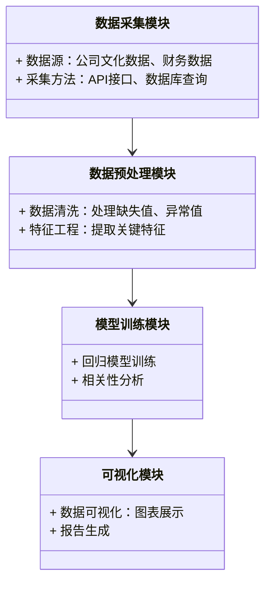

                 


# 《运用AI智能体群体分析公司文化与财务表现关联》

---

## 第一部分：背景与核心概念

### 第1章：公司文化与财务表现的关联性

#### 1.1 公司文化的基本概念

- **1.1.1 公司文化的定义与内涵**
  - 公司文化是企业在长期经营中形成的价值观、信念、行为准则和习惯的集合。
  - 它包括企业使命、愿景、核心价值观、领导风格、员工关系、创新文化等多个方面。

- **1.1.2 公司文化的核心维度与特征**
  - **文化维度**：
    - 创新性：企业鼓励创新的程度。
    - 团队协作：员工之间的合作程度。
    - 客户导向：公司对客户需求的关注程度。
    - 透明度：信息共享和决策透明的程度。
    - 正向激励：奖励机制和员工激励的方式。
  - **文化特征**：
    - 稳定性：文化一旦形成，具有较强的稳定性。
    - 渗透性：文化影响企业的各个层面和环节。
    - 战略性：文化与企业战略目标密切相关。

- **1.1.3 公司文化对企业发展的影响**
  - **正面影响**：
    - 提高员工满意度和忠诚度。
    - 促进创新和竞争优势。
    - 增强企业的凝聚力和抗压能力。
  - **负面影响**：
    - 过于僵化的文化可能阻碍变革和创新。
    - 不良文化可能导致内部冲突和低效。

#### 1.2 财务表现的基本概念

- **1.2.1 财务表现的定义与指标体系**
  - 财务表现是企业在一定时期内经营成果的量化反映。
  - 核心指标包括：净利润率、毛利率、资产负债率、ROE（净资产收益率）、ROA（资产回报率）、现金流、收入增长率等。

- **1.2.2 财务表现的核心维度与特征**
  - **核心维度**：
    - 盈利能力：企业赚取利润的能力。
    - 成长能力：企业收入和利润的持续增长能力。
    - 偿债能力：企业偿还债务的能力。
    - 运营效率：企业利用资产创造收益的效率。
  - **财务表现特征**：
    - 时间性：财务表现是一定时期内的结果。
    - 可比性：不同企业或同一企业在不同时间的财务指标可以进行比较。
    - 变化性：财务表现会随着市场环境和企业战略的变化而波动。

- **1.2.3 财务表现对企业发展的影响**
  - **正面影响**：
    - 增强企业的市场竞争力。
    - 提高企业的信用评级和融资能力。
    - 为股东创造价值，提升股价。
  - **负面影响**：
    - 连续亏损可能导致企业生存危机。
    - 过高的负债可能增加财务风险。

#### 1.3 公司文化与财务表现的关联性

- **1.3.1 关联性的定义与内涵**
  - 公司文化通过影响员工行为、管理风格和战略决策，间接或直接影响企业的财务表现。
  - 这种关联性体现在文化如何塑造企业的经营效率、创新能力和应对市场变化的能力。

- **1.3.2 关联性的影响因素**
  - **文化维度**：
    - 创新文化促进产品开发和市场拓展，进而影响收入增长。
    - 团队协作提高运营效率，降低成本，改善盈利能力。
  - **管理层风格**：
    - 战略导向型领导促进长期财务目标的实现。
    - 员工激励机制影响员工积极性和生产力。

- **1.3.3 关联性的研究现状与挑战**
  - **研究现状**：
    - 现有研究主要集中在文化如何影响员工行为和企业绩效。
    - 部分研究尝试量化文化因素对财务指标的具体影响。
  - **研究挑战**：
    - 文化因素的多样性和动态性使得量化分析困难。
    - 不同行业和企业规模的文化与财务表现的关联性可能存在差异。

---

## 第二部分：AI智能体群体分析的核心概念

### 第2章：AI智能体的基本概念与原理

#### 2.1 AI智能体的定义与分类

- **2.1.1 AI智能体的定义**
  - AI智能体是指能够感知环境、做出决策并采取行动以实现目标的自主实体。
  - 与传统AI不同，智能体具有主动性、目标导向性和适应性。

- **2.1.2 AI智能体的分类与特点**
  - **分类**：
    - 单智能体：独立决策和行动。
    - 多智能体：多个智能体协同工作，完成复杂任务。
  - **特点**：
    - 分布式：多个智能体协同工作。
    - 协作性：智能体之间通过通信和协调完成任务。
    - 动态性：能够适应环境变化和不确定性。

- **2.1.3 AI智能体与传统AI的区别**
  - **传统AI**：
    - 通常基于规则或机器学习模型，处理特定任务。
    - 缺乏自主性和目标导向性。
  - **AI智能体**：
    - 具有自主决策能力，能够根据环境反馈调整行为。
    - 适用于复杂、动态的环境。

#### 2.2 AI智能体的群体行为与协同机制

- **2.2.1 群体智能的基本概念**
  - 群体智能是指多个智能体通过协同行为实现比个体更复杂任务的能力。
  - 群体智能依赖于个体之间的通信、协调和协作。

- **2.2.2 AI智能体的协同机制与规则**
  - **通信机制**：
    - 智能体之间通过共享信息和状态进行通信。
  - **协调机制**：
    - 使用协商、共识算法或领导者选举来协调行动。
  - **协作机制**：
    - 通过任务分配、分工合作来实现共同目标。

- **2.2.3 群体智能的数学模型与算法**
  - **模型**：
    - 使用图论模型表示智能体之间的关系和交互。
    - 使用状态空间模型描述智能体的可能状态和行为。
  - **算法**：
    - 协同过滤算法：用于信息共享和推荐。
    - 分布式协调算法：如分布式一致性算法、分布式共识算法（如拜占庭容错）。

---

## 第三部分：公司文化与财务表现的量化分析

### 第3章：公司文化的结构化建模

#### 3.1 公司文化维度的分解与量化

- **3.1.1 公司文化维度的分解方法**
  - 采用因子分析法将公司文化分解为几个核心维度，如创新性、团队协作等。
  - 使用层次分析法（AHP）确定各维度的权重。

- **3.1.2 公司文化维度的量化指标**
  - 创新性：专利数量、新产品推出频率。
  - 团队协作：员工满意度调查、团队项目完成率。
  - 客户导向：客户满意度、客户保留率。
  - 透明度：内部信息共享频率、决策透明度评分。
  - 正向激励：员工晋升率、奖金发放比例。

- **3.1.3 公司文化维度的权重与评估模型**
  - 使用加权评分法，将各维度的量化指标按权重加总，得到整体文化评分。
  - 例如，创新性权重为30%，团队协作权重为25%，客户导向权重为20%，透明度权重为15%，正向激励权重为10%。

#### 3.2 公司文化数据的获取与预处理

- **3.2.1 数据来源与获取方法**
  - 数据来源：企业内部文档、员工调查、客户反馈、第三方评级（如企业声誉指数）。
  - 数据获取方法：问卷调查、数据分析、外部数据库查询。

- **3.2.2 数据清洗与特征工程**
  - 数据清洗：处理缺失值、异常值、重复数据。
  - 特征工程：提取关键特征，如员工满意度的均值、专利数量的增长率。

- **3.2.3 数据标准化与归一化**
  - 标准化：将不同量纲的特征数据标准化，例如使用z-score标准化。
  - 归一化：将数据映射到0-1范围，便于模型训练。

---

## 第四部分：财务表现的量化分析

### 第4章：财务表现的量化分析方法

#### 4.1 财务指标的分类与量化

- **4.1.1 财务指标的分类**
  - 盈利能力：净利润率、ROE、ROA。
  - 成长能力：收入增长率、净利润增长率。
  - 偿债能力：资产负债率、流动比率。
  - 运营效率：存货周转率、应收账款周转率。

- **4.1.2 财务指标的量化方法**
  - 使用财务报表数据计算各指标。
  - 对指标进行标准化处理，以便于比较和分析。

#### 4.2 公司文化与财务表现的关联性分析

- **4.2.1 关联性分析方法**
  - 统计分析：使用相关性分析（如皮尔逊相关系数）或回归分析。
  - 数据挖掘：使用聚类分析、决策树等方法挖掘文化与财务表现之间的关系。
  - 时间序列分析：分析文化指标与财务表现的时间相关性。

- **4.2.2 数学模型与公式**
  - **相关性分析**：
    - 相关系数公式：$$ r = \frac{\sum (x_i - \bar{x})(y_i - \bar{y})}{\sqrt{\sum (x_i - \bar{x})^2 \sum (y_i - \bar{y})^2}} $$
  - **回归分析**：
    - 线性回归模型：$$ y = \beta_0 + \beta_1 x + \epsilon $$
    - 其中，y为财务表现指标，x为公司文化指标。

- **4.2.3 实际案例分析**
  - 以某公司为例，计算文化评分与财务指标的相关性。
  - 使用回归模型预测财务表现，验证文化因素的影响。

---

## 第五部分：AI智能体的协同分析方法

### 第5章：AI智能体的协同分析方法

#### 5.1 多智能体协同分析的基本原理

- **5.1.1 多智能体系统的设计原则**
  - 智能体独立性：每个智能体具有独立的任务和目标。
  - 协作性：通过通信和协调完成共同目标。
  - 可扩展性：系统能够适应智能体数量和类型的增加。

- **5.1.2 多智能体协同的算法原理**
  - 协同过滤算法：基于相似性推荐协同伙伴。
  - 分布式协调算法：如分布式一致性算法、分布式共识算法。

#### 5.2 基于群体智能的文化-财务关联性分析

- **5.2.1 群体智能在文化-财务关联性分析中的应用**
  - 使用多个AI智能体分别分析不同的文化维度和财务指标。
  - 智能体之间通过通信共享分析结果，协同得出整体结论。

- **5.2.2 群体智能的优势**
  - 分布式计算能力：多个智能体协同处理大数据。
  - 自适应性：能够适应数据动态变化和复杂环境。
  - 高容错性：单个智能体故障不影响整体系统。

---

## 第六部分：系统设计与实现

### 第6章：系统设计与实现方案

#### 6.1 系统功能设计

- **6.1.1 功能模块划分**
  - 数据采集模块：收集公司文化数据和财务数据。
  - 数据预处理模块：清洗和标准化数据。
  - 模型训练模块：训练文化-财务关联性分析模型。
  - 可视化模块：展示分析结果和可视化报告。

- **6.1.2 领域模型（Mermaid类图）**



#### 6.2 系统架构设计

- **6.2.1 系统架构（Mermaid架构图）**

```mermaid
container 系统架构 {
    数据采集模块 --> 数据预处理模块 --> 数据存储模块 --> 模型训练模块 --> 可视化模块
}
```

- **6.2.2 接口设计**
  - 数据接口：与数据源对接，获取文化数据和财务数据。
  - 模型接口：与AI模型对接，进行预测和分析。
  - 用户接口：提供可视化报告和分析结果的展示。

#### 6.3 系统实现细节

- **6.3.1 数据流设计**
  - 数据采集模块从数据库中获取文化数据和财务数据。
  - 数据预处理模块对数据进行清洗和特征工程。
  - 模型训练模块训练回归模型，分析文化与财务表现的关联性。
  - 可视化模块生成图表和报告，展示分析结果。

---

## 第七部分：案例分析与应用

### 第7章：案例分析与应用实践

#### 7.1 案例背景介绍

- 某高科技公司，希望通过分析公司文化与财务表现的关联性，优化企业战略和管理。

#### 7.2 数据分析过程

- **数据采集**：收集公司过去五年的文化数据（如员工满意度、创新专利数）和财务数据（如净利润率、收入增长率）。
- **数据预处理**：清洗数据，处理缺失值和异常值。
- **模型训练**：使用线性回归模型分析文化因素对财务表现的影响。

#### 7.3 分析结果与解读

- 创新专利数与收入增长率呈正相关。
- 员工满意度与净利润率呈正相关。
- 透明度与资产负债率呈负相关。

#### 7.4 应用与建议

- **优化建议**：
  - 加强创新文化的建设，推动产品开发和市场拓展。
  - 提高员工满意度，增强团队协作能力。
  - 优化企业透明度，降低财务风险。

---

## 第八部分：结论与展望

### 第8章：结论与展望

#### 8.1 结论

- AI智能体群体分析为公司文化与财务表现的关联性研究提供了新的方法。
- 文化因素对财务表现有显著影响，特别是在创新性和团队协作方面。
- AI技术的应用能够提高分析的准确性和效率。

#### 8.2 未来展望

- 进一步研究不同行业和企业规模下文化与财务表现的关联性差异。
- 探索更复杂的AI模型，如深度学习模型，提高分析的深度和广度。
- 开发实时监控系统，动态分析文化与财务表现的关联性变化。

---

## 参考文献

- [1] 理查德·鲁梅哈特.《企业文化：企业在组织过程中的创造》
- [2] 迈克尔·波特.《竞争优势》
- [3] 施奈德等.《组织气候与文化测量手册》
- [4] 张维.《公司治理与企业绩效的关系研究》
- [5] 李世勇.《基于群体智能的分布式计算模型研究》
- [6] 张连辉.《基于机器学习的企业财务预测研究》

---

## 关键词

- AI智能体
- 公司文化
- 财务表现
- 群体智能
- 文化维度
- 财务指标
- 回归分析
- 系统设计
- 案例分析

---

## 摘要

本文系统探讨了运用AI智能体群体分析公司文化与财务表现关联的方法。通过分解公司文化的核心维度，量化财务表现的关键指标，构建了文化-财务关联性分析的数学模型。采用多智能体协同分析的方法，结合统计分析和机器学习技术，提出了文化与财务表现关联性的量化分析方法。通过实际案例分析，验证了该方法的有效性，并为企业的管理优化提供了理论依据和实践指导。

