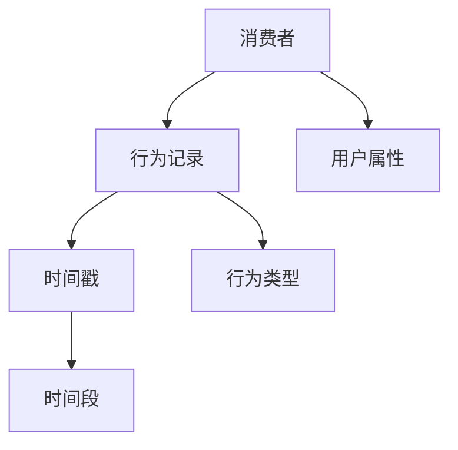
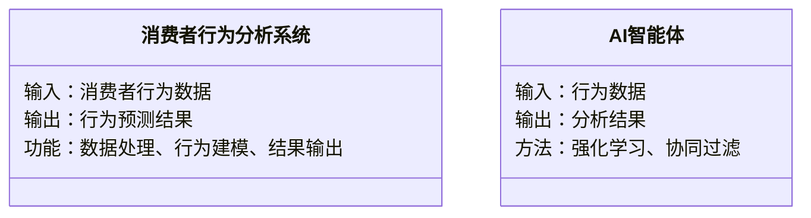
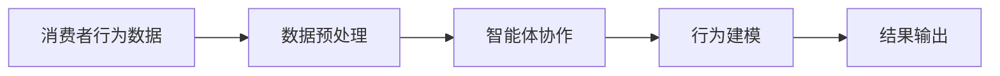
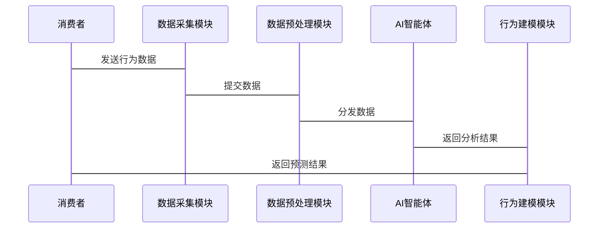

                 


# 运用AI智能体群体实现动态消费者行为分析

## 关键词
AI智能体，群体智能，消费者行为分析，动态行为分析，强化学习，协同过滤，聚类分析

## 摘要
本文探讨如何利用AI智能体群体实现动态消费者行为分析，从背景、概念、算法、系统架构到项目实战，全面解析该领域的技术实现与应用。通过介绍强化学习、协同过滤和聚类分析等算法，结合系统架构设计，展示如何构建高效的动态消费者行为分析系统。

---

# 第1章: 背景与概述

## 1.1 问题背景
### 1.1.1 消费者行为分析的现状与挑战
消费者行为分析是商业决策的核心，但传统方法依赖静态数据，难以捕捉实时动态变化。随着数据量的爆炸式增长，动态行为分析的需求日益迫切。

### 1.1.2 动态消费者行为分析的重要性
动态行为分析能够实时捕捉消费者行为变化，帮助企业快速响应市场变化，提升客户满意度和市场竞争力。

### 1.1.3 AI智能体群体的优势与潜力
AI智能体具备自主学习和决策能力，群体智能能够通过分布式协作解决复杂问题，为动态行为分析提供了新的技术路径。

## 1.2 问题描述
### 1.2.1 动态消费者行为的定义
动态消费者行为是指消费者在不同时间和场景下的行为变化，具有实时性、多样性和复杂性特点。

### 1.2.2 动态行为分析的核心问题
如何实时捕捉、建模和预测消费者行为，同时处理数据的动态变化和不确定性。

### 1.2.3 AI智能体群体的应用场景
在电商、社交媒体、金融等领域，AI智能体群体可以实时分析消费者行为，优化推荐系统和营销策略。

## 1.3 问题解决
### 1.3.1 AI智能体群体的解决方案
通过分布式智能体协作，实时处理消费者行为数据，实现动态行为建模和预测。

### 1.3.2 动态行为分析的实现方法
结合强化学习、协同过滤和聚类分析，构建动态行为分析模型。

### 1.3.3 群体智能的优势与实现路径
群体智能通过分布式计算和协作学习，能够在复杂环境中实现高效决策。

## 1.4 边界与外延
### 1.4.1 研究的边界
限定于消费者行为的实时动态分析，不涉及生产系统和供应链管理。

### 1.4.2 相关领域的外延
包括自然语言处理、计算机视觉等领域，但本文仅关注行为分析部分。

### 1.4.3 群体智能的适用范围
适用于需要实时决策和分布式协作的复杂场景。

## 1.5 概念结构与核心要素
### 1.5.1 核心概念组成
消费者行为数据、智能体协作、动态行为建模。

### 1.5.2 概念之间的关系
消费者行为数据是输入，智能体协作是处理过程，动态行为建模是输出结果。

## 1.6 本章小结
本章介绍了动态消费者行为分析的背景、问题、解决方案及其边界，为后续内容奠定了基础。

---

# 第2章: 消费者行为分析的核心概念与联系

## 2.1 核心概念原理
### 2.1.1 AI智能体的定义与属性
AI智能体是具备感知、决策和执行能力的实体，能够自主完成任务。

### 2.1.2 动态消费者行为分析的原理
通过实时数据流处理和智能体协作，动态建模消费者行为。

### 2.1.3 群体智能的基本概念
群体智能是多个智能体通过协作完成复杂任务的集体智慧。

## 2.2 概念属性特征对比
| 概念 | 属性 | 特征 |
|------|------|------|
| AI智能体 | 感知 | 数据采集能力 |
| 动态行为分析 | 实时性 | 数据处理速度 |
| 群体智能 | 分布式 | 协作能力 |

## 2.3 ER实体关系图


## 2.4 本章小结
本章通过对比分析，明确了AI智能体、动态行为分析和群体智能的核心概念及其关系。

---

# 第3章: AI智能体群体的核心算法与实现

## 3.1 算法原理
### 3.1.1 强化学习
强化学习通过智能体与环境的交互，学习最优策略。

### 3.1.2 协同过滤
基于用户行为相似性，推荐相关内容。

### 3.1.3 聚类分析
将消费者行为数据分为不同类别，便于分析。

## 3.2 算法实现
### 3.2.1 强化学习实现
使用Q-learning算法，通过状态转移矩阵更新策略。

### 3.2.2 协同过滤实现
基于用户行为矩阵，计算相似度并推荐内容。

### 3.2.3 聚类分析实现
使用K-means算法，将行为数据分为K类。

## 3.3 数学模型与公式
### 3.3.1 强化学习的数学模型
状态空间S，动作空间A，奖励函数R(s, a)。

### 3.3.2 协同过滤的公式
$$sim(i, j) = \frac{\sum_{k=1}^{n} r_{ik} \cdot r_{jk}}{\sqrt{\sum_{k=1}^{n} r_{ik}^2} \cdot \sqrt{\sum_{k=1}^{n} r_{jk}^2}}}$$

### 3.3.3 聚类分析的公式
$$\text{目标函数} = \sum_{i=1}^{k} \sum_{j=1}^{n_i} (x_j - \mu_i)^2$$

## 3.4 本章小结
本章详细介绍了强化学习、协同过滤和聚类分析的算法原理及其在动态行为分析中的应用。

---

# 第4章: 系统分析与架构设计

## 4.1 问题场景介绍
系统需要实时处理消费者行为数据，支持多智能体协作。

## 4.2 系统功能设计
### 4.2.1 领域模型


### 4.2.2 系统架构


### 4.2.3 接口设计
API接口：/api/v1/behavior-analysis，接收JSON格式的行为数据，返回分析结果。

### 4.2.4 交互流程


## 4.3 本章小结
本章通过系统架构设计，展示了如何构建动态消费者行为分析系统。

---

# 第5章: 项目实战

## 5.1 环境安装
安装Python、TensorFlow、Scikit-learn等工具。

## 5.2 核心代码实现
### 5.2.1 强化学习代码
```python
import numpy as np
class QLearning:
    def __init__(self, state_space, action_space):
        self.q_table = np.zeros((state_space, action_space))
    def update(self, state, action, reward, next_state):
        self.q_table[state][action] = reward + np.max(self.q_table[next_state])
```

### 5.2.2 协同过滤代码
```python
from sklearn.metrics.pairwise import cosine_similarity
def collaborative_filtering(user_matrix):
    similarities = cosine_similarity(user_matrix)
    return similarities
```

### 5.2.3 聚类分析代码
```python
from sklearn.cluster import KMeans
def kmeans_clustering(data, k):
    model = KMeans(n_clusters=k)
    model.fit(data)
    return model.labels_
```

## 5.3 案例分析
以电商推荐系统为例，展示如何利用AI智能体群体分析消费者行为。

## 5.4 代码解读与分析
详细解释每段代码的功能和应用场景。

## 5.5 本章小结
本章通过实际项目，展示了AI智能体群体在动态消费者行为分析中的应用。

---

# 第6章: 最佳实践与总结

## 6.1 核心内容回顾
总结全文内容，强调AI智能体群体在动态行为分析中的重要性。

## 6.2 注意事项
数据隐私、算法选型和系统性能是实际应用中的关键问题。

## 6.3 未来研究方向
探索更高效的算法和更广泛的应用场景。

## 6.4 本章小结
本文通过理论与实践结合，展示了如何利用AI智能体群体实现动态消费者行为分析。

---

# 结语
通过本文的系统介绍，读者可以深入了解AI智能体群体在动态消费者行为分析中的应用。未来，随着技术的不断进步，这一领域将有更广阔的发展前景。

--- 

**全文完**

