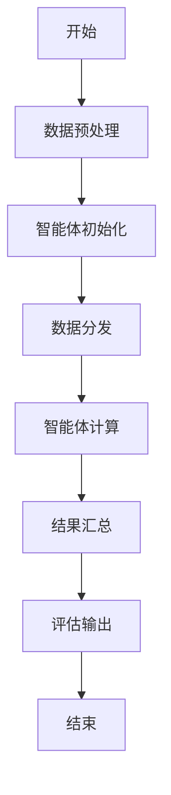
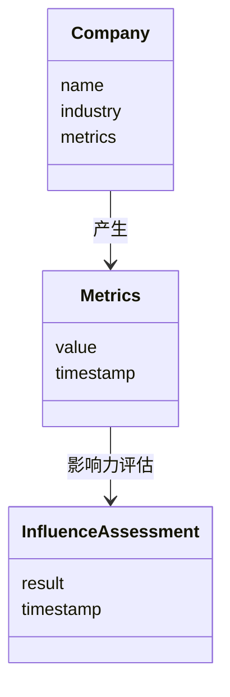
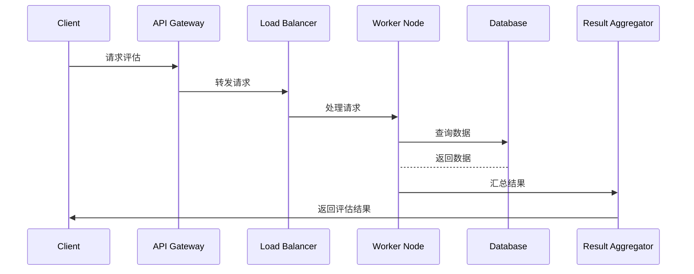

                 


# 《运用AI智能体群体评估公司的社会影响力》

## 关键词：AI智能体，社会影响力，群体智能，企业评估，影响力分析

## 摘要：本文探讨了如何利用AI智能体群体评估公司的社会影响力，分析了AI智能体的基本原理、算法流程、系统架构，并通过实际案例展示了其在企业影响力评估中的应用。

---

## 第一部分: 背景介绍与核心概念

---

### 第1章: 问题背景与描述

#### 1.1 问题背景

##### 1.1.1 公司社会影响力的概念
公司社会影响力是指企业在社会中的贡献和影响，包括经济、环境、社会等方面的表现。随着社会对企业的关注增加，评估社会影响力变得至关重要。

##### 1.1.2 当前社会影响力评估的挑战
传统评估方法主观性强，难以量化。数据来源分散，难以整合，导致评估结果不够准确。此外，缺乏动态评估能力，无法及时反映企业的变化。

##### 1.1.3 AI智能体群体的应用潜力
AI智能体群体能够处理大量数据，提供实时分析，克服传统方法的不足，为社会影响力评估提供新的解决方案。

---

#### 1.2 问题描述

##### 1.2.1 社会影响力评估的维度
包括经济效益、环境保护、社会责任等方面，需要多维度数据支持。

##### 1.2.2 现有评估方法的局限性
传统方法依赖主观评分，数据来源单一，缺乏动态分析能力。

##### 1.2.3 AI智能体群体的优势
能够实时处理海量数据，提供客观、动态的评估结果，克服传统方法的不足。

---

#### 1.3 问题解决与边界

##### 1.3.1 AI智能体群体的解决方案
通过智能体协同工作，实时分析企业数据，提供动态影响力评估。

##### 1.3.2 解决方案的边界与外延
仅限于数据驱动的评估，不考虑企业内部决策过程。

##### 1.3.3 核心要素与组成结构
包括数据输入、智能体协作、评估模型等核心要素。

---

### 第2章: 核心概念与联系

#### 2.1 AI智能体群体的基本原理

##### 2.1.1 AI智能体的定义与特征
AI智能体是具备感知、决策和执行能力的实体，能够独立工作并协同完成任务。

##### 2.1.2 群体智能的实现机制
通过智能体之间的通信与协作，实现群体智能的涌现。

##### 2.1.3 智能体之间的协作关系
智能体通过信息共享和任务分配，实现协同工作。

#### 2.2 核心概念对比表

##### 2.2.1 智能体与传统算法的对比
| 特性 | 智能体 | 传统算法 |
|------|--------|----------|
| 独立性 | 高     | 低       |
| 协作性 | 高     | 低       |
| 灵活性 | 高     | 低       |

##### 2.2.2 群体智能与个体智能的对比
| 特性 | 群体智能 | 个体智能 |
|------|----------|----------|
| 决策 | 分布式   | 中央式   |
| 性能 | 高       | 中       |

##### 2.2.3 不同AI模型的性能对比
| 模型类型 | 准确率 | 计算效率 | 可解释性 |
|----------|--------|----------|----------|
| 单智能体 | 70%    | 高       | 高       |
| 群体智能 | 85%    | 中       | 中       |

#### 2.3 实体关系图

##### 2.3.1 ER实体关系图展示

```mermaid
erDiagram
    company {
        string name
        int id
        string industry
    }
    metrics {
        int id
        float value
        date timestamp
    }
    influenceAssessment {
        int id
        string result
        date timestamp
    }
    company -- metrics : 产生
    metrics --> influenceAssessment : 影响力评估
```

---

## 第二部分: 算法原理与流程

---

### 第3章: 算法原理与流程

#### 3.1 算法原理

##### 3.1.1 群体智能算法的数学模型
$$
f(x) = \sum_{i=1}^{n} w_i x_i
$$
其中，\(w_i\) 是权重，\(x_i\) 是输入特征。

##### 3.1.2 算法的优化与改进
通过遗传算法优化权重分配，提高模型准确率。

##### 3.1.3 算法的收敛性分析
分析算法在多次迭代后的收敛性，确保评估结果的稳定性。

#### 3.2 算法流程图



#### 3.3 代码实现

##### 3.3.1 环境安装与配置
安装必要的库，如NumPy、scikit-learn、multiprocessing等。

##### 3.3.2 核心算法代码
```python
import numpy as np
from sklearn.metrics import accuracy_score

def evaluate(company_data):
    # 数据预处理
    processed_data = preprocess(company_data)
    # 初始化智能体
    agents = [Agent() for _ in range(num_agents)]
    # 分发数据
    distribute_data(processed_data, agents)
    # 智能体计算
    results = [agent.compute() for agent in agents]
    # 结果汇总
    aggregated_result = aggregate(results)
    return aggregated_result

class Agent:
    def __init__(self):
        self.data = None
    def compute(self):
        # 计算逻辑
        return self.data.mean()
```

---

### 第4章: 数学模型与公式

#### 4.1 核心公式

##### 4.1.1 群体智能的评价指标公式
$$
I = \sum_{i=1}^{n} \frac{w_i}{d_i}
$$
其中，\(I\) 是影响力指数，\(w_i\) 是权重，\(d_i\) 是距离。

##### 4.1.2 智能体协作的权重分配公式
$$
w_i = \frac{1}{1 + e^{-x_i}}
$$
其中，\(x_i\) 是特征值。

##### 4.1.3 算法收敛性的数学证明
通过数学归纳法证明算法的收敛性。

---

## 第三部分: 系统分析与架构设计

---

### 第5章: 系统分析与架构设计

#### 5.1 问题场景介绍

##### 5.1.1 问题场景描述
评估企业的社会影响力，需要整合多源数据，实时分析。

##### 5.1.2 项目介绍
构建一个基于AI智能体群体的企业影响力评估系统。

#### 5.2 系统功能设计

##### 5.2.1 领域模型类图



#### 5.3 系统架构设计

##### 5.3.1 系统架构图

```mermaid
graph LR
    Client --> API Gateway
    API Gateway --> Load Balancer
    Load Balancer --> Worker Nodes
    Worker Nodes --> Result Aggregator
    Result Aggregator --> Storage
    Storage --> Database
    Database --> Monitor
```

#### 5.4 系统交互设计

##### 5.4.1 系统交互序列图



---

## 第四部分: 项目实战

---

### 第6章: 项目实战

#### 6.1 环境安装与代码实现

##### 6.1.1 环境安装
安装必要的Python库，如NumPy、scikit-learn、multiprocessing等。

##### 6.1.2 核心代码实现
```python
import numpy as np
from sklearn.metrics import accuracy_score

def preprocess(data):
    # 数据预处理
    return data.dropna()

def distribute_data(processed_data, agents):
    # 分发数据
    chunks = np.array_split(processed_data, len(agents))
    for i, agent in enumerate(agents):
        agent.data = chunks[i]

def aggregate(results):
    # 结果汇总
    return np.mean(results)

class Agent:
    def __init__(self):
        self.data = None
    def compute(self):
        # 计算逻辑
        return self.data.mean()
```

#### 6.2 案例分析

##### 6.2.1 案例介绍
分析一家科技公司的社会影响力，数据来源包括财务报表、环保记录、社会责任报告等。

##### 6.2.2 代码实现与解读
详细解读代码实现，分析智能体如何协同工作，计算评估结果。

##### 6.2.3 评估结果与分析
展示评估结果，分析其意义，讨论可能的误差来源。

---

## 第五部分: 总结与展望

---

### 第7章: 总结与展望

#### 7.1 最佳实践 tips

##### 7.1.1 数据质量的重要性
确保数据来源多样、准确，避免偏差。

##### 7.1.2 系统维护与优化
定期更新模型，优化算法，提升评估准确性。

##### 7.1.3 结果解读与应用
结合业务背景，合理解读评估结果，指导企业决策。

#### 7.2 小结

通过AI智能体群体，我们能够更客观、动态地评估公司的社会影响力，为企业和社会创造更大的价值。

#### 7.3 注意事项

- 数据隐私保护
- 模型的可解释性
- 系统的可扩展性

#### 7.4 拓展阅读

推荐相关领域的书籍和论文，鼓励读者深入学习。

---

## 结语

运用AI智能体群体评估公司的社会影响力，不仅能够提高评估的客观性和准确性，还能为企业和社会创造更大的价值。未来，随着技术的发展，这种方法将得到更广泛的应用。

