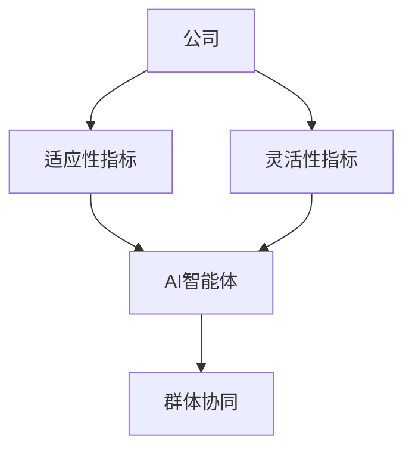
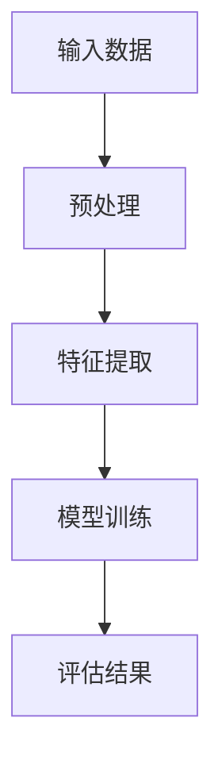
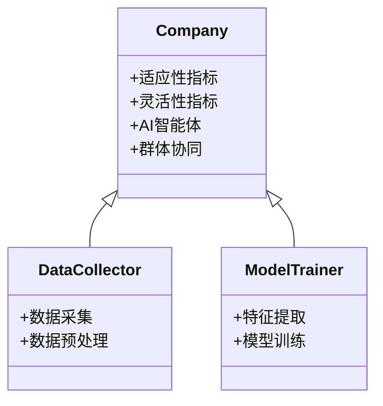
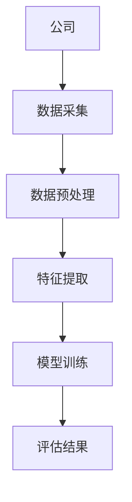
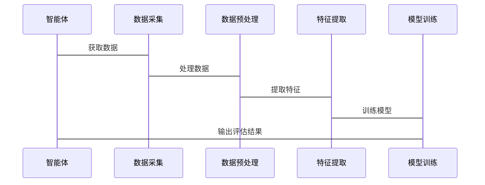

                 


# 运用AI智能体群体评估公司适应性和灵活性

## 关键词：AI智能体，群体智能，公司适应性，公司灵活性，评估系统

## 摘要：本文将探讨如何利用AI智能体群体评估公司的适应性和灵活性。通过分析适应性和灵活性的定义、传统评估方法的局限性，以及AI智能体群体评估的优势，结合算法原理和系统架构设计，提出一套基于AI的评估方案，并通过具体案例展示其应用效果。

---

# 第一部分：AI智能体群体评估公司适应性和灵活性的背景与核心概念

## 第1章：公司适应性和灵活性的评估背景

### 1.1 问题背景与定义

#### 1.1.1 公司适应性的定义与重要性
公司适应性是指企业在面对外部环境变化时，能够快速调整自身战略、组织结构和业务模式的能力。适应性越强的公司，越能在市场波动中保持竞争力。

#### 1.1.2 公司灵活性的定义与挑战
公司灵活性是指公司在资源分配、团队协作和任务执行方面能够灵活调整的能力。灵活性强的公司能够更好地应对突发事件和复杂任务。

#### 1.1.3 适应性和灵活性的边界与外延
适应性关注的是对外部变化的响应，而灵活性关注的是内部资源的调整。两者的结合能够帮助公司在复杂环境中保持竞争力。

### 1.2 传统评估方法的局限性

#### 1.2.1 传统评估指标的局限性
传统的评估指标通常基于财务数据和静态分析，难以捕捉动态变化中的适应性和灵活性。

#### 1.2.2 传统评估方法的不足
传统方法通常依赖人工分析，耗时且容易受到主观因素的影响，无法实时动态评估。

#### 1.2.3 传统评估与现代企业需求的矛盾
现代企业面临的环境更加复杂和动态，传统评估方法难以满足实时性和准确性要求。

### 1.3 AI智能体群体评估的优势

#### 1.3.1 AI智能体的群体协作优势
AI智能体可以通过群体协作，实时分析公司内外部数据，提供动态评估结果。

#### 1.3.2 数据驱动的评估准确性
AI智能体能够处理大量数据，利用机器学习算法，提高评估的准确性和可靠性。

#### 1.3.3 实时动态评估的可能性
通过AI智能体的实时分析，公司能够快速响应市场变化，提升适应性和灵活性。

---

## 第2章：AI智能体群体评估的核心概念与联系

### 2.1 核心概念原理

#### 2.1.1 AI智能体的定义与属性
AI智能体是具有感知、决策和执行能力的智能实体，能够独立或协同完成任务。

#### 2.1.2 群体智能的基本原理
群体智能是指多个智能体通过协作完成复杂任务的能力，强调分布式计算和自主决策。

#### 2.1.3 适应性和灵活性的数学模型
适应性可以通过公司对市场变化的响应速度来衡量，灵活性可以通过公司资源的调整效率来衡量。

$$ \text{适应性} = \frac{\text{市场变化响应速度}}{\text{市场变化幅度}} $$
$$ \text{灵活性} = \frac{\text{资源调整效率}}{\text{资源需求变化速度}} $$

### 2.2 核心概念对比表

| 概念 | 属性 | 描述 |
|------|------|------|
| 适应性 | 反应速度 | 公司应对市场变化的速度 |
| 灵活性 | 资源分配 | 公司资源的灵活调整能力 |
| AI智能体 | 学习能力 | 智能体的自主学习能力 |
| 群体协同 | 协作效率 | 智能体之间的协作效率 |

### 2.3 ER实体关系图



---

## 第3章：AI智能体群体评估的算法原理

### 3.1 算法原理概述

#### 3.1.1 多智能体系统的定义
多智能体系统是由多个智能体组成的分布式系统，智能体之间通过通信和协作完成任务。

#### 3.1.2 群体智能的协同机制
群体智能的协同机制包括任务分配、信息共享和决策优化，确保智能体之间的高效协作。

#### 3.1.3 基于强化学习的评估算法
强化学习是一种通过试错优化策略的机器学习方法，适用于动态环境下的评估任务。

### 3.2 算法流程图



### 3.3 算法实现代码

```python
def evaluate_adaptability(data):
    # 数据预处理
    processed_data = preprocess(data)
    # 特征提取
    features = extract_features(processed_data)
    # 模型训练
    model = train_model(features)
    return model.predict(features)
```

---

# 第二部分：系统架构设计与实现

## 第4章：系统架构设计

### 4.1 系统功能设计

#### 4.1.1 数据流设计
数据流包括外部数据输入、数据预处理、特征提取和模型训练。

#### 4.1.2 功能模块设计
功能模块包括数据采集、数据处理、模型训练和结果输出。

#### 4.1.3 系统功能图



### 4.2 系统架构设计

#### 4.2.1 系统架构图



#### 4.2.2 系统接口设计
系统接口包括数据输入接口、模型训练接口和结果输出接口。

#### 4.2.3 系统交互图



---

## 第5章：系统实现与案例分析

### 5.1 项目实战

#### 5.1.1 环境安装
需要安装Python、机器学习库（如Scikit-learn）和数据处理库（如Pandas）。

#### 5.1.2 核心代码实现

```python
import pandas as pd
from sklearn.model_selection import train_test_split
from sklearn.metrics import accuracy_score

def preprocess(data):
    # 数据清洗和转换
    processed_data = data.dropna()
    return processed_data

def extract_features(data):
    # 特征提取
    features = data[['feature1', 'feature2']]
    return features

def train_model(features, labels):
    # 模型训练
    X_train, X_test, y_train, y_test = train_test_split(features, labels, test_size=0.2)
    model = SomeModel()
    model.fit(X_train, y_train)
    return model

def evaluate_adaptability(data):
    processed_data = preprocess(data)
    features = extract_features(processed_data)
    model = train_model(features, labels)
    return model.predict(features)
```

#### 5.1.3 案例分析与总结
通过实际案例分析，展示AI智能体群体评估在公司适应性和灵活性中的应用效果。

---

## 第6章：最佳实践与总结

### 6.1 最佳实践

#### 6.1.1 小结
总结AI智能体群体评估的优势和应用价值。

#### 6.1.2 注意事项
在实际应用中，需要注意数据质量、模型选择和系统优化。

#### 6.1.3 拓展阅读
推荐相关领域的书籍和论文，供读者进一步学习。

### 6.2 总结
AI智能体群体评估是一种创新的评估方法，能够帮助企业更好地应对复杂环境，提升适应性和灵活性。

---

通过以上内容，我们详细探讨了运用AI智能体群体评估公司适应性和灵活性的方法，从理论到实践，结合具体案例，展示了其应用价值和实现过程。

