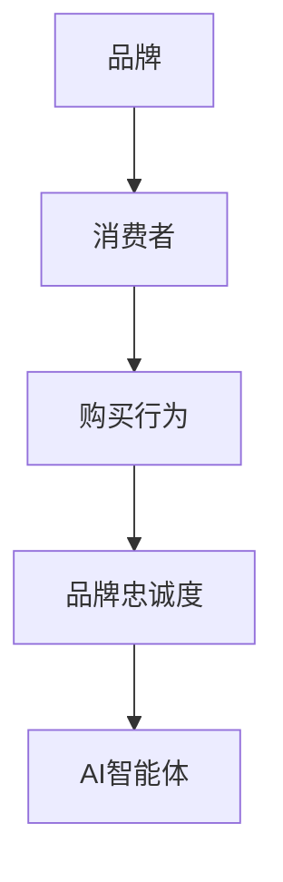
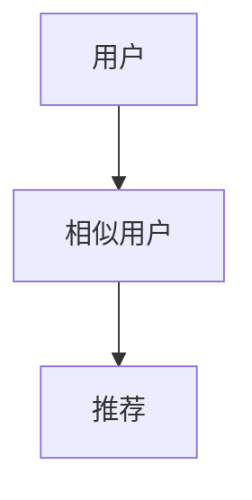
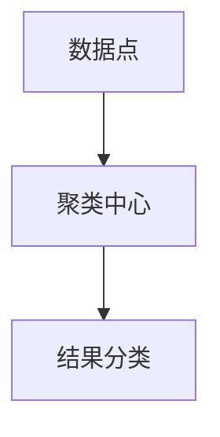
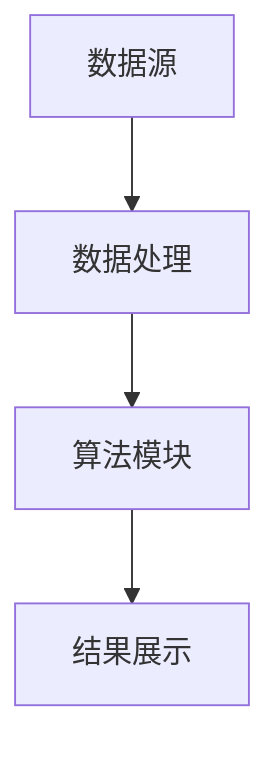

                 


# 运用AI智能体群体量化品牌忠诚度

## 关键词：AI智能体，品牌忠诚度，量化分析，协同过滤，聚类分析，系统架构

## 摘要：  
本文探讨了如何利用AI智能体群体来量化品牌忠诚度。通过分析消费者行为数据，构建品牌忠诚度量化模型，提出基于协同过滤和聚类分析的算法，并设计相应的系统架构，提供实际案例和实现方案，为品牌管理和营销策略优化提供支持。

---

## 第1章: 问题背景与核心概念

### 1.1 问题背景
品牌忠诚度是企业在市场竞争中的重要资产，直接影响客户生命周期价值和市场占有率。然而，传统品牌忠诚度测量方法存在数据维度单一、分析深度不足的问题。如何利用AI技术实现品牌忠诚度的量化分析，成为现代营销领域的重要课题。

### 1.2 核心概念与问题描述
品牌忠诚度的量化需要考虑消费者行为、情感倾向等多个维度。AI智能体通过群体协作，能够从海量数据中提取深层次特征，帮助品牌管理者制定精准的营销策略。

### 1.3 问题解决与边界
本文将重点探讨基于AI智能体的群体分析方法，解决品牌忠诚度量化中的数据处理、特征提取和模型构建问题。边界包括数据来源、分析维度和应用场景。

### 1.4 概念结构与核心要素
- **品牌**：核心品牌资产
- **消费者**：目标客户群体
- **购买行为**：消费数据
- **品牌忠诚度**：量化指标
- **AI智能体**：协同分析工具

---

## 第2章: 核心概念与联系

### 2.1 AI智能体与品牌忠诚度的关系
AI智能体通过分析消费者数据，识别品牌忠诚度的潜在特征，帮助品牌管理者优化营销策略。

### 2.2 核心概念原理
- **协同作用机制**：AI智能体协同分析消费者数据，提取品牌忠诚度特征。
- **多维度特征**：包括消费频率、购买金额、产品评价等。

### 2.3 实体关系图


---

## 第3章: 算法原理

### 3.1 协同过滤算法
通过分析用户行为数据，找到相似用户群体，预测品牌忠诚度。

#### 3.1.1 算法原理


#### 3.1.2 数学模型
$$相似度 = \frac{\sum (x_i - \bar{x})(y_i - \bar{y})}{\sqrt{\sum (x_i - \bar{x})^2} \sqrt{\sum (y_i - \bar{y})^2}}$$

### 3.2 聚类分析
将消费者分为不同群体，分析其品牌忠诚度特征。

#### 3.2.1 算法原理


#### 3.2.2 数学模型
$$距离 = \sqrt{\sum (x_i - x_j)^2}$$

---

## 第4章: 系统分析与架构设计

### 4.1 项目背景
本文设计一个基于AI智能体的品牌忠诚度量化系统，旨在通过数据挖掘和机器学习技术，帮助企业优化品牌管理策略。

### 4.2 系统功能设计
- **数据采集模块**：收集消费者行为数据。
- **分析模块**：应用协同过滤和聚类算法进行品牌忠诚度量化。
- **结果展示模块**：可视化分析结果。

### 4.3 系统架构设计


---

## 第5章: 项目实战

### 5.1 环境安装
- **Python**：安装必要的库如NumPy、Pandas、Scikit-learn。
- **工具**：安装Jupyter Notebook进行代码开发。

### 5.2 核心实现代码
```python
from sklearn.metrics.pairwise import cosine_similarity

# 示例数据
users = ['A', 'B', 'C']
prefs = {'A': {'X': 5, 'Y': 3},
         'B': {'X': 4, 'Y': 4},
         'C': {'X': 3, 'Y': 5}}

# 转换为矩阵
user_ids = ['A', 'B', 'C']
item_ids = ['X', 'Y']

# 计算相似度
pref_matrix = [[prefs[u][i] if i in prefs[u] else 0 for i in item_ids] for u in user_ids]
similarity = cosine_similarity(pref_matrix)

print(similarity)
```

### 5.3 实际案例分析
以某品牌为例，分析消费者数据，应用协同过滤算法预测忠诚度，优化营销策略。

---

## 第6章: 总结与展望

### 6.1 本章小结
本文通过AI智能体群体量化品牌忠诚度，提出了基于协同过滤和聚类分析的算法，设计了系统的架构，并通过案例验证了方法的有效性。

### 6.2 应用建议
- 数据质量：确保数据准确性和完整性。
- 模型优化：结合业务场景调整算法参数。
- 未来研究：探索更复杂的机器学习模型。

### 6.3 拓展阅读
推荐相关领域的书籍和论文，深入学习品牌忠诚度量化和AI智能体应用的知识。

---

通过本文的分析和实践，读者可以掌握利用AI技术量化品牌忠诚度的方法，为企业制定更精准的营销策略提供支持。

