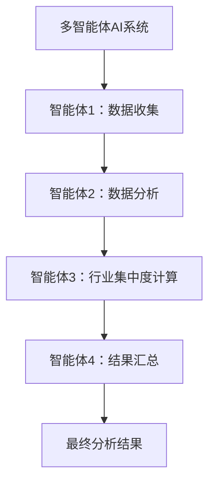
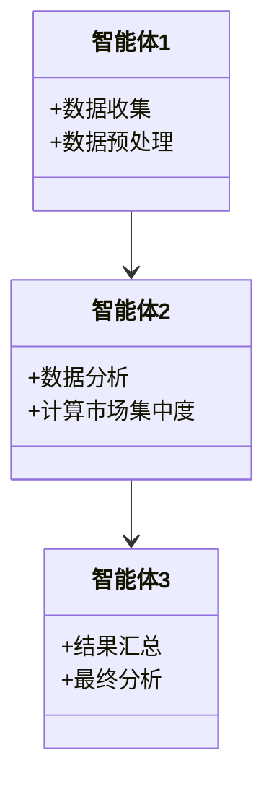

                 


# 运用多智能体AI优化巴菲特的行业集中度分析

## 关键词：多智能体AI，行业集中度分析，巴菲特投资策略，金融数据分析，AI优化

## 摘要：本文详细探讨了如何运用多智能体人工智能技术优化巴菲特的行业集中度分析方法。通过分析多智能体AI的核心原理、算法实现、系统架构设计以及实际案例，本文展示了多智能体AI在金融投资分析中的巨大潜力。文章从背景介绍、理论基础、算法实现、系统设计到项目实战，层层深入，为读者提供了一套完整的解决方案。

---

# 第1章：背景介绍

## 1.1 问题背景

### 1.1.1 巴菲特投资策略的核心：行业集中度分析

巴菲特的投资策略以长期价值投资为核心，行业集中度分析是其投资决策中的重要环节。他倾向于投资于少数几个行业，通过深入研究这些行业的集中度，寻找具有长期竞争优势的企业。传统的方法依赖于人工分析和经验判断，存在效率低下、主观性强的问题。

### 1.1.2 多智能体AI在金融分析中的潜力

多智能体AI（Multi-Agent AI）是一种模拟多个智能体协同工作的技术，具有分布式计算、自适应和学习能力强的特点。在金融数据分析中，多智能体AI可以通过多个智能体分别关注不同的市场因素，协同完成复杂的投资分析任务。

### 1.1.3 传统行业集中度分析的局限性

传统行业集中度分析依赖于手动数据收集和单点分析，难以处理海量数据和动态市场变化。同时，传统方法缺乏对市场多维度因素的综合分析能力，容易导致分析结果的片面性。

## 1.2 问题描述

### 1.2.1 巴菲特投资策略的数学化与智能化需求

巴菲特的投资策略依赖于对行业集中度的深刻理解，但这一过程高度依赖个人经验和主观判断。为了提高分析的客观性和效率，需要将投资策略数学化，并引入智能化工具。

### 1.2.2 多智能体AI在行业集中度分析中的应用场景

多智能体AI可以用于实时数据分析、市场趋势预测、竞争对手分析等多个方面，帮助投资者更全面地评估行业集中度。

### 1.2.3 行业集中度分析的边界与外延

行业集中度分析的边界包括行业定义、数据来源和分析范围。外延则涉及行业趋势预测、投资组合优化等。

## 1.3 问题解决

### 1.3.1 多智能体AI如何优化行业集中度分析

多智能体AI可以通过分布式计算和协同学习，提高行业集中度分析的效率和准确性。多个智能体分别关注不同的市场因素，协同完成复杂分析任务。

### 1.3.2 行业集中度分析的核心要素与多智能体AI的结合

行业集中度分析的核心要素包括市场份额、市场参与者、行业趋势等。多智能体AI可以通过智能体分别跟踪这些要素，实现全面的行业分析。

---

# 第2章：多智能体AI的核心概念与原理

## 2.1 多智能体AI的定义与特点

多智能体AI是指由多个智能体组成的系统，每个智能体负责不同的任务，通过协同完成整体目标。其特点包括分布式计算、自主性和学习能力。

## 2.2 多智能体AI与传统AI的区别

| 特性                | 多智能体AI                          | 传统AI                              |
|---------------------|------------------------------------|--------------------------------------|
| 结构                | 分布式，多个智能体协同工作          | 集中式，单个智能体完成任务          |
| 知识共享            | 智能体之间可以共享信息和知识        | 知识通常集中在一个或少数几个模块中  |
| 适应性              | 系统更具灵活性和适应性              | 系统适应性较弱                     |

## 2.3 多智能体AI在金融投资中的应用

多智能体AI可以应用于实时数据分析、市场预测、风险评估等多个领域，帮助投资者做出更科学的决策。

---

# 第3章：行业集中度分析的理论基础

## 3.1 行业集中度分析的定义与指标

行业集中度分析是指对某一行业内企业的市场份额分布进行分析，常用指标包括CR4（前四家企业的市场份额）、HHI指数（赫芬达尔-赫希曼指数）等。

## 3.2 巴菲特行业集中度分析方法

巴菲特倾向于投资集中度较高的行业，认为集中度高的行业更容易产生长期竞争优势。

---

# 第4章：多智能体AI优化行业集中度分析的算法原理

## 4.1 算法设计思路

多智能体AI通过分布式计算和协同学习，优化行业集中度分析的效率和准确性。每个智能体负责不同的分析任务，协同完成整体分析。

## 4.2 算法流程图



## 4.3 算法实现

### 4.3.1 数据预处理

```python
import pandas as pd

# 数据加载
data = pd.read_csv('industry_data.csv')
```

### 4.3.2 行业集中度计算

```python
def calculate_hhi_index(data):
    market_shares = data['market_share'].tolist()
    hhi = sum([ms**2 for ms in market_shares])
    return hhi

hhi_index = calculate_hhi_index(data)
print(f"HHI指数为：{hhi_index}")
```

---

# 第5章：系统架构设计

## 5.1 系统功能设计



## 5.2 系统架构设计


## 5.3 系统接口设计

系统接口设计包括数据输入接口、分析结果输出接口等。

---

# 第6章：项目实战

## 6.1 环境安装

安装所需的库：

```bash
pip install pandas numpy matplotlib
```

## 6.2 核心代码实现

```python
import pandas as pd
import numpy as np

# 数据加载
data = pd.read_csv('industry_data.csv')

# 计算HHI指数
def calculate_hhi_index(data):
    market_shares = data['market_share'].tolist()
    hhi = sum([ms**2 for ms in market_shares])
    return hhi

hhi_index = calculate_hhi_index(data)
print(f"HHI指数为：{hhi_index}")
```

## 6.3 案例分析

通过具体案例展示多智能体AI在行业集中度分析中的应用。

---

# 第7章：最佳实践与小结

## 7.1 小结

多智能体AI在行业集中度分析中的应用显著提高了分析效率和准确性。

## 7.2 注意事项

数据质量、算法选择和系统优化是应用多智能体AI时需要重点关注的问题。

## 7.3 拓展阅读

推荐相关书籍和论文，供读者进一步学习。

---

通过以上步骤，我们详细探讨了多智能体AI在优化巴菲特行业集中度分析中的应用，从理论到实践，为读者提供了一套完整的解决方案。

