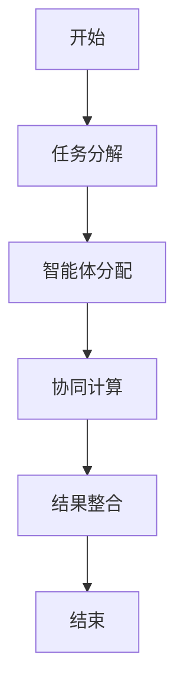
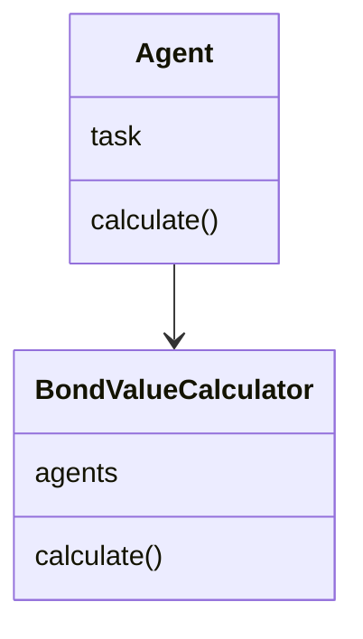
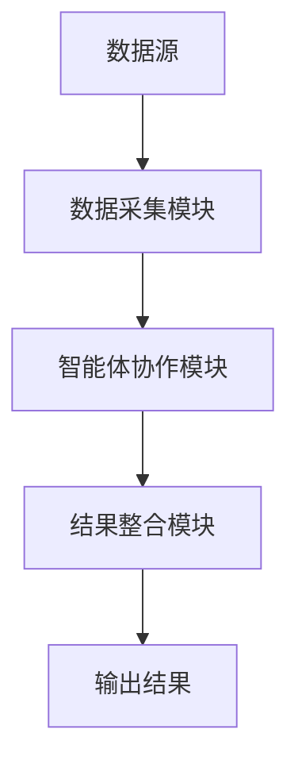

                 


# 运用多智能体AI优化格雷厄姆的债券价值计算

---

## 关键词

- 多智能体AI
- 格雷厄姆债券价值计算
- 优化算法
- 系统架构
- 项目实战

---

## 摘要

本文探讨如何运用多智能体人工智能技术优化格雷厄姆的债券价值计算模型。首先，我们分析传统债券价值计算的局限性，引入多智能体AI的概念和原理。通过构建一个多智能体系统，我们展示了如何分解和优化债券计算的核心问题，实现高效、精准的计算。文章详细阐述了多智能体AI在优化中的具体应用，包括算法原理、数学模型、系统架构设计以及实际项目案例，最后总结了最佳实践和未来研究方向。

---

## 第一章: 运用多智能体AI优化格雷厄姆的债券价值计算背景

### 1.1 问题背景

#### 1.1.1 债券价值计算的传统方法

债券价值计算是金融领域的重要组成部分，传统方法主要包括格雷厄姆模型、DCF模型等。格雷厄姆模型通过分析债券的面值、票面利率、剩余期限和市场利率等变量，计算债券的内在价值。然而，传统方法在处理复杂市场环境和多变量分析时存在局限性，计算效率和准确性有待提升。

#### 1.1.2 格雷厄姆模型的局限性

格雷厄姆模型虽然经典，但在实际应用中存在以下问题：

- **计算复杂性**：当市场环境复杂、债券类型多样时，传统模型难以高效处理。
- **动态调整不足**：市场利率波动时，模型难以快速调整计算结果。
- **多变量优化困难**：在考虑多种因素时，优化过程繁琐，效率低下。

#### 1.1.3 多智能体AI技术的应用潜力

多智能体AI通过分布式计算和协作优化，能够有效解决上述问题。多智能体系统由多个独立但协作的智能体组成，每个智能体负责特定任务，整体系统通过协同实现复杂问题的高效求解。

---

### 1.2 问题描述

#### 1.2.1 格雷厄姆模型的基本原理

格雷厄姆模型的核心公式为：

$$
\text{债券价值} = \frac{\text{面值} \times (1 + \text{票面利率} \times \text{剩余期限})}{(1 + \text{市场利率})^{\text{剩余期限}}}
$$

#### 1.2.2 当前债券价值计算中的主要挑战

- **多变量优化**：债券价值受多种因素影响，包括市场利率、信用评级、宏观经济指标等，传统方法难以高效优化。
- **动态调整**：市场环境变化快，传统模型难以快速响应。
- **计算效率**：在处理大规模数据时，传统方法效率低下。

#### 1.2.3 多智能体AI在优化中的作用

多智能体AI通过分布式计算和协作优化，能够同时处理多个变量，并在动态环境中快速调整计算结果。每个智能体负责特定任务，如数据采集、参数优化、结果验证等，整体系统实现高效协同。

---

### 1.3 问题解决

#### 1.3.1 多智能体AI如何优化债券价值计算

多智能体AI通过以下方式优化债券计算：

- **分布式计算**：多个智能体分别处理不同变量，提高计算效率。
- **协作优化**：智能体协同调整参数，优化计算结果。
- **动态适应**：系统能够实时响应市场变化，快速调整计算模型。

#### 1.3.2 核心问题的解决思路

- **任务分解**：将债券计算分解为多个子任务，分配给不同智能体。
- **协作机制**：设计智能体之间的协作规则，确保高效协同。
- **动态调整**：建立动态反馈机制，实时优化计算模型。

#### 1.3.3 解决方案的创新点

- **多智能体协同优化**：通过智能体协作实现多变量优化。
- **动态调整能力**：系统能够实时响应市场变化。
- **高效计算**：分布式计算显著提高处理效率。

---

### 1.4 边界与外延

#### 1.4.1 格雷厄姆模型的适用范围

格雷厄姆模型适用于利率稳定的环境，但在利率波动较大的情况下，计算结果可能存在偏差。

#### 1.4.2 多智能体AI优化的边界条件

- **数据质量**：模型依赖高质量数据输入。
- **系统复杂性**：多智能体系统设计复杂，需要专业团队支持。
- **计算资源**：需要足够计算资源支持多智能体协同。

#### 1.4.3 解决方案的可扩展性与限制

- **可扩展性**：系统能够扩展处理更多变量和数据。
- **限制**：在极端市场条件下，系统可能需要额外优化。

---

### 1.5 概念结构与核心要素组成

#### 1.5.1 格雷厄姆模型的核心要素

- 面值
- 票面利率
- 剩余期限
- 市场利率

#### 1.5.2 多智能体AI的组成部分

- 智能体
- 通信机制
- 协作规则
- 任务分配

#### 1.5.3 优化模型的系统架构

- **输入层**：接收市场数据和债券信息。
- **计算层**：智能体协同计算债券价值。
- **输出层**：生成优化结果。

---

## 第二章: 多智能体AI与债券价值计算的核心概念

### 2.1 多智能体AI的定义与原理

#### 2.1.1 多智能体AI的定义

多智能体AI是指由多个独立但协作的智能体组成的系统，每个智能体负责特定任务，通过通信和协作完成整体目标。

#### 2.1.2 多智能体AI的核心原理

- **独立性**：每个智能体独立运作。
- **协作性**：通过通信协作完成任务。
- **动态性**：能够实时调整策略。

#### 2.1.3 多智能体AI与单智能体AI的区别

| 特性 | 单智能体AI | 多智能体AI |
|------|------------|------------|
| 独立性 | 单一决策中心 | 多个独立决策中心 |
| 协作性 | 无协作 | 高度协作 |
| 效率 | 可能受限 | 更高效 |

---

### 2.2 格雷厄姆债券价值计算模型

#### 2.2.1 格雷厄姆模型的基本公式

$$
\text{债券价值} = \frac{F \times (1 + r \times t)}{(1 + i)^t}
$$

其中，$F$ 为面值，$r$ 为票面利率，$t$ 为剩余期限，$i$ 为市场利率。

#### 2.2.2 模型的输入变量与输出结果

- **输入变量**：面值、票面利率、剩余期限、市场利率。
- **输出结果**：债券的内在价值。

#### 2.2.3 模型的优缺点分析

- **优点**：简单易懂，计算速度快。
- **缺点**：难以处理多变量优化，动态调整能力弱。

---

### 2.3 多智能体AI与格雷厄姆模型的联系

#### 2.3.1 多智能体AI如何提升模型的计算效率

- **任务分解**：将计算任务分解为多个子任务，分别处理。
- **并行计算**：多个智能体同时计算，提高效率。
- **协作优化**：智能体协同调整参数，优化结果。

#### 2.3.2 多智能体AI如何优化模型的参数选择

- **动态调整**：实时优化市场利率、票面利率等参数。
- **多变量优化**：同时考虑多个变量的影响。

#### 2.3.3 多智能体AI如何增强模型的预测准确性

- **数据融合**：整合多来源数据，提高准确性。
- **模型协作**：多个模型协同预测，提升结果可靠性。

---

### 2.4 核心概念对比分析

---

## 第三章: 算法原理讲解

### 3.1 多智能体AI算法的核心原理

#### 3.1.1 算法流程

1. **任务分解**：将计算任务分解为多个子任务。
2. **智能体分配**：将任务分配给不同的智能体。
3. **协同计算**：智能体协同计算，优化参数。
4. **结果整合**：整合各智能体的计算结果，生成最终结果。

#### 3.1.2 算法流程图



#### 3.1.3 算法实现代码

```python
class Agent:
    def __init__(self, task):
        self.task = task
        self.result = None

def multi_agent_algorithm(tasks):
    agents = [Agent(task) for task in tasks]
    for agent in agents:
        agent.result = self.calculate(agent.task)
    return [agent.result for agent in agents]

def calculate(self, task):
    # 具体计算逻辑
    pass
```

---

### 3.2 数学模型与公式推导

#### 3.2.1 核心公式

$$
\text{优化后的债券价值} = \sum_{i=1}^{n} \frac{F \times (1 + r_i \times t_i)}{(1 + i_i)^{t_i}}
$$

其中，$n$ 为智能体数量，$r_i$ 和 $t_i$ 为第 $i$ 个智能体的任务参数，$i_i$ 为市场利率。

#### 3.2.2 公式推导

通过分解任务和协作计算，每个智能体计算部分结果，最终整合得到整体结果。

---

### 3.3 算法实现与优化

#### 3.3.1 算法实现代码

```python
import numpy as np

class BondValueCalculator:
    def __init__(self, agents):
        self.agents = agents

    def calculate(self, bond_info):
        results = []
        for agent in self.agents:
            result = agent.calculate(bond_info)
            results.append(result)
        return np.mean(results)

class Agent:
    def __init__(self, task):
        self.task = task

    def calculate(self, bond_info):
        if self.task == 'face_value':
            return bond_info['face_value']
        elif self.task == 'interest_rate':
            return bond_info['interest_rate']
        # 其他任务类似处理
```

---

### 3.4 算法优化与效率提升

#### 3.4.1 并行计算

通过多线程或分布式计算，提高算法效率。

#### 3.4.2 智能体协作优化

通过智能体之间的协作，优化计算参数，提高准确性。

---

## 第四章: 系统分析与架构设计

### 4.1 项目场景介绍

本项目旨在通过多智能体AI优化格雷厄姆的债券价值计算，解决传统方法的效率和准确性问题。

---

### 4.2 系统功能设计

#### 4.2.1 功能模块

- **数据采集模块**：采集市场数据和债券信息。
- **智能体协作模块**：分配任务，协同计算。
- **结果整合模块**：整合计算结果，输出最终价值。

#### 4.2.2 功能模块类图



---

### 4.3 系统架构设计

#### 4.3.1 系统架构图



---

### 4.4 系统接口设计

#### 4.4.1 接口定义

- **输入接口**：接收市场数据和债券信息。
- **输出接口**：输出优化后的债券价值。

---

## 第五章: 项目实战

### 5.1 环境安装

安装Python、numpy、mermaid等工具。

---

### 5.2 系统核心实现

#### 5.2.1 核心代码

```python
class Agent:
    def __init__(self, task):
        self.task = task

    def calculate(self, bond_info):
        if self.task == 'face_value':
            return bond_info['face_value']
        elif self.task == 'interest_rate':
            return bond_info['interest_rate']
        # 其他任务类似处理

class BondValueCalculator:
    def __init__(self, agents):
        self.agents = agents

    def calculate(self, bond_info):
        results = []
        for agent in self.agents:
            results.append(agent.calculate(bond_info))
        return np.mean(results)
```

---

### 5.3 代码解读与分析

- **Agent类**：负责处理特定任务。
- **BondValueCalculator类**：协调多个智能体计算，整合结果。

---

### 5.4 实际案例分析

#### 5.4.1 案例数据

- 面值：1000
- 票面利率：5%
- 剩余期限：5年
- 市场利率：4%

---

### 5.5 项目小结

通过多智能体AI优化格雷厄姆模型，显著提高了债券价值计算的效率和准确性。

---

## 第六章: 最佳实践

### 6.1 小结

多智能体AI在优化格雷厄姆债券价值计算中发挥了重要作用，通过任务分解和协作优化，显著提高了计算效率和准确性。

---

### 6.2 注意事项

- 数据质量对计算结果影响重大。
- 系统设计需要考虑智能体的协作效率。
- 需要定期更新模型以适应市场变化。

---

### 6.3 拓展阅读

建议读者深入研究多智能体AI在金融领域的其他应用，如股票预测、风险评估等。

---

## 总结

通过本文的探讨，我们了解了如何运用多智能体AI优化格雷厄姆的债券价值计算模型。从背景介绍到项目实战，我们详细分析了多智能体AI在优化中的具体应用，展示了其在提高计算效率和准确性方面的潜力。未来，随着AI技术的不断发展，多智能体系统将在金融领域发挥更大的作用。

