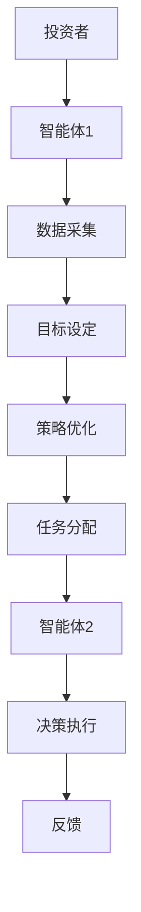
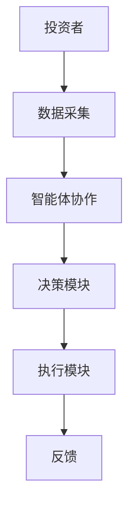
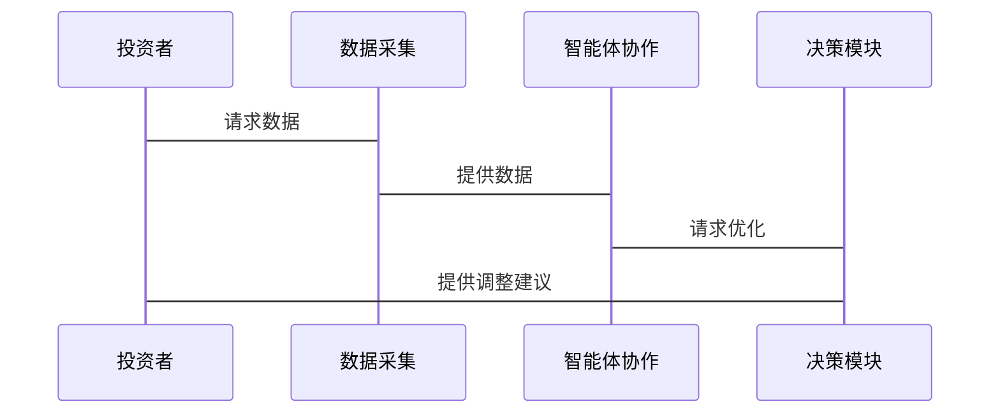

                 


# 运用多智能体AI优化约翰·伯格的再平衡策略

> 关键词：多智能体AI，再平衡策略，投资组合优化，约翰·伯格，人工智能，智能体协作

> 摘要：本文探讨了如何运用多智能体人工智能技术优化经典的约翰·伯格投资组合再平衡策略。文章首先介绍了多智能体AI的基本概念和约翰·伯格再平衡策略的核心思想，随后从理论、算法、系统设计和项目实践等多个维度展开分析，详细阐述了多智能体协作机制在再平衡策略优化中的具体应用，结合实际案例和数学模型，深入剖析了其原理和实现过程，最后总结了最佳实践和未来发展展望。

---

## 第1章：背景介绍

### 1.1 多智能体AI的背景

#### 1.1.1 多智能体AI的定义与特点
多智能体AI是指由多个相互作用的智能体组成的系统，每个智能体都能独立感知环境、自主决策，并通过协作完成复杂任务。其特点包括：
- **分布性**：任务由多个智能体分担。
- **协作性**：智能体之间通过通信和协调完成目标。
- **适应性**：能够动态调整策略以应对环境变化。
- **高效性**：通过并行计算提升整体性能。

#### 1.1.2 多智能体AI的核心原理
多智能体AI的核心在于智能体之间的协作与通信。智能体通过共享信息、协商任务分工，共同解决复杂问题。典型的协作机制包括：
- **分布式计算**：任务分解到各个智能体。
- **协商机制**：智能体之间通过协商确定任务分配。
- **通信协议**：定义智能体之间的信息交换规则。

#### 1.1.3 多智能体AI的应用领域
多智能体AI广泛应用于投资组合管理、自动驾驶、机器人协作、分布式计算等领域。在投资领域，其优势在于能够处理复杂的投资策略优化问题。

### 1.2 再平衡策略的背景

#### 1.2.1 再平衡策略的定义
再平衡策略是指定期调整投资组合的资产配置，以维持预设的目标比例。通过再平衡，投资者可以降低风险、优化收益。

#### 1.2.2 再平衡策略的核心要素
- **目标比例**：设定的资产配置目标。
- **调整频率**：定期检查并调整投资组合。
- **调整幅度**：根据市场变化决定调整规模。

#### 1.2.3 再平衡策略在投资中的重要性
再平衡策略有助于：
- **风险控制**：降低单一资产的风险敞口。
- **收益优化**：通过动态调整捕捉市场机会。
- **长期稳健**：保持投资组合的稳定性。

### 1.3 多智能体AI与再平衡策略的结合

#### 1.3.1 结合的必要性
传统再平衡策略依赖人工调整，效率低且难以应对复杂市场环境。多智能体AI能够实时分析市场数据、优化调整策略，显著提升效率。

#### 1.3.2 结合的优势与挑战
- **优势**：
  - 提高决策效率。
  - 实现复杂策略优化。
  - 动态适应市场变化。
- **挑战**：
  - 智能体协作复杂。
  - 数据处理难度大。
  - 系统稳定性要求高。

#### 1.3.3 结合的应用前景
多智能体AI在投资组合管理中的应用前景广阔，尤其是在高频交易、动态资产配置等领域具有重要价值。

---

## 第2章：核心概念与联系

### 2.1 多智能体AI的核心概念

#### 2.1.1 智能体的定义与特征
智能体（Agent）是具有感知、决策、行动能力的实体。其特征包括：
- **自主性**：无需外部干预。
- **反应性**：能感知环境并做出反应。
- **协作性**：能与其他智能体协作。

#### 2.1.2 多智能体系统的结构
多智能体系统由多个智能体组成，分为：
- **结构化环境**：任务明确的结构。
- **非结构化环境**：任务模糊的环境。

#### 2.1.3 多智能体AI的协作机制
协作机制包括：
- **直接通信**：智能体之间直接交换信息。
- **间接协作**：通过共享环境间接影响。

### 2.2 再平衡策略的核心概念

#### 2.2.1 再平衡的定义与目标
再平衡是调整投资组合使其符合目标比例的过程。目标在于优化收益与风险。

#### 2.2.2 再平衡的类型与方法
- **被动再平衡**：定期按比例调整。
- **主动再平衡**：根据市场变化主动调整。

#### 2.2.3 再平衡策略的优化目标
- **最小化调整成本**：降低交易费用。
- **最大化收益**：捕捉市场机会。
- **控制风险**：降低投资组合波动性。

### 2.3 多智能体AI与再平衡策略的联系

#### 2.3.1 智能体在再平衡中的角色
智能体负责：
- 数据采集与分析。
- 策略制定与优化。
- 决策执行与反馈。

#### 2.3.2 多智能体协作对再平衡的影响
- 提高决策效率。
- 实现复杂策略优化。
- 动态适应市场变化。

#### 2.3.3 再平衡策略的优化方向
- 优化智能体协作机制。
- 提升数据处理能力。
- 增强系统稳定性。

---

## 第3章：核心概念对比与ER实体关系图

### 3.1 多智能体AI与再平衡策略的对比

| **对比维度** | **多智能体AI** | **再平衡策略** |
|--------------|----------------|-----------------|
| 核心目标      | 协作完成任务    | 调整资产配置     |
| 输入          | 市场数据、目标   | 当前组合、目标   |
| 输出          | 决策建议        | 调整计划        |
| 优势          | 高效协作        | 精准调整         |
| 挑战          | 协作复杂性       | 市场波动影响       |

### 3.2 ER实体关系图

```mermaid
erDiagram
    investor {
        id : integer
        name : string
        portfolio : Portfolio
    }
    portfolio {
        id : integer
        target_allocation : map
        current Allocation : map
        rebalancing_plan : RebalancingPlan
    }
    rebalancing_plan {
        id : integer
        action : string
        priority : integer
        status : string
    }
    investor --> portfolio : "拥有"
    portfolio --> rebalancing_plan : "生成"
```

---

## 第4章：算法原理讲解

### 4.1 多智能体AI的协作算法

#### 4.1.1 分布式计算流程


#### 4.1.2 智能体协作机制
- **任务分配**：智能体根据能力分配任务。
- **通信协议**：定义信息交换规则。
- **协商机制**：解决冲突，达成共识。

### 4.2 再平衡策略的优化算法

#### 4.2.1 数学模型
目标是最小化调整成本，约束条件是保持目标比例。

优化目标：
$$
\min \sum_{i} |w_i - t_i|
$$

约束条件：
$$
\sum_{i} t_i = 1
$$

其中，$w_i$ 是当前权重，$t_i$ 是目标权重。

#### 4.2.2 动态调整策略
基于市场变化实时调整，采用滑动窗口法计算最优比例。

---

## 第5章：系统分析与架构设计

### 5.1 问题场景介绍

#### 5.1.1 投资者需求
- 实时监控资产配置。
- 自动化再平衡调整。
- 可视化报告。

#### 5.1.2 系统目标
- 实现多智能体协作。
- 提供实时再平衡建议。
- 支持多种投资策略。

### 5.2 系统功能设计

#### 5.2.1 数据采集模块
- 采集市场数据。
- 监控投资组合。

#### 5.2.2 智能体协作模块
- 分配任务。
- 通信与协作。

#### 5.2.3 决策模块
- 优化策略。
- 输出决策。

### 5.3 系统架构设计



### 5.4 系统接口设计

- **输入接口**：接收市场数据和用户指令。
- **输出接口**：提供调整建议和报告。

### 5.5 系统交互序列图



---

## 第6章：项目实战

### 6.1 环境安装

#### 6.1.1 系统需求
- Python 3.8+
- 网络连接

#### 6.1.2 安装依赖
```bash
pip install numpy pandas matplotlib
```

### 6.2 核心代码实现

#### 6.2.1 智能体协作模块
```python
class Agent:
    def __init__(self, id):
        self.id = id
        self.data = {}
    
    def receive(self, message):
        # 处理消息
        pass
```

#### 6.2.2 再平衡优化模块
```python
def optimize_weights(current_weights, target_weights):
    # 使用数学模型优化权重
    pass
```

### 6.3 实际案例分析

#### 6.3.1 案例描述
假设投资组合中股票和债券的目标比例为6:4，当前比例为7:3，系统自动调整。

#### 6.3.2 调整过程
- 数据采集模块获取市场数据。
- 智能体协作模块分配任务。
- 决策模块优化权重。
- 执行模块调整投资组合。

### 6.4 代码应用解读

- **数据采集模块**：实时获取市场数据。
- **智能体协作模块**：协调多个智能体完成任务。
- **决策模块**：基于数学模型优化调整方案。

---

## 第7章：总结与展望

### 7.1 最佳实践 tips

#### 7.1.1 系统设计建议
- 确保智能体协作机制高效。
- 优化数据处理能力。

#### 7.1.2 实际应用建议
- 结合具体市场环境。
- 定期系统优化。

### 7.2 小结
本文详细探讨了多智能体AI优化约翰·伯格再平衡策略的理论与实践，展示了其在投资组合管理中的应用潜力。

### 7.3 注意事项
- 确保系统稳定性。
- 注意数据隐私保护。

### 7.4 拓展阅读
推荐阅读相关领域的书籍和论文，深入理解多智能体AI和投资组合优化的最新进展。

---

通过以上结构，本文系统地分析了多智能体AI优化再平衡策略的各个方面，为实际应用提供了理论依据和实践指导。

