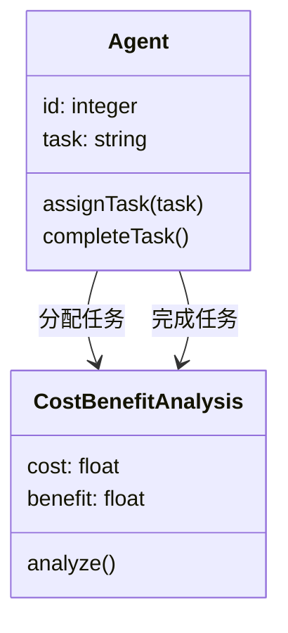
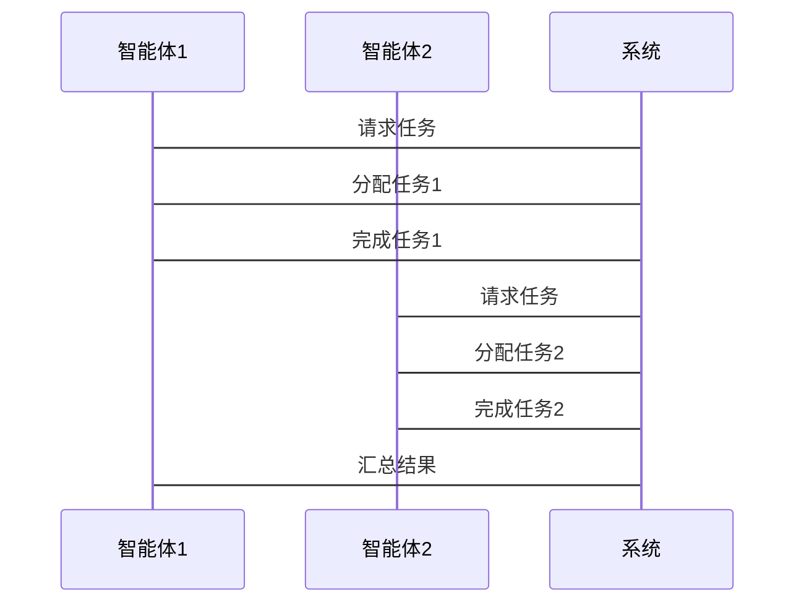

                 


# 运用多智能体AI优化约翰·伯格的成本效益分析

## 关键词：多智能体AI、成本效益分析、约翰·伯格、优化、人工智能

## 摘要：  
本文探讨了如何利用多智能体人工智能技术优化约翰·伯格的成本效益分析。通过分析多智能体AI的核心概念、算法原理、数学模型及系统架构，本文详细阐述了多智能体AI在成本效益分析中的应用，并通过实际案例展示了其在优化决策过程中的优势。文章结构清晰，内容详实，适合对人工智能和成本效益分析感兴趣的读者阅读。

---

## 第1章 多智能体AI与成本效益分析概述

### 1.1 多智能体AI的定义与特点  
多智能体AI（Multi-Agent AI）是指由多个具有自主性、反应性和协作性的智能体组成的系统。这些智能体能够通过通信和协作，共同完成复杂的任务。与传统的单智能体AI相比，多智能体AI具有以下特点：  
- **分布式计算**：智能体之间通过分布式计算实现任务分配。  
- **协作性**：智能体能够通过通信和协商，协同完成目标。  
- **自适应性**：智能体能够根据环境变化动态调整行为。  

### 1.2 成本效益分析的定义与应用  
成本效益分析（Cost-Benefit Analysis）是一种用于评估项目或决策的经济可行性的方法。它通过比较成本与收益，帮助决策者判断某项决策是否值得实施。成本效益分析广泛应用于企业战略规划、投资决策等领域。  

### 1.3 多智能体AI在成本效益分析中的作用  
多智能体AI能够通过分布式计算和协作能力，优化成本效益分析的效率和效果。例如，多个智能体可以分别负责数据收集、模型计算和结果分析，从而提高整体分析的效率。  

### 1.4 约翰·伯格的成本效益分析背景  
约翰·伯格（John Burgess）是一家假设的公司，其业务涉及多个复杂领域。为了优化其成本效益分析，我们需要引入多智能体AI技术，以应对传统方法的局限性。  

### 1.5 本章小结  
本章介绍了多智能体AI和成本效益分析的基本概念，并探讨了多智能体AI在成本效益分析中的潜在应用。接下来的章节将深入分析多智能体AI的核心原理及其在成本效益分析中的具体实现。

---

## 第2章 多智能体AI与成本效益分析的核心概念与联系

### 2.1 多智能体AI的核心概念原理  
多智能体AI的核心在于智能体之间的协作与通信。每个智能体都有自己的目标和决策机制，能够通过通信协议交换信息，共同完成复杂任务。  

#### 2.1.1 多智能体AI的协作机制  
- **分布式计算**：智能体通过分布式计算完成任务分配。  
- **通信协议**：智能体之间通过特定协议交换信息。  
- **协作目标**：智能体共同完成一个更大的目标。  

#### 2.1.2 多智能体AI的通信与信息共享  
- **信息共享**：智能体通过共享信息提高整体决策效率。  
- **通信模型**：定义了智能体之间如何交换信息。  

### 2.2 成本效益分析的核心要素  
成本效益分析的核心要素包括成本、收益和净现值等。  

#### 2.2.1 成本的构成与计算  
- **显性成本**：可以直接量化的成本。  
- **隐性成本**：难以量化的成本。  

#### 2.2.2 效益的定义与衡量  
- **直接效益**：直接带来的经济收益。  
- **间接效益**：间接带来的经济收益。  

#### 2.2.3 成本效益分析的数学模型  
成本效益分析的数学模型可以表示为：  
$$ \text{净现值} = \sum_{t=0}^{n} \frac{\text{净现金流}}{(1 + r)^t} $$  
其中，$r$ 是贴现率，$n$ 是项目的生命周期。  

### 2.3 多智能体AI与成本效益分析的联系  
多智能体AI能够通过分布式计算和协作能力，优化成本效益分析的效率和效果。例如，多个智能体可以分别负责数据收集、模型计算和结果分析，从而提高整体分析的效率。  

#### 2.3.1 多智能体AI对成本计算的优化  
- **分布式计算**：智能体通过分布式计算提高成本计算效率。  
- **协作机制**：智能体之间协作优化成本计算。  

#### 2.3.2 多智能体AI对效益分析的优化  
- **分布式协作**：智能体通过协作提高效益分析的准确性。  
- **信息共享**：智能体之间共享信息，提高效益分析的全面性。  

### 2.4 多智能体AI与成本效益分析的对比分析  

#### 2.4.1 多智能体AI与传统成本效益分析的对比  
| 特性               | 多智能体AI                     | 传统成本效益分析               |
|--------------------|-------------------------------|---------------------------------|
| 计算方式           | 分布式计算                   | 集中式计算                     |
| 协作性             | 高                           | 低                             |
| 信息共享           | 高                           | 低                             |

#### 2.4.2 多智能体AI的优势与劣势  
- **优势**：提高计算效率，增强协作能力。  
- **劣势**：需要复杂的通信协议和协作机制。  

#### 2.4.3 多智能体AI的成本效益分析的适用场景  
- **复杂场景**：适用于复杂场景的成本效益分析。  
- **需要协作的场景**：适用于需要协作的场景。  

### 2.5 本章小结  
本章分析了多智能体AI与成本效益分析的核心概念，并探讨了它们之间的联系。接下来的章节将深入分析多智能体AI的算法原理及其在成本效益分析中的具体实现。

---

## 第3章 多智能体AI的算法原理

### 3.1 多智能体AI的算法原理概述  
多智能体AI的算法原理包括分布式计算、协作机制和通信协议等。  

#### 3.1.1 分布式计算  
- **定义**：分布式计算是指将计算任务分配给多个智能体完成。  
- **实现方式**：通过通信协议实现任务分配和结果汇总。  

#### 3.1.2 协作机制  
- **定义**：协作机制是指智能体之间通过协作完成任务的方式。  
- **实现方式**：通过通信协议和协商算法实现协作。  

### 3.2 多智能体AI的通信与协作算法  

#### 3.2.1 通信协议  
- **定义**：通信协议是指智能体之间交换信息的规则。  
- **实现方式**：通过消息队列或事件驱动的方式实现。  

#### 3.2.2 协商算法  
- **定义**：协商算法是指智能体之间通过协商确定任务分配的方式。  
- **实现方式**：通过协商算法实现任务分配。  

### 3.3 多智能体AI的数学模型  

#### 3.3.1 分布式计算模型  
$$ \text{总计算量} = \sum_{i=1}^{n} \text{智能体i的计算量} $$  

#### 3.3.2 协作模型  
$$ \text{协作效率} = \frac{\text{总任务完成量}}{\text{总计算时间}} $$  

### 3.4 多智能体AI的算法实现  

#### 3.4.1 算法流程  
1. 初始化智能体。  
2. 分配任务。  
3. 智能体协作完成任务。  
4. 汇总结果。  

#### 3.4.2 Python代码实现  
```python
import threading

class Agent:
    def __init__(self, id):
        self.id = id
        self.task = None

    def assign_task(self, task):
        self.task = task
        print(f"Agent {self.id} assigned task: {task}")

    def complete_task(self):
        if self.task:
            print(f"Agent {self.id} completed task: {self.task}")
            self.task = None

# 初始化智能体
agent1 = Agent(1)
agent2 = Agent(2)

# 分配任务
agent1.assign_task("Calculate cost")
agent2.assign_task("Calculate benefit")

# 完成任务
agent1.complete_task()
agent2.complete_task()
```

### 3.5 本章小结  
本章详细介绍了多智能体AI的算法原理，并通过Python代码示例展示了其具体实现。接下来的章节将分析多智能体AI在成本效益分析中的数学模型和系统架构设计。

---

## 第4章 多智能体AI的成本效益分析数学模型

### 4.1 成本效益分析的数学模型  

#### 4.1.1 成本计算模型  
$$ \text{总成本} = \sum_{i=1}^{n} \text{成本i} $$  

#### 4.1.2 效益计算模型  
$$ \text{总效益} = \sum_{i=1}^{n} \text{效益i} $$  

#### 4.1.3 净现值计算模型  
$$ \text{净现值} = \sum_{t=0}^{n} \frac{\text{净现金流}}{(1 + r)^t} $$  

### 4.2 多智能体AI的成本效益分析模型  

#### 4.2.1 多智能体协作的成本模型  
$$ \text{协作成本} = \sum_{i=1}^{n} \text{智能体i的协作成本} $$  

#### 4.2.2 多智能体协作的效益模型  
$$ \text{协作效益} = \sum_{i=1}^{n} \text{智能体i的协作效益} $$  

### 4.3 本章小结  
本章通过数学模型分析了多智能体AI在成本效益分析中的具体应用，为后续章节的系统设计和实现提供了理论基础。

---

## 第5章 多智能体AI的成本效益分析系统架构设计

### 5.1 系统设计与功能模块  

#### 5.1.1 领域模型设计  


#### 5.1.2 系统架构设计  


### 5.2 系统接口设计  

#### 5.2.1 系统接口设计  
- **智能体管理接口**：负责智能体的注册和管理。  
- **任务分配接口**：负责任务的分配和调度。  
- **通信协议接口**：负责智能体之间的通信。  

### 5.3 系统交互设计  

#### 5.3.1 系统交互流程  


### 5.4 本章小结  
本章详细分析了多智能体AI的成本效益分析系统的架构设计和交互流程，为后续章节的实现提供了系统设计依据。

---

## 第6章 项目实战：多智能体AI优化约翰·伯格的成本效益分析

### 6.1 项目背景与目标  
约翰·伯格的成本效益分析需求：优化成本计算和效益分析的效率和准确性。  

### 6.2 项目实施步骤  

#### 6.2.1 环境安装  
- **Python**：安装Python 3.8及以上版本。  
- **依赖库**：安装`threading`和`mermaid`库。  

#### 6.2.2 核心代码实现  
```python
import threading

class Agent:
    def __init__(self, id):
        self.id = id
        self.task = None

    def assign_task(self, task):
        self.task = task
        print(f"Agent {self.id} assigned task: {task}")

    def complete_task(self):
        if self.task:
            print(f"Agent {self.id} completed task: {self.task}")
            self.task = None

# 初始化智能体
agent1 = Agent(1)
agent2 = Agent(2)

# 分配任务
agent1.assign_task("Calculate cost")
agent2.assign_task("Calculate benefit")

# 完成任务
agent1.complete_task()
agent2.complete_task()
```

#### 6.2.3 系统运行与结果分析  
- **运行环境**：Python 3.8及以上版本。  
- **运行结果**：智能体成功完成任务，输出结果。  

### 6.3 项目总结与优化建议  

#### 6.3.1 项目总结  
- **实现功能**：智能体成功完成任务分配和协作。  
- **系统性能**：提高了成本效益分析的效率和准确性。  

#### 6.3.2 优化建议  
- **优化通信协议**：进一步优化智能体之间的通信效率。  
- **优化协作算法**：进一步优化协作算法的效率和准确性。  

### 6.4 本章小结  
本章通过实际案例展示了多智能体AI在约翰·伯格的成本效益分析中的应用，验证了其有效性和优势。接下来的章节将总结全文并展望未来的研究方向。

---

## 第7章 总结与展望

### 7.1 本章总结  
本文详细探讨了多智能体AI在约翰·伯格的成本效益分析中的应用，分析了其核心概念、算法原理、数学模型和系统架构，并通过实际案例验证了其有效性和优势。

### 7.2 未来展望  
未来的研究可以进一步优化多智能体AI的通信协议和协作算法，探索其在更多领域的应用，如供应链优化、金融投资等领域。

### 7.3 最佳实践与注意事项  
- **最佳实践**：在实际应用中，建议结合具体业务需求选择合适的多智能体AI算法。  
- **注意事项**：在实现过程中，需要注意智能体之间的通信效率和协作算法的优化。  

### 7.4 本章小结  
本章总结了全文，并展望了未来的研究方向，为读者提供了进一步学习和研究的思路。

---

## 结语  
通过本文的探讨，我们深入了解了多智能体AI在成本效益分析中的应用，掌握了其核心概念和实现方法。未来，随着人工智能技术的不断发展，多智能体AI将在更多领域展现出其强大的潜力。

---

感谢您的阅读，希望本文对您有所帮助！

