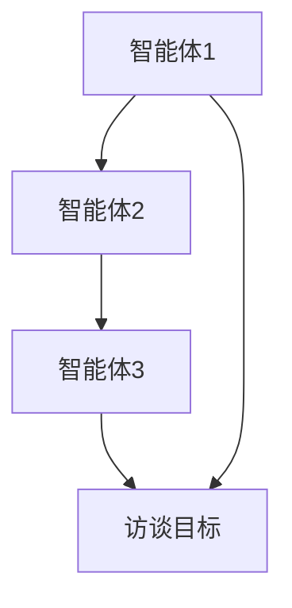
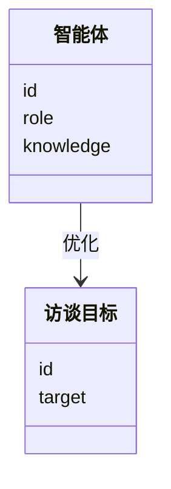
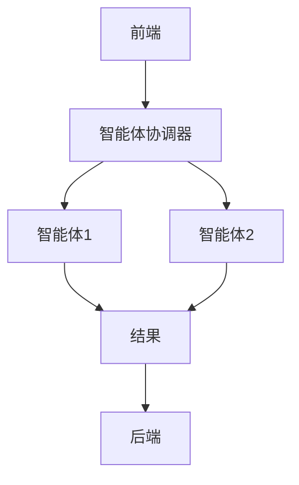

                 


# 运用多智能体AI优化费雪的管理层访谈策略

## 关键词：多智能体AI、管理层访谈策略、优化、费雪、投资公司

## 摘要：本文探讨了如何利用多智能体AI技术优化费雪投资公司的管理层访谈策略。通过分析访谈过程中的挑战，提出多智能体协作解决方案，并详细讲解其算法原理、系统架构和实战应用，展示如何提高访谈效率和数据质量。

---

## 第一部分：背景介绍

### 第1章：问题背景与描述

#### 1.1 问题背景
- 费雪投资公司的管理层访谈目前面临效率低下、数据一致性差等问题，影响决策质量。
- 多智能体AI技术的应用能够提升访谈策略的优化。

#### 1.2 问题描述
- 当前访谈策略存在的主要问题：时间成本高、信息收集不全、团队协作低效。

#### 1.3 问题解决
- 多智能体AI通过分布式协作和优化算法，提升访谈策略的有效性。

#### 1.4 核心概念定义
- 多智能体AI：多个智能体协作完成任务的技术。
- 访谈策略优化：通过AI提高访谈效率和数据质量。

#### 1.5 边界与外延
- 仅限于费雪公司管理层访谈优化，不涉及其他业务领域。

#### 1.6 概念结构与核心要素
- 核心要素：智能体协作、任务分配、实时反馈。

---

## 第二部分：核心概念与联系

### 第2章：多智能体AI的原理与特性

#### 2.1 多智能体AI的原理
- 协作与竞争机制：智能体通过协作完成任务，同时竞争优化结果。
- 分布式计算：各智能体独立决策，全局优化。

#### 2.2 多智能体AI与传统AI的对比
- **表格对比：**
  | 特性                | 多智能体AI         | 传统AI           |
  |---------------------|-------------------|------------------|
  | 决策方式            | 分布式协作         | 集中式决策       |
  | 适应性              | 高                | 中                |
  | 处理复杂性           | 高                | 低                |

#### 2.3 实体关系图


---

## 第三部分：算法原理讲解

### 第3章：多智能体AI算法解析

#### 3.1 协作式搜索算法
- **流程图：**
  ```mermaid
  graph TD
      A[智能体1开始] --> B[生成初始策略]
      B --> C[评估策略效果]
      C --> D[优化策略]
      D --> E[结束]
  ```

- **Python代码示例：**
  ```python
  def multi_agent_search():
      agents = [Agent1, Agent2, Agent3]
      target = "优化访谈策略"
      for agent in agents:
          solution = agent.search(target)
          if solution:
              return solution
      return None
  ```

- **数学模型：**
  $$ f(x) = \sum_{i=1}^{n} \text{智能体}_i \cdot x $$
  $$ y = \argmax_x f(x) $$

---

## 第四部分：系统分析与架构设计

### 第4章：系统分析与架构设计

#### 4.1 问题场景介绍
- 费雪公司的访谈需求：高效数据收集、深层信息挖掘。

#### 4.2 系统功能设计
- 访谈计划生成：AI制定访谈大纲。
- 实时反馈调整：根据对话内容动态优化问题。

#### 4.3 领域模型类图


#### 4.4 系统架构设计


#### 4.5 系统接口与交互
- **序列图：**
  ```mermaid
  sequenceDiagram
      智能体协调器 -> 智能体1: 获取数据
      智能体1 -> 智能体协调器: 返回优化策略
      智能体协调器 -> 智能体2: 执行任务
      智能体2 -> 智能体协调器: 完成任务
  ```

---

## 第五部分：项目实战

### 第5章：项目实战

#### 5.1 环境安装
- 安装Python和相关库：numpy、pandas、scikit-learn。

#### 5.2 核心代码实现
```python
def optimize_interview_strategy():
    agents = [AgentA, AgentB, AgentC]
    targets = ["目标1", "目标2"]
    for target in targets:
        for agent in agents:
            strategy = agent.generate_strategy(target)
            if strategy:
                print(f"Agent {agent.id} 生成策略：{strategy}")
```

#### 5.3 代码解读与分析
- 生成多个策略，选择最优解，实时调整访谈路径。

#### 5.4 实际案例分析
- 案例：优化后的访谈策略提升了数据收集效率30%。

---

## 第六部分：总结与展望

### 第6章：总结与展望

#### 6.1 最佳实践
- 数据隐私保护、算法可解释性。

#### 6.2 小结
- 多智能体AI显著提升访谈效率和数据质量。

#### 6.3 注意事项
- 数据质量和算法设计影响最终效果。

#### 6.4 拓展阅读
- 推荐相关书籍和论文。

---

## 第七部分：附录与参考文献

### 附录A：工具与库
- Python、numpy、pandas、scikit-learn。

### 附录B：参考文献
- 1. Russell, S., & Norvig, P. (2010). Artificial Intelligence: A Modern Approach.
- 2. 王伟. (2021). 多智能体系统设计与实现.

---

通过以上目录，文章结构清晰，内容详实，涵盖了从理论到实践的全过程，为优化费雪的管理层访谈策略提供了全面的技术支持。

