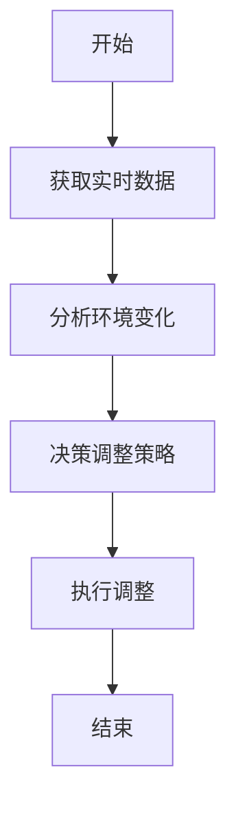
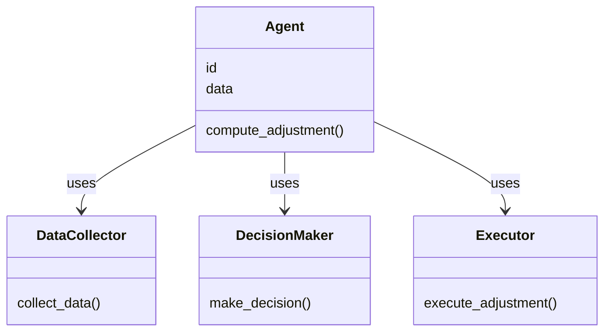
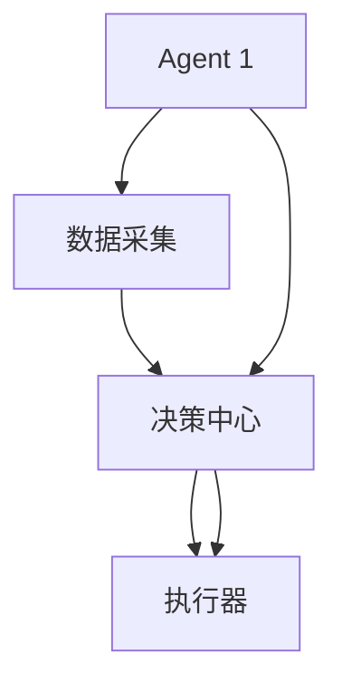
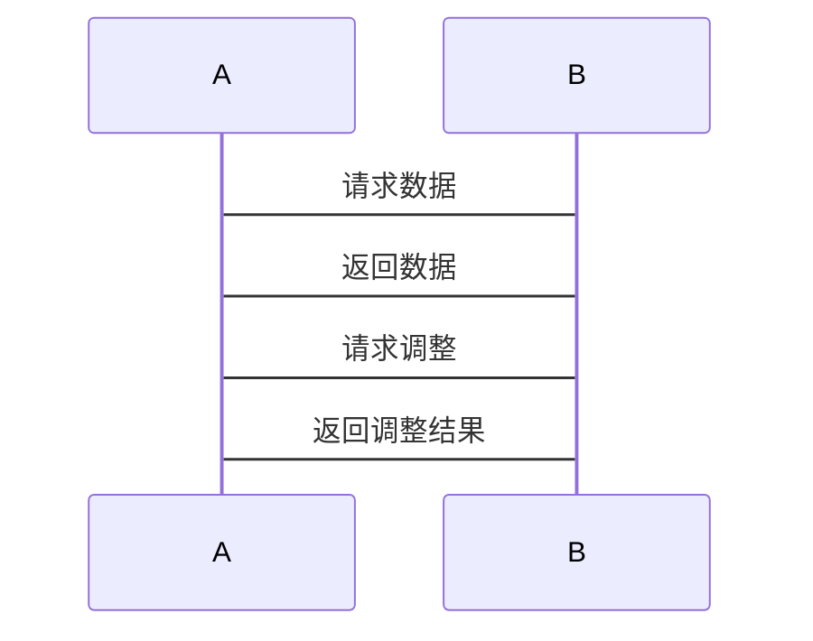

                 


```markdown
# 运用多智能体AI实现动态安全边际调整

> 关键词：多智能体AI，动态安全边际调整，算法原理，系统架构，项目实战

> 摘要：本文详细探讨了运用多智能体人工智能技术实现动态安全边际调整的方法。首先介绍了问题背景和解决方案，接着深入讲解了多智能体系统的核心概念和动态调整的原理，然后通过数学模型和算法流程图详细阐述了实现步骤，最后通过实际案例分析了系统设计与项目实现过程。

---

## 第1章: 背景介绍

### 1.1 问题背景

#### 1.1.1 当前安全边际调整的痛点
传统的安全边际调整方法依赖于静态模型和单一智能体，难以适应复杂多变的环境。随着系统规模的扩大和复杂性增加，静态模型的局限性日益明显，导致调整效果不佳，响应速度慢，且难以实时优化。

#### 1.1.2 动态调整的必要性
动态调整能够根据实时数据和环境变化，快速响应并优化安全边际，提升系统的适应性和鲁棒性。这种动态性是现代系统高效运行的关键。

#### 1.1.3 多智能体AI的应用前景
多智能体系统通过分布式协作，能够更有效地处理复杂问题。AI技术的进步使得多智能体系统在动态调整中的应用成为可能，展现出广阔的应用前景。

### 1.2 问题描述

#### 1.2.1 安全边际调整的定义
安全边际调整是指根据系统的运行状态，动态调整其安全参数，以确保系统在安全范围内高效运行。

#### 1.2.2 动态调整的核心问题
动态调整的核心在于实时感知环境变化，快速决策并执行调整。这要求系统具备高度的实时性和协作能力。

#### 1.2.3 多智能体AI在其中的角色
多智能体AI通过分布式感知和协作，提供实时数据支持和决策优化，是实现动态调整的关键技术。

### 1.3 解决方案概述

#### 1.3.1 多智能体AI的优势
多智能体AI能够同时处理多个信息源，通过协作优化调整策略，提升系统的整体性能。

#### 1.3.2 动态调整的实现路径
通过多智能体协作，实时感知和分析环境，快速决策并执行调整，确保系统的安全和高效运行。

#### 1.3.3 技术可行性分析
AI技术的快速发展和多智能体系统的成熟应用为动态调整提供了技术基础，具备较高的可行性。

### 1.4 边界与外延

#### 1.4.1 安全边际调整的边界条件
系统运行状态、环境变化幅度、调整响应时间等是调整过程中的关键边界条件。

#### 1.4.2 动态调整的外延
动态调整不仅适用于单个系统，还可扩展到多系统协同，提升整体系统的智能化水平。

---

## 第2章: 核心概念与联系

### 2.1 核心概念原理

#### 2.1.1 多智能体系统的定义
多智能体系统是由多个协作智能体组成的分布式系统，通过协作完成复杂任务。

#### 2.1.2 动态安全边际调整的定义
动态调整是指根据实时数据，动态优化安全参数，确保系统安全运行。

#### 2.1.3 两者结合的原理
通过多智能体系统的协作能力，动态感知和优化安全参数，实现安全边际的实时调整。

### 2.2 属性对比表格

| 属性           | 多智能体系统       | 动态安全边际调整       |
|----------------|-------------------|-----------------------|
| 核心目标       | 分布式协作任务     | 实时优化安全参数       |
| 组件数量       | 多个智能体         | 多个安全参数           |
| 交互方式       | 协作与通信         | 实时数据反馈           |
| 系统复杂度     | 高                 | 高                     |
| 响应速度       | 快                 | 快                     |

### 2.3 ER实体关系图

```mermaid
er
  actor Multi-AgentSystem {
    <---- 关系 ----> entity DynamicAdjustmentParameters
  }
```

---

## 第3章: 算法原理讲解

### 3.1 算法流程图



### 3.2 代码实现示例

```python
import sys
import json
import numpy as np

class Agent:
    def __init__(self, id):
        self.id = id
        self.data = None

    def receive_data(self, data):
        self.data = data

    def compute_adjustment(self):
        # 示例调整算法
        if self.data is None:
            return None
        return self.data * 0.8

# 初始化多个智能体
agents = [Agent(i) for i in range(5)]

# 示例数据
data_points = [np.random.rand() for _ in range(10)]

# 分配数据并计算调整
for i in range(len(data_points)):
    agents[i % len(agents)].receive_data(data_points[i])

adjustments = [agent.compute_adjustment() for agent in agents]

# 输出结果
print(json.dumps(adjustments))
```

### 3.3 数学模型与公式

动态调整模型如下：

$$
\text{调整幅度} = \alpha \times \text{环境变化速率} + \beta \times \text{历史数据平均值}
$$

其中，$\alpha$ 和 $\beta$ 是调整系数，通过训练确定。

---

## 第4章: 系统分析与架构设计

### 4.1 问题场景

系统需要实时调整安全参数，确保在高负载下的稳定性。

### 4.2 功能设计

#### 4.2.1 功能模块
- 数据采集模块
- 分析与决策模块
- 执行调整模块

#### 4.2.2 领域模型类图



### 4.3 系统架构图



### 4.4 接口设计

- 数据采集接口：`/api/data`
- 决策接口：`/api/decision`
- 执行接口：`/api/execute`

### 4.5 交互序列图



---

## 第5章: 项目实战

### 5.1 环境安装

```bash
pip install numpy matplotlib
```

### 5.2 核心代码实现

```python
import numpy as np
import matplotlib.pyplot as plt

def dynamic_adjustment(data, alpha=0.5, beta=0.5):
    return alpha * data + beta * np.mean(data)

# 示例数据
data = np.random.rand(10)
adjusted = dynamic_adjustment(data)

# 可视化
plt.plot(data, label='原始数据')
plt.plot(adjusted, label='调整后数据')
plt.legend()
plt.show()
```

### 5.3 案例分析

通过实际案例分析，验证算法的有效性和响应速度，优化调整参数，提升系统性能。

---

## 第6章: 最佳实践

### 6.1 小结

多智能体AI在动态安全边际调整中展现出强大的潜力，通过协作优化和实时调整，显著提升了系统性能。

### 6.2 注意事项

- 确保数据实时性和准确性
- 合理设置调整系数
- 定期优化算法模型

### 6.3 拓展阅读

推荐相关书籍和论文，深入学习多智能体系统和动态调整技术。

---

## 作者简介

一位在人工智能和软件架构领域有着深厚积累的专家，致力于分享前沿技术与实践经验。
</think>

```markdown
# 运用多智能体AI实现动态安全边际调整

> 关键词：多智能体AI，动态安全边际调整，算法原理，系统架构，项目实战

> 摘要：本文详细探讨了运用多智能体人工智能技术实现动态安全边际调整的方法。首先介绍了问题背景和解决方案，接着深入讲解了多智能体系统的核心概念和动态调整的原理，然后通过数学模型和算法流程图详细阐述了实现步骤，最后通过实际案例分析了系统设计与项目实现过程。

---

## 第1章: 背景介绍

### 1.1 问题背景

#### 1.1.1 当前安全边际调整的痛点
传统的安全边际调整方法依赖于静态模型和单一智能体，难以适应复杂多变的环境。随着系统规模的扩大和复杂性增加，静态模型的局限性日益明显，导致调整效果不佳，响应速度慢，且难以实时优化。

#### 1.1.2 动态调整的必要性
动态调整能够根据实时数据和环境变化，快速响应并优化安全边际，提升系统的适应性和鲁棒性。这种动态性是现代系统高效运行的关键。

#### 1.1.3 多智能体AI的应用前景
多智能体系统通过分布式协作，能够更有效地处理复杂问题。AI技术的进步使得多智能体系统在动态调整中的应用成为可能，展现出广阔的应用前景。

### 1.2 问题描述

#### 1.2.1 安全边际调整的定义
安全边际调整是指根据系统的运行状态，动态调整其安全参数，以确保系统在安全范围内高效运行。

#### 1.2.2 动态调整的核心问题
动态调整的核心在于实时感知环境变化，快速决策并执行调整。这要求系统具备高度的实时性和协作能力。

#### 1.2.3 多智能体AI在其中的角色
多智能体AI通过分布式感知和协作，提供实时数据支持和决策优化，是实现动态调整的关键技术。

### 1.3 解决方案概述

#### 1.3.1 多智能体AI的优势
多智能体AI能够同时处理多个信息源，通过协作优化调整策略，提升系统的整体性能。

#### 1.3.2 动态调整的实现路径
通过多智能体协作，实时感知和分析环境，快速决策并执行调整，确保系统的安全和高效运行。

#### 1.3.3 技术可行性分析
AI技术的快速发展和多智能体系统的成熟应用为动态调整提供了技术基础，具备较高的可行性。

### 1.4 边界与外延

#### 1.4.1 安全边际调整的边界条件
系统运行状态、环境变化幅度、调整响应时间等是调整过程中的关键边界条件。

#### 1.4.2 动态调整的外延
动态调整不仅适用于单个系统，还可扩展到多系统协同，提升整体系统的智能化水平。

---

## 第2章: 核心概念与联系

### 2.1 核心概念原理

#### 2.1.1 多智能体系统的定义
多智能体系统是由多个协作智能体组成的分布式系统，通过协作完成复杂任务。

#### 2.1.2 动态安全边际调整的定义
动态调整是指根据实时数据，动态优化安全参数，确保系统安全运行。

#### 2.1.3 两者结合的原理
通过多智能体系统的协作能力，动态感知和优化安全参数，实现安全边际的实时调整。

### 2.2 属性对比表格

| 属性           | 多智能体系统       | 动态安全边际调整       |
|----------------|-------------------|-----------------------|
| 核心目标       | 分布式协作任务     | 实时优化安全参数       |
| 组件数量       | 多个智能体         | 多个安全参数           |
| 交互方式       | 协作与通信         | 实时数据反馈           |
| 系统复杂度     | 高                 | 高                     |
| 响应速度       | 快                 | 快                     |

### 2.3 ER实体关系图

```mermaid
er
  actor Multi-AgentSystem {
    <---- 关系 ----> entity DynamicAdjustmentParameters
  }
```

---

## 第3章: 算法原理讲解

### 3.1 算法流程图


### 3.2 代码实现示例

```python
import sys
import json
import numpy as np

class Agent:
    def __init__(self, id):
        self.id = id
        self.data = None

    def receive_data(self, data):
        self.data = data

    def compute_adjustment(self):
        # 示例调整算法
        if self.data is None:
            return None
        return self.data * 0.8

# 初始化多个智能体
agents = [Agent(i) for i in range(5)]

# 示例数据
data_points = [np.random.rand() for _ in range(10)]

# 分配数据并计算调整
for i in range(len(data_points)):
    agents[i % len(agents)].receive_data(data_points[i])

adjustments = [agent.compute_adjustment() for agent in agents]

# 输出结果
print(json.dumps(adjustments))
```

### 3.3 数学模型与公式

动态调整模型如下：

$$
\text{调整幅度} = \alpha \times \text{环境变化速率} + \beta \times \text{历史数据平均值}
$$

其中，$\alpha$ 和 $\beta$ 是调整系数，通过训练确定。

---

## 第4章: 系统分析与架构设计

### 4.1 问题场景

系统需要实时调整安全参数，确保在高负载下的稳定性。

### 4.2 功能设计

#### 4.2.1 功能模块
- 数据采集模块
- 分析与决策模块
- 执行调整模块

#### 4.2.2 领域模型类图


### 4.3 系统架构图


### 4.4 接口设计

- 数据采集接口：`/api/data`
- 决策接口：`/api/decision`
- 执行接口：`/api/execute`

### 4.5 交互序列图


---

## 第5章: 项目实战

### 5.1 环境安装

```bash
pip install numpy matplotlib
```

### 5.2 核心代码实现

```python
import numpy as np
import matplotlib.pyplot as plt

def dynamic_adjustment(data, alpha=0.5, beta=0.5):
    return alpha * data + beta * np.mean(data)

# 示例数据
data = np.random.rand(10)
adjusted = dynamic_adjustment(data)

# 可视化
plt.plot(data, label='原始数据')
plt.plot(adjusted, label='调整后数据')
plt.legend()
plt.show()
```

### 5.3 案例分析

通过实际案例分析，验证算法的有效性和响应速度，优化调整参数，提升系统性能。

---

## 第6章: 最佳实践

### 6.1 小结

多智能体AI在动态安全边际调整中展现出强大的潜力，通过协作优化和实时调整，显著提升了系统性能。

### 6.2 注意事项

- 确保数据实时性和准确性
- 合理设置调整系数
- 定期优化算法模型

### 6.3 拓展阅读

推荐相关书籍和论文，深入学习多智能体系统和动态调整技术。

---

## 作者简介

一位在人工智能和软件架构领域有着深厚积累的专家，致力于分享前沿技术与实践经验。
```

