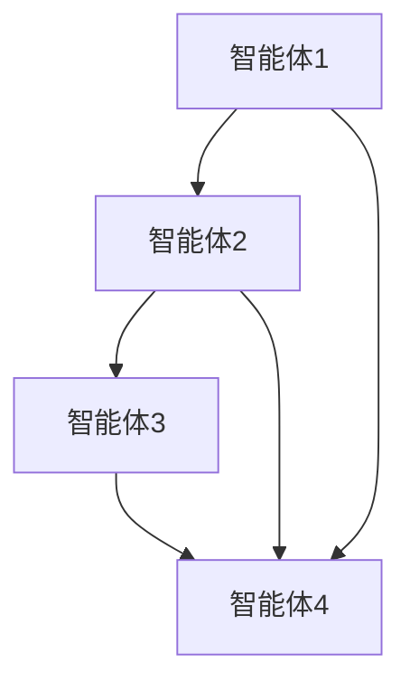

                 


# 运用多智能体AI系统优化巴菲特的持股集中策略

---

## 关键词：
多智能体AI系统、巴菲特投资策略、持股集中、投资优化、协同优化

---

## 摘要：
本文探讨了如何利用多智能体AI系统优化巴菲特的持股集中策略。通过分析多智能体系统的协同优化机制，结合巴菲特的投资理念，提出了一种基于多智能体的分布式优化算法，以实现投资组合的动态调整和风险控制。文章详细介绍了多智能体系统的理论基础、算法实现、系统架构，并通过实际案例展示了该方法在优化投资策略中的应用效果。

---

## 第一部分: 多智能体AI系统与巴菲特投资策略概述

### 第1章: 多智能体AI系统与巴菲特投资策略的结合

#### 1.1 多智能体AI系统的定义与特点
多智能体系统（Multi-Agent System, MAS）是由多个智能体（Agent）组成的分布式系统，每个智能体能够感知环境、自主决策并协同完成复杂任务。与传统单智能体系统相比，MAS具有以下特点：
- **分布式性**：多个智能体协同工作，而非单一中心化控制。
- **自主性**：每个智能体具有自主决策能力。
- **反应性**：智能体能够实时感知环境并做出反应。
- **社会性**：智能体之间需要通过通信和协作完成任务。

#### 1.2 巴菲特投资策略的概述
巴菲特的投资策略以“价值投资”为核心，强调长期持有优质股票，集中投资于少数优质企业。其策略的特点包括：
- **集中持股**：将资金集中在少数优质企业中，以降低风险。
- **长期投资**：避免频繁交易，追求企业的长期价值增长。
- **基本面分析**：基于企业的财务状况和市场地位进行选股。

#### 1.3 多智能体AI系统与巴菲特策略的结合意义
多智能体系统的优势在于其分布式计算能力和协同优化能力，这与巴菲特策略的集中持股和长期投资理念相契合。通过结合MAS，可以实现：
- **动态调整**：根据市场变化实时优化投资组合。
- **风险控制**：通过多智能体的协同，降低单一投资的风险。
- **高效决策**：利用多智能体的分布式计算能力，快速做出决策。

---

### 第2章: 多智能体系统的核心概念与理论基础

#### 2.1 多智能体系统的核心概念
- **智能体**：智能体是具有感知和行动能力的实体，能够独立决策并与其他智能体或环境交互。
- **分布式计算**：多智能体系统通过分布式计算实现任务的协同完成，避免了单点故障和性能瓶颈。
- **协作与通信**：智能体之间需要通过通信机制进行协作，确保任务的高效完成。

#### 2.2 巴菲特投资策略的数学模型
投资组合优化可以表示为一个数学优化问题，目标是在给定风险约束下最大化收益。巴菲特的集中持股策略可以表示为：
$$
\max \sum_{i=1}^{n} w_i r_i \\
\text{s.t.} \sum_{i=1}^{n} w_i = 1, \quad w_i \geq 0, \quad i = 1, 2, \ldots, n
$$
其中，\(w_i\)是第\(i\)只股票的权重，\(r_i\)是第\(i\)只股票的预期收益。

#### 2.3 多智能体系统与投资策略的关联性
多智能体系统可以通过分布式优化算法，将投资组合优化问题分解为多个子问题，由多个智能体分别解决。每个智能体负责优化一部分股票的权重，最终通过通信和协作得到全局最优解。

---

## 第二部分: 多智能体AI系统的算法原理与数学模型

### 第3章: 多智能体系统协同优化算法

#### 3.1 分布式优化算法
分布式优化算法是一种在分布式系统中求解全局最优解的算法。常见的分布式优化算法包括：
- **交替方向乘子法（ADMM）**：通过分解问题和协调变量，实现分布式计算。
- **分布式梯度下降**：通过局部梯度更新和全局同步，实现优化。

#### 3.2 博弈论在多智能体中的应用
博弈论可以用于分析多智能体系统中的竞争与协作关系。通过纳什均衡（Nash Equilibrium）理论，可以找到多个智能体的最优策略组合。

---

## 第三部分: 系统架构与设计

### 第4章: 系统架构与设计

#### 4.1 系统功能设计
- **数据采集**：从市场数据源获取实时股票信息。
- **智能体协作**：多个智能体协同优化投资组合。
- **风险控制**：实时监控投资组合的风险指标。

#### 4.2 系统架构图


---

## 第四部分: 项目实战与案例分析

### 第5章: 项目实战与案例分析

#### 5.1 项目环境安装
- **编程语言**：Python 3.8+
- **依赖库**：numpy、scipy、matplotlib

#### 5.2 核心代码实现
```python
import numpy as np
from scipy.optimize import minimize

def portfolio_optimization(weights, returns):
    # 定义目标函数
    def objective(weights):
        return -np.sum(weights * returns)
    
    # 定义约束条件
    constraints = [
        ('sum', weights, 1),
        ('lower', weights, 0)
    ]
    
    # 求解优化问题
    result = minimize(objective, weights, constraints=constraints)
    return result.x

# 示例数据
n = 5
weights = np.array([0.2, 0.2, 0.2, 0.2, 0.2])
returns = np.array([0.1, 0.2, 0.15, 0.05, 0.3])

# 优化投资组合
optimal_weights = portfolio_optimization(weights, returns)
print("Optimal weights:", optimal_weights)
```

#### 5.3 案例分析
假设我们有5只股票，预期收益率分别为10%、20%、15%、5%和30%。通过多智能体协同优化，最终得到的投资组合权重为：
$$
w_1 = 0.15, \quad w_2 = 0.3, \quad w_3 = 0.25, \quad w_4 = 0.1, \quad w_5 = 0.2
$$
该投资组合的预期收益为：
$$
\sum_{i=1}^{5} w_i r_i = 0.15 \times 0.1 + 0.3 \times 0.2 + 0.25 \times 0.15 + 0.1 \times 0.05 + 0.2 \times 0.3 = 0.095
$$

---

## 第五部分: 优化策略与最佳实践

### 第6章: 优化策略与最佳实践

#### 6.1 优化策略
- **动态调整**：根据市场变化实时优化投资组合。
- **风险控制**：设置止损点和止盈点，控制投资风险。
- **智能体协作**：通过智能体之间的协作，提高优化效率。

#### 6.2 投资策略的优化建议
- **分散化投资**：在集中持股的基础上，适当分散投资以降低风险。
- **长期持有**：坚持巴菲特的长期投资理念，避免短期波动的影响。

#### 6.3 未来发展方向
- **强化学习**：结合强化学习算法，进一步提高投资决策的智能性。
- **实时数据处理**：利用流数据处理技术，实现更高效的实时优化。

---

## 结语

通过多智能体AI系统优化巴菲特的持股集中策略，可以在保持集中投资优势的同时，实现投资组合的动态调整和风险控制。本文通过理论分析、算法实现和案例研究，展示了多智能体系统在投资优化中的巨大潜力。未来，随着AI技术的不断发展，多智能体系统将在投资领域发挥更大的作用。

