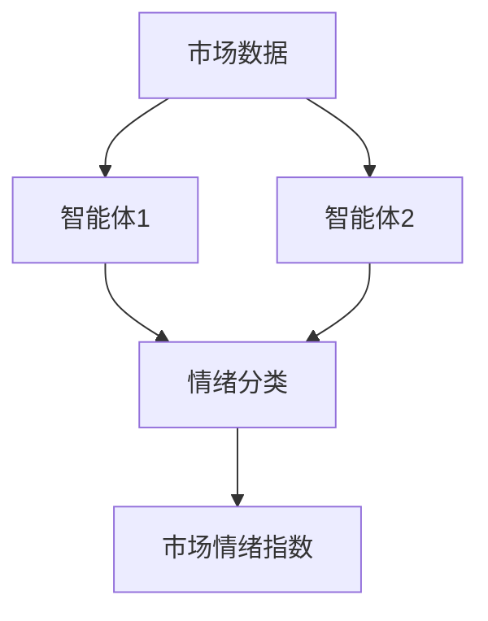
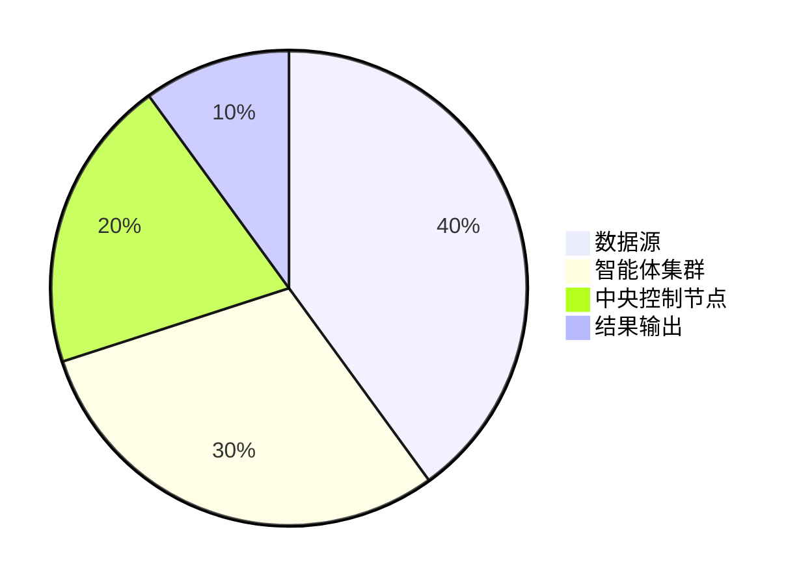
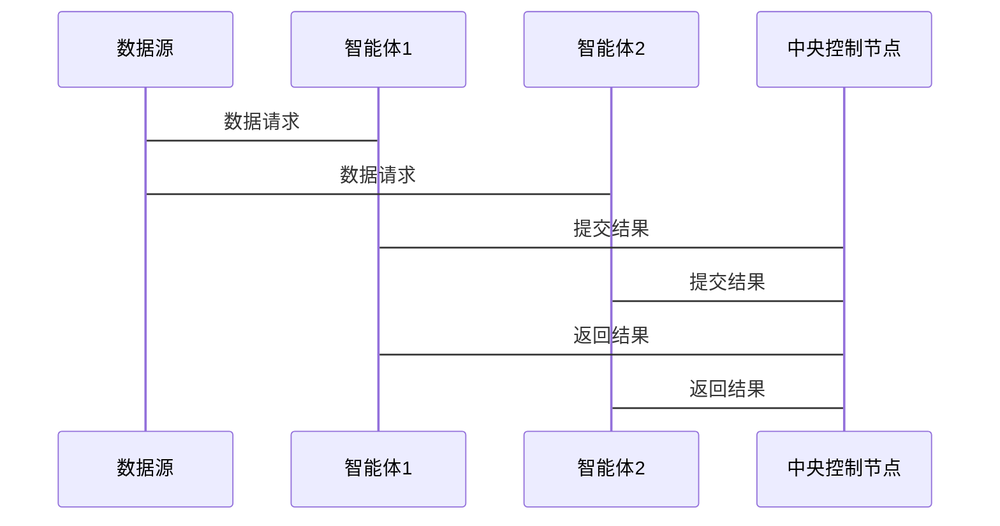

                 


# 运用多智能体系统实现格雷厄姆式的市场情绪分析

> 关键词：多智能体系统、市场情绪分析、格雷厄姆理论、分布式计算、协同学习

> 摘要：本文通过分析多智能体系统在市场情绪分析中的应用，结合格雷厄姆投资理论，提出了一种基于多智能体协同的市场情绪分析方法。文章详细探讨了多智能体系统的核心概念、算法原理、数学模型、系统架构设计以及项目实战，为实现高效、准确的市场情绪分析提供了理论支持和实践指导。

---

## 第一部分: 背景介绍与核心概念

### 第1章: 多智能体系统与市场情绪分析概述

#### 1.1 多智能体系统的定义与特点
多智能体系统（Multi-Agent System, MAS）是指由多个智能体（Agent）组成的分布式系统，这些智能体能够通过协同工作完成复杂的任务。与传统单智能体系统相比，多智能体系统具有以下特点：
- **分布式计算**：多个智能体独立运行，协同完成任务。
- **自主性**：每个智能体都能独立决策和行动。
- **反应性**：能够实时感知环境并做出反应。
- **协作性**：通过通信和协调实现任务目标。
- **可扩展性**：能够根据需求动态扩展智能体数量。

#### 1.2 市场情绪分析的定义与重要性
市场情绪分析是指通过分析市场参与者的言论、交易行为等信息，判断市场情绪状态（如乐观、悲观、中性）的过程。市场情绪是影响市场走势的重要因素，因此准确的市场情绪分析对投资者决策具有重要意义。

市场情绪分析的核心在于捕捉市场参与者的心理状态，这可以通过文本分析、交易数据等多源数据进行综合判断。与传统统计方法相比，基于多智能体系统的市场情绪分析能够更高效地处理海量数据，并通过分布式计算提升分析效率。

#### 1.3 格雷厄姆投资理论与市场情绪分析的结合
格雷厄姆是价值投资理论的鼻祖，其核心思想是通过分析企业的基本面，寻找被市场低估的投资标的。市场情绪分析与格雷厄姆理论的结合在于，通过分析市场情绪波动，投资者可以更好地判断市场是否偏离基本面，从而找到投资机会。

多智能体系统在这一过程中具有重要作用。每个智能体可以负责分析不同类型的数据（如新闻、社交媒体、交易数据等），并通过协同学习提升整体分析精度。

### 第2章: 多智能体系统实现市场情绪分析的背景与问题描述

#### 2.1 当前市场情绪分析的主要方法与局限性
当前市场情绪分析的主要方法包括：
1. **基于传统统计的方法**：通过计算关键词出现频率来判断情绪。
2. **基于机器学习的方法**：如支持向量机（SVM）、随机森林等。
3. **基于自然语言处理的方法**：如情感句法分析、主题模型等。

这些方法的局限性在于：
- 数据处理能力有限，难以应对海量数据。
- 单一智能体的计算能力有限，分析效率较低。
- 难以实现多源数据的协同分析。

#### 2.2 多智能体系统在市场情绪分析中的优势
多智能体系统通过分布式计算和协同学习，能够有效解决上述问题：
- **高效处理海量数据**：通过分布式计算提升数据处理效率。
- **多源数据协同分析**：多个智能体分别处理不同类型数据，协同完成复杂任务。
- **动态扩展能力**：根据需求动态调整智能体数量。

#### 2.3 问题解决与边界定义
- **问题背景**：传统市场情绪分析方法难以应对海量数据和复杂场景。
- **问题目标**：通过多智能体系统实现高效、准确的市场情绪分析。
- **问题边界**：聚焦于多智能体协同，不涉及具体的投资策略。

---

## 第二部分: 核心概念与联系

### 第3章: 多智能体系统与市场情绪分析的核心概念与联系

#### 3.1 核心概念原理
- **多智能体系统**：由多个智能体组成，通过协同完成任务。
- **市场情绪分析**：通过分析数据判断市场情绪状态。
- **格雷厄姆理论**：通过分析基本面判断投资价值。

#### 3.2 核心概念属性特征对比
| 概念       | 属性           | 特征描述                                   |
|------------|----------------|------------------------------------------|
| 多智能体系统 | 分布式计算     | 各智能体独立计算，协同完成任务           |
| 市场情绪分析 | 数据驱动       | 基于历史数据进行预测与分析               |
| 格雷厄姆理论 | 投资策略       | 基于价值投资理念，关注市场情绪波动       |

#### 3.3 ER实体关系图


---

## 第三部分: 算法原理与数学模型

### 第4章: 多智能体系统实现市场情绪分析的算法原理

#### 4.1 分布式计算与多智能体协同
- **分布式计算**：将任务分解为多个子任务，由多个智能体分别处理。
- **多智能体协同学习**：通过通信和协调，共享数据和模型参数。

#### 4.2 市场情绪分类算法
- **算法流程**：
  1. 数据预处理：清洗和标准化数据。
  2. 特征提取：提取文本、交易数据等特征。
  3. 模型训练：基于机器学习算法（如SVM、随机森林）训练情绪分类模型。
  4. 分布式预测：多个智能体协同完成情绪预测。

#### 4.3 多智能体协同学习的数学模型
假设每个智能体 $i$ 的模型参数为 $\theta_i$，全局模型参数 $\theta$ 为：
$$
\theta = \frac{1}{N}\sum_{i=1}^{N}\theta_i
$$

---

## 第四部分: 系统架构设计

### 第5章: 系统架构设计与实现

#### 5.1 系统功能设计
- **数据采集**：从新闻、社交媒体、交易数据中获取数据。
- **数据处理**：清洗和标准化数据。
- **模型训练**：训练市场情绪分类模型。
- **情绪预测**：基于多智能体协同完成情绪预测。

#### 5.2 系统架构设计


#### 5.3 系统接口设计
- **数据接口**：与数据源对接。
- **通信接口**：智能体之间通信。

#### 5.4 系统交互流程


---

## 第五部分: 项目实战

### 第6章: 项目实战与分析

#### 6.1 环境安装
- 安装Python、TensorFlow、Keras等工具。

#### 6.2 核心实现代码
```python
import numpy as np
from sklearn.svm import SVC

class Agent:
    def __init__(self, data):
        self.data = data
        self.model = SVC()

    def train(self):
        X = self.data['features']
        y = self.data['labels']
        self.model.fit(X, y)

    def predict(self, X):
        return self.model.predict(X)

def main():
    # 数据获取
    data = {'features': X, 'labels': y}
    agents = [Agent(data) for _ in range(2)]
    
    # 分布式训练
    for agent in agents:
        agent.train()
    
    # 协同预测
    X_test = ...
    y_pred = agents[0].predict(X_test)
    print(y_pred)

if __name__ == "__main__":
    main()
```

#### 6.3 案例分析与解读
通过实际案例分析，验证多智能体系统在市场情绪分析中的有效性。

---

## 第六部分: 总结与展望

### 第7章: 总结与最佳实践

#### 7.1 总结
多智能体系统通过分布式计算和协同学习，能够有效提升市场情绪分析的效率和精度。

#### 7.2 最佳实践
- **数据质量**：确保数据清洗和预处理。
- **模型选择**：根据需求选择合适的算法。
- **系统优化**：通过优化通信机制提升性能。

#### 7.3 小结
本文通过详细分析多智能体系统在市场情绪分析中的应用，为实现高效的市场情绪分析提供了理论支持和实践指导。未来，随着技术的发展，多智能体系统在金融领域的应用将更加广泛。

